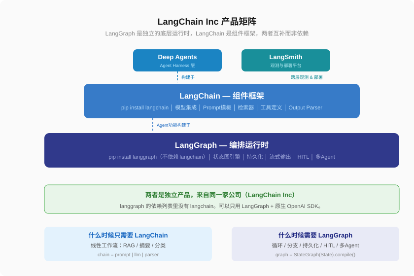
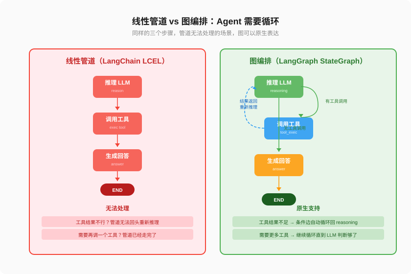
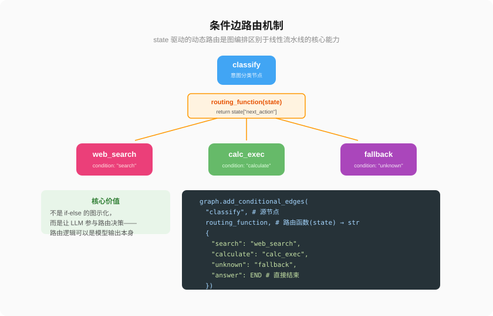
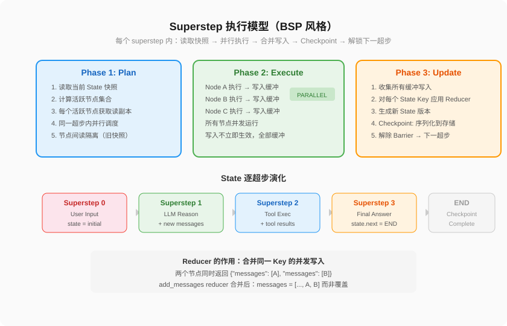
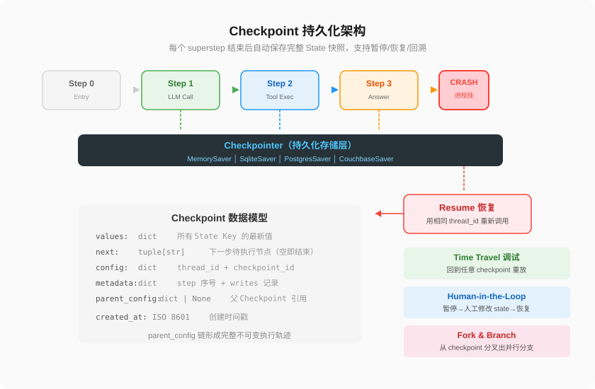
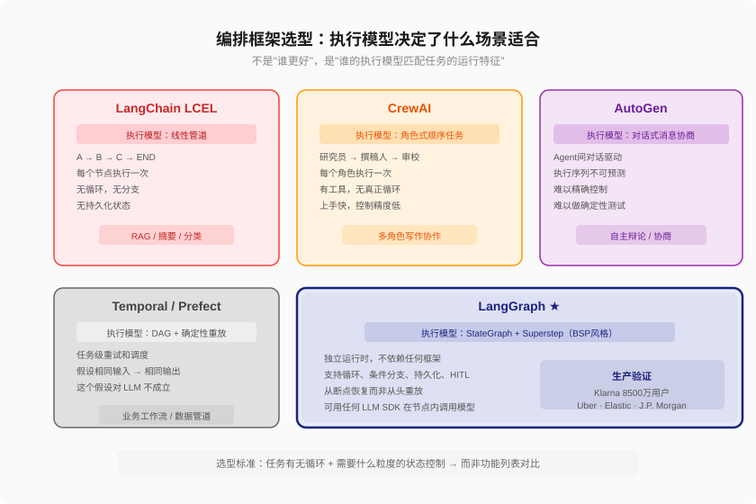
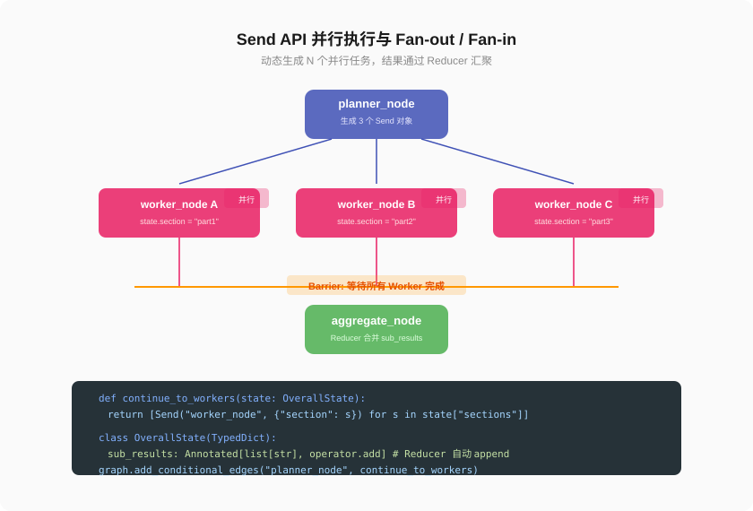

# 第 0 篇：LangGraph 不是 LangChain 的插件

---

大家好，我是Q。

写一个 while 循环，让 LLM 调工具、拿结果、再推理，循环往复。6 行代码就能跑起来，感觉 Agent 不过如此。

然后问题来了。

工具调用失败了，while 循环直接挂掉。加 try-catch。工具结果不对，想回退一步重新推理——回不了，循环已经往前走了。想在某个步骤暂停等人审批——做不到，没有暂停机制。想并行搜三个数据源再汇总——while 循环天然串行，强行异步后状态管理一团糟。

最后你的 Agent 代码变成了一个 500 行的 while 循环，里面塞满了 try-catch、if-else、asyncio、全局状态变量。能跑，但没人敢改。

**这不是你的问题，是编排方式的问题。**

而 LangGraph，就是用来解决这个问题的。但它和 LangChain 的关系，大部分人搞错了——包括半年前的我。

2024 年 1 月，LangChain Inc 把 LangGraph 作为一个独立项目开源。到今天，它的月下载量超过 9000 万，被 Klarna、Uber、Elastic、J.P. Morgan 在生产环境使用。但大部分人仍然把它当成"LangChain 的插件"。

事实恰恰相反。

LangGraph 是一个**完全独立的底层编排运行时**。它有自己的 pip 包（`pip install langgraph`），有自己的 API 设计哲学（借鉴了 Google Pregel 和 Apache Beam），有独立于 LangChain 的执行模型。

LangChain Inc 的官方文档写得很直白：

> **LangGraph is built by LangChain Inc, the creators of LangChain, but can be used without LangChain.**

翻译一下：你可以一行 LangChain 代码都不写，纯用原生 OpenAI SDK 在 LangGraph 节点里调模型——完全合法，完全支持。

更有意思的是，LangChain 自身的 Agent 功能（`create_react_agent` 等）实际上是**构建在 LangGraph 之上的**。LangGraph 做的是发动机，LangChain 做的是车壳。很多人把关系搞反了。

两者的准确关系：

```
LangGraph  = 底层编排运行时（状态图引擎、持久化、流式输出、人工审核）
LangChain = 高层组件框架（模型集成、prompt 模板、检索器、输出解析）
             └─ 其 Agent 功能本身构建在 LangGraph 之上
LangSmith  = 全链路观测平台（trace、评估、prompt 管理、部署）
```

这篇文章，就从"它们到底是什么关系"出发，讲清楚图编排技术为什么是 Agent 开发的正确范式。



---

### 一、为什么 Agent 需要专门的编排工具

先退一步：**为什么一个简单的 while 循环不够？**

```python
while not done:
    thought = llm.reason(state)
    action = pick_tool(thought)
    result = execute(action)
    state.update(result)
```

这在原型阶段完全够用。但系统复杂化后，三个问题同时爆发：

**状态不可控。** 对话历史、工具输出、中间推理——全部塞进一个 dict，没有类型约束，没有合并规则。两个并发操作同时写同一个 key，数据可能静默丢失。

**流程不可追溯。** 什么时候回退？什么时候人工介入？节点失败后怎么恢复？while 循环里塞 try-catch 的成本指数增长。执行轨迹更是无法记录——你没法知道 Agent 在第几步做了什么决策、为什么那么做。

**并行是灾难。** 搜索三个数据源并汇总——while 循环天然串行。强行异步化会让共享状态的竞态条件、异常的传播路径、中间结果的拼接逻辑全部失控。

这三个问题的根因相同：**while 循环把控制流、数据流、故障恢复耦合在一起。**

图编排的解决方案就是把它们显式分离：

- **控制流** → 图的拓扑结构（节点 + 边）
- **数据流** → State 的类型化增量更新 + Reducer 合并规则  
- **故障恢复** → Checkpoint 的持久化快照链



---

### 二、LangGraph 是什么：一个独立的编排运行时

LangGraph 本质是一个**状态图执行引擎**。它的核心概念只有五个，但每一个都有精确的语义：

#### 2.1 StateGraph：图即状态机

```python
from langgraph.graph import StateGraph
from typing import Annotated, TypedDict
from langgraph.graph.message import add_messages

class AgentState(TypedDict):
    messages: Annotated[list, add_messages]
    next_step: str

graph = StateGraph(AgentState)
```

这不是"把代码画成图"，而是用图的拓扑来**显式声明**节点之间的执行约束。图的拓扑定义"哪些路径合法"，但具体走哪条——由每个节点的输出决定。

LangGraph 图的关键特性是**允许循环**：条件边可以指回已执行的节点。这让 Agent 循环（推理→工具→观察→再推理→...）能被原生表达为图结构，而不是靠 while 循环在外部模拟。

#### 2.2 State：带 Reducer 的共享上下文

```python
from typing import Annotated
import operator

class State(TypedDict):
    messages: Annotated[list, add_messages]   # append 而非覆盖
    counter: Annotated[int, operator.add]     # 累加而非覆盖
    status: str                                # 默认 LastValue（覆盖）
```

State 是整个图共享的数据。但它不是全局变量——每个 superstep 产生一个新版本，节点看到的始终是**当前版本的不可变快照**。

Reducer 是 State 的关键机制：它定义了"同一 key 的多个并发写入如何合并"。`add_messages` 让消息历史自动追加，`operator.add` 让计数累加。**没有 reducer 的 key 如果被并发写入，框架直接抛异常**——LangGraph 宁可失败也不静默丢数据。

节点不直接修改 State，而是返回一个**部分更新 dict**。框架在每个 superstep 结束后统一合并。这意味着节点之间不会互相覆盖，并行执行是安全的。

#### 2.3 Edge：三种流转语义

- **Normal Edge：** `A → B`，无条件执行。A 完成后固定走 B。
- **Conditional Edge：** `A → route(state) → B|C|D`。根据当前 state 的值动态选择下一个节点。路由函数 `(State) → str` 可以是纯逻辑，也可以是读取 LLM 在上一个节点设置的值。
- **Join Edge：** `A,B → C`。A 和 B 都完成后，C 才激活（AND-join 语义）。



条件边是图编排区别于管道的关键。在传统管道里，路由逻辑是程序员写死的。在 LangGraph 中，路由可以由 LLM 动态决定——LLM 调用后设置 `state.next_action = "tool_exec"`，路由函数读取这个值，决定走 tool_exec 分支。图定义"可以走哪些路"，LLM 决定"这次走哪条"。

#### 2.4 Superstep：图编排的执行心跳



LangGraph 的执行模型借鉴了 BSP（Bulk Synchronous Parallel），每个 superstep 分三阶段：

1. **Plan**：计算哪些节点"准备好了"（入边条件满足）→ 产生活跃节点集合
2. **Execute**：所有活跃节点**并行执行**。每个节点看到同一份 state 快照（读隔离）。节点的输出写入缓冲区，不立即生效（写缓冲）。
3. **Update**：收集所有缓冲写入 → 对每个 key 应用 reducer → 生成新 state 版本 → 写入 checkpoint → 解除 barrier，启动下一超步

读隔离 + 写缓冲 = 无锁并行。同一个 superstep 内，节点 A 的输出不会影响节点 B 的输入——两个节点看到的 state 完全相同。

#### 2.5 Checkpoint：持久化不是"保存"，是执行历史



每个 checkpoint 包含：values（最新 state）、next（下一步节点）、config（thread_id + checkpoint_id）、metadata（step + 写入记录）、parent_config（指向前驱 checkpoint）。

**parent_config 链**是整个持久化架构的点睛之笔：

```
root → checkpoint_1 → checkpoint_2 → checkpoint_3 → ...
```

每次 superstep 结束，自动生成新 checkpoint，并指向前一个。整个执行历史是不可变的单向链表。

基于这个链，三个高级能力自然涌现：

- **Time Travel：** 回到任意 checkpoint，修改 state，从那里重放执行。生产环境中出 bug，找到"决策出问题"的那个 checkpoint，修改错误的 state 值，从那个点重新执行。
- **Human-in-the-Loop：** `interrupt_before=["send_email"]` → 执行到发邮件前自动暂停 → 人工审批 → `update_state(config, {"approved": True})` → `invoke(None, config)` 恢复。
- **Fork & Branch：** 从同一个 checkpoint 分叉出多个分支，探索不同策略，对比结果。

---

### 三、LangChain 与 LangGraph 的准确关系

理解了 LangGraph 的独立性后，LangChain 的定位就清楚了。

#### 3.1 它们是什么关系

来自同一家公司（LangChain Inc），是**两个独立的产品**。各自有独立的 pip 包、独立的版本号、独立的文档站点。

**没有依赖关系。** `langgraph` 的依赖列表里没有 `langchain`。你可以在不安装 LangChain 的环境里使用 LangGraph。

**但设计上互补。** LangChain 提供模型集成（30+ LLM provider）、prompt 模板、检索器（20+ vector store）、工具定义装饰器——这些"零件"用来装在 LangGraph 的节点里非常方便。所以官方文档在示例中大量使用 LangChain 组件。

**LangChain 自身的 Agent 功能基于 LangGraph。** LangChain 的 `create_react_agent`、`create_tool_calling_agent` 等高级 Agent API，底层都是用 LangGraph 的 StateGraph 实现的。LangChain 负责提供便捷的封装，LangGraph 负责实际的执行。

#### 3.2 什么场景下只需要 LangChain

如果你的工作流是**线性的、一次成功的、不需要回退或人工介入**——LangChain 就够了：

- RAG：检索文档 → 增强 prompt → 生成回答
- 文档摘要：读取 → LLM 总结 → 输出
- 分类/提取：文本 → LLM → 结构化输出

`chain = prompt | llm | parser` 三行写完。不需要图。

#### 3.3 什么场景下需要 LangGraph

当你的工作流需要**循环、条件分支、状态持久化、人工审核**时，LangGraph 是正确答案：

- 多步推理 Agent：推理 → 调工具 → 观察结果 → 再推理 → 循环
- 代码生成 + 测试 + 修复循环：写 → 跑测试 → 失败就修复 → 循环直到通过
- 多 Agent 协作：Supervisor 调度 → Worker 执行 → 结果汇总 → 再分配
- 人工审批流程：自动生成草稿 → 暂停等人审批 → 修改后继续

这些场景的共同点是**有循环**。一个 while 循环能做到，但做不好——状态管理、故障恢复、执行追溯这些需求是 while 循环的天敌。

#### 3.4 生产中的典型组合

大多数生产 Agent 同时用两者，但不是"上下层"关系，而是**组件与运行时的关系**：

```python
# LangChain 组件：定义工具
from langchain.tools import tool

@tool
def search(query: str) -> str:
    """搜索互联网获取信息"""
    return search_api(query)

# LangChain 组件：定义模型
from langchain.chat_models import init_chat_model
model = init_chat_model("gpt-4o")

# LangGraph 运行时：编排执行逻辑
from langgraph.graph import StateGraph, START, END

graph = StateGraph(State)
graph.add_node("reasoning", reasoning_node)  # 内部调用 model.invoke()
graph.add_node("tools", tool_node)            # 内部调用 search.invoke()
graph.add_edge(START, "reasoning")
graph.add_conditional_edges("reasoning", should_continue)
graph.add_edge("tools", "reasoning")

# LangGraph 运行时：提供持久化
from langgraph.checkpoint.postgres import PostgresSaver

app = graph.compile(checkpointer=PostgresSaver(conn))
```

LangChain 提供零件（模型、工具），LangGraph 提供发动机（编排、持久化、HITL）。这就是正确的关系。

---

### 四、为什么是 LangGraph 而不是其他方案

#### 4.1 不是 CrewAI（角色式编排）

CrewAI 的设计是"定义 Agent 角色 → 分配任务 → 顺序执行"。适合"研究员 → 撰稿人 → 审校"这种线性协作流水线。

但当任务需要**循环**（"搜索结果不够，加关键词再搜"），CrewAI 的模型就不够。这是设计取舍：CrewAI 选择上手快，牺牲了控制精度。LangGraph 选择完全可控的图拓扑，代价是需要写显式的节点和边。

#### 4.2 不是 AutoGen（对话式编排）

AutoGen 的思路是"Agent 之间通过消息对话、协商"。适合需要 Agent 自主辩论的场景。

问题在于：对话式协调的执行路径是**涌现的**——A 的消息触发 B 的回复，B 又触发 C，整个序列不可预测。很难做确定性测试，很难在特定点挂载人工审批。

LangGraph 的图拓扑让执行路径**结构上可预测**：虽然具体选哪条路由是 LLM 决定的，但可选路由是开发者在图中显式枚举的。

#### 4.3 不是 Temporal / Prefect（任务编排）

Temporal 和 Prefect 是通用工作流引擎，核心假设是**确定性重放**（deterministic replay）：崩溃后，用相同输入重放，得到相同结果。

LLM 调用天然非确定性——`temperature=0` 也不能保证完全相同的输出。这意味着 Temporal 式的确定性重放假设在 Agent 场景中不成立。

LangGraph 的 Checkpoint 模型不需要这个假设——它不从开头重放，而是**从最后一个成功的 superstep 直接继续**。

#### 4.4 选型总原则

| 任务特征 | 适合工具 |
|---------|---------|
| 线性、一次成功的 | LangChain LCEL 管道 |
| DAG 无循环的 | Airflow / Prefect / Dagster |
| 角色式线性协作 | CrewAI |
| 对话式自主协商 | AutoGen |
| **有循环、状态持久、需人工介入** | **LangGraph** |

大多数生产 Agent 恰好落在最后一个区间。



---

### 五、Send API：处理未知规模的并行



静态并行（多个 `add_edge`）能处理"你知道有几个并行任务"的情况。但生产环境中经常面临"运行时才知道有几个"——搜索结果返回 7 个链接，要对每个做摘要。

Send API 就是为此设计的：

```python
from langgraph.types import Send

def continue_to_workers(state: OverallState) -> list[Send]:
    return [Send("worker", {"url": u}) for u in state["urls"]]

graph.add_conditional_edges("planner", continue_to_workers)
```

LangGraph 自动创建 N 个 worker 实例，在同一 superstep 并行执行。所有 worker 完成后，barrier 解除，聚合节点激活。Reducer 自动合并结果——`operator.add` 统一追加到列表中。

这是 Map-Reduce 在图编排中的原生实现。

---

### 六、生产环境的关键决策

#### 6.1 Checkpointer 选型

不是所有场景都需要 PostgreSQL：

- **本地开发**：MemorySaver。启动快，进程重启即清。
- **单机部署**：SqliteSaver。文件持久化，零运维。小规模生产完全够用。
- **分布式并发**：PostgresSaver。连接池、主从复制、备份。
- **已有 Couchbase/MongoDB**：用对应的社区 Checkpointer。

核心选择标准不是性能，是**故障恢复机制**。如果进程崩溃后需要自动恢复，还需要外部调度器（如 K8s Job）配合心跳检测。

#### 6.2 成本结构

Agent 生产成本由三部分构成：

- **LLM Token 消耗**：减少"震荡循环"——图要设计成尽早收敛。`recursion_limit` 设置合理的上限。
- **Checkpoint 存储成本**：每个 superstep 一次序列化。长对话可以用 Delta Channel（LangGraph≥1.2）只存增量。
- **观测成本**：LangSmith trace 有 token 和存储开销。生产环境按比例采样，不全量 trace。

#### 6.3 避免过度设计

图编排最常见的误用：**把问题想得比实际复杂。**

搜索总结 Agent 只需要三个节点：分类意图 → 搜索 → 总结。不需要条件边，不需要 checkpoint，不需要 HITL。

如果你的图有 30 个节点，但 25 个只在 2% 的情况下触发——你在为 2% 的边缘情况支付 100% 的代码复杂度。图编排的价值与**实际需要的复杂度**成正比，不是与你画得出多复杂的图成正比。

---

### 七、总结

LangGraph 是目前 Agent 图编排的事实标准，这个结论由三个硬条件支撑：

**独立性。** LangGraph 是一个独立的运行时，不绑定任何框架。你可以在节点里用原生 OpenAI SDK、PydanticAI、甚至 CrewAI 的 Agent。这种"只做编排，不管组件"的定位，让它可以嵌入任何技术栈。

**架构正确性。** StateGraph + Superstep + Checkpoint 的组合不是碰巧——它是从"Agent 需要循环 + 状态持久化 + 增量执行"这三个需求反推出来的。Pregel 的 BSP 模型在分布式图计算领域被验证了十几年，LangGraph 把它适配到了 Agent 场景。

**生态完善度。** LangChain Inc 围绕 LangGraph 构建了完整的产品矩阵：LangChain（组件）、LangGraph（运行时）、LangSmith（观测）、LangSmith Deployment（部署）。Klarna 8500 万用户的生产验证，比任何 benchmark 都更有说服力。

回到最核心的问题：**LangChain 和 LangGraph 是什么关系？**

它们是来自同一家公司的**两个独立开源产品**。LangGraph 是 Agent 的编排运行时，LangChain 是 LLM 应用的组件框架。LangChain 的 Agent 功能构建在 LangGraph 之上，但 LangGraph 不依赖 LangChain。

你可以只用一个，也可以两个都用。选择取决于你的工作流有没有循环——没有循环，LangChain 的管道就够了。有循环，就需要 LangGraph 的图。

**图编排不是"高级写法"，是 Agent 发展到一定复杂度之后的必然选择。**

---

*（本文基于 LangGraph v1.2+ 官方文档、PyPI langgraph 包描述、LangChain Inc 官方产品体系说明综合撰写。关键引述均来源于 docs.langchain.com。）*