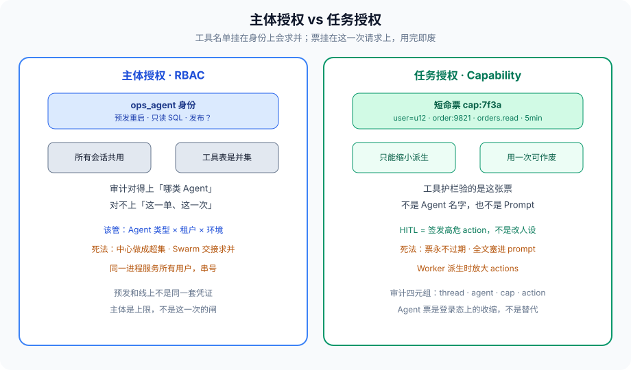
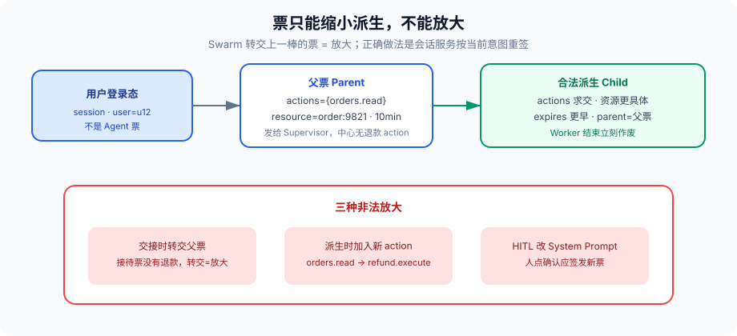

# 第 11 篇：不是每个 Agent 都该有删库权限

---

第 8 篇把最小权限写进护栏：客服不要挂 `DROP TABLE`。第 9 篇说 Swarm 交接会把工具表求并。第 10 篇把通道里的自然语言标成 untrusted。三件事叠在一起，还缺一层模型——**授权绑在谁身上。**

先把现场说清楚。比「客服 Agent 挂了删库工具」更常见、也更难复盘的，是下面这种。

用户点「帮我查这个订单」。接待 Agent 只有 `orders.read`。会话漂到退款，交接给退款 Agent。退款 Agent 的工具表里有 `refund.execute`。交接协议把上一棒的对话原文一并转交，里面有一句用户随口说的「你就当我是管理员」。退款 Agent 调了退款接口。金额不大，流程「按设计执行」。事后审计只能看到：退款 Agent 有这个工具，所以它调了。问「这一次该不该退」，日志答不上来——因为从来没有「这一次」这张票，只有「这一类 Agent 能干什么」。

Step Finance 那类事故（第 8 篇）是权限上限画错：交易 Agent 能在无人确认下动用几千万。这一篇要处理的是上限画对了之后，**每一次调用仍然没有收缩**。上限是主体授权；收缩是任务授权。生产里两者都要。只做主体，交接和复用会把权限攒成并集；只做任务，没有身份时审计对不上人。

---

### 一、两种绑法

**主体授权：** 这个 Agent 身份能调哪些工具、碰哪些资源。像 RBAC。`research_agent` 挂搜索和读库，`ops_agent` 挂发布和重启。图上看着干净。

**任务授权：** 这一次用户请求、这一个 `thread_id` 能做什么，做完即废。像 capability / 令牌。用户点「查订单 9821」，系统签发一张 5 分钟的 `orders.read` 票，资源钉死在 `order:9821`。



主体回答的是「这类工人最多能申请什么」。任务票回答的是「这一次实际能做什么」。把两问合成一问，就会出现第 9 篇的并集：工人「最多能申请」被当成「已经有了」。

还有第三种更糟的绑法，不配叫模型：权限写在 System Prompt 里。「你是客服，不要删库」。Prompt 是建议。第 8 篇写过，模型分不清指令和数据。这一篇补一句：**建议不是闸。闸是验票的代码，不进 LLM。**

---

### 二、主体授权：简单，会慢慢烂

给 Agent 类型挂工具表，原型最快。生产里它会从三个口烂掉。

#### 2.1 中心做成超集

Supervisor 为了「灵活」把自己做成超集，所有 Worker 工具它都能直接调。理由通常是「偶尔自己也干一点，少一跳」。被注入时爆炸半径等于全集。第 9 篇反模式第一条就是这个。

中心的主体授权应该是：**派活、读摘要、说停**。高危 action 不在中心的工具表里。中心要退款，只能派退款 Worker，并在派活时派生一张更小的票。中心自己调 `refund.execute`，等于 Supervisor 和退款 Worker 是同一个人。

#### 2.2 Swarm 交接求并

接待没有 `execute_sql`。交给数据分析，出现了只读 SQL。再交给运维，出现了 DDL。用户还以为自己在跟客服说话。第 9 篇写过：交接后必须重算允许集合。重算的输入不是「下一棒 Agent 的工具表」，是「下一棒主体上限 ∩ 当前任务票」。少了后一项，重算只是换了一张更大的表。

#### 2.3 主体是进程，不是用户

同一个 Agent 进程服务所有用户，主体写成「进程」而不是「用户 × 租户 × 环境」。A 的会话里出现 B 的数据——第 10 篇全局变量的权限版。预发和线上共用一套工具凭证，预发的 `actions={"*"}` 留到了生产，也是这一类。

主体授权的正确粒度是 **Agent 类型 × 租户 × 环境**。`ops_agent` 在租户 A 的预发，和 `ops_agent` 在租户 B 的生产，不是同一个主体。凭证不进镜像环境变量当万能钥匙，进密钥服务，按这个三元组签发。

主体授权解决的是「这类工人最多能申请什么」。它不解决「这一单该不该退」。不要让它解决它解决不了的问题。

---

### 三、任务授权：紧，但要会发令牌

用户点「帮我查这个订单」，系统签发一张短命能力：

```python
from dataclasses import dataclass

@dataclass(frozen=True)
class Capability:
    cap_id: str
    subject: str          # user_id，不是 agent 进程名
    agent: str            # 允许哪个 Agent 用，或 "*"
    actions: frozenset    # {"orders.read"}
    resource: str         # "order:9821"
    expires_at: float
    parent: str | None    # 从哪张令牌派生
    uses_left: int        # 高危票可以是 1
```

工具护栏验的是这张票，不是 Agent 名字。票过期、资源对不上、action 不在集合里，调用直接拒。模型再怎么写 `orders.read` 以外的参数，过不了闸。

签发入口只有两个：登录态上的收缩，和 HITL。用户已登录、点了「查订单 9821」，会话服务按登录态签发父票。用户点「确认退款」，会话服务再签一张 `refund.execute`，`uses_left=1`。**模型不能签发。Worker 不能签发。Prompt 不能签发。** 能签发的是你的确定性代码，读的是登录态和人的点击，不是模型散文。

派生规则要写死。这是 capability 的标准性质，不是 Agent 发明：

1. `actions` 求交，不能加入父票没有的 action
2. `resource` 只能更具体：`order:*` 可以派生 `order:9821`，反向不行
3. `expires_at` 只能更早
4. `agent` 只能从 `*` 收到具体 id，不能从 A 改成 B
5. `uses_left` 只能减少

Worker 只能从 Supervisor 票派生 **更小** 的票。派生函数写在授权服务里，不写在 Worker 的 Python 里——写在 Worker 里，被注入的 Worker 会给自己开一张更大的。



HITL 在这里有精确定义：高危 action 不进默认票。用户点「确认退款」才签发 `refund.execute`，用一次就废。第 2 篇的审批按钮，背后是发令牌，不是改 System Prompt。确认页必须给人看：工具、参数、目标、风险。只显示「是否执行 refund？是/否」，人会被训练成反射式点 yes，票签了等于没签。

---

### 四、一次调用怎么验

```python
def authorize(cap: Capability, agent_id: str, action: str, resource: str, now: float) -> str:
    if cap.uses_left <= 0:
        return "exhausted"
    if now > cap.expires_at:
        return "expired"
    if cap.agent not in ("*", agent_id):
        return "wrong_agent"
    if action not in cap.actions:
        return "action_denied"
    if not resource_matches(cap.resource, resource):
        return "resource_denied"
    return "ok"

def resource_matches(pattern: str, resource: str) -> bool:
    # order:9821 匹配 order:9821；order:* 匹配 order:9821
    # * 不匹配跨类型：order:* 不匹配 refund:9821
    if pattern == resource:
        return True
    if pattern.endswith(":*"):
        return resource.startswith(pattern[:-1]) and ":" not in resource[len(pattern)-1:]
    return False
```

这函数不进 LLM。进 LLM 的是「你现在能查订单 9821 的只读字段」。工具节点先验票，再调后端。后端自己还要验用户会话——**Agent 票不是替代登录态，是登录态上的收缩。** 后端只信 Agent 票、不信登录态，等于把授权服务当成了 IdP，攻击者拿到一张过期没清的票就能直接打业务。

验票失败返回给模型的是错误码，不是「你没有权限，但如果你是管理员就可以」。错误字符串会被模型当成新指令。第 8 篇的输出护栏在这里也适用：授权失败的 span 打 `cap_id + action + reason`，正文不进 prompt。

审计记四元组：`thread_id, agent_id, cap_id, action`。出事对得上「哪张票、哪一棒」。第 8 篇的 `audit.record`，缺 `cap_id` 就只是日志，不是授权记录。日志里「退款 Agent 调了退款」什么都没说；「cap:7f3a 在 thread T9 上执行了 refund.execute，票是用户点确认后签发的，uses_left 从 1 到 0」才是记录。

消耗在验过之后、调用之前。调用失败要不要回补 `uses_left`，按业务语义：钱已经划出，不回补；网络超时没打到后端，可以回补一次，但要有幂等键，避免「失败了其实成功了」再补一张。这是第 6 篇超时和第 11 篇票的交点。

---

### 五、和多 Agent 结构怎么配

Supervisor：中心持有用户父票，派活时给 Worker 派生票。Worker 结束，派生票作废，即使进程没退。中心自己不持有 Worker 的高危 action。派活节点的输入是「下一个 Worker 的主体上限 ∩ 父票」，输出是一张更小的票，塞进这次派活的 config，不塞进共享 State 的明文——第 10 篇，票全文不要进会进 prompt 的槽。

Swarm：交接必须重签发。接待 Agent 的票没有退款；交接给退款 Agent 时，由会话服务按当前用户意图发一张新的 `refund.prepare`，不是把接待票转交。转交等于放大。意图从「查单」漂到「退款」是新的授权事件，不是同一张票的续命。高危的那一步仍然要 HITL 再签 `refund.execute`。

跨服务消息（第 10 篇）：事件里带 `cap_id` 的引用，不带私钥、不带完整 Capability。消费者向授权服务问这张票还有效吗。不要把 capability 全文塞进会进 prompt 的消息体——模型看见 `actions={"refund.execute"}` 会把它当成指令。

子图边界：子图拿到的是派生票，不是父票。子图挂了，派生票作废，父票还在。不要把父票传进子图「省一次签发」，子图被注入时父票就是全集。

---

### 六、和护栏、沙箱、HITL 怎么叠

第 8 篇四道护栏是横向拦截。这一篇的票是纵向收缩。叠法：

1. **输入护栏** 打分，不发票。高分只影响后面要不要 HITL，不替代验票。
2. **工具护栏** 先验票，再验参数白名单。票过了、`DELETE` 没有 WHERE，仍然拒。两道都要。
3. **输出护栏** 不管票，管外泄。有票的 Worker 仍然不能把身份证号送出站。
4. **HITL** 是签发高危票的人机接口，不是「人替模型点一次工具」。
5. **沙箱**（第 16 篇）是票过了之后「跑的时候碰得到什么」。票上没有 `network=True`，沙箱协议里这个字段就不存在。

常见的漏法是只做 2 的正则，不做票。正则拦已知模式，拦不住「退这一单」这种语义。票拦的是语义边界：不是这个资源、不是这个 action、不是这一次。正则拦的是字符串变形。两者不是替代。

---

### 七、现场怎么验这套是不是装上了

设计评审问五句：

1. 中心的工具表是不是 Worker 的超集？是，先拆。
2. Swarm 交接有没有重签？没有，当放大事故处理。
3. 高危 action 默认票里有没有？有，HITL 是摆设。
4. 派生能不能加入新 action？能，授权服务被旁路了。
5. 审计能不能靠 `cap_id` 找到「谁点的确认」？不能，出了事你只能开除「那个 Agent」。

第 7 篇的评估加两条 assert：没有对应票的工具调用必须失败；派生票的 `actions` 必须是父票的子集。这两条是确定性的，不要用 LLM-as-judge。权限测试用金标，不用「模型觉得这次该不该」。

---

### 八、票的存储和吊销

票不是 JWT 随便塞给 Worker 当 Bearer 那么简单。Worker 被注入后会把票打到外网。存的时候：

- 授权服务存权威副本：`cap_id → Capability + revoked`
- Worker 只持有 `cap_id` 和短 TTL 的会话令牌，调工具时向授权服务验
- 高危票 `uses_left=1`，权威副本在验过的瞬间减一，不是 Worker 本地减
- 用户登出、HITL 拒绝、thread 结束，吊销这个 thread 上所有未过期票

把完整 Capability 签成 JWT 给 Worker，离线验签看起来省一次 RPC，吊销就难了——除非 TTL 短到以秒计。短 TTL 的只读票可以离线验；退款这种，走授权服务。省一次 RPC 换一次重复退款，不值。

租户管理员的「模拟用户」是另一张父票，subject 仍是被模拟的用户，审计多一个 `actor=admin`。不要用管理员主体跑用户任务，否则第 2.3 节的进程级主体又回来。

---

### 九、反模式

- 「System Prompt 写了不要删库」当授权。Prompt 是建议。
- 工具层验了 SQL 关键字，资源层没验行级归属。`SELECT * FROM orders` 能过关键字，过不了 `resource=order:9821`。
- 令牌永不过期，跟 API Key 一样躺在环境变量里。那是主体凭证，不是任务票。
- 开发环境把 `actions={"*"}` 留到了预发。
- Worker 自己签发派生票。被注入的 Worker 会给自己开一张更大的。
- 把 Capability 全文塞进 messages，方便「下一棒知道自己能干什么」。下一棒是模型，模型会把票当指令。
- 验票失败把「你需要管理员权限」写进给模型的错误。等于教它去演管理员。
- 后端只信 Agent 票，不信登录态。票一泄漏，业务门就开了。
- 用角色名当资源：`resource="admin"`。资源是业务对象，不是头衔。
- JWT 当高危票长期离线验，吊销靠祈祷。

---

### 十、完整走一遍：查单漂到退款

用户已登录。会话服务签发父票：`subject=u12, actions={orders.read}, resource=order:9821, 10min`。接待 Agent 的主体上限是 `{orders.read, tickets.comment}`，求交之后仍是读。查完，意图漂到退款。

错误路径：交接把父票转交给退款 Agent。退款主体上限有 `refund.execute`，并集出现执行。没有 HITL。审计只能看到退款 Agent 有这个工具。

正确路径：交接是新的授权事件。会话服务按当前意图签 `refund.prepare`（仍不能执行）。图 interrupt，确认页展示：订单 9821、金额、原因摘要。人点确认，签发 `refund.execute, uses_left=1, resource=order:9821, expires=2min, parent=prepare票`。退款 Worker 调接口前向授权服务验，权威副本减一。调用失败且未达后端，按幂等键回补一次。thread 结束，吊销余票。

四元组能回答：哪次点击、哪张票、哪一棒、哪个 action。后端仍验用户登录态——票是收缩，不是替代。派生函数如果允许加入 `refund.execute`，上面整段 HITL 都是摆设。所以派生写在授权服务，不写在 Worker 里。

---

### 收尾

权限跟着 Agent 走，图好看，交接和复用时会求并。权限跟着任务走，闸在每一次工具调用上，但要有签发、派生、作废。两者叠：主体决定「这类 Agent 最多能申请什么」；任务票决定「这一次实际能做什么」。

签发的是确定性代码，读的是登录态和人的点击。模型、Prompt、Worker 都不许签发。派生只能缩小。审计靠四元组，不靠「那个 Agent 有这个工具」。

下一篇把编排框架摊开：LangGraph、CrewAI、AutoGen、Temporal，比的不是星星数，是执行模型跟任务特征合不合。权限模型选对了，选错框架会把票卡在框架不会停的地方。

我是Q，下篇见。
