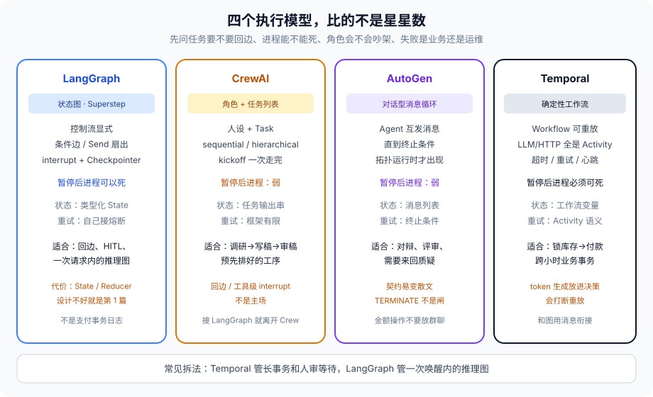

# 第 12 篇：LangGraph、CrewAI、AutoGen、Temporal，比的是执行模型

---

前三篇把多 Agent 的控制权、通道、权限钉死了。有人会问：那我直接选一个框架不就行了？

框架营销页都说自己能做多 Agent。差别在 **执行模型**——图、角色对话、事件工作流，各自假设了任务长什么样。假设错了，不是多写点胶水的事，是状态、重试、HITL、票，全套要跟它拧着做。

这一篇只比四样在生产里常被并列的东西：LangGraph、CrewAI、AutoGen（现在的 agent-framework 一线）、Temporal。不排名。星星数、GitHub 趋势、谁被哪家大公司用过，都不是选型依据。依据是任务的四个特征。

先说一个选错的现场。

团队用 CrewAI 的 hierarchical 跑「调研 → 写稿 → 审稿」，demo 很漂亮。上线第二周，审稿失败要回到调研补两篇文献，再写一版。Crew 的工序是排好的，回边要自己拿输出当新的 kickoff 输入，等于在框架外面盖了一张图。HITL 卡在「终稿发出去之前」，人点拒绝，进程还占着，K8s 一滚动，审批单蒸发。事后总结写「Crew 不适合我们」。不适合的不是品牌，是 **预置工序对上了回边任务**。换 LangGraph 之前如果不问那四个特征，下一季会用 LangGraph 去模拟支付的 precisely-once，再写一篇「Checkpoint 丢了钱」。

---

### 一、先问任务，再问框架

把任务压成四个特征：

1. **控制流是否要回边、条件边、并行扇出。** 要，图合适。不要，工序列表就够。
2. **停下来等人之后，进程能不能死。** 要能死，需要外置工作流或外置 Checkpoint，不是线程里 `input()`。
3. **角色是「工具工人」还是「会吵架的对话者」。** 后者像 AutoGen 的群聊；前者像图上的节点。
4. **失败重试是业务语义还是运维语义。** 支付要 precisely-once 的工作流；检索超时重试是运维。

四条答完，框架差不多定了。答的时候不要看框架 README 的 feature list。「支持多 Agent」四家都支持，支持的不是同一件事。

第五个不该问但总有人问的：团队会不会 Python。会，不构成选 LangGraph 的理由。不会，也不构成选 Crew 的理由。执行模型跟语言无关。Temporal 的 Worker 可以是 TypeScript，图还是图。

---

### 二、四个执行模型

#### 2.1 LangGraph：状态图

Superstep、条件边、Send 扇出、Checkpoint。控制流显式。HITL 是 `interrupt` + 外置 checkpointer，进程可以死。和本系列第 0、1、2、4 篇是同一套词汇。

它假设：你愿意把任务画成一张图，愿意设计 State 和 Reducer，愿意把「下一步去哪」写成边条件而不是模型散文。代价正好是第 1 篇：设计不好，静默覆盖、窗口膨胀、子图泄漏，全回来。

适合：一次用户请求内的推理，要回边、要并行、要在固定卡点 HITL、要从 Checkpoint 醒过来。不适合：把支付的「扣款是否成功」交给 Checkpoint 当事务日志。Checkpoint 是执行历史的链表，不是账本。

LangGraph 的 `create_supervisor` / `create_swarm` 能少写样板。第 9 篇写过：样板后面那三件事它不会替你做——摘要协议、交接次数上限、交接后重算工具白名单。包只解决「怎么把控制权转起来」。票（第 11 篇）也不在包里。

#### 2.2 CrewAI：角色 + 任务列表

先声明 Agent 人设和 Task，再 `Crew.kickoff()`。上手快，sequential / hierarchical 两种内置过程。适合「调研→写稿→审稿」这种预先排好的工序。人设写在 prompt 里，任务输出串成下一棒的输入。

它假设：拓扑在 kickoff 之前就知道，失败了整段重来可以接受，HITL 不是一等公民。回边、按中间结果改拓扑、精细到工具级的 interrupt，不是它的主场。硬拧也能接 LangGraph 当 backend，那等于你已经离开 Crew 的执行模型，只是还用它的人设 DSL。

工序任务用 Crew 能少写样板，这是真的。把「少写样板」当成「生产编排」，会在第一次回边时付清。

#### 2.3 AutoGen / 对话型多 Agent：消息循环

Agent 互发消息，直到某个终止条件。适合需要来回质疑、补充的场景：代码评审、方案辩论、找漏洞。终止条件写不好就是第 9 篇的踢皮球。状态默认在对话里，schema 弱，第 10 篇的「契约变散文」会成为主问题。HITL 通常是插一条 human 消息，不是工作流级的持久暂停——人去吃饭，进程还在，或进程死了对话没了。

它假设：智能来自角色对辩，而不是来自显式图。这个假设在「答案不唯一、需要互相挑错」时成立。在「退款必须经过验票、熔断、HITL」时不成立。群聊协议里没有第 8、11 篇的闸。`TERMINATE` 是模型说的一句话，不是边条件。

金额、写生产、出站邮件，不要放进群聊。对辩可以在群聊里出一份结构化报告，真正的副作用走图，走票。

#### 2.4 Temporal：确定性工作流 + Activity

工作流代码必须能重放。LLM 调用、HTTP、浏览器，全是 Activity，有超时、重试、心跳。Agent 在这里不是一等公民，是 Activity 里跑的一段。适合「订机票：锁库存→付款→出票」，中间可以隔几个小时、机器可以换。人审是信号，不是线程里的 `input()`。

它假设：工作流决策是确定性的。相同的历史重放，必须走到同一条边。LLM 的 token 生成不满足这个假设。把每一步 chat completion 放进工作流决策，重放会分叉——上次选了退款，这次选了查单，Temporal 会直接报 non-determinism。

常见拆法：Temporal 管长事务和人审等待，LangGraph 管单次请求内的推理图。两者通过消息或信号衔接，正是第 10 篇的跨服务通道。LangGraph 的一次 `invoke` 是一个 Activity；Activity 的输入是票和指针，输出是摘要和 `report_id`，不是 20 万 token 的 messages。

「用 Temporal 跑 Agent」如果指的是「整个 ReAct 环当工作流」，多半已经违了确定性。如果指的是「业务事务用 Temporal，推理用图」，那是这一篇推荐的拆。

仓库里那张旧对照图把 LangChain LCEL 也画进去了，线性管道适合 RAG / 摘要 / 分类，没有循环。本篇不把它和这四家并列——LCEL 不是多 Agent 执行模型，是链。任务没有回边，用链，别升图，第 9 篇对 Router 说过同一句话。

---

### 三、一张对照表（只对照执行，不对照星星）

| | 控制流 | 暂停后进程可死 | 状态 | 重试 |
| --- | --- | --- | --- | --- |
| LangGraph | 显式图 | 可以（checkpointer） | 类型化 State | 你自己接第 6 篇 |
| CrewAI | 预置工序 | 弱 | 任务输出串 | 框架有限 |
| AutoGen 群聊 | 运行时对话 | 弱 | 消息列表 | 终止条件 |
| Temporal | 工作流代码 | 必须可以 | 工作流变量 | Activity 语义 |

「弱」不是不能做，是做了你就在框架外面自己盖一层，那一层才是你真正的架构。盖了那一层之后，对外还说「我们用 Crew」，会把下一任带到沟里——他以为改 Task 描述就行，其实拓扑在你自己的图里。

把第 11 篇的票叠上去，差别更清楚：

- LangGraph：票进节点 config，工具节点先验。interrupt 等人签高危票，进程可以死。
- Crew：工序中间插验票要自己包工具。人审等待不是一等公民。
- AutoGen：群聊里验票，等于在散文协议上打补丁。终止条件仍可能在没验票时结束。
- Temporal：票的签发和消耗是 Activity，可重试、可超时。工作流只记 `cap_id`，不记票全文——重放不该看见会变的密钥。

---

### 四、和本系列怎么接

第 9 篇的 Supervisor / Swarm 是控制权，不是框架。LangGraph 两个包都能做；Crew 的 hierarchical 看起来像 Supervisor，没有「说停」的全局节点语义；AutoGen 默认更像 Swarm，环路更难画出来；Temporal 的 Child Workflow 可以模拟 Supervisor，但 Worker 是 Activity，不是会自己交接的对话者。

第 10 篇的通道：图内用 State，跨框架用消息。选了两家框架，就没有「共享一份 TypedDict」这条路。

第 4 篇的长时运行：进程可死这件事，LangGraph 靠 checkpointer，Temporal 靠事件历史。Crew 和 AutoGen 要把这件事做实，得外挂两者之一。

第 6 篇的熔断：LangGraph 要自己写在图里。Temporal 的 Activity 重试策略是现成的，但要设上限，默认重试能把下游打满。Crew / AutoGen 的重试常常在模型侧「再试一次」，正是重试风暴的入口。

---

### 五、最小对照：同一任务四种子

任务：用户要一份竞品调研，终稿发出前 HITL，检索允许失败降级。

LangGraph：节点 `research → write → review`，`review` 失败条件边回 `research`，最多两圈。检索节点套超时和熔断。`write` 之后 `interrupt`。State 里 `report_id` 指针，不塞原文。

Crew：三个 Task 顺序 kickoff。回边变成第二次 kickoff。HITL 自己做。能跑 demo。生产第一次回边就离开 Crew。

AutoGen：研究员和写手对辩，审稿人当终止者。终止者说「再查两篇」就是回边，但 hop 没有硬上限，除非你外挂。HITL 是 human 消息。票不好挂。

Temporal：Workflow 里 `research` / `write` 是 Activity，`review` 失败再调 `research` Activity。人审 `wait_for_signal`。LangGraph 如果还在，塞进某一个 Activity。Workflow 不调用 LLM 做分支。

同一任务，四种子都「能做」。能做的成本和出事时能不能醒，差在执行模型。

---

### 六、迁移时不要换皮

从 Crew 迁到 LangGraph，不是把 Task 描述贴进节点 prompt。要先画边：哪些失败回哪、HITL 卡在哪、State 哪些键。描述可以暂时留着，拓扑不能留成 kickoff 顺序。

从 LangGraph 迁一段给 Temporal，迁的是「跨小时等待和补偿」，不是把每个节点变成 Activity。节点仍在图里，图的一次 invoke 变成一个 Activity。迁反了，重放天天分叉。

从单 Agent 加多角色，先问第 9 篇那一问，再选框架。先接 AutoGen 再发现需要票和熔断，闸要外挂一整层，那一层才是架构，群聊变成了 UI。

选型评审写四句就能交差：控制流要不要回边；等人时进程能不能死；角色会不会对辩；失败是业务还是运维。四句都含糊，不要买框架。

---

### 七、反模式

- 用 Crew 的 hierarchical 当 Supervisor，然后抱怨不能在「写稿」和「审稿」之间按失败类型回边。那是图的问题，换图。
- 用 LangGraph 模拟支付的 precisely-once。Checkpoint 不是事务日志。钱的状态给 Temporal 或数据库事务。
- 用 Temporal 工作流直接 `chat.completions.create` 还不标非确定性。重放会分叉。
- 用 AutoGen 群聊跑有金额上限的操作，终止条件靠模型说 `TERMINATE`。第 8、11 篇的闸不在群聊协议里。
- 按 GitHub stars 选。stars 不回答四个特征。
- 为了「统一技术栈」强迫所有任务进同一执行模型。检索问答用图，支付用 Temporal，对辩用群聊，可以共存，靠第 10 篇的消息衔接。
- 在 README 写「我们用 LangGraph」，实际拓扑是 while True 调模型。那是第 0 篇的链，不是图。
- 迁移只换包名，拓扑仍是 kickoff 顺序或整包 transcript POST。

---

### 八、完整走一遍：四个特征怎么落到选型

任务还是那张退款单，加上「物流要查外部 API，人审可能隔夜，偶尔要和规则专家对辩一句」。

1. 控制流要回边：查物流失败要换数据源再查，审稿式的规则核对失败要回检索。图合适。Crew 的工序第一次回边就会被离开。
2. 等人之后进程要能死：隔夜审批。LangGraph interrupt + 外置 checkpointer 能撑「人在页面上」的分钟级；隔夜把等待交给 Temporal 信号，图的一次 invoke 当 Activity。
3. 角色大体是工具工人，对辩只发生在「这条规则适不适用」这一小段。不要整张单进 AutoGen。对辩可以是一个节点里的有上限消息循环，副作用仍走图表和票。
4. 失败：检索超时是运维重试，有预算、有熔断。扣款失败是业务语义，precisely-once，Temporal Activity 或数据库事务，不靠 Checkpoint。

落下来：LangGraph 管一次唤醒内的查单和准备；Temporal 管隔夜人审和扣款补偿；没有 Crew；没有群聊当主路径。框架可以两个共存，靠第 10 篇的消息和第 18 篇的任务 id。硬选一个「全家桶」，四个特征里总有一个被拧着做。

---

### 收尾

框架是执行模型的包装。任务要回边和可暂停的图，用 LangGraph；任务是排好的工序，Crew 能少写样板；任务是角色对辩，对话循环自然；任务是跨小时的业务事务，Temporal。

先问四个特征，再问框架名字。名字选对了，第 9、10、11 篇的闸还是要自己焊。名字选错了，焊在错误的执行模型上，下一季会整张揭掉。

多 Agent 这一组到此结束。下一组进生产：第 13 篇从「上了线就是黑盒」开始，把 Trace、Span、State Diff 装上。没有观测，前面写的 Supervisor、权限、熔断，出事时都对不上现场。

我是Q，下篇见。
