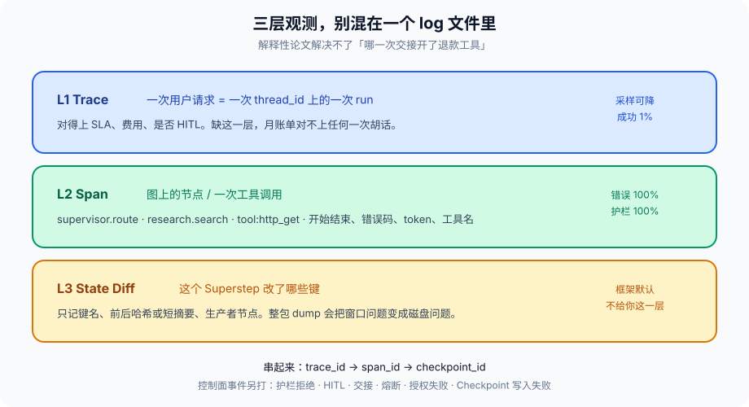
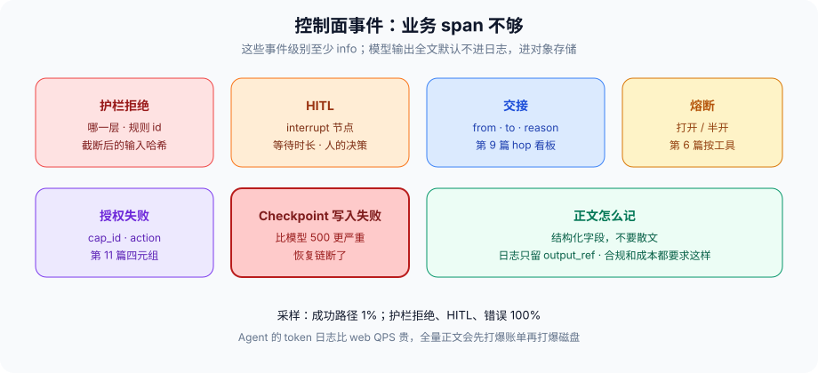

# 第 13 篇：Agent 上了生产就是黑盒

---

多 Agent 四篇把结构钉完了。结构在测试环境能画出来，一上生产就变成：用户说「它胡了」，你问「哪一步」，谁也指不出。

传统后端靠 access log 和 tracing。Agent 多了三样东西 log 默认没有：

1. **这一步为什么选这个工具**（模型决策）
2. **State 哪几个字段被改了**（补丁，不是整包 dump）
3. **护栏 / HITL / 交接发生过没有**（控制面事件）

没有这三样，第 6 篇的熔断、第 9 篇的踢皮球、第 11 篇的票，都无法复盘。观测不是锦上添花，是前面那些闸的验收条件。闸装了但打不出点，等于没装。

现场通常长这样。客服说 Agent 把退款退错了。你打开网关日志，看到一次 200，耗时 38 秒。模型厂商控制台看到几次 chat completion，输入 token 很多。LangSmith 如果接了，能看见一段很长的 messages。三样东西对不上：哪一次交接把退款工具打开了？`current_order` 是谁写的？HITL 有没有弹过？票的 `cap_id` 是哪一张？没有 State Diff 和控制面事件，你只能对着 38 秒的 200 开会。

黑盒不是因为 LLM 不可解释。注意力可视化解决不了「哪一次交接开了退款工具」。这是工程打点问题。

---

### 一、三层，别混在一个 log 文件里

**L1 Trace：一次用户请求。** `trace_id` = 一次 `thread_id` 上的一次 run。从用户消息进图到最终回复。对得上 SLA、费用、是否 HITL。同一 `thread_id` 可以有多次 run——HITL 恢复是第二次，第 4 篇的 resume 是第三次。每次 run 一个 `trace_id`，用 `thread_id` 串起来。把 `thread_id` 当 `trace_id` 用，人审前后两段会糊成一次，费用和耗时都是错的。

**L2 Span：图上的节点或一次工具调用。** `supervisor.route`、`research.search`、`tool:http_get`。要有开始结束、错误码、token 用量、工具名。LangSmith、OpenTelemetry 的 span 都能扛这一层。工具调用不要和节点揉成一个 span：节点可能调三次工具，熔断发生在第二次，揉在一起你只看见节点失败。

**L3 State Diff：这个 Superstep 改了哪些键。** 不要把整个 State 打进日志——第 3 篇的窗口问题会变成磁盘问题，还会把用户数据写进日志系统。只记：键名、前后哈希或短摘要、生产者节点。`current_order` 从 `9821` 变成 `0000`，diff 里要能看见，且能看见是 `research` 节点写的。整包 dump 里也能看见，但下个月磁盘先爆，合规再来敲门。



三层用同一套 id 串起来：`trace_id → span_id → checkpoint_id`。缺任何一层，黑盒只是换了个形状。只有 L1，你知道这次慢；只有 L2，你知道哪个工具慢，不知道 State 被谁改脏；只有 L3，你知道脏了，对不上用户的那一次投诉。

LangGraph 的 callback / LangSmith 已经覆盖 L1/L2。L3 要自己在 reducer 旁挂钩，框架不会默认给你「哪个键被谁改了」。这是选型时就要算进去的工作量，不是上线后「加个日志」。

---

### 二、必须打点的控制面事件

业务 span 不够。下面这些是「架构事件」，级别至少 info，采样 100%：

- 护栏拒绝：哪一层、规则 id、截断后的输入哈希
- HITL：interrupt 的节点、等待时长、人的决策（同意 / 拒绝 / 改参）
- 交接：from、to、reason（第 9 篇）
- 熔断打开 / 半开（第 6 篇）
- 授权失败：cap_id、action（第 11 篇）
- Checkpoint 写入失败——这比模型 500 更严重，恢复链断了
- 预算触发：哪一条边因为 token / 工具次数打满而走了降级（第 14 篇）
- 沙箱杀死：超时、OOM、seccomp，错误码，不带宿主机堆栈（第 16 篇）



用结构化字段，不要散文。`reason="用户看起来想退款所以交给退款 Agent"` 不是字段，是另一段会进下一轮 prompt 的自然语言。`reason_code=intent_refund` 才是字段。

模型输出全文默认不进日志，进对象存储，日志只留 `output_ref`。合规和成本都要求这样。PII、身份证、订单全文，日志系统的权限模型通常比对客服的还松——运维能 grep，攻击者能进日志平台。第 8 篇的输出护栏如果只管用户可见回复、不管日志，等于开了后门。

---

### 三、最小实现

```python
from dataclasses import dataclass, field
import hashlib, time, json

@dataclass
class Span:
    trace_id: str
    span_id: str
    name: str
    start: float
    end: float = 0
    attrs: dict = field(default_factory=dict)
    err: str | None = None

def snapshot_hashes(state: dict) -> dict:
    out = {}
    for k, v in state.items():
        if k.startswith("_"):
            continue
        raw = json.dumps(v, default=str, sort_keys=True)[:4096]
        out[k] = hashlib.sha256(raw.encode()).hexdigest()[:12]
    return out

class Tracer:
    def start(self, trace_id, name, **attrs) -> Span:
        return Span(trace_id, new_id(), name, time.time(), attrs=attrs)

    def end(self, sp: Span, err=None):
        sp.end = time.time()
        sp.err = err
        emit(sp)  # OTLP / LangSmith

    def diff(self, sp: Span, before: dict, after: dict):
        changed = []
        for k in sorted(set(before) | set(after)):
            if before.get(k) != after.get(k):
                changed.append({"key": k, "from": before.get(k), "to": after.get(k)})
        sp.attrs["state_diff"] = changed
        if changed:
            emit_event(sp.trace_id, "state.diff", changed)

def node_wrapper(name, fn):
    def wrapped(state, config):
        tr = config["tracer"]
        sp = tr.start(config["trace_id"], name,
                      checkpoint=config.get("ckpt"),
                      thread_id=config["thread_id"],
                      agent_id=config.get("agent_id"))
        before = snapshot_hashes(state)
        try:
            out = fn(state)
            tr.diff(sp, before, snapshot_hashes(apply_patch(state, out)))
            tr.end(sp)
            return out
        except Exception as e:
            tr.end(sp, err=type(e).__name__)
            raise
    return wrapped
```

`snapshot_hashes` 截断到 4KB 再哈希，避免为了打点把 2MB 检索原文序列化一遍——那会让观测本身变成延迟。键名白名单也可以：只对 `current_order`、`reports`、`next_worker`、`budget` 做 diff，`messages` 只记长度。

采样：成功路径可以 1%；护栏拒绝、HITL、错误 100%。Agent 的 token 日志比 web QPS 贵，全量正文会先打爆账单再打爆磁盘。采样决策写在 Tracer 里，不要写在每个节点「觉得这次重要就打」。节点觉得重要的，往往是它没犯错的时候。

属性要预先约定，不然每个节点各写各的，看板拼不起来。最低集合：

```
trace_id, span_id, thread_id, checkpoint_id,
agent_id, node, tool,
tokens_in, tokens_out, model,
cap_id, action, resource,
handoff_from, handoff_to,
error_code
```

第 9 篇说 Supervisor 和 Swarm 不要共用一张看板。落实就是这些属性：Supervisor 盯 `tokens_in` 在 `node=supervisor` 上的占比、改派次数；Swarm 盯 `handoff_to` 回流、hop。缺属性，Grafana 只能画「多 Agent 慢」。

---

### 四、和评估、成本、权限的关系

第 7 篇的回归测试吃的是 Trace：同样的 `trace` 结构，离线再跑 Judge。生产采样下来的失败 Trace，就是最好的评测增量。没有生产 Trace 的评测集，是实验室金标，覆盖不了「交接三次才答」这种现场。

第 14 篇的成本：没有 span 上的 token in/out，你只看得见月账单，看不见是 Supervisor 在空转还是检索在循环。观测是成本归因的前提。不要等财务来问再补打点，那时候已经五万了。

第 11 篇的票：授权失败如果只在 stderr 打一行，审计四元组不成立。`cap_id` 必须是 span 属性，和 `action` 一起。成功的调用也要记，不只记失败——出事时你要证明「那张票当时是有效的」。

第 15 篇的部署：副本之间的锁等待、resume 是否打到另一台，也是 span。`thread_lock_wait_ms` 突然变高，往往是同一 `thread_id` 被并发打进来了，不是模型变慢。

---

### 五、隐私和保留

Trace 不是永远留着。会话原文、工具返回、用户 PII，保留策略要单独写：错误样本 90 天、成功抽样 7 天、控制面事件 180 天，按合规调。HITL 截图、确认页上的参数，是用户数据，不是调试附件。

给模型厂商的请求日志，默认当出站。能关则关，不能关就当第 8 篇的外部通道：不要把票全文、身份证、内部域名送进去。观测的「完整 prompt」诱惑很大，完整等于泄漏。

开发环境把 Tracer 打到 stdout 可以。预发和生产打到 stdout，K8s 日志采集会变成第二份没有采样、没有脱敏的 Trace。那是第 10 篇「日志系统成了第二份共享内存」的现场。

---

### 六、告警怎么挂，才不会变成第 8 篇的疲劳

观测如果只用来事后 grep，等于没观测。告警挂在控制面事件上，不要挂在「延迟 P99」这一条万能线上。Agent 的延迟 P99 会因为 HITL 等人而废掉——人审三分钟不是事故。

该响的：

- Checkpoint 写入失败，立刻
- 熔断打开，按工具
- 授权失败率突增（可能在扫票，也可能票服务挂了）
- Swarm hop 超阈值的比例
- Supervisor 改派次数超阈值
- 观测管道自己延迟（打点失败比模型 500 更需要被看见）

不该响的：单次模型慢、单次检索 miss、用户取消。响了人会关告警，真断链时没人看。

看板按角色分：值班看控制面和熔断；成本看第 14 篇三张图；安全看护栏拒绝和 cap 失败；研发看 State Diff 抽样。一张「Agent 总览」给领导可以，给值班不行。

---

### 七、反模式

- 只有网关 access log。Agent 的 200 和「胡了」可以同时成立。
- 整包 State dump 进 ELK。磁盘、合规、下一次检索自己的日志当上下文，三炸。
- 用模型再总结一次 Trace 当复盘。复盘要的是字段，不是另一段散文。
- LangSmith 全量开着，月账单里观测比推理贵，然后关掉，回到黑盒。先采样，再接厂商。
- span 名用模型输出：「正在认真检索竞品」。用稳定字符串 `research.search`。
- 成功和失败同一采样率。失败被抽掉的那次，就是用户投诉的那次。
- 不记 `cap_id`。权限模型在代码里，观测里看不见，出事只能开除 Agent。
- Checkpoint 写入失败只打 debug。这是 P0，不是 debug。
- 告警挂在延迟 P99 上，HITL 等人把值班吵死，真断链时告警已被关掉。

---

### 八、完整走一遍：退错款之后怎么查

用户投诉退错了。值班不该先翻模型厂商控制台。

1. 用 `thread_id` 找到两次 run 的 `trace_id`：一次查单，一次 HITL resume。如果只有一个 trace，人审前后糊在一起，费用和耗时都不可信。
2. L2 看 `handoff_to` 或 `supervisor.route` 的下一棒，是否出现 `refund`。看 `tool` span 里有没有 `refund.execute`。
3. 控制面：有没有 HITL 事件、人的决策是什么、有没有 `cap_id`。没有 HITL、有执行，第 11 篇的闸没挂上。有 HITL、人点了同意，问题在确认页信息够不够，不在模型。
4. L3 State Diff：`current_order` 的哈希何时变成 0000、生产者是哪个节点。变了且生产者是检索 Worker，通道把 untrusted 写进了业务槽。
5. Checkpoint 链能把 resume 点找回来。写入失败事件如果在当时就响了，这条投诉不该等到用户开口。

这一趟查下来，该修的是闸，不是「再训一下模型别退错」。观测的验收条件是：**值班能在十五分钟内指认是交接、是票、是通道、还是人点错。** 指认不了，三层缺了。

---

### 收尾

黑盒不是因为 LLM 不可解释，是因为你没把图上的节点、State 补丁、控制面事件打点。解释性论文解决不了「哪一次交接开了退款工具」。

三层：Trace / Span / State Diff，用 id 串起来。控制面事件 100% 采样。正文进对象存储，日志留引用。属性先约定，看板才分得开 Supervisor 和 Swarm。

下一篇把观测到的数字变成钱：Token、Checkpoint、日志，一个月五万是怎么堆出来的。没有这一篇的 span，下一篇只能骂模型单价。

我是Q，下篇见。
