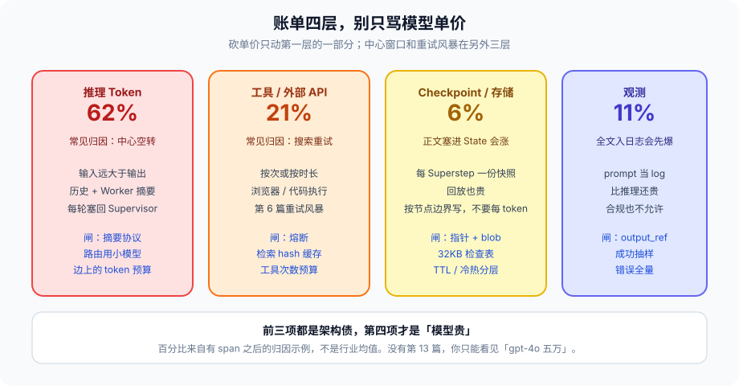

# 第 14 篇：Agent 跑一个月 Token 账单五万，成本架构怎么设计

---

第 13 篇把点打上了。有了 span 上的 token，才能谈钱。五万这个数字不是寓言，是「中心模型 + 多 Worker + 长会话 + 全量 Trace」乘在一起的常见量级。先拆账单，再决定砍哪一层。

没有归因的成本会会开成这样：财务说这个月模型五万。产品说用户在涨。算法说旗舰模型不能换，换了效果掉。工程说检索 API 也贵。四个人都对，因为五万是四层叠出来的，每一层都觉得自己不是大头。有 span 之后才能说出「62% 输入 token 在 Supervisor 空转」这种话。说不出这种话，就只能砍单价——砍完发现还是四万八，因为空转还在。

---

### 一、账单的四层，别只骂模型单价

1. **推理 Token：** 输入远大于输出。Supervisor 每轮把历史和 Worker 摘要塞回去，输入是大头。第 9 篇中心窗口，直接等于钱。输出 token 贵，但空转的 Supervisor 每轮可能只吐一个 Worker 名字，输入却是 20K。
2. **工具与外部 API：** 搜索、浏览器、代码执行，按次或按时长。重试风暴（第 6 篇）会把这一项打满。一次检索超时，中心再开一个 Worker，两次打同一 API，钱和时间一起翻。
3. **Checkpoint / 存储：** 每 Superstep 一份快照。State 里塞了检索原文，存储和回放都贵。Postgres 里 2MB 的 JSON 每步写一次，不是「先这样」。
4. **观测：** 全量 prompt 进 LangSmith / 自建日志。观测可以比推理还贵，如果你把正文当 log。



砍单价（换小模型）只动第一层的一部分。架构不动，另外三层照涨。旗舰换便宜一档，空转还是空转，只是单价低了 30%，次数没变。

还有第五层不太进模型账单，但进总拥有成本：人审时间。HITL 弹得太勤，第 8 篇的 alarm fatigue，人的工资比 token 贵。成本架构如果只盯美元，会把费用转移到值班表上。

---

### 二、预算是图上的边，不是财务周报

把预算写成 State 里的计数器，在条件边检查：

```python
from typing import TypedDict

class Budget(TypedDict):
    tokens_in: int
    tokens_out: int
    tool_calls: int
    max_tokens: int
    max_tools: int
    max_handoffs: int

def over_budget(state) -> str | None:
    b = state["budget"]
    if b["tokens_in"] + b["tokens_out"] >= b["max_tokens"]:
        return "tokens"
    if b["tool_calls"] >= b["max_tools"]:
        return "tools"
    if len(state.get("handoff_log") or []) >= b["max_handoffs"]:
        return "handoffs"
    return None

def after_node(state):
    reason = over_budget(state)
    if reason:
        return "degrade"
    return state.get("next_worker") or "end"
```

超了走降级节点：返回已有摘要、或问用户要不要加预算。不要让模型「再想想」。再想想就是再花钱。降级节点不调旗舰模型，调模板：「目前信息不够，已用完这次查询额度，需要我继续的话请确认。」确认是 HITL，会签发一张加预算的票，不是模型自己给自己加。

预算按 **请求** 计，也按 **用户日** 计。单请求上限防一次跑飞；日上限防一个用户把账单打满。租户级再加一条，避免一个租户拖死共享的检索 API——第 6 篇舱壁在钱上的对应物。

路由用小模型，生成用大模型。教程第 6 章写过 Router 用 mini。Supervisor 的「选下一个 Worker」同样不需要旗舰模型。旗舰留给「写最终对用户可见的那段」。中心用旗舰，是把最贵的模型用在最不需要聪明的决策上——四个 Worker 名字里选一个。

模型分级写在图配置里，不写在「看情况」：

```python
MODELS = {
    "supervisor.route": "mini",
    "research.summarize": "mini",
    "write.final": "flagship",
    "review.rubric": "mini",   # 评审用规则+小模型，不用旗舰散文
}
```

换模型是配置变更，走第 15 篇的灰度，不要每个节点 `if len(text) > 1000: flagship`。那种启发式会在长检索原文上每次都打旗舰，正是窗口绑架的计费版。

---

### 三、缓存与复用

同一 `query` 的检索结果按 hash 缓存。Worker 重试不要重新搜全网。缓存键必须包含工具版本和租户，避免 A 租户的结果被 B 读到——第 11 篇资源归属。TTL 按数据新鲜度：商品价格分钟级，百科小时级。缓存命中也打 span，`cache=hit`，否则归因会把「没花钱」当成「没发生」。

Checkpoint 不要每 token 写，按节点边界写。流式输出每 token 一份快照，存储会先于推理把库打满。HITL 前必须写，节点结束必须写，中间的 token 不写。第 4 篇的链表仍然成立，只是粒度是 Superstep 不是 token。

观测正文抽样，错误全量。第 13 篇写过。这里只补一句钱：LangSmith 一类按 volume 计费的观测，全量 prompt 两周就能赶上推理账单。先采样，再决定哪类错误要升全量。

会话级：滑动窗口摘要（教程第 4 章 Memory）是成本措施，不是体验措施。16K 历史每轮都带上，比多调一次工具更贵。摘要本身也要预算：用 mini 做摘要，不要用旗舰把历史再写一遍小说。

Prompt 缓存（厂商的 prefix cache）只对 **稳定前缀** 有效。System Prompt 每轮拼进当天日期、随机会话问候，前缀缓存全废。把稳定的角色说明放最前，把每轮变化的放最后。这是上下文工程（第 3 篇）的计费后果。

---

### 四、归因

没有第 13 篇的 span，财务只能看到「gpt-4o 五万」。有 span 才能说出：

- 62% 输入 token 在 Supervisor 空转（摘要协议没做）
- 21% 工具费在搜索重试（没熔断）
- 11% 观测（全文入日志）
- 6% 真正的终稿生成

前三项都是架构债。第四项才是「模型贵」。百分比是示例，用来说明形状：真正贵的往往不是终稿。你的数字会不同，但形状对不上「模型单价」时，先查空转和重试。

归因看板最低三张：

1. 按节点：token in/out、调用次数、单价、金额
2. 按工具：次数、超时、重试、金额
3. 按原因码：`over_budget`、`handoff_loop`、`circuit_open` 各拦下多少钱

第三张是在数闸省了多少。闸如果从来没拦住过，要么预算太松，要么闸没挂上。

---

### 五、和结构的关系

第 9 篇选 Supervisor，就要付中心窗口的钱。摘要协议是成本措施。选 Swarm，就要付 hop 的钱：每次交接都是一轮模型。hop 上限既是防踢皮球，也是成本闸。

第 10 篇把原文放进共享 State，Checkpoint 和下一轮输入一起涨。指针加摘要是成本措施。

第 12 篇：Crew 的整段重跑，失败一次付全价。图的回边只付回的那一段。Temporal Activity 重试要设上限，默认重试策略能把工具层打满。

第 16 篇沙箱按时长计费时，`timeout_ms` 既是安全也是钱。无限等一个失控的循环，账单在云主机上，不在模型账单里，财务对不上。

---

### 六、单请求账单怎么算

上线前用一条金标轨迹把四层加总，不要等月账单。伪代码：

```python
def cost_of_trace(spans, price) -> dict:
    tok = sum(price.token(s.model, s.tokens_in, s.tokens_out) for s in spans)
    tools = sum(price.tool(s.tool) for s in spans if s.tool)
    ckpt = price.storage(sum(s.attrs.get("ckpt_bytes", 0) for s in spans))
    obs = price.obs(sum(s.attrs.get("log_bytes", 0) for s in spans))
    return {"tokens": tok, "tools": tools, "ckpt": ckpt, "obs": obs,
            "total": tok + tools + ckpt + obs}
```

金标轨迹的 `total` 乘以日请求量，就是月账单的下限。再乘一个「空转系数」：生产里 Supervisor 平均轮数 / 金标轮数。系数大于 2，先做摘要协议，不要先谈折扣。

用户可见的「思考中」时长也是成本。中心空转 20 秒，用户取消，钱已经花了。取消必须能打断 in-flight 的 Worker（第 6 篇），否则取消键是假的，账单是真的。

预发用旗舰、生产用 mini，账单会骗人：预发看不出空转有多贵。预发要有一条和生产同模型分级的压测，专门打「十轮 Supervisor + 三次检索失败」。那条轨迹的钱，才是你该害怕的数字。

---

### 七、反模式

- 只砍单价，不砍空转。下个月还是五万。
- 预算在周报里，不在边上。周报看见时已经花完了。
- 中心和写终稿同一个旗舰模型。
- 检索不缓存，重试全打源。
- 每 token 写 Checkpoint。
- 全量 prompt 进观测，观测比推理贵，然后关掉观测，回到黑盒。
- 用旗舰模型做摘要来「省窗口」。摘要的输入是窗口本身，省不了，还多一轮。
- System Prompt 每轮变化，前缀缓存全废。
- 让模型「看情况决定用哪个模型」。模型会选它自己。
- HITL 弹得太勤，费用从 token 转到人，还以为成本下降了。
- 预发用旗舰、生产用 mini，用预发账单预测生产。
- 日预算存在单进程内存，扩副本后乘以副本数。

---

### 八、完整走一遍：五万是怎么叠出来的

假设日请求 2 万。金标轨迹：路由 mini 一次 2K in、检索两次、摘要 mini、终稿旗舰 1K in / 400 out，工具两次命中缓存。单请求推理几分钱。

生产系数：Supervisor 平均 6 轮不是 2 轮，因为 Worker 回传长文，中心反复读。检索失败重试没有熔断，工具次数 ×3。观测全量 prompt，和推理同量级。Checkpoint 把检索原文写进 Postgres。人审弹得勤，取消率高，取消时 in-flight 还不杀。

归因之后砍的顺序：Worker 回传改成 400 字协议（第 9、10 篇）——中心轮数掉下来，输入 token 是大头；熔断 + 检索 hash（第 6 篇）——工具费掉下来；观测抽样（第 13 篇）；Checkpoint 改指针；最后才谈旗舰折扣。先谈折扣，系数还在，五万变四万八。

预算写在边上之后，超预算走降级节点，不再「再想想」。日上限按租户，存在外置计数器，不存在 Pod 内存。取消打断 in-flight。这几闸上了，月账单才跟金标轨迹的乘积一个数量级，而不是差一个空转系数。

---

### 收尾

成本是控制面问题：预算在边上、模型按节点分级、缓存按检索 hash、观测按错误采样。把旗舰模型换便宜一档，解决不了中心窗口和重试风暴。

先打 span，再归因，再决定砍哪一层。砍的顺序通常是：摘要协议 → 熔断和缓存 → 观测采样 → 最后才是单价。反过来砍，数字好看一个月，结构还在计费。

下一篇部署：有 Checkpoint、有 HITL 等待、有长会话的服务，不是加个 Docker 副本就能水平扩。成本闸如果只存在于单进程内存，一扩副本，日预算就乘以副本数。

我是Q，下篇见。
