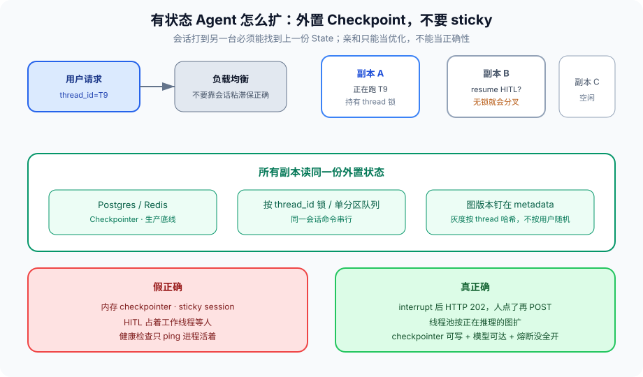

# 第 15 篇：Agent 部署不是加个 Docker

---

无状态 API 的扩缩是加副本、前面挂负载均衡。Agent 服务默认不是无状态：

- Checkpoint 绑定 `thread_id`
- HITL 可能挂几分钟到几天
- 同一会话的下一跳要能找到上一份 State
- 进程死了要能从第 4 篇的快照醒过来

把三个副本丢到 K8s Deployment 里，会话打到另一台，要么丢上下文，要么两台同时写同一 `thread_id`。第 10 篇禁掉的全局变量，会以「本地内存 checkpointer」的形式回来。

现场：人审单在副本 A 上 `interrupt` 了，HTTP 连接还占着。滚动更新把 A 杀掉。用户点确认，打到副本 B。B 的内存里没有这份 State，返回「会话不存在」。客服以为用户超时，让用户重提。用户重提，新的 `thread_id`，旧票作废，退款单重复建。根因不是 K8s，是把有状态服务按无状态扩了。



---

### 一、先定状态放哪

**内存 checkpointer：** 只配单进程开发。进程一重启，HITL 全死。单元测试可以用。预发如果用它，预发就测不出恢复。

**外置 checkpointer：** Postgres / Redis。所有副本读同一份。这是生产底线。LangGraph 的 `PostgresSaver` 一类就是干这个。写要同步，读要能从任意副本。Schema 迁移跟图版本走，不要让 DBA 单独改 Checkpoint 表。

**工作流引擎：** 等待超过秒级、跨服务补偿，状态给 Temporal（第 12 篇）。图只负责一次唤醒内的推理。HITL 等三天，不该由 LangGraph 进程陪着等三天，该由工作流 `wait_for_signal`。

会话亲和（sticky session）只能当优化，不能当正确性。机器要下线、要 OOM、要被抢占。正确性靠外置状态。sticky 可以降低跨副本读 Checkpoint 的延迟，挂了必须仍能在别的副本 resume。把 sticky 写成「会话必须打到同一 Pod」，等于禁止发布。

对象存储放 blob（第 10 篇的 `report_id`），Checkpoint 放指针和限长 State。两者都外置。只外置 Checkpoint、blob 还在本地盘，resume 到另一台会变成「指针在、文件不在」。

---

### 二、副本之间争同一 thread

两个请求带同一个 `thread_id` 打到两个副本：一个在跑节点，一个在 resume HITL。没有锁就会分叉——两个 Checkpoint 链，用户看见的是随机一条，审计看见两条都「成功」。第 5 篇的覆盖，在部署层重演。

最低限度：按 `thread_id` 分布式锁，跑完释放。锁超时要跟节点超时对齐，避免死锁（第 6 篇隔离）。锁的 holder 要把 `replica_id` 和 `trace_id` 写进去，超时抢锁时能看见上一棒是谁、是不是僵尸。

更干净：同一 `thread_id` 的命令进单分区队列，单消费者。Kafka / Redis Stream 按 `thread_id` 哈希分区。副本是消费者，不是无状态 HTTP worker。HTTP 只负责把命令丢进队列、返回 `202 + command_id`。这和 HITL 的 202 是同一形状。

```python
def handle(req):
    thread_id = req["thread_id"]
    cmd_id = req.get("command_id") or new_id()
    enqueue(partition=hash(thread_id), item={
        "thread_id": thread_id,
        "command_id": cmd_id,
        "payload": req["payload"],
        "trace_id": req["trace_id"],
    })
    return {"status": 202, "command_id": cmd_id}

def worker_loop():
    for item in consume_my_partitions():
        with lock(item["thread_id"], ttl=node_timeout()):
            run_graph(item)
```

幂等键是 `command_id`。用户双击确认、网关重试，不能跑两遍退款。第 11 篇的 `uses_left` 也依赖这个：没有命令幂等，两遍 resume 会把一张一次性票用两次，或第二次直接 exhausted 让用户以为失败。

---

### 三、HITL 等待怎么部署

人审期间 **不要占着工作线程。** `interrupt` 后进程应退出这次 run，HTTP 返回 `202 + resume_token`。人点了再 POST 回来。线程池按「正在推理的图」扩，不按「等老板点头的单」扩。这是第 2 篇和第 4 篇在运维上的交点。

`resume_token` 要签过名、要过期、要绑 `thread_id` 和 `checkpoint_id`。不要把内部 checkpoint 主键当 URL 参数裸传。人把链接转发出去，等于把会话交给外人继续。第 11 篇：resume 也是一次授权，父票可能已经过期，恢复时要重验。

等待超过秒级的 HITL，状态给工作流引擎更省心。图 interrupt 能撑几分钟的「用户就在页面上」。审批跨天、跨人，用 Temporal 信号。两种等待不要混在同一条实现里——混了之后超时策略、告警、线程占用全是错的。

前端不要用一条开了 30 分钟的 HTTP 等审批。连网关超时、负载均衡空闲切断、手机锁屏，都会把「还在等」变成「失败了」。正确形状：提交 → 202 → 轮询或推送 → 人点 → POST resume。

---

### 四、发布与版本

模型版本、工具版本、图版本、沙箱镜像 digest，要能一起钉在 Checkpoint 的 metadata 里。只更模型、旧会话 resume 进新图，边对不上：旧图有 `review` 节点，新图改名为 `critique`，resume 崩溃。只更工具、票上的 action 还在、实现已经换成另一个 API，副作用对不上。

灰度按 `thread_id` 哈希，不要按用户随机——同一用户连续两跳不能跨两个图版本。用户随机会导致：第一跳在 v1 interrupt，确认打到 v2，边对不上。`thread_id` 哈希保证一条会话从生到死一个图版本。新会话才进新版本。

回滚是切哈希规则，不是在运行中的会话上 patch。已经 interrupt 的会话，用它出生时的图版本 resume，即使那个版本已经不接新流量。为此，图的代码和提示要按版本可取——镜像 tag 或对象存储里的 bundle，Checkpoint metadata 写的是那个 id。

健康检查：进程活着不够，还要 checkpointer 可写、模型 API 可达、熔断器没全开。后两项失败应摘流量，而不是继续 200。就绪探针和存活探针分开：checkpointer 短暂不可写，不要杀进程（存活），但要摘流量（就绪）。熔断全开还 200，等于把失败当成成功送给用户，再让重试把下游打得更死。

资源请求：CPU / 内存按「同时推理的图」估，不要按 QPS。QPS 在 HITL 为主的服务上很低，内存却被 Checkpoint 反序列化和模型客户端占满。OOM 比 CPU throttle 更常见。第 4 篇假设每一步都可能是最后一步，部署上就是内存预算按峰值图数 × 单图峰值 State，外加 blob 不进进程内存。

---

### 五、多租户和密钥

第 11 篇的主体是类型 × 租户 × 环境。部署上这变成：凭证不进公共镜像，进运行时注入；租户 A 的沙箱配额打满不影响租户 B（第 6 篇舱壁）；日预算按租户（第 14 篇）。

一个 Deployment 跑所有租户，可以，前提是 State、锁、缓存键、日志都带 `tenant_id`。漏一个键，就是串号。不要用「我们内部只有一个租户」跳过——预发和生产已经是两个租户，工具凭证已经不该共用。

---

### 六、滚动更新怎么走

K8s 滚动更新默认先起新 Pod 再杀旧 Pod。对无状态服务这没问题。对 Agent：

1. 旧 Pod 上可能有 in-flight 的图。SIGTERM 后要先停接新命令，把正在跑的 Superstep 跑完并写 Checkpoint，再退出。宽限期短于节点超时，会留下半截。
2. 新 Pod 必须先通过「checkpointer 可写 + 模型可达」才进就绪。否则流量打到还不能 resume 的副本。
3. 正在 HITL 等待的会话不在进程里，滚动对它们无感——前提是 interrupt 真的退出了 run。如果还占着线程，滚动就是第 15 篇开头那个现场。

预停钩：

```python
def pre_stop():
    stop_consuming()
    deadline = time.time() + drain_seconds()
    while in_flight() and time.time() < deadline:
        time.sleep(0.2)
    for t in in_flight():
        emit_event("deploy.drain_timeout", t)
        # 不强杀图；让 K8s 到期 SIGKILL。Checkpoint 应已在上一 Superstep 落盘
```

`drain_seconds` 大于单节点超时，小于 K8s `terminationGracePeriodSeconds`。三者对不齐，要么杀半截，要么 Pod 删不掉。

---

### 七、反模式

- 内存 checkpointer 上生产，因为「先跑起来」。
- sticky session 当正确性。发布窗口变成事故窗口。
- HITL 占着 gunicorn worker 等人。人一多，线程池先于模型配额耗尽。
- 同一 `thread_id` 无锁并发 resume。
- 灰度按用户随机，人审单跨图版本。
- 健康检查只 `GET /healthz` 返回 ok。
- blob 在本地盘，Checkpoint 在 Postgres，副本一飘文件没了。
- 回滚用「改 System Prompt 热更新」，图拓扑已经变了。
- 把内部 checkpoint id 放进给用户的 URL。
- `terminationGracePeriodSeconds` 短于节点超时，滚动更新留下半截 Superstep。
- 日预算、熔断计数器、线程锁只在 Pod 内存里。

---

### 八、完整走一遍：隔夜审批怎么活过一次发布

用户下午点了退款，HITL 确认页挂着。晚上发版。

错误路径：interrupt 仍占着 gunicorn worker；sticky 把会话钉在 Pod A；滚动杀掉 A；用户晚上点确认打到 Pod B；内存 checkpointer 里没有 State；返回会话不存在；用户重提，新 thread，旧票作废或更糟——新票再退一次。

正确路径：下午 interrupt 后进程退出，Checkpoint 在 Postgres，metadata 钉着图版本 v1、模型、沙箱 digest。HTTP 早已 202。晚上发版上 v2，灰度按 thread_id 哈希，这条旧会话仍路由到 v1 bundle。用户点确认，POST 带签名过的 `resume_token`（绑 thread、checkpoint、过期）。任意副本抢到 `thread_id` 锁，读 v1 Checkpoint，重验父票是否仍有效，再跑。预停钩让 in-flight 的别的图写完当前 Superstep。健康检查：新 Pod 要能写 checkpointer 才接流量。

验收：发布窗口里，隔夜单能在另一台、用出生时的图版本醒过来，且只执行一次。做不到，就还不是有状态服务，只是多了几个容器。

---

### 收尾

有状态服务的部署单元是「图版本 + checkpointer + 按 thread 的串行化」，不是容器镜像。镜像只是包装。

进程必须能死。死了要能在另一台醒。醒的时候版本要是它出生时的版本。人审不占线程。同一会话的命令串行。正确性不靠 sticky。

下一篇把工具执行从「宿主机上的 subprocess」挪进沙箱：进程、容器、VM，各自挡住什么、挡不住什么。部署把宿主扩对了，工具还在宿主机上 `rm -rf`，扩得越对炸得越宽。

我是Q，下篇见。
