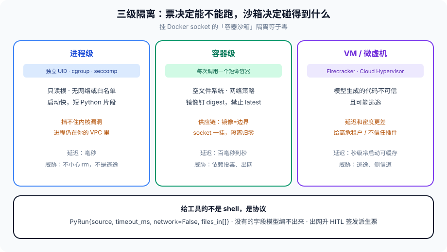

# 第 16 篇：Agent 在沙箱里运行

---

第 8 篇要求能跑代码的工具进沙箱。第 11 篇的票决定「能不能跑」；沙箱决定「跑的时候碰得到什么」。票过了、进程还是宿主机的 `subprocess`，删库仍然是一条命令的事。

沙箱不是一种。隔离级别对应威胁模型和延迟预算。选错级别的现场也很具体：团队给代码执行工具套了 Docker，容器里 `docker.sock` 挂着，为了「方便装依赖」。模型生成的脚本 `curl` 了外部地址，把环境变量里的云密钥送走。容器隔离在纸上，宿主机的密钥在容器里。EchoLeak 那一类出站，不需要逃逸，只需要出网和一份环境变量。

另一类现场是「我们有 seccomp」。短 Python 片段跑在独立 UID 下，看起来安全。片段里没 `rm`，有的是 `import os; os.environ` 和一次 HTTP。进程级挡的是乱删文件，挡不住「这个进程仍在你的 VPC 里」。威胁模型如果是「不信任的代码要出网」，进程级不够。



---

### 一、三级隔离

**进程级：** 独立 UID、cgroup、seccomp、只读根、无网络或白名单。启动快，适合短 Python 片段。挡不住内核漏洞，也挡不住「这个进程仍在你的 VPC 里」。适合威胁是「自己人写的工具 impl 可能被模型喂了坏参数」，不是「模型生成的任意代码」。

**容器级：** 每次调用一个短命容器，挂空文件系统，网络策略只放行需要的依赖。镜像要钉 digest，不能 `latest`。第 8 篇供应链那节：镜像和 MCP 包一样是边界。短命的意思是调完即毁，不复用一个脏的可写层当缓存——缓存复用会把上一次调用写的文件留给下一次，跨会话泄漏。

**VM / 微虚机级：** Firecracker、Cloud Hypervisor。威胁是「模型生成的代码不可信且可能逃逸」。延迟和密度更差，给高危租户或不信任的插件。冷启动可以预热池，但池里的虚机不能带着上一次的盘。

Agent 宿主进程 **不要** 和沙箱共用内核模块调试口、不要挂 Docker socket。挂了 socket，容器隔离等于零。这是最常见的「我们有沙箱」假象。宿主也不要把云密钥、数据库 URL 以环境变量形式泄漏进沙箱——沙箱的环境是协议里声明的那几个，默认空。

隔离级别按 **工具的威胁** 选，不按「我们集群有什么」。内部检索工具，进程级可能够。用户贴进来的代码、MCP 市场上来的服务器、浏览器里跑的页面，至少容器，高危租户上 VM。同一张图里可以三种都有，票上带 `isolation` 字段，运行时按字段选，不要全局一个级别图省事。

---

### 二、给工具的不是 shell，是协议

把 `execute_shell` 暴露给模型，等于把沙箱策略交给模型文案。更好的形状：

```python
from dataclasses import dataclass

@dataclass(frozen=True)
class PyRun:
    source: str          # 有长度上限，比如 32KB
    timeout_ms: int      # 上限封顶，模型不能要 1 小时
    network: bool        # 默认 False，True 必须来自票
    files_in: tuple      # 允许读的 blob id
    files_out_max: int   # 输出文件个数和总字节

def run_py(req: PyRun, cap) -> dict:
    if req.network and "code.network" not in cap.actions:
        return {"error": "action_denied"}
    if req.timeout_ms > 8000:
        req = PyRun(**{**req.__dict__, "timeout_ms": 8000})
    return sandbox_exec(req)
```

沙箱运行时只实现这一个协议。没有的字段，模型编不出来。输出截断、超时杀进程、CPU/内存 quota，全是运行时硬限制。`source` 超长直接拒，不要静默截断后跑半截——半截语法错误会逼模型再调一次，第 6 篇重试。

网络默认关。要搜索走搜索工具，不走沙箱里的 curl。沙箱一开网，数据外泄路径就回到 EchoLeak 那一类：读到内部内容，再 POST 出去。搜索工具的返回进 untrusted 槽（第 10 篇），出站域名白名单在工具护栏（第 8 篇），不在生成代码里。

文件只走 blob id。模型不能传 `/etc/passwd` 当 `files_in`。运行时把 id 对应的对象落进沙箱的只读目录，路径是运行时生成的随机名。输出也只许写指定目录，超出 `files_out_max` 丢弃并打标。

语言运行时要钉版本。`python:latest` 和 `node:latest` 是供应链。预装包是白名单，模型 `pip install` 默认关。要加包，走镜像构建，digest 进第 15 篇的图版本 metadata。运行时现场装包，等于把 PyPI 当成了 MCP 市场。

---

### 三、和 HITL、权限、观测的叠法

高危：票上有 `code.execute` **且** 沙箱 `network=False` **且** 超时 2 秒。出网或写生产库，票里根本没有对应 action，不是沙箱配置项。沙箱配置拦不住「票上就允许出网」——那是签发过松，回第 11 篇。

需要出网的代码执行，升 HITL。人批的是这张派生票，不是「模型说要 curl」。确认页上要看到：将要出网、目标域名、超时、输入文件摘要。人看不见这些，点确认等于给了 shell。

第 13 篇：超时、OOM、seccomp 违规，对 Agent 都是工具错误字符串，带错误码，不带宿主机堆栈。堆栈会泄露路径和内核版本。span 记 `sandbox.isolation`、`sandbox.timeout`、`error_code`。stdout / stderr 进 blob，prompt 只收截断后的摘要，避免模型对着 2MB 报错循环修。

沙箱镜像要能回滚。图版本钉镜像 digest（第 15 篇）。否则 resume 一次 HITL，跑的已经是另一套运行时——旧会话以为能 import 的包，新镜像没有，或新镜像多了不该有的权限。

---

### 四、失败语义和资源

超时：杀进程 / 杀容器 / 杀虚机，确认死了再返回。只发 SIGTERM 不等，子进程可能还在出网。cgroup 的 memory.max 到了，应该是 OOM 错误码，不是宿主被内核杀掉——宿主被杀是第 15 篇的事故，说明沙箱没有自己的 cgroup。

并发：同一租户同时跑的沙箱有上限，全局也有。模型一旦学会「多开几个执行」，会把密度打满。上限是第 6 篇舱壁，也是第 14 篇成本。排队要有超时，排到超时当工具错误，不要在宿主线程里干等。

确定性：沙箱不是 Temporal 的 Activity 重放环境。同样的 `source` 两次跑，结果可以不同（时间、随机）。不要把沙箱输出当 Checkpoint 里的「必须可重放字段」。要可重放，把输出做成 blob，重放时跳过执行、直接读 blob——这是第 12 篇「LLM 和副作用放 Activity」在沙箱上的对应。

---

### 五、浏览器和 MCP 服务器也是沙箱问题

代码执行最显眼。浏览器工具、STDIO MCP 服务器，威胁模型同类。

浏览器：默认无登录态、无宿主 cookie、无宿主文件系统。页面是 untrusted。下载的文件进 blob，不进宿主盘。出网按域名白名单。无头浏览器进程在容器里，不要在宿主上开一排 Chrome。

STDIO MCP：服务器进程本身就该在沙箱里，不要跟宿主同 uid（第 17 篇会再写）。二进制路径来自配置仓，参数不进 shell。MCP 服务器要出网，是服务器的网络策略，不是把宿主网络给它。

「能跑代码的工具」定义要宽：任何会执行模型提供的字节的地方，都按这一篇。包括「只是跑个正则」但正则引擎能爆炸的，也包括「只是渲染 Markdown」但渲染器能跑 HTML 脚本的。

---

### 六、多租户密度

沙箱按调用计费和按租户隔离，会把密度问题提前。一百个租户同时「跑段代码看看」，进程级还能扛，VM 级会把节点打满。调度要有两级队列：租户内公平、全局上限。租户打满只饿自己（第 6 篇舱壁），全局打满要拒新调用并打 `sandbox.capacity`。

热池：容器或微虚机预热可以降延迟。池里的实例必须是干净快照，接任务前复位。谁把热池当「常驻 REPL」用，跨会话状态就回来了。池的大小按「同时推理的代码执行数」估，跟第 15 篇内存预算是同一类数，不是按 QPS。

时钟和随机：代码里读时间、读随机数，不要当评测金标的一部分。评测断言输出结构、错误码、是否出网，不断言「打印了几点」。第 7 篇非确定性，沙箱是重灾区。

---

### 七、反模式

- 挂 Docker socket，还写「我们有容器沙箱」。
- `execute_shell` 当一等工具，策略靠模型自觉。
- 网络默认开，因为「不然装不了包」。包应该在镜像里。
- 环境变量原样继承宿主，云密钥进沙箱。
- 复用带可写层的热容器当缓存，跨会话脏文件。
- 超时只 SIGTERM，子进程继续 curl。
- 错误把宿主堆栈回给模型。
- 沙箱镜像 `latest`，HITL resume 跑到另一套运行时。
- 用进程级隔离跑来自技能市场的代码。
- 沙箱成功输出全文进 messages，窗口和注入一起回来。
- 热池复用带可写层的实例，跨会话脏文件。
- 评测断言沙箱打印了几点，把非确定性当失败。

---

### 八、完整走一遍：模型要「跑段代码算运费」

票上有 `code.execute`，没有 `code.network`。协议是 `PyRun{source≤32KB, timeout_ms≤2000, network=False, files_in=(运费表 blob,)}`。运行时选进程级或短命容器（内部工具，威胁是坏参数不是逃逸）。空文件系统，运费表只读落进随机路径。环境变量空，没有云密钥。超时杀干净。stdout 截断进 blob，prompt 只收摘要。span 记 isolation、timeout、error_code。

模型在 source 里写了 `urllib.request`。网络命名空间没有出站，或协议层 `network=False` 直接不给网卡。调用返回 `action_denied` 或 `network_disabled`，不返回「你需要出网权限」。若业务真要出网拉实时费率，升 HITL，确认页写出网域名，签发派生票 `code.network`，隔离升到容器 + 域名白名单。digest 钉在图版本里。

缺协议、缺票、缺超时、挂了 socket、继承了宿主环境，五条里中一条，「算运费」就能变成外泄。沙箱验收的是这五条，不是 Dockerfile 里有没有 `USER nobody`。

---

### 收尾

沙箱挡的是「代码执行」这条工具路径，不是注入本身。注入仍靠第 8 篇护栏。没有票、没有沙箱、没有超时，三者缺一，删库就还是一句话。

给工具协议，不给 shell。网络默认关。文件只走 blob。镜像钉 digest。错误只给错误码。隔离级别按威胁选，同一张图可以三种并存。

协议组从下一篇开始：MCP 把工具从编译时依赖变成运行时发现——发现本身就是新的攻击面和架构面。沙箱如果只罩住你自己写的工具，MCP 一接上，运行时又回到「别人的进程，你的凭证」。

我是Q，下篇见。
