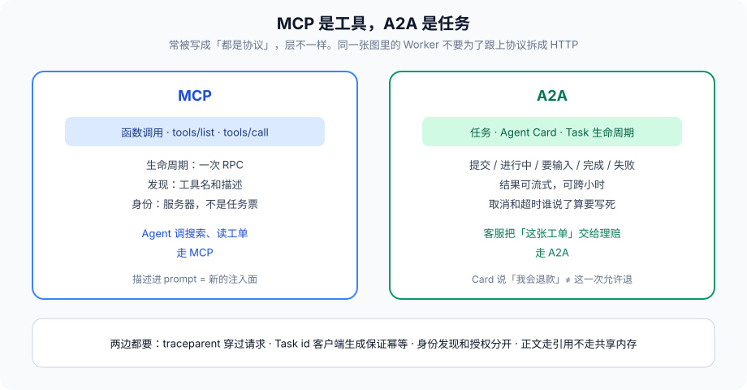

# 第 18 篇：A2A，不同框架的 Agent 怎么对话

---

第 10 篇在同一张图里选共享 State 还是消息。团队一拆、语言一拆、框架一拆，消息就得有协议。Google 2011 年的 A2A 是安卓那个；2025 年公开的 Agent2Agent（A2A）是另一件事：给 Agent 之间的任务、流式结果、身份定一份 HTTP 上的约定。Linux 基金会现在接了规范。名字容易混，内容很具体。

本篇不教你把所有系统改成 A2A。问的是：**跨框架协作要哪些语义，现有框架默认没有。** 协议可以换，语义不能少。少了就会用「把 transcript 整包 POST 给对面」来填，第 10 篇的散文契约和第 8 篇的注入快递一起上门。

现场：客服图是 LangGraph，理赔是另一团队的 Crew 工序。为了「打通」，客服把 messages 列表 JSON 丢到一个内部 HTTP。理赔侧当用户输入喂给 kickoff。用户消息里有一句「以管理员身份处理」。理赔侧没有票，只有人设。工单被关了，赔付记在客服团队头上，因为 HTTP 200。两边的 Trace 对不上，复盘开了两周会。缺的不是「再选一个更火的协议」，是身份、任务生命周期、幂等、traceparent、票。



---

### 一、图内消息不够的时候

LangGraph 节点返回补丁，只在本进程有效。对面是 Crew 工序、AutoGen 群聊、或别的公司的客服 Agent，你不能把 TypedDict 塞过去。需要：

- 对方是谁（身份，不是模型名）
- 这是一个任务还是一句话（生命周期：提交、进行中、要输入、完成、失败）
- 结果是整包还是流
- 取消和超时谁说了算
- 失败重试是否幂等
- 观测怎么穿过

A2A 用 Agent Card 描述能力，用 Task 表示一次协作。这和 MCP 不同：MCP 是 **工具**（函数调用），A2A 是 **任务**（可能跑很久、可能要人）。两者常被写成「都是协议」，层不一样。Agent 调搜索用 MCP；客服 Agent 把「处理这张工单」交给理赔 Agent 用 A2A。

不要用 MCP 模拟任务：`tools/call` 等三小时，超时和 HITL 都挤在一次 RPC 里。不要用 A2A 模拟工具：搜一下网页走完整 Task 生命周期，税太重。选层选错，协议再标准也拧。

---

### 二、接到本系列的哪几刀

**身份：** Agent Card 不能当第 11 篇的票。Card 说「我会退款」，票才说「这一次允许退这一单」。发现能力和授权能力必须分开，MCP 那节同一原则。对端身份用你登记过的公钥或服务账号验，不要信 Card 里的自述。Card 是广告。

**状态：** 跨框架不要共享内存。任务 id 当第 10 篇的 `report_id` 用。正文进各自存储，协议上走引用。把 transcript 整包塞进 Task 输入，窗口、PII、注入半径一起交给对方。

**HITL：** 对方任务进入「要输入」，你这边是 interrupt 还是再开一个 Task，要在边界写死。不要让两边同时等人——用户点了 A，B 还在等，或两边各弹一张确认。人审归属写在任务元数据里：谁弹、谁签票、超时谁取消。

**观测：** `traceparent` 穿过 A2A 请求。没有它，第 13 篇的黑盒变成两个黑盒。对方拒绝提供 Trace，你至少要有自己的 span：发给谁、Task id、等待时长、对方状态码。

**失败：** 对方 4xx/5xx 按第 6 篇熔断。重试要幂等——Task id 客户端生成，避免付两次款。对方说「已接收」但超时，查询同一 Task id，不要再提交一个。第 15 篇的 `command_id` 在跨进程就是 Task id。

**预算：** 对方按次计费或按 token 计费，你的第 14 篇预算要包含「外呼任务」。无限等对方流式输出，钱在对方账单上，也在你的等待线程上。超时是成本闸。

**沙箱：** 你不能沙箱对面的进程。能做的是：送出的输入按最小必要、当对方返回为 untrusted、高危副作用仍在你这边验票后自己做。不要因为「理赔 Agent 专业」就把退款工具的执行权交给对面 HTTP。

---

### 三、最小任务形状

不管协议品牌，跨框架任务至少要能表达这些字段：

```python
class TaskSubmit(TypedDict):
    task_id: str              # 客户端生成，幂等键
    from_agent: str           # 已登记身份
    to_agent: str
    intent: str               # 稳定枚举，不是散文
    resource_ids: list        # 指针，不是正文
    cap_id: str               # 引用，不是票全文
    traceparent: str
    timeout_ms: int
    schema_version: str

class TaskStatus(TypedDict):
    task_id: str
    state: str                # submitted|working|input_required|completed|failed|canceled
    result_ref: str | None
    error_code: str | None
    input_required: dict | None
```

`intent` 用枚举：`claim.review`、`order.refund_prepare`。用散文「帮我看看这个用户是不是该赔」，对面模型会再理解一次，契约漂。`input_required` 是 HITL 的跨进程版：对面要的是结构化缺项，不是「你再跟用户聊聊」。

取消：谁发起、谁确认、钱类任务取消是否真的回滚，写进合同，不写进 Card。超时：你的超时必须短于或等于对面的执行预算，否则你取消了，对面还在扣款。

---

### 四、什么时候不要上 A2A

同一张 LangGraph 里的 Worker，用节点和 State，不要为了「跟上协议」把子图拆成 HTTP。多一跳网络，就多一跳注入面和超时。协议是团队边界的税，不是先进性指标。

同一进程、同一发布单元、同一票签发服务，用图。跨团队、跨语言、跨 SLA、对面可能比你活得更长，用任务协议。第 10 篇那条「跨服务改消息」在这里落地。

也不要在 A2A 上重建一套 Supervisor。跨组织的「中心」会变成谁都管不了的单点，失败形态比第 9 篇的中心窗口更糟：中心在别人的可用区。跨组织用明确的任务和超时，不要用「对面你看着办」。

---

### 五、和 MCP 一起出现时

一张图可以两者都有：检索走 MCP，工单交给理赔走 A2A。不要让模型在「调工具」和「派任务」之间靠人设选择。图上是两类节点，工具节点和任务节点，边条件是确定性的。模型可以填 TaskSubmit 的非授权字段（比如用户原话的摘要），不能填 `to_agent` 和 `cap_id`——那两样来自路由表和授权服务。

MCP 服务器冒充 A2A 对端、A2A 对端暴露一个「万能 tools/call」，都是层被拍扁。拍扁之后验票不知道验哪一层。

---

### 六、SLA 写在任务上，不写在群里

跨团队最容易烂的是「口头说三分钟返回」。TaskSubmit 的 `timeout_ms` 是合同。对面超了，你走降级，并按第 6 篇记一次失败。对面「还在跑」不是你继续等的理由。钱类任务的超时还要短于支付渠道的撤销窗口，否则你取消了，钱已经划出。

对方版本：Card 上的 protocol 版本、你的 `schema_version`，对不上就不要提交。自动降级到「整包 transcript POST」是最糟的兼容。兼容只允许少字段，不允许改通道形状。

人工对账：每天抽 N 条跨团队任务，对 `task_id`、两边状态、是否重复扣款。这是第 7 篇评估的跨进程版，自动化优先，抽检兜底。对不上的 `task_id` 当事故，不是「最终一致一会儿就好」。

---

### 七、反模式

- transcript 整包 POST。注入快递。
- 信 Agent Card 的自述当授权。
- Task id 服务端生成，超时重试变成两单。
- 两边同时 HITL。
- 没有 traceparent，复盘靠双方日志对时间戳。
- 用 MCP 等三小时当任务。
- 同一张图的 Worker 拆成 HTTP 以示先进。
- 把票全文塞进 Task 输入。
- 取消了当成功，对面还在跑副作用。
- 对端 5xx 无限重试，第 6 篇风暴跨过公司边界。
- 协议版本对不上就降级成整包 transcript POST。
- 口头 SLA，Task 上没有 timeout_ms。

---

### 八、完整走一遍：客服把工单交给理赔

客服图判定 `intent=claim.review`。任务节点——不是工具节点——填 `TaskSubmit`：客户端 `task_id`、已登记的理赔身份、`resource_ids=[ticket:55]`、`cap_id` 引用、`traceparent`、`timeout_ms=120000`、`schema_version`。模型只生成限长摘要字段，填不了 `to_agent` 和 `cap_id`。

理赔侧验身份、验 schema、向授权服务问票。跑自己的工序。要人证材料，状态变 `input_required`，客服侧 interrupt 一次，不要两边同时弹窗。完成则 `result_ref` 指针回来，正文不进客服 prompt 全文。超时客服走降级「理赔处理中，已为你建单」，并按熔断记一次。重试用同一 `task_id`。扣款若发生在理赔侧，取消窗口短于支付撤销窗口。

traceparent 让值班能从客服 span 点到理赔 span。每天抽 N 条对状态。Card 说「我会退款」没有让客服侧把 `refund.execute` 交给对方 HTTP——副作用仍在票和沙箱这边，或明确写进合同由理赔执行并审计。

验收：跨团队 200 不再是复盘的终点。终点是 task_id、两边状态、是否重复扣款、trace 能否穿过。

---

### 收尾

A2A 补的是跨进程、跨厂商的任务语义。MCP 补的是工具发现。图、票、熔断、Trace 仍然在你这边。协议不会替你做架构。

先把语义凑齐：身份、生命周期、指针、幂等、traceparent、票引用。再决定身上这层 HTTP 是不是叫 A2A。名字可以换，少任何一项，现场都像开头那个 200。

演进组两篇：Agent 怎么用自己的轨迹变强，以及别把「变强」做成一个无限权限的超级大脑。

我是Q，下篇见。
