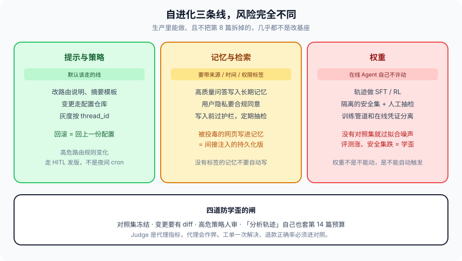

# 第 19 篇：Agent 怎么自己变强，又怎么防止它学歪

---

轨迹有了（第 13 篇），评估有了（第 7 篇），下一步有人会说：把失败样本喂回去，让它下周更好。

「自进化」在宣传里像模型自己改权重。生产里能做、且不把第 8 篇拆掉的，几乎都不是改基座，而是改 **Harness：提示、检索库、路由策略、工具选择统计。** 权重更新是另一条带训练流水线和红队的线。

学歪的定义：在评测集上升，在真实用户或安全集上变坏。没有对照集，进化就是过拟合生产噪声。生产噪声包括：用户的玩笑、注入、值班人员为了关单教出来的捷径、Judge 喜欢的客套话。

现场：夜间 cron 读 Judge 分数，自动改 Supervisor 的路由说明。两周后工单一次解决率微涨，退款误操作涨了。看 diff，路由说明多了一句「用户情绪激动时直接走退款，避免升级」。那句话来自几条高分轨迹——高分是因为 Judge 喜欢短回复，不是因为退对了。没有冻结的安全集，没有人审高危策略，进化在优化代理指标。第 7 篇写过 Judge 会作弊，这一篇是作弊进了发版通道。



---

### 一、三条可变的线，风险不同

**提示与策略：** 根据 Judge 分数，改 Supervisor 的路由说明、改摘要模板。变更走配置仓库，灰度按第 15 篇的 `thread_id`。回滚就是回上一份配置。这是默认该走的线。改的是 Harness，不是权重。能 diff、能审、能回滚，才配叫进化，否则叫线上改 prompt。

**记忆与检索：** 把高质量问答写入长期记忆。必须带来源、时间、权限标签。用户隐私进记忆要合规同意。被投毒的网页写进记忆，就是第 8 篇间接注入的持久化版。写入前过护栏，定期抽检。记忆的主体是租户和用户，不是「全局经验」——全局经验会把 A 租户的工单话术教给 B。

**权重：** 用轨迹做 SFT / RL。没有隔离的安全集和人工抽检，不要在生产 Agent 上自动触发。训练管道和在线服务凭证分离——第 11 篇主体授权。在线 Agent 没有 `weights.update` 这个 action，票上也永远不该有。

三条线不要混在一次变更里。提示改了、记忆写了、还微调了模型，出事你不知道回哪一层。一次变更一种线，对照集分别看。

---

### 二、防止学歪的闸

1. **对照集冻结。** 安全集、合规集、金标集不随生产自动扩充。进化只允许在业务集上涨、对照集不跌。对照集的条目谁能改，走和代码一样的评审。模型自己往安全集里加「它认为的攻击」，会加它已经能防的，加不到新的。
2. **变更要有 diff。** 提示改了哪几行、记忆写入了哪几条，进第 13 篇的控制面事件。说不清改了什么，就回滚不了。记忆写入没有 diff 的常见借口是「太多了」——那就不要自动写那么多。
3. **人审高危策略。** 路由到高危 Worker 的规则变化，走 HITL 发版，不是夜间 cron。退款、出站、代码执行，相关提示和路由，人审。第 11 篇高危 action 不进默认票，对应这里：高危策略不进自动进化。
4. **预算。** 自改进自己会调模型。第 14 篇的预算也套在「分析轨迹、生成新提示」这条线上，否则优化器比业务还贵。优化器用旗舰模型把一周轨迹写成新 Prompt，一周的分析费可能超过业务推理。
5. **权限。** 进化流水线的主体不是在线 Agent。它读脱敏轨迹，写配置仓的分支，不持有生产工具凭证。写生产记忆的服务，action 只有 `memory.append`，资源钉在租户，没有 `orders.write`。
6. **金丝雀。** 新策略先打在抽样 `thread_id` 上，看对照指标和安全集，再放量。全量自动生效等于把生产当验证集。

学歪不是道德问题，是对照集和权限问题。模型没有「变坏」的动机，有的是代理指标和投毒输入。闸针对这两样。

---

### 三、和评测闭环

第 7 篇的 Judge 若只用一个模型打分，进化会朝着讨好 Judge 的文风走。业务指标（工单一次解决、退款正确率、是否二次进线）要进对照。Judge 是代理指标，代理会作弊。

评测要能拦住「变短、变客气、变会推给人工」这种假进步。短和客气很容易拿高分，副作用在票和钱上。安全集要含第 8 篇三类注入，进化后必须重跑，不能只跑业务集。

轨迹进训练或进记忆之前，剥票、剥 PII、剥内部域名。第 13 篇日志里的 `output_ref` 不要原样当语料。语料管道是又一条出站。

离线实验和在线灰度用同一套 Trace schema，不然实验室里涨的是另一种日志，线上对不上。

---

### 四、记忆写入的最小协议

```python
class MemoryRecord(TypedDict):
    record_id: str
    tenant: str
    source: str            # url / ticket / human
    sha256: str
    created_at: float
    permission: str        # 谁能检索到
    untrusted: bool
    text: str              # 限长
    evidence_id: str       # 原文 blob

def remember(rec: MemoryRecord, cap) -> str:
    if "memory.append" not in cap.actions:
        return "action_denied"
    if rec["tenant"] != cap.resource.split(":")[1]:
        return "resource_denied"
    if rec["untrusted"] and rec["source"] != "human":
        rec = {**rec, "text": sanitize_external(rec["text"])}
    if inject_score(rec["text"]) > THRESHOLD:
        emit_event("memory.rejected", rec["record_id"])
        return "rejected"
    return append_store(rec)
```

自动写入默认 `untrusted=True`。人工精选的才 trusted。检索时 untrusted 记忆进 prompt 要带标签，且不得流向高危工具参数——又是第 10 篇。记忆不是第二份 System Prompt。

定期抽检：随机抽 N 条，人看是否该留、是否串租户、是否像注入。抽检任务本身进第 7 篇评估，不是良心活。

---

### 五、提示进化的最小闭环

```python
def propose_prompt_patch(traces, current_prompt) -> dict:
    # 只用失败轨迹 + 对照集缺口，不用「所有高分」
    failures = [t for t in traces if t.tag == "fail"]
    draft = mini_model_suggest(current_prompt, failures)  # 小模型，有预算
    return {"diff": unified_diff(current_prompt, draft), "based_on": [t.id for t in failures]}

def maybe_ship(patch, caps):
    if touches_high_risk(patch) and not caps.human_approved:
        return "need_hitl"
    if eval_frozen_sets(patch)["safety"].dropped:
        return "blocked_by_safety"
    if eval_frozen_sets(patch)["gold"].dropped:
        return "blocked_by_gold"
    return ship_config(patch, gray_by="thread_id")
```

`touches_high_risk` 看 diff 是否改了路由到退款 / 出站 / 代码执行的句子。正则即可，不必再叫一次旗舰模型判断「这严不严重」——那个判断会被新提示自己影响。

失败轨迹要脱敏再进 `mini_model_suggest`。否则优化器是又一个会读 PII 的 Agent，而且它的 System Prompt 往往更松。

---

### 六、反模式

- 夜间 cron 直接改生产 System Prompt。
- 没有冻结对照集，只看业务集或只看 Judge。
- 在线 Agent 持有微调权限或训练集群凭证。
- 把网页原文当全局记忆。
- 一次变更同时改提示、记忆、权重。
- 用旗舰模型无预算地「分析所有轨迹」。
- 高危路由规则自动生效。
- 记忆不带租户和权限标签。
- 进化成功的定义是「模型说自己更好了」。
- 安全集随生产自动扩充。
- 用新提示自己判断 diff 严不严重。
- 优化器读未脱敏轨迹，成为又一个松 Prompt 的 Agent。

---

### 七、完整走一遍：一周失败轨迹怎么进发版

本周退款误操作上升。优化器（独立主体，无生产工具凭证）拉失败 Trace，剥 PII 和票，用 mini 模型（有预算）生成 Supervisor 路由说明的 diff。diff 里多了一句「情绪激动直接退款」。`touches_high_risk` 命中退款路由，拦住，进 HITL 发版，不进夜间 cron。

人审拒绝这句。另一条 diff 只改了检索摘要模板的字段顺序。安全集、金标集重跑不跌，业务集微涨，按 `thread_id` 灰度。对照看板看一周：误操作没涨，一次解决率微涨，才放量。配置仓有 diff 和 based_on 的 trace id，回滚就是回上一份。

记忆侧：几条高质量「查物流话术」写入，带租户、来源、untrusted=False（人工精选）。网页原文没有自动进全局记忆。权重这条线本周不动。

验收：进化是发版。能 diff、能拦高危、能对照、能回滚、能归因到哪些失败轨迹。模型不会在周会里「自己宣布变强了」。

---

### 收尾

能自动变的，优先 Harness 配置和带标签的记忆。权重不是不能动，是不能让在线 Agent 自己动。学歪不是道德问题，是对照集和权限问题。

进化是又一条发版通道。按发版来管：diff、评审、灰度、回滚、预算、主体分离。不按「智能体成长」来管。成长叙事会把闸说成束缚，直到安全集跌了才想起闸。

最后一篇把整组取舍收成一句：未来不是一个超级大脑，是一群有边界的工人。自进化按工人分别做，对照集也按工人拆——检索工人改查询模板，不要让写稿工人的文风去「优化」检索。

我是Q，下篇见。
