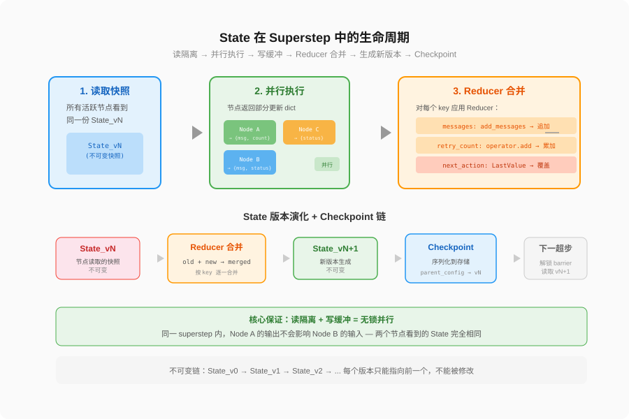
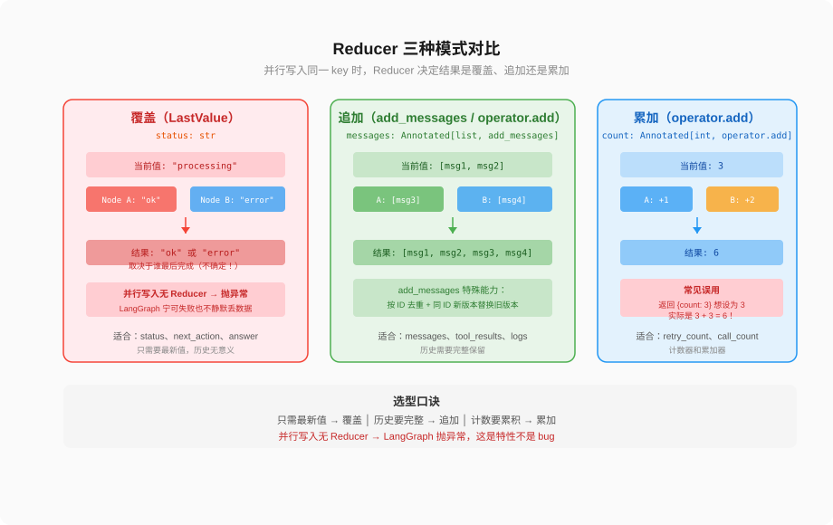
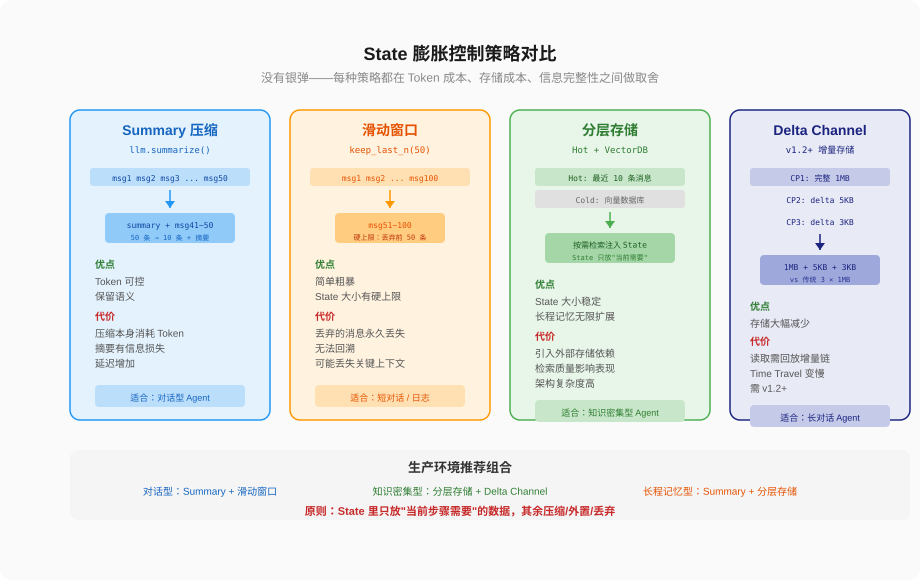
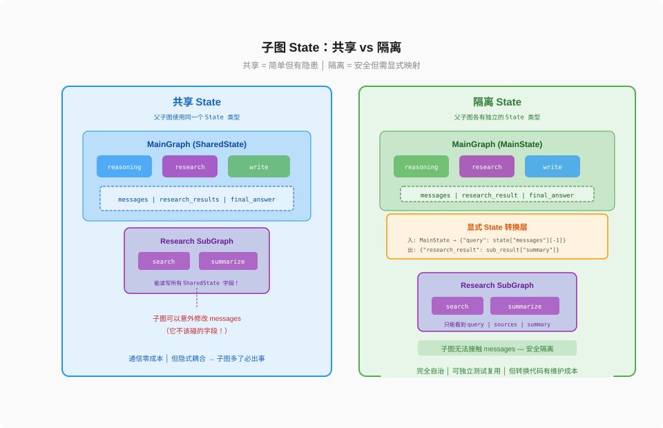

# 第 1 篇：State 设计是最容易被忽视的架构灾难

---

大家好，我是Q。

系统上线第一天跑得好好的，第二天数据丢了。排查半天，两个并行节点同时写了 State 的同一个 key，后写的把前写的覆盖了。

更扎心的是，这种 bug 不会报错，不会崩溃，日志里一切正常。数据就是静默丢了。

**这就是 State 设计失当的代价。**

在图编排架构中，State 不是"全局变量"，不是"参数字典"，也不是"上下文对象"。它是图的共享数据协议——定义了节点间能交换什么、怎么合并、怎么回滚、怎么隔离。这个协议设计得好，Agent 系统可调试、可扩展、可恢复；设计得不好，系统"能跑"，但没人敢改。

这篇文章，就来讲清楚图编排中 State 设计的每一个架构决策：Schema 怎么选、Reducer 怎么定、膨胀怎么控、子图怎么隔离、版本怎么管。每个决策都有取舍，没有标准答案。

---

### 一、State 不是全局变量，是节点间的数据协议

先统一认知。很多工程师把 Agent 的 State 理解为"一个全局 dict，所有节点都能读写"。这个理解在原型阶段没问题，但在图编排架构中是不精确的。

State 在图编排中的准确定义：**它是图的共享数据协议，定义了节点间能交换什么信息、信息怎么合并、信息怎么版本化。**

这和全局变量有三个本质区别：

**第一，State 是类型化的。** 每个字段有类型声明，不是随意塞任何值。更关键的是，类型声明不只是给人看的——LangGraph 运行时会根据类型信息做 Reducer 绑定和并发写入检测。

```python
from typing import Annotated, TypedDict
from langgraph.graph.message import add_messages
import operator

class AgentState(TypedDict):
    messages: Annotated[list, add_messages]   # 消息列表，追加而非覆盖
    tool_call_count: Annotated[int, operator.add]  # 工具调用次数，累加
    next_action: str                           # 下一步动作，默认覆盖
```

注意 `Annotated[list, add_messages]` 这个声明——它不只是类型标注，它告诉框架"当多个节点同时写 messages 时，用 add_messages 函数来合并，而不是后写覆盖先写"。

**第二，State 的更新是增量式的。** 节点不直接修改 State，而是返回一个部分更新 dict。框架负责合并。这意味着节点之间不会互相覆盖——只要你定义了正确的 Reducer。

```python
def reasoning_node(state: AgentState) -> dict:
    # 节点只返回它要更新的字段
    return {
        "messages": [AIMessage(content="我需要搜索一下")],
        "next_action": "search"
    }

def tool_node(state: AgentState) -> dict:
    # 这个节点更新不同的字段
    return {
        "messages": [ToolMessage(content="搜索结果...")],
        "tool_call_count": 1
    }
```

两个节点各自返回自己的更新，框架用 Reducer 合并。`messages` 字段用 `add_messages` 追加，`tool_call_count` 用 `operator.add` 累加，`next_action` 用默认的覆盖策略。

**第三，State 是版本化的。** 每次 superstep 结束，State 会生成一个新的不可变版本。节点看到的始终是当前版本的快照，不会受到其他节点并发修改的影响。这个版本链是 Time Travel、Fork、Human-in-the-Loop 的基础。



上图展示了 State 在一个 superstep 中的完整生命周期：节点读取快照 → 执行 → 返回部分更新 → 框架对每个 key 应用 Reducer → 生成新 State 版本 → 写入 Checkpoint → 启动下一超步。

这三个区别不是理论上的——它们直接决定了你的 Agent 系统在并发场景下会不会丢数据、在调试时能不能回溯、在扩展时会不会爆炸。

---

### 二、Schema 选型：TypedDict vs Pydantic，不是"哪个更新用哪个"

LangGraph 支持三种 State Schema：TypedDict、Pydantic BaseModel、Python dataclass。选哪个不是赶时髦，是工程取舍。

#### 2.1 TypedDict：轻量但无运行时保护

```python
from typing import TypedDict, Annotated
from langgraph.graph.message import add_messages

class AgentState(TypedDict):
    messages: Annotated[list, add_messages]
    next_action: str
```

TypedDict 是 LangGraph 社区使用最广泛的方案。原因很简单：零运行时开销。类型信息只在静态分析时存在，运行时不做任何校验。

这意味着什么？快。但也不安全。

我见过一个真实案例：调试时在 State 里临时加了个 `debug_info` 字段，后来忘了删。线上跑了一周，某个节点读到了这个不该存在的字段，做了一次错误的分支判断。排查花了半天——因为没有任何报错，数据就是悄悄地错了。

TypedDict 不会拦住你塞非法字段，也不会拦住你写错类型。它只在你用 mypy/pyright 做静态检查时才有效。如果你的团队没有强制 lint 流程，TypedDict 的安全网约等于没有。

#### 2.2 Pydantic：运行时校验，代价是性能

```python
from pydantic import BaseModel, Field
from typing import Annotated
from langgraph.graph.message import add_messages

class AgentState(BaseModel):
    messages: Annotated[list, add_messages] = Field(default_factory=list)
    next_action: str = ""
    tool_call_count: int = 0
    
    class Config:
        extra = "forbid"   # 禁止写入未声明的字段
```

Pydantic 的 `extra = "forbid"` 直接解决了上面的问题——任何未声明的字段写入都会立即报错。运行时类型校验也能防止 `next_action` 被写成 `123` 这种错误。

代价呢？性能。Pydantic v2 的校验开销大约比 TypedDict 高 5-10%。在大多数 Agent 场景下，这个开销远小于 LLM 调用的延迟（几百毫秒到几秒），所以实际影响微乎其微。但在高并发、低延迟的场景（比如工具路由节点每秒处理数百次请求），这个开销就值得考虑了。

2026 年 Pydantic v3 发布后，性能提升 5-10 倍，LangGraph 官方已经推荐新项目使用 Pydantic BaseModel。但如果你在维护一个已经在生产中运行的 TypedDict 项目，迁移的收益未必大于风险。

#### 2.3 选型决策树

```
你的团队有强制 lint 流程吗？
├─ 是 → TypedDict 够用，零开销
└─ 否 → Pydantic，extra="forbid" 防御性更强
    │
    你的 Agent 每秒处理多少次 State 更新？
    ├─ < 100 → Pydantic 校验开销可忽略
    └─ > 100 → 评估 Pydantic 延迟，可能需要 TypedDict + 严格 lint
        │
        你的 State 字段会频繁变更吗？
        ├─ 是 → Pydantic，校验能捕获遗漏
        └─ 否 → TypedDict 足够
```

我的建议：**新项目用 Pydantic，老项目不迁移。** 不要为了"更现代"而迁移一个已经在跑的系统。State Schema 是图的根基，换 Schema 等于拆地基。

#### 2.4 一个容易忽略的细节：默认值

TypedDict 没有默认值机制。如果 `invoke()` 时忘记传某个字段，节点读取时会得到 `KeyError`。

```python
# TypedDict：漏传字段 → KeyError
result = graph.invoke({"messages": []})  # 缺了 next_action → KeyError

# Pydantic：有默认值 → 安全
result = graph.invoke({"messages": []})  # next_action 默认 ""
```

这不是大问题，但它是 TypedDict 在生产环境中的一个摩擦点。如果你选 TypedDict，建议在图的入口节点里做一次字段初始化。

---

### 三、Reducer：图编排中最核心、也最容易被误解的机制

Reducer 是 State 设计的灵魂。它决定了"当多个节点同时修改同一个 key 时，结果是什么"。

这个机制为什么重要？因为在图编排中，并行执行是常态。两个节点在同一个 superstep 内并行运行，它们可能同时写 `messages`，也可能同时写 `tool_call_count`。没有 Reducer，LangGraph 的默认行为是"后写覆盖先写"——谁最后完成，谁的值留下。

**这不是 bug，这是设计选择。** 但如果你不知道这个默认行为，它就是你的 bug。

#### 3.1 三种 Reducer 模式

**模式一：覆盖（默认，LastValue）**

没有声明 Reducer 的字段，默认使用覆盖策略。后写的值替换先写的值。

```python
class State(TypedDict):
    status: str  # 无 Annotated → 默认覆盖
```

适用场景：**只需要最新值**的字段。比如 `status`（当前状态）、`next_action`（下一步动作）、`final_answer`（最终答案）。这些字段的历史值没有意义，只需要知道"现在是什么"。

风险：如果两个并行节点都写了 `status`，一个写 `"processing"`，一个写 `"error"`，最终只保留一个。如果保留了 `"processing"`，你就丢失了错误信息。

**模式二：追加（add_messages / operator.add）**

```python
class State(TypedDict):
    messages: Annotated[list, add_messages]     # 消息追加
    tool_results: Annotated[list, operator.add]  # 列表追加
```

`add_messages` 是 LangGraph 为消息列表内置的专用 Reducer。它不只是简单的 `list.extend()`——它还会做消息去重（基于 message ID）和消息更新（同一 ID 的新版本替换旧版本）。

适用场景：**历史需要完整保留**的字段。对话历史、工具调用记录、搜索结果列表——这些字段的值是累积的，不能覆盖。

风险：列表无限增长 → 状态膨胀（后面详细讲）。

**模式三：累加（operator.add 用于数值）**

```python
class State(TypedDict):
    retry_count: Annotated[int, operator.add]   # 整数累加
```

当节点返回 `{"retry_count": 1}` 时，框架把 1 加到当前值上，而不是替换。两个并行节点各返回 `{"retry_count": 1}`，最终 `retry_count` 增加 2。

适用场景：**计数器和累加器**。重试次数、调用次数、成功次数。

风险：如果你误解了这个语义，写了 `{"retry_count": 3}` 想把计数设为 3，实际结果是加了 3。这是最常见的 Reducer 误用。



#### 3.2 自定义 Reducer：当你需要更复杂的合并逻辑

内置的三种模式覆盖了 90% 的场景。但有时候你需要更精细的控制。

**场景：日志去重。** 两个并行节点可能产生相同的日志条目，你想去重而不是简单追加。

```python
def merge_unique_logs(existing: list[str], new: list[str]) -> list[str]:
    """追加新日志，但去重"""
    seen = set(existing)
    result = list(existing)
    for entry in new:
        if entry not in seen:
            result.append(entry)
            seen.add(entry)
    return result

class State(TypedDict):
    log: Annotated[list[str], merge_unique_logs]
```

**场景：滑动窗口。** 你想让列表保持最近 N 条，超过的自动淘汰。

```python
def keep_last_n(n: int):
    """工厂函数：返回一个只保留最近 n 条的 reducer"""
    def reducer(existing: list, new: list) -> list:
        merged = existing + new
        return merged[-n:]  # 只保留最后 n 条
    return reducer

class State(TypedDict):
    recent_errors: Annotated[list[str], keep_last_n(10)]  # 最多保留 10 条错误
```

**场景：最大值/最小值。**

```python
def max_reducer(existing: int, new: int) -> int:
    return max(existing, new)

class State(TypedDict):
    max_retries: Annotated[int, max_reducer]  # 跟踪最大重试次数
```

自定义 Reducer 的签名是 `(existing: T, new: T) -> T`。第一个参数是当前值，第二个参数是节点返回的新值。返回合并后的值。

**重要细节**：自定义 Reducer 必须是幂等的——相同的输入，必须产生相同的输出。因为 Checkpoint 恢复时可能重新执行 Reducer。如果你的 Reducer 包含随机数、时间戳等非确定性逻辑，恢复后的 State 会和原始执行不一致。

#### 3.3 没有 Reducer 的并发写入：LangGraph 的"宁可失败"哲学

这是最容易被忽视的一点。

如果一个字段没有声明 Reducer（使用默认的覆盖策略），并且两个并行节点同时写这个字段，LangGraph **直接抛异常**。

```python
class State(TypedDict):
    result: str  # 无 Reducer

# 如果 node_a 和 node_b 在同一 superstep 并行执行，
# 且都返回 {"result": "..."} → LangGraph 抛出 InvalidUpdateError
```

为什么？因为默认行为是"后写覆盖先写"，但在并行场景下，"谁后写"是不确定的。如果框架默默选了一个值覆盖另一个，你可能永远不会发现数据丢了。

**LangGraph 的设计哲学是：宁可让你的 Agent 崩溃，也不让它静默丢数据。**

这个哲学在原型阶段很烦人（"我只是想跑一下，怎么就报错了"），但在生产环境极其宝贵。它让你在开发阶段就发现并发写入冲突，而不是上线后才被用户投诉数据错误。

解决方法很简单：给需要并发写入的字段加 Reducer。

```python
class State(TypedDict):
    results: Annotated[list[str], operator.add]  # 并发写入 → 追加合并

# 现在两个并行节点各返回 {"results": ["A"]} 和 {"results": ["B"]}
# 最终 results = ["A", "B"]，不会丢数据
```

#### 3.4 Reducer 的一个反直觉行为

Reducer 的第二个参数不是"节点返回的完整值"，而是"节点返回 dict 中对应 key 的值"。

```python
def reasoning_node(state: AgentState) -> dict:
    return {"messages": [AIMessage(content="思考中...")], "retry_count": 1}

# Reducer 执行：
# messages: add_messages(当前messages, [AIMessage("思考中...")])
# retry_count: operator.add(当前retry_count, 1)
```

节点返回的是部分更新 dict，框架只对节点实际返回的 key 应用 Reducer。没返回的 key 不触发 Reducer，保持原值。

这保证了"不关心的字段不会被意外修改"。但也意味着：如果你在节点里返回了 `{"retry_count": 0}`，以为"不改变计数"，实际效果是 `operator.add(当前值, 0)` ——虽然结果恰好正确（加了 0），但语义上你触发了一次 Reducer 调用。更好的做法是不要在返回值里包含不需要更新的字段。

---

### 四、并行执行中的 State 机制：读隔离 + 写缓冲

理解了 Reducer 之后，我们需要看它在并行执行中的完整工作机制。

LangGraph 的 superstep 模型保证了同一个超步内的并行安全。核心机制是两个：

**读隔离：** 每个 superstep 开始时，所有活跃节点看到同一份 State 快照。节点 A 的输出不会影响节点 B 的输入——即使在物理时间上 A 先执行完了。

**写缓冲：** 节点的输出不立即写入 State，而是进入缓冲区。所有节点执行完毕后，框架统一对每个 key 应用 Reducer，生成新 State 版本。

```
Superstep N:
  ┌─────────────────────────────────────────────────────┐
  │ 读取: 所有节点看到 State_v5                          │
  │                                                     │
  │ Node A → 返回 {"messages": [msg_a]}                 │
  │ Node B → 返回 {"messages": [msg_b]}                 │
  │ Node C → 返回 {"status": "done"}                    │
  │                                                     │
  │ 合并:                                               │
  │   messages: add_messages([msg_a, msg_b]) → 追加      │
  │   status: LastValue("done") → 覆盖                  │
  │                                                     │
  │ 结果: State_v6                                      │
  └─────────────────────────────────────────────────────┘
```

这意味着：**在同一个 superstep 内，你不需要加锁，不需要用 mutex，不需要担心竞态条件。** 框架已经处理好了。

但跨 superstep 的情况就不同了。如果你在两个不同的 superstep 里修改同一个 key，那是串行修改——第二个 superstep 看到的是第一个 superstep 修改后的值。这是正常的、预期的行为。

**架构决策点**：如果你发现两个节点经常需要同时写同一个 key，这不是 Reducer 的问题——这可能是你的 State 设计有问题。两个节点写同一个 key 意味着它们之间存在隐式耦合，更好的做法是把它们拆成不同的 key，或者串行执行。

#### 4.1 Private State：节点不该把所有东西都暴露给 State

State 是图的公共协议，但不是节点唯一的存储。节点内部有大量**临时数据**——LLM 返回的原始 JSON、工具调用的中间结果、正则匹配的捕获组——这些数据对当前节点有用，但不需要也不应该进入 State。

为什么？三个原因：

**第一，State 膨胀。** 每个临时字段进入 State，就等于每个 Checkpoint 都要存一份。一个只在节点 A 使用的 `raw_llm_output` 字段，如果放进 State，会在所有后续 superstep 的 Checkpoint 中白白占据空间。

**第二，耦合污染。** State 是所有节点的公共协议。加入一个只有节点 A 用的字段，其他节点的开发者会困惑："这个字段我能用吗？我需要更新它吗？"这等于在公共接口里暴露了私有实现细节。

**第三，语义混淆。** State 的字段应该有清晰的语义和生命周期。临时数据的生命周期是"一次节点调用"，而 State 字段的生命周期是"整个图执行"。混在一起会让 State 的语义变得模糊。

正确的做法：**临时数据留在节点内部，只把结构化结果写入 State。**

```python
def reasoning_node(state: AgentState) -> dict:
    # 临时数据留在节点内部
    raw_response = llm.invoke(state["messages"])
    
    # 解析 LLM 输出 —— 这些中间变量不需要进 State
    try:
        parsed = json.loads(raw_response.content)
        action = parsed.get("action", "end")
        tool_calls = parsed.get("tool_calls", [])
    except json.JSONDecodeError:
        action = "end"
        tool_calls = []
    
    # 只把结构化结果写入 State
    return {
        "messages": [raw_response],
        "next_action": action,
        "tool_call_count": len(tool_calls)
    }
    # raw_response, parsed, action, tool_calls 都是局部变量
    # 函数结束后自动销毁，不污染 State
```

但有一种情况例外：**你需要在后续节点中回溯决策原因。** 比如，"为什么 Agent 在第 3 步选择了搜索而不是直接回答？"如果这个信息对调试或审计有用，那 LLM 的推理过程就应该进入 State（通常作为 messages 的一部分）。

判断标准很简单：**这个数据在下一个节点还需要吗？** 需要 → 写入 State。不需要 → 留在节点内部。

这个原则可以总结为：**State 是节点间的合约，不是节点的垃圾桶。**


---

### 五、状态膨胀：Agent 系统的慢性病

State 设计中，有一个问题几乎不会在原型阶段暴露，但一定会在生产环境爆发：**状态膨胀**。

消息列表越来越长，工具输出越来越大，中间推理记录不断累积——State 的体积随对话轮次线性增长，最终导致三个问题：

1. **Token 消耗爆炸：** 每次 LLM 调用，整个 `messages` 列表都要作为上下文发送。消息 50 条时 token 还可控，500 条时一次调用可能消耗几十万 token。
2. **Checkpoint 存储膨胀：** 每个 superstep 的 Checkpoint 包含完整 State 快照。如果 State 有 1MB，跑 100 个 superstep 就是 100MB 的 Checkpoint 存储。
3. **LLM 注意力漂移：** 上下文窗口太长时，LLM 的注意力会分散。它可能更关注早期的消息，而不是最近的指令——这对 Agent 来说是致命的。

#### 5.1 控制膨胀的四种策略

**策略一：Summary 字段**

在 State 中加一个 `summary` 字段，用单独的节点在每轮对话后压缩历史。

```python
class AgentState(TypedDict):
    messages: Annotated[list, add_messages]
    summary: str   # 历史压缩摘要

def summarize_node(state: AgentState) -> dict:
    if len(state["messages"]) < 20:
        return {}  # 消息不多，不压缩
    
    # 把较早的消息压缩成摘要
    old_messages = state["messages"][:-10]  # 保留最近 10 条
    recent_messages = state["messages"][-10:]
    
    summary = llm.invoke(f"压缩以下对话历史：{old_messages}")
    
    # 用摘要 + 最近消息替换
    return {
        "messages": [SystemMessage(content=f"历史摘要：{summary}")] + recent_messages,
        "summary": summary
    }
```

优点：Token 消耗可控。缺点：摘要过程本身消耗 token，且有信息损失。

**策略二：滑动窗口**

只保留最近 N 条消息，超出的直接丢弃。

```python
def keep_last_n(n: int):
    def reducer(existing: list, new: list) -> list:
        return (existing + new)[-n:]
    return reducer

class AgentState(TypedDict):
    messages: Annotated[list, keep_last_n(50)]  # 最多 50 条消息
```

优点：简单粗暴，State 大小有硬上限。缺点：丢弃的消息永久丢失，无法回溯。对需要长程记忆的 Agent 不适用。

**策略三：分层存储**

把 State 分成"热数据"和"冷数据"。热数据在内存中（当前对话的 messages），冷数据在向量数据库中（历史摘要、知识库）。

```python
class AgentState(TypedDict):
    messages: Annotated[list, add_messages]  # 热数据：当前对话
    relevant_memories: list[str]              # 冷数据：从向量库检索的片段
```

每次节点执行前，从向量库检索相关记忆注入 `relevant_memories`；节点执行后，把重要信息写入向量库。State 本身只保留"当前需要"的数据。

优点：State 大小稳定，长程记忆无限扩展。缺点：引入了外部存储依赖，检索质量影响 Agent 表现。

**策略四：LangGraph Delta Channel（v1.2+）**

这是 LangGraph 2025 年底引入的机制。传统的 Checkpoint 每个 superstep 存储完整 State 快照；Delta Channel 只存增量——从上一个 Checkpoint 到当前 Checkpoint 的变化部分。

```python
from langgraph.checkpoint.postgres.aio import AsyncPostgresSaver

# Delta Channel 自动启用（LangGraph >= 1.2）
checkpointer = AsyncPostgresSaver(conn_string)
app = graph.compile(checkpointer=checkpointer)
```

优点：Checkpoint 存储大幅减少（增量 vs 全量）。缺点：读取 Checkpoint 时需要回放增量链，复杂度从 O(1) 变成 O(n)。对于 Time Travel 场景，回溯到很早的 Checkpoint 需要从头重放所有增量。



#### 5.2 选哪种策略？

不是单选。生产环境通常是组合使用：

- **Summary + 滑动窗口**：压缩历史 + 硬上限保底。适合对话型 Agent。
- **分层存储 + Delta Channel**：检索增强 + 存储优化。适合知识密集型 Agent。
- **Summary + 分层存储**：压缩 + 检索。适合长程记忆型 Agent。

关键原则：**State 里只放"当前步骤需要"的数据，其余的要么压缩，要么外置，要么丢弃。**

---

### 六、子图 State：共享 vs 隔离

当 Agent 系统复杂到一定程度，你需要把一个大图拆成多个子图。每个子图是一个独立的 StateGraph，有自己的 State、节点和边。

子图 State 设计的核心决策是：**子图和父图共享 State，还是隔离 State？**

#### 6.1 共享 State：简单但有隐患

```python
# 父图和子图使用同一个 State 类型
class SharedState(TypedDict):
    messages: Annotated[list, add_messages]
    research_results: list[str]

# 子图直接作为父图的节点
research_subgraph = StateGraph(SharedState)
research_subgraph.add_node("search", search_node)
research_subgraph.add_node("summarize", summarize_node)

# 父图
main_graph = StateGraph(SharedState)
main_graph.add_node("research", research_subgraph.compile())
main_graph.add_node("write", write_node)
```

共享 State 时，子图可以看到并修改父图的所有字段。优点是通信零成本——子图不需要做任何 State 转换。缺点是子图可能意外修改不该改的字段。

比如，`research` 子图不应该修改 `messages`，但因为 State 是共享的，子图内的任何节点都可以写 `messages`。这种隐式耦合在子图数量少时可以靠人工 review 控制，但子图多了之后几乎必然出错。

#### 6.2 隔离 State：安全但需要显式映射

```python
# 子图有自己的 State 类型
class ResearchState(TypedDict):
    query: str
    sources: list[str]
    summary: str

# 父图有自己的 State 类型
class MainState(TypedDict):
    messages: Annotated[list, add_messages]
    research_result: str

# 子图
research_subgraph = StateGraph(ResearchState)
research_subgraph.add_node("search", search_node)
research_subgraph.add_node("summarize", summarize_node)
research_app = research_subgraph.compile()

# 父图中调用子图，需要显式映射
def research_node(state: MainState) -> dict:
    # 父图 State → 子图 State
    sub_input = {"query": state["messages"][-1].content}
    sub_result = research_app.invoke(sub_input)
    # 子图 State → 父图 State
    return {"research_result": sub_result["summary"]}
```

隔离 State 时，子图只看到自己声明的字段。父子图之间的数据传递需要显式转换。优点是子图完全自治——它不会意外修改父图的字段，可以被独立测试和复用。缺点是转换代码有维护成本。

#### 6.3 选哪种？

**子图是系统内部的模块** → 共享 State，省事。前提是子图数量可控（< 5 个），且团队对每个子图的读写范围有共识。

**子图是可复用的组件** → 隔离 State，安全。子图可能被多个不同的父图调用，不能假设它知道父图的 State 结构。

**子图是第三方提供的** → 必须隔离 State。你不可能让第三方子图访问你的完整 State。



#### 6.4 子图的独立 Checkpoint

一个容易被忽略的点：子图可以有自己的 Checkpointer。

```python
# 子图用独立的 MemorySaver
research_app = research_subgraph.compile(
    checkpointer=MemorySaver()  # 子图级别的 Checkpoint
)

# 父图用 PostgresSaver
main_app = main_graph.compile(
    checkpointer=PostgresSaver(conn)
)
```

这有什么用？当你需要子图有独立的执行历史——比如 `research` 子图的中间步骤不需要暴露给父图，但你需要单独调试它。子图级别的 Checkpoint 让你可以用子图的 thread_id 回溯它的执行轨迹，而不影响父图。

架构决策点：**大多数情况下，不需要子图级别的 Checkpoint。** 父图的 Checkpoint 已经包含了子图的执行结果。只有在子图需要独立调试、或者子图需要独立恢复时，才需要子图级别的 Checkpoint。

---

### 七、State 的不可变快照与版本链

前面多次提到"不可变快照"，现在展开讲。

每次 superstep 结束后，LangGraph 生成一个新的 State 版本。这个版本是**不可变的**——一旦生成，任何节点都不能修改它。下一个 superstep 的节点看到的是新版本，不是旧版本。

版本之间通过 Checkpoint 的 `parent_config` 链连接：

```
State_v0 (初始)
  ↓ parent_config
State_v1 (superstep 1 后)
  ↓ parent_config
State_v2 (superstep 2 后)
  ↓ parent_config
State_v3 (superstep 3 后)
```

这是一个不可变的单向链表。每个版本只能指向前一个版本，不能被修改。

#### 7.1 为什么不可变性是必须的

如果 State 是可变的，会怎样？

**Time Travel 失效。** 回到 State_v2 修改某个值后继续执行，如果 State_v3 是基于 v2 的可变引用，修改 v2 会导致 v3 也变了。不可变性保证了修改 v2 不会影响任何后续版本——框架会基于 v2 创建一个新的分支。

**Fork 失效。** 从同一个 Checkpoint 分叉出两条路径并行探索，如果 State 可变，两条路径会互相干扰。不可变性让每条分支有独立的 State 版本链。

**调试失效。** 如果 State 可变，你回溯到历史版本看到的值可能已经被后续操作改掉了。不可变性保证了"回到第 5 步看到的就是第 5 步时的值"。

#### 7.2 不可变性的代价

不可变快照意味着每个 superstep 都要生成一份完整的 State 拷贝。如果 State 有 1MB，100 个 superstep 就是 100MB 的 Checkpoint 存储。

这就是为什么前面说"状态膨胀是慢性病"——State 越大，不可变快照的存储成本越高。

Delta Channel 解决了部分问题（只存增量），但读取时需要重放增量链。这是存储成本和读取延迟之间的取舍。

#### 7.3 对 State 设计的影响

不可变性对 State 设计有一个直接影响：**你的 State 里不应该放频繁变化的大对象。**

比如，如果你的 State 里有一个 100KB 的 `context` 字段，每轮只改其中几个字符，但因为不可变快照，每个 superstep 都要存一份完整的 100KB 拷贝。10 轮就是 1MB 的纯冗余存储。

更好的设计：把大对象外置到数据库或向量存储，State 里只放引用 ID。

```python
# 不好：大对象直接放 State
class BadState(TypedDict):
    full_document: str  # 100KB，每个 Checkpoint 都存一份

# 好：State 只放引用
class GoodState(TypedDict):
    document_id: str    # 32 字节
    document_summary: str  # 1KB
```

原则：**State 是控制面，不是数据面。** 大块数据放存储，State 放引用和摘要。

---


### 八、State 设计的演进路线：从原型到生产的四步升级

State 设计不是一次性完成的。它随着 Agent 系统的复杂度增长而演进。我见过的大部分项目，State 设计都经历了四个阶段：

#### 阶段一：裸奔期（1-3 个节点）

```python
class State(TypedDict):
    messages: list  # 连 add_messages 都没加
    result: str
```

所有字段都用默认覆盖，没有 Reducer，没有类型标注。一个节点写的值，另一个节点直接覆盖。但这没关系——1-3 个节点的图通常是串行的，不存在并发写入的问题。

这个阶段的核心目标：**先让图跑起来。** State 设计的优先级最低。

#### 阶段二：正规化（4-10 个节点）

节点多了，开始有并行执行的需求。State 需要加 Reducer，否则并行写入直接报错。

```python
class State(TypedDict):
    messages: Annotated[list, add_messages]  # 加了 Reducer
    tool_results: Annotated[list, operator.add]  # 新增字段
    retry_count: Annotated[int, operator.add]
    next_action: str  # 还是默认覆盖
```

这个阶段的核心决策：**给每个需要并发的字段选 Reducer。** 同时开始清理"裸奔期"留下的临时字段——它们应该从 State 中移除，变成节点内部变量。

#### 阶段三：模块化（10-20 个节点）

图太大了，需要拆子图。State 设计面临共享 vs 隔离的选择。

```python
# 主图 State
class MainState(TypedDict):
    messages: Annotated[list, add_messages]
    research_result: str
    final_answer: str

# 研究子图 State（隔离）
class ResearchState(TypedDict):
    query: str
    sources: Annotated[list[str], operator.add]
    summary: str
```

这个阶段的核心决策：**子图 State 隔离策略。** 同时需要设计父子图之间的 State 转换函数。

#### 阶段四：生产化（20+ 个节点）

State 膨胀问题爆发。需要加入压缩、外置、Delta Channel 等机制。

```python
class ProductionState(TypedDict):
    messages: Annotated[list, keep_last_20]  # 滑动窗口
    relevant_memories: list[str]  # 从向量库检索
    summary: str  # 历史压缩摘要
    errors: Annotated[list[str], merge_unique]  # 去重日志
    tool_usage: Annotated[dict, lambda o, n: {**o, **n}]  # 使用统计
```

这个阶段的核心决策：**膨胀控制策略的组合选择。** 同时 Checkpoint 存储需要从 MemorySaver 迁移到 PostgresSaver + Delta Channel。

**关键洞察：每个阶段的 State 设计决策是不可逆的。** 从 TypedDict 迁移到 Pydantic 需要改所有节点。从共享 State 拆成隔离 State 需要加转换函数。从无 Reducer 加到有 Reducer 需要处理历史 Checkpoint 的兼容性。

所以更好的做法是：**在阶段二就开始做阶段三、四的准备。** 具体来说：

- 给可能需要并发的字段提前加 Reducer，即使当前没有并行
- 把大对象提前外置，不要等到 State 膨胀了再改
- 子图从一开始就设计独立的 State 类型，即使只有一个子图

这叫"提前付一点设计税，避免后面交重构债"。

### 九、七个反模式

讲了这么多正确的做法，最后列几个我见过的常见反模式。每个都是"能跑但迟早出事"的典型。

**反模式一：上帝 State**

所有字段塞进一个 State，50 个节点共享。改一个字段要确认 50 个节点不会受影响。

解法：拆子图，隔离 State。每个子图只声明它需要的字段。

**反模式二：State 里放 LLM 原始输出**

```python
# 不好：LLM 的完整 JSON 输出放进 State
class BadState(TypedDict):
    llm_response: str  # 可能几千 token 的 JSON 字符串
```

LLM 输出是不可控的——格式可能变化，长度可能爆炸，而且对后续节点来说大部分信息是噪音。

解法：在节点内解析 LLM 输出，只把结构化结果写入 State。

```python
def reasoning_node(state: AgentState) -> dict:
    raw = llm.invoke(state["messages"])
    # 在节点内解析，只写结构化数据
    parsed = parse_tool_calls(raw)
    return {
        "messages": [raw],
        "next_action": parsed.action,
        "tool_calls": parsed.calls
    }
```

**反模式三：用 State 做节点间隐式通信**

两个节点不通过边连接，而是通过 State 的某个字段"暗通款曲"。

```python
def node_a(state: State) -> dict:
    return {"_secret_flag": True}  # 隐式信号

def node_b(state: State) -> dict:
    if state.get("_secret_flag"):  # 读取隐式信号
        ...
```

这破坏了图的拓扑声明性——图定义了"哪些路径合法"，但隐式通信创建了图上看不见的依赖关系。

解法：把隐式通信变成显式的条件边。如果节点 B 的行为取决于节点 A 的输出，那它们之间应该有一条边。

**反模式四：所有字段都用默认覆盖**

不管什么场景都用 `str`、`int`、不加 Annotated。遇到并行写入就"碰运气"。

解法：需要累积的字段必须加 Reducer。这是非可选的。

**反模式五：State 里放可变对象**

```python
class BadState(TypedDict):
    cache: dict  # 可变对象
```

节点直接 `state["cache"]["key"] = value` 看似能跑，但绕过了框架的更新机制——这个修改不会经过 Reducer，不会被 Checkpoint 记录，不会被 State Diff 追踪。

解法：返回部分更新 dict，让框架处理合并。

```python
def node(state: State) -> dict:
    return {"cache": {"key": "value"}}  # 正确方式
```

**反模式六：子图滥用隔离 State**

每个子图都设计独立的 State 类型，父图写大量转换代码。5 个子图就要维护 5 种 State 类型和 5 组转换函数。

解法：子图数量 < 5 且都是内部模块时，用共享 State。隔离 State 是给"需要边界"的子图用的，不是给每个子图都用的。

---


#### 反模式七：State 里放时间戳和随机数

```python
import time
import uuid

class BadState(TypedDict):
    created_at: float      # time.time()
    request_id: str        # uuid.uuid4()
```

时间戳和 UUID 是非确定性的——每次执行结果不同。这意味着 Checkpoint 恢复时，这些字段的值会和原始执行不一致。如果后续节点的逻辑依赖这些值（比如用 `created_at` 计算超时），恢复后的行为会偏离原始执行。

更隐蔽的问题：如果 Reducer 依赖这些字段做合并（比如按时间戳排序消息），恢复后的合并结果可能不同。

解法：非确定性数据用 Checkpoint 的 metadata 存储，不要放进 State。

```python
# 正确做法：metadata 里存非确定性数据
config = {"configurable": {"thread_id": "thread-1"}}
result = app.invoke(input, config)

# 查看时间戳等元数据
checkpoint = checkpointer.get(config)
print(checkpoint.metadata)  # {"created_at": ..., "source": "input", "step": 3, "writes": {...}}
```

Checkpoint 的 metadata 是框架自动生成的，不需要你在 State 里手动维护。

---

### 十、State 的可测试性设计

State 设计的最后一个架构维度：**你的 State 好不好测？**

很多团队给 Agent 写测试时，最大的痛苦不是"怎么 mock LLM"，而是"怎么构造一个合理的 State 来测试单个节点"。

#### 10.1 构造测试 State 的三种方法

**方法一：手动构造**

```python
def test_reasoning_node():
    state = {
        "messages": [HumanMessage(content="帮我搜索")],
        "next_action": "reason",
        "retry_count": 0
    }
    result = reasoning_node(state)
    assert result["next_action"] in ["tool", "end"]
```

优点：直观。缺点：State 字段多了之后，构造成本爆炸。20 个字段的 State，每个测试都要写 20 行初始化代码。

**方法二：工厂函数**

```python
def make_state(**overrides) -> AgentState:
    """创建默认 State，只覆盖需要改的字段"""
    default = {
        "messages": [],
        "next_action": "reason",
        "retry_count": 0,
        "max_retries": 3,
        "errors": [],
        "tool_usage": {},
    }
    default.update(overrides)
    return default

def test_reasoning_with_retry():
    state = make_state(retry_count=2, max_retries=3)
    result = reasoning_node(state)
    assert result["next_action"] == "end"  # 达到最大重试次数
```

优点：每个测试只写关心的字段。缺点：工厂函数需要和 State 定义保持同步——加字段忘了更新工厂函数，测试会悄悄用过时的默认值。

**方法三：Pydantic 默认值**

```python
class AgentState(BaseModel):
    messages: Annotated[list, add_messages] = Field(default_factory=list)
    next_action: str = "reason"
    retry_count: int = 0
    max_retries: int = 3
    errors: Annotated[list[str], merge_errors] = Field(default_factory=list)
    tool_usage: dict = Field(default_factory=dict)

def test_reasoning():
    state = AgentState(retry_count=2)  # 只传需要改的字段
    result = reasoning_node(state.model_dump())
    assert result["next_action"] == "end"
```

Pydantic 的默认值机制天然解决了工厂函数的同步问题——字段定义和默认值在同一个地方。这是 Pydantic 在 State 设计中经常被忽略的优势。

#### 10.2 测试 Reducer 的正确姿势

Reducer 本身也需要测试——尤其是自定义 Reducer。

```python
def test_merge_unique_logs():
    # 测试去重
    assert merge_unique_logs(["error_A"], ["error_B"]) == ["error_A", "error_B"]
    assert merge_unique_logs(["error_A"], ["error_A"]) == ["error_A"]
    
    # 测试空值
    assert merge_unique_logs([], ["error_A"]) == ["error_A"]
    assert merge_unique_logs(["error_A"], []) == ["error_A"]

def test_keep_last_n():
    reducer = keep_last_n(3)
    assert reducer([1, 2], [3]) == [1, 2, 3]
    assert reducer([1, 2, 3], [4]) == [2, 3, 4]
    assert reducer([1, 2, 3, 4], [5]) == [3, 4, 5]
```

**关键：测试 Reducer 的幂等性。** 相同输入必须产生相同输出。

```python
def test_reducer_idempotent():
    existing = ["error_A"]
    new = ["error_B"]
    result1 = merge_unique_logs(existing, new)
    result2 = merge_unique_logs(existing, new)
    assert result1 == result2  # 幂等性保证
```

#### 10.3 一个容易被忽略的测试场景：并发写入

你的 State 在并行写入下会不会丢数据？这不容易手动测试，但可以用 LangGraph 的 `Command` 对象模拟：

```python
from langgraph.types import Command

def test_parallel_writes():
    """测试并行写入时 Reducer 是否正确合并"""
    graph = StateGraph(AgentState)
    graph.add_node("a", lambda s: {"messages": [AIMessage(content="A")]})
    graph.add_node("b", lambda s: {"messages": [AIMessage(content="B")]})
    graph.add_node("c", lambda s: {"messages": [AIMessage(content="C")]})
    
    # 让三个节点并行
    graph.add_edge(START, "a")
    graph.add_edge(START, "b")
    graph.add_edge(START, "c")
    
    app = graph.compile()
    result = app.invoke({"messages": []})
    
    # add_messages 应该合并所有消息
    assert len(result["messages"]) == 3  # 不会丢消息
```

这个测试验证了一个核心属性：**并行写入不会丢数据。** 如果你把 `add_messages` 改成默认覆盖，这个测试会失败——只保留了一条消息。这比在生产环境发现数据丢失要好得多。

### 十一、一个生产级 State 设计实例

最后，给一个完整的、生产级别的 State 设计。这是一个"多步推理 + 工具调用 + 人工审核"的 Agent，涵盖前面讲的所有要点。

```python
from typing import Annotated, TypedDict, Literal
from langgraph.graph.message import add_messages
import operator

# 自定义 Reducer：滑动窗口，保留最近 20 条消息
def keep_last_20(existing: list, new: list) -> list:
    return (existing + new)[-20:]

# 自定义 Reducer：错误日志去重
def merge_errors(existing: list[str], new: list[str]) -> list[str]:
    seen = set(existing)
    result = list(existing)
    for err in new:
        if err not in seen:
            result.append(err)
            seen.add(err)
    return result

class AgentState(TypedDict):
    # === 核心字段 ===
    messages: Annotated[list, add_messages]       # 对话历史，自动追加去重
    
    # === 控制流字段 ===
    next_action: Literal["reason", "tool", "review", "end"]  # 下一步动作
    retry_count: Annotated[int, operator.add]     # 重试计数，累加
    max_retries: int                              # 最大重试次数，不变
    
    # === 审核字段 ===
    pending_approval: bool                        # 是否等待人工审核
    approval_status: Literal["pending", "approved", "rejected"] | None
    
    # === 监控字段 ===
    errors: Annotated[list[str], merge_errors]    # 错误日志，去重追加
    tool_usage: Annotated[dict, lambda old, new: {**old, **new}]  # 工具使用统计

# 节点：推理
def reasoning_node(state: AgentState) -> dict:
    response = llm.invoke(state["messages"])
    
    if response.tool_calls:
        return {
            "messages": [response],
            "next_action": "tool",
            "tool_usage": {tc["name"]: state["tool_usage"].get(tc["name"], 0) + 1 
                          for tc in response.tool_calls}
        }
    
    # 需要人工审核的场景
    if "APPROVAL_NEEDED" in response.content:
        return {
            "messages": [response],
            "next_action": "review",
            "pending_approval": True,
            "approval_status": "pending"
        }
    
    return {
        "messages": [response],
        "next_action": "end"
    }

# 节点：工具执行
def tool_node(state: AgentState) -> dict:
    try:
        results = execute_tools(state["messages"][-1].tool_calls)
        return {
            "messages": results,
            "next_action": "reason"
        }
    except Exception as e:
        return {
            "errors": [f"tool_error: {str(e)}"],
            "next_action": "reason",
            "retry_count": 1
        }

# 路由函数
def should_continue(state: AgentState) -> str:
    if state["retry_count"] >= state["max_retries"]:
        return "end"
    return state["next_action"]

# 构建图
from langgraph.graph import StateGraph, START, END

graph = StateGraph(AgentState)
graph.add_node("reasoning", reasoning_node)
graph.add_node("tools", tool_node)
graph.add_edge(START, "reasoning")
graph.add_conditional_edges("reasoning", should_continue)
graph.add_edge("tools", "reasoning")

app = graph.compile(
    checkpointer=PostgresSaver(conn),
    interrupt_before=["review"]  # 审核节点前暂停
)
```

这个设计体现了几个关键决策：

1. **messages 用 add_messages**：对话历史必须完整保留，且支持去重和更新。
2. **retry_count 用 operator.add**：每次重试加 1，不会因为并行写入丢计数。
3. **errors 用自定义去重 Reducer**：相同的错误不重复记录。
4. **tool_usage 用 dict 合并 Reducer**：多个工具调用结果合并到一个 dict。
5. **max_retries 是常量**：只有 `retry_count` 是累加的，`max_retries` 是只读阈值，不需要 Reducer。
6. **审核相关字段用覆盖**：`pending_approval` 和 `approval_status` 只需要当前值，历史无意义。
7. **interrupt_before 做人工审核**：不是在 State 里实现审核逻辑，而是用图的中断机制。

---

### 十二、总结

State 设计不是"定义几个字段"这么简单。它是图编排架构中最底层的决策——因为它决定了节点怎么通信、怎么并发、怎么恢复、怎么调试。

五个核心决策：

1. **Schema 选 TypedDict 还是 Pydantic？** 新项目 Pydantic，老项目不迁移。核心标准是有没有运行时校验需求。
2. **每个字段用什么 Reducer？** 需要累积的必须加 Reducer，否则并行写入要么丢数据要么报错。
3. **State 膨胀怎么控制？** 只放当前需要的数据，其余压缩/外置/丢弃。State 是控制面，不是数据面。
4. **子图 State 共享还是隔离？** 内部模块共享，可复用组件隔离，第三方必须隔离。
5. **不可变快照的存储成本怎么管理？** 大对象不放 State，Delta Channel 做增量存储。

最后一点：**State 设计决定了 Agent 系统是"能跑"还是"能改"。** 能跑的系统靠运气不丢数据，能改的系统靠设计不丢数据。差别就在 Reducer 有没有加对、膨胀有没有控制、隔离有没有做好。

不是所有 Agent 都需要完美的 State 设计。但如果你在做生产 Agent，这些决策你不做，运行时替你做——结果通常不是你想要的。

---

*（本文基于 LangGraph v1.2+ 官方文档、源码及生产实践经验撰写。关键 API 行为已在 langgraph 1.2.0 上验证。）*
