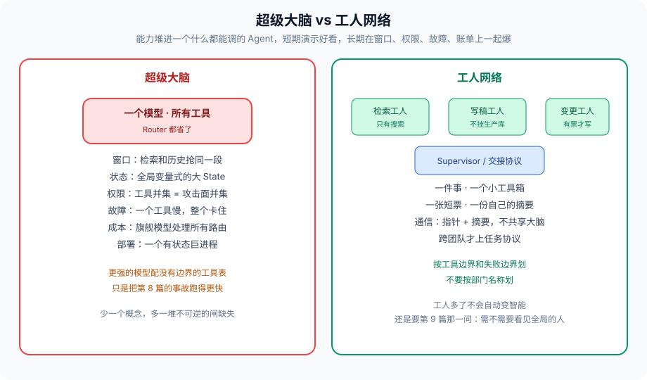

# 第 20 篇：不是一个超级大脑，是一群专业工人

---

从第 0 篇图编排到第 19 篇自进化，取舍反复指向同一件事：把能力堆进一个什么都能调的 Agent，短期演示好看，长期在窗口、权限、故障、账单上一起爆。

「超级大脑」的诱惑是少一个概念。用户一句话，一个模型，所有工具。Router 都省了。它失败的方式本系列都见过：

- 窗口：第 3 篇，所有检索和历史抢同一段上下文
- 状态：第 1、5、10 篇，全局变量式的大 State
- 权限：第 8、11 篇，工具并集等于攻击面并集
- 故障：第 6 篇，一个工具慢，整个大脑卡住
- 成本：第 14 篇，旗舰模型处理所有路由
- 部署：第 15 篇，一个有状态巨进程没法安全扩
- 进化：第 19 篇，一个大脑的对照集没法按能力拆，学歪是全身的

工人网络是反面：每个 Agent 一件事、一个小工具箱、一张短票、一份自己的摘要。Supervisor 或交接协议负责组合，不负责「什么都懂」。

现场不必再新编。第 8 篇的交易 Agent 能无人转走几千万，是大脑。第 9 篇中心挂着 Worker 超集工具，是大脑披了 Supervisor 的皮。第 11 篇接待交接后出现 DDL，是大脑在 Swarm 里求并。第 17 篇扫描目录把 MCP 全接上，是大脑在运行时长大。名字可以叫工人，结构仍是大脑——看工具表是不是并集，不看花名册上有几个角色。

---

### 一、工人怎么划

按 **工具边界和失败边界** 划，不要按部门名称划。

检索工人：只有搜索，超时熔断不影响写稿。写稿工人：不挂生产库。变更工人：有票才动写接口，默认沙箱。审批不是工人，是 HITL 节点。客服工人没有退款 action，退款是另一张票、另一个工人，甚至另一次 HITL。

划错的两种典型：

1. **按组织架构划。** 「数据组 Agent」「运营组 Agent」，工具表跟着组走，组会要新工具，表会变成并集。组织名称不是失败边界。
2. **按模型划。** 「旗舰大脑 + 一群 mini 马仔」，马仔没有自己的票和熔断，只是大脑的 RPC。那是垂直扩容，不是工人网络。

检验：这个工人挂了，哪些用户目标还可以降级完成？答不出来，说明没划出失败边界。检索挂了仍能按已有摘要写「信息不全」的稿，这条边界才存在。退款工人挂了，查单工人不该跟着 500。

通信用第 10 篇的指针加摘要，不用共享大脑内存。跨团队才上第 18 篇的任务协议。工人多不是先进，通道脏了以后，多出来的每一个都是广播半径。

---

### 二、组合仍然需要架构

工人多了，不会自动变智能。还是要第 9 篇那一问：需不需要看见全局的人。需要就 Supervisor；意图会漂且交接协议写得动，再 Swarm。框架（第 12 篇）跟着执行模型选。观测（第 13 篇）按工人打 span，否则网络比单大脑更黑。

组合的几条硬规则，本系列已经写过，收在这里当验收：

1. 中心或当前持有者，工具表不是并集。
2. 回传有协议，原文进 blob。
3. 交接或派活后重算允许集合，派生票只能缩小。
4. hop、改派、token、工具次数，边上有预算。
5. 高危副作用有票、有沙箱、有 HITL，缺一不可。
6. 同一 `thread_id` 串行，状态外置，进程可死。
7. MCP 发现白名单，A2A 任务有幂等和 traceparent。
8. 进化按工人分别做，对照集冻结，在线不改权重。

少任何一条，花名册上的工人会在运行时重新长回大脑。长回的路径就是并集、共享槽、动态发现、自动改提示。

自进化（第 19 篇）按工人分别做：检索工人改查询模板，不要让写稿工人的文风去「优化」检索。对照集也按工人拆。一个工人学歪，回滚一个，不要回滚整张图的人设。

---

### 三、终态不是「更多 Agent」

终态也不是「一个更强的模型出来之后这些闸可以拆」。更强的模型配没有边界的工具表，只是把第 8 篇的事故跑得更快。模型强，窗口竞争还在，并发覆盖还在，账单还在，进程还是会被杀。闸在 Harness，不在参数量。

终态也不是完全去中心。没有人被允许说停的网络，是第 9 篇的踢皮球乘以工人数。需要全局预算、固定 HITL、步骤依赖时，中心是功能，不是耻辱。工人网络里可以有 Supervisor，只要中心不是超集大脑。

终态是：**有边界的工人 + 显式的组合协议 + 可观测的闸。** 工人的数量随工具边界长，不随演示 PPT 长。组合协议写在图和票上，不写在人设上。闸打在边上，不打在周报上。

---

### 四、收整组系列

| 篇 | 取舍 |
| --- | --- |
| 0 | while 循环还是图 |
| 1 | State 谁写、怎么合并 |
| 2 | 停在哪等人 |
| 3 | 窗口里放什么 |
| 4 | 进程死了怎么醒 |
| 5 | 并发写谁赢 |
| 6 | 局部失败是否允许局部死 |
| 7 | 非确定性怎么验 |
| 8 | 硬约束在模型外哪几道闸 |
| 9 | 中心调度还是对等交接 |
| 10 | 共享 State 还是消息 |
| 11 | 权限跟身份还是跟任务 |
| 12 | 执行模型是否匹配任务 |
| 13 | 点打在节点还是只打在 HTTP |
| 14 | 预算在边上还是在月报 |
| 15 | 状态外置还是 sticky |
| 16 | 代码跑在哪一层隔离 |
| 17 | 工具编译期钉死还是运行时发现 |
| 18 | 图内补丁还是跨进程任务 |
| 19 | 改 Harness 还是改权重 |

没有一篇给出「标准架构」。给出的是：演示用的超级大脑，和能上线的工人网络，差在这些闸在不在。

实现时从任务特征往回选篇，不要从框架营销页往下抄。先问四个执行特征（第 12 篇），再问要不要中心（第 9 篇），再问数据怎么走（第 10 篇），再把票、沙箱、观测、预算焊上。MCP 和 A2A 是边界税，不是起点。

---

### 五、从一张新图开工时怎么用本系列

不要按 0 到 20 的顺序实现。按任务问：

1. 副作用有哪些？有写、有钱、有出站，先第 8、11、16 篇，闸比模型先存在。
2. 要不要回边、要不要等人、进程能不能死？第 12、2、4、15 篇。
3. 几个工人、要不要中心？第 9 篇。通道和第 10 篇一起画，不要先共享一个 dict。
4. 观测和预算第 13、14 篇，跟第一张图同一迭代，不要「下个迭代补日志」。
5. MCP / A2A 只在跨过你控制的进程时再上。第 17、18 篇是税。
6. 进化第 19 篇，等对照集能拦住学歪再开。更早的自动改提示，等于给第 8 篇开后门。

演示可以只有一个工人加三四个工具。上线把工人按失败边界拆，把并集拆掉。拆的时候用户可见行为可以不变，变的是出事半径。半径不变的拆，是换皮。

---

### 六、反模式（终态特供）

- 花名册上五个 Agent，工具表一份并集。
- 「等下一代模型出来再加闸」。
- 用更多工人解决窗口问题，通道仍是共享全文。
- 去中心当成政治正确，没有人能说停。
- 进化对着整个大脑做，对照集一份散文。
- 把本系列当框架教程，跳过第 1、6、8、11 篇直接接 MCP。
- 演示一个工人、上线仍一个工人，只是工具表变成了并集。
- 用「下一代模型」当第 8 篇的里程碑。

---

### 七、完整走一遍：从演示到上线拆一次大脑

演示：一个 Agent，搜索、查单、留言、退款、跑代码全挂着，System Prompt 写了「要小心」。投资人喜欢。

上线拆：

- 检索工人，只有搜索，失败降级。
- 查单工人，`orders.read`，资源钉订单。
- 工单工人，留言要票。
- 退款工人，默认无执行，HITL 签发一次性票，沙箱与出网无关。
- 代码工人，PyRun 协议，网络默认关。
- 中心或接待：派活 / 交接，工具表不是并集。
- 通道：指针和摘要。观测：三层 + 控制面。预算在边上。状态外置。MCP 只登记 search 和 tickets。理赔跨团队才 A2A。进化先不开。

用户可见话术可以几乎不变。变的是：检索挂了还能告知查不到；注入进了检索返回，改不了 `order_id`；交接打不开 DDL；发布杀不掉隔夜单；账单能归因。半径变了，才叫拆。花名册变了半径没变，叫换皮。

这就是终态在工程上的意思：不是工人多，是并集拆开、闸焊在边上、出事能指认。模型更强了，布局还是这一套。

---

### 收尾

模型还会更强。更强的模型配没有边界的工具表，只是把第 8 篇的事故跑得更快。边界是 Harness 的事：图、票、沙箱、预算、观测。工人网络不是诗，是这些闸的布局。

系列到此结束。下一张图从任务特征往回选篇，不要从框架营销页往下抄。工人从工具边界长出来，中心从「需不需要看见全局」长出来，票从「这一次实际能做什么」长出来。三样齐了，才配叫上线。

我是Q。
