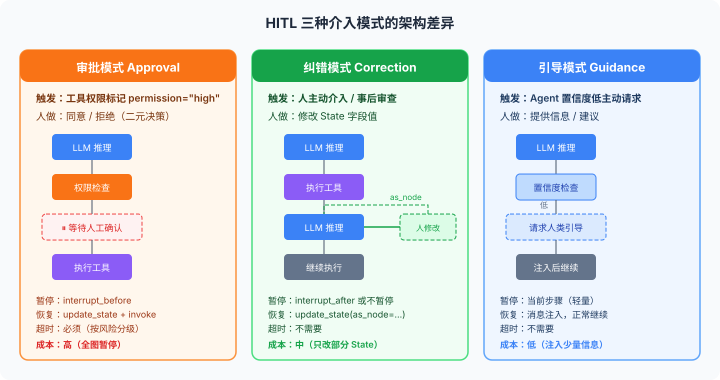
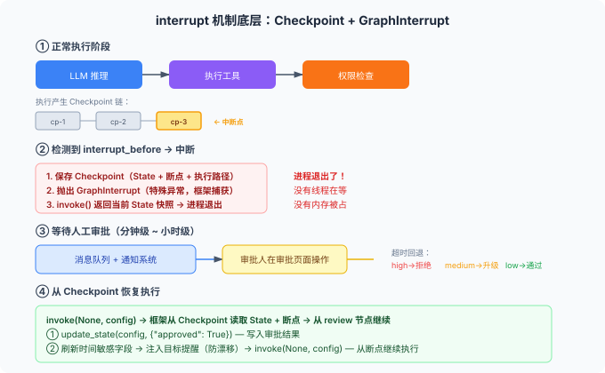

# 给 Agent 加个人工审批？没那么简单——HITL 的三种架构模式

---

大家好，我是Q。

做过 Agent 的人，大概都想过这个问题：

Agent 要执行一个高危操作——删数据、发邮件、转账——我得加个人工审批。

于是你打开代码，在工具执行前加了个 `if input("确认执行？") == "yes":`，上线了，感觉挺好。

然后用户投诉了。

他提交审批后去喝咖啡，回来发现 Agent 超时挂了。

更糟的是，另一个用户的 Agent 在等审批的时候，后面的任务还在继续执行——审批还没过，数据已经改了。

**这就是把 HITL 理解为"加个按钮"的代价。**

HITL（Human-in-the-Loop）不是在代码里加一个确认弹窗。

它的本质是**把人当作一种特殊的 Node**——人也要读 State、也要做决策、也要返回结果，只是人的响应时间是分钟级甚至小时级，而 LLM 是秒级。

这个响应时间的量级差异，改变了几乎所有的架构决策：

执行模型怎么暂停？State 怎么保持？超时怎么处理？审批后怎么恢复？

本文把这些决策逐个拆开讲清楚。

---

### 一、三种介入模式：审批、纠错、引导，架构完全不同

先统一认知。

"人工介入"不是一种操作，是三种操作。架构差异很大。

#### 1.1 审批模式（Approval）：人做二元决策

Agent 准备执行一个高危操作，暂停，等人说"同意"或"拒绝"。

```python
@tool(permission="high")
def delete_records(table: str, condition: str) -> str:
    """删除数据库记录。高危操作，需人工确认。"""
    ...
```

审批模式有三个特点：

- **决策简单**：同意或拒绝，二元选择
- **信息需求低**：人只需要看"Agent 要做什么"和"参数是什么"
- **时序敏感**：审批通过之前，操作绝对不能执行

这是最常见的 HITL 模式，也是最容易实现的。

但也最容易做错。

最常见的错误是什么？审批等待期间，Agent 的其他部分还在跑。

比如 Agent 要发邮件，等审批的同时又把数据库改了——审批拒绝了，但数据库已经脏了。

正确的做法是：**审批模式下，整个图执行暂停，不是只暂停一个节点。**

#### 1.2 纠错模式（Correction）：人修改 State

Agent 执行了一步，结果不太对。人看到后直接修改 State，让 Agent 基于正确的状态继续。

```python
# LangGraph 的 update_state API
graph.update_state(
    config,
    {"messages": [HumanMessage(content="不对，上一步的搜索结果应该用第二个链接")]},
    as_node="tool"
)
```

纠错模式也有三个特点：

- **决策复杂**：人不是做选择，是做编辑——改哪个字段、改成什么值
- **信息需求高**：人需要看到完整的当前 State，才能判断哪里错了
- **时序不敏感**：修改发生在某个步骤之后，不是之前

纠错模式的架构难点不在暂停，在**恢复**。

人修改了 State 后，从哪里继续执行？是从被修改的节点重新开始，还是从下一个节点开始？

LangGraph 的 `as_node` 参数就是解决这个问题的。

它告诉框架"这个更新假装是从某个节点输出的"，框架据此决定后续路由。

#### 1.3 引导模式（Guidance）：人注入上下文

Agent 在执行过程中遇到不确定的情况，主动请求人的指导。

人不修改 State，只是提供信息。

```python
class AgentState(TypedDict):
    messages: Annotated[list, add_messages]
    human_guidance: str  # 人的指导意见
    confidence: float    # Agent 对当前决策的置信度

def reasoning_node(state: AgentState) -> dict:
    """推理节点：置信度低时请求人类引导。"""
    response = llm.invoke(state["messages"])
    
    if state.get("confidence", 1.0) < 0.6:
        return {
            "messages": [AIMessage(content="我对下一步不太确定，需要你的意见。")],
            "human_guidance": "__REQUEST__"
        }
    return {"messages": [response]}
```

引导模式的特点：

- **决策开放**：人不是做选择也不是做编辑，而是提供信息或建议
- **信息需求中等**：人需要理解 Agent 的困惑点，但不需要看完整 State
- **时序灵活**：可以在任何点注入，不影响已有执行结果

引导模式常用于半自主 Agent——日常决策自动做，不确定时才问人。

架构难点是**触发条件**：什么时候该问人？置信度阈值怎么设？

阈值太低，人被频繁打扰；阈值太高，关键时候没人兜底。

#### 1.4 三种模式对比

| | 审批 | 纠错 | 引导 |
|---|---|---|---|
| 人做什么 | 同意/拒绝 | 修改 State | 提供信息 |
| 触发方式 | 工具权限标记 | 人主动介入 | Agent 主动请求 |
| 暂停范围 | 整个图 | 无需暂停 | 当前步骤 |
| 信息需求 | 低 | 高 | 中 |
| 恢复方式 | 继续或终止 | 重新路由 | 注入后继续 |
| 典型场景 | 发邮件、删数据 | 修正错误结果 | 不确定时求助 |



这三种模式不是互斥的——生产系统通常同时需要。

但它们的架构实现完全不同。后面逐个展开。

---

### 二、interrupt 机制底层：不是"暂停线程"，是 Checkpoint + GraphInterrupt

很多人以为 HITL 的暂停机制是"把线程挂起，等人确认后恢复线程"。

这个理解在单机同步场景下大致对。但在图编排架构中完全不对。

**图编排的暂停机制是：保存 Checkpoint → 抛出 GraphInterrupt → 进程退出。**

理解这一点至关重要。

因为进程退出了，所以不存在"线程被挂起"这回事。恢复的时候，也不是"唤醒线程"，而是"用 Checkpoint 重建 State，从断点继续执行"。

#### 2.1 interrupt 的执行流程

```python
from langgraph.checkpoint.memory import MemorySaver
from langgraph.graph import StateGraph

checkpointer = MemorySaver()

builder = StateGraph(AgentState)
builder.add_node("reason", reasoning_node)
builder.add_node("tool", tool_node)
builder.add_node("review", review_node)

builder.add_edge("reason", "tool")
builder.add_edge("tool", "review")
builder.add_edge("review", "reason")

# 关键：在 review 节点之前自动暂停
graph = builder.compile(
    checkpointer=checkpointer,
    interrupt_before=["review"]
)

# 第一次调用：执行到 review 前暂停
result = graph.invoke(
    {"messages": [HumanMessage(content="帮我发封邮件")]},
    config={"configurable": {"thread_id": "thread-1"}}
)

# 人工审核后恢复
graph.update_state(
    {"configurable": {"thread_id": "thread-1"}},
    {"approved": True}
)
result = graph.invoke(
    None,  # None 表示从断点继续
    config={"configurable": {"thread_id": "thread-1"}}
)
```

这个流程的底层发生了什么？

**第一步**：执行到 `review` 节点前，框架检测到 `interrupt_before=["review"]`

**第二步**：保存 Checkpoint——将当前 State、下一个要执行的节点、执行路径全部序列化

**第三步**：抛出 `GraphInterrupt`——这是一个特殊异常，框架会捕获它，而不是让它传播

**第四步**：`invoke` 返回当前 State 的快照——这就是 Agent 的"暂停状态"

**第五步**：进程退出。如果这是 HTTP 请求的处理函数，请求结束，进程可以处理其他事情

**第六步**：恢复时，`invoke(None, config)` → 框架从 Checkpoint 读取 State 和断点 → 从 `review` 节点继续执行



关键认知：**两次 `invoke` 之间，没有线程在等。**

进程可以关掉、重启、甚至换一台机器——只要 Checkpoint 存在（存在数据库里而不是内存里），就能从断点恢复。

#### 2.2 为什么不是"暂停线程"？

"暂停线程"的方案有几个致命问题。

**第一，资源浪费。**

Agent 等审批可能等几分钟甚至几小时。如果每个等待审批的请求都占一个线程，100 个并发审批就把线程池吃满了。

**第二，不可恢复。**

进程崩溃后线程就没了。如果 Agent 等审批的时候服务重启了，审批状态永久丢失——既无法恢复执行，也无法通知用户。

**第三，不可迁移。**

线程绑定了进程和内存。你不能在 A 机器上暂停、在 B 机器上恢复。但生产环境中，负载均衡可能把恢复请求路由到不同的实例。

**第四，不可分叉。**

审批不是只有"同意/拒绝"两个选项。有时候人想看看"如果不同意，Agent 会怎么做"。这需要从同一个 Checkpoint 分叉出两条执行路径——线程模型做不到。

Checkpoint + GraphInterrupt 的方案完美解决了这四个问题：

不占线程（进程退出）、可恢复（Checkpoint 在数据库里）、可迁移（任何实例都能读 Checkpoint）、可分叉（从同一个 Checkpoint 创建多个后续执行）。

#### 2.3 interrupt_before vs interrupt_after

LangGraph 提供了两个暂停时机：

```python
# 在节点执行前暂停
graph = builder.compile(interrupt_before=["send_email"])

# 在节点执行后暂停
graph = builder.compile(interrupt_after=["reasoning"])
```

`interrupt_before` 用于审批模式——在执行高危操作前暂停。

`interrupt_after` 用于纠错/引导模式——在 LLM 做出决策后暂停，让人审查或修改。

选择哪个不是随意的。

**`interrupt_before` 保证操作不会执行，`interrupt_after` 保证你能看到 LLM 的决策。**

一个是预防性的，一个是审查性的。

还有一个容易忽视的区别：

`interrupt_before` 暂停时，当前 State 还没有包含该节点的输出。

`interrupt_after` 暂停时，State 已经包含了该节点的输出。

这意味着 `interrupt_after` 后你可以直接审查并修改 LLM 的输出，而 `interrupt_before` 后你只能决定"要不要执行"。

---

### 三、同步审批 vs 异步审批：从"等 5 秒"到"等 5 小时"的架构跨越

审批的等待时间决定了整个架构。

#### 3.1 同步审批：用户在等

场景：用户在聊天界面里让 Agent 发邮件，Agent 暂停，弹窗问用户"确认发送？"。

同步审批的特点是**用户还在等**。

等待时间通常在秒级到分钟级。这种场景下，`interrupt` + 恢复的方案就够了——前端轮询或者 WebSocket 推送结果。

```python
# 同步审批流程
@app.post("/chat")
async def chat(request: ChatRequest):
    result = graph.invoke(
        {"messages": [HumanMessage(content=request.message)]},
        config={"configurable": {"thread_id": request.thread_id}}
    )
    
    if result.get("needs_approval"):
        return {"status": "needs_approval", "action": result["pending_action"]}
    
    return {"status": "done", "response": result["messages"][-1].content}

@app.post("/approve")
async def approve(request: ApproveRequest):
    graph.update_state(
        {"configurable": {"thread_id": request.thread_id}},
        {"approved": request.approved}
    )
    result = graph.invoke(
        None,
        config={"configurable": {"thread_id": request.thread_id}}
    )
    return {"status": "done", "response": result["messages"][-1].content}
```

同步审批的架构简单，但有上限：

用户能等多久？5 秒可以，5 分钟勉强，5 小时不可能。

如果你的 Agent 跑一个长时任务，中间需要审批，同步方案就力不从心了。

#### 3.2 异步审批：用户走了

场景：Agent 处理一份合同，流程是"提取条款 → 法务审核 → 生成摘要"。

法务审核可能要几小时甚至几天。

异步审批的特点是**用户已经走了**。

这改变了所有东西：

- 你不能用 HTTP 请求阻塞等待——请求会超时
- 你不能用 WebSocket 推送——用户已经关了页面
- 你必须用**消息队列 + 通知系统**来解耦

```python
# 异步审批：Agent 执行到审批点 → 发通知 → 进程退出
def review_node(state: AgentState) -> dict:
    """法务审核节点：发通知后暂停。"""
    contract_terms = state.get("extracted_terms", [])
    
    # 发送审批通知到消息队列
    approval_request = {
        "thread_id": state["thread_id"],
        "action": "legal_review",
        "content": contract_terms,
        "timeout_at": (datetime.now() + timedelta(hours=24)).isoformat()
    }
    message_queue.publish("approval_requests", approval_request)
    
    # 通知审核人
    notifier.send(
        to="legal-team@company.com",
        subject=f"合同审核请求 - {state['thread_id']}",
        body=f"请在24小时内审核。"
    )
    
    # 抛出中断——Agent 进程退出，不占资源
    raise GraphInterrupt("waiting_for_legal_review")
```

审批人在审批页面操作后，恢复执行：

```python
@app.post("/approve/{thread_id}")
async def async_approve(thread_id: str, decision: ApprovalDecision):
    config = {"configurable": {"thread_id": thread_id}}
    
    # 更新审核结果
    graph.update_state(config, {
        "review_result": decision.result,
        "review_comments": decision.comments
    })
    
    # 恢复执行
    result = graph.invoke(None, config=config)
    
    # 通知发起人结果
    notifier.send(to=decision.requester, subject="审核完成")
```

异步审批的核心架构组件有四个：

1. **消息队列**：解耦 Agent 执行和审批通知
2. **通知系统**：邮件/IM/短信，确保审批人知道有东西要审
3. **Checkpoint 存储**：必须用持久化存储（Postgres/Redis），不能用内存
4. **超时回退**：审批人可能忘了审批，必须有时限

#### 3.3 超时回退：审批人不是总能及时出现

超时是异步审批最容易被忽视的架构问题。

审批人请假了、审批人离职了、审批人就是忘了——你的 Agent 不能永远等下去。

```python
# 超时回退的三种策略

# 策略一：自动拒绝——最安全，最保守
TIMEOUT_ACTION = "reject"

# 策略二：自动升级——转给上级或备选审批人
ESCALATION_CHAIN = {
    "legal_review": ["legal-lead@company.com", "cto@company.com"],
    "finance_approval": ["cfo@company.com"]
}

# 策略三：自动通过——最危险，仅适用于低风险场景
TIMEOUT_ACTION = "auto_approve"  # 仅风险等级为 low 时使用
```

超时回退策略必须和业务绑在一起。

不是所有审批都该自动拒绝——低风险的操作超时自动通过可能更合理（比如内容发布审核）。

但高风险操作（比如转账）超时必须拒绝——宁可少做不能做错。

**架构原则：每个审批节点都必须有超时策略，就像每个 HTTP 请求都必须有超时一样。**

没有超时的审批节点是系统里的定时炸弹。

---

### 四、从 Checkpoint 分叉：审批不是二选一

审批模式给人的直觉是"同意或拒绝"。

但实际场景比这复杂得多。

#### 4.1 分叉的场景

**场景一：探索式审批。**

法务审核一份合同，觉得条款 A 有问题，但不确定不同意会怎样。他想看看：如果拒绝了条款 A，Agent 会怎么改？

**场景二：并行探索。**

Agent 生成了两个方案，人想同时探索两个方案的后续路径——看哪个最终结果更好。

**场景三：审批后修改。**

人不完全同意，想改一下参数再执行。改完之后又想回到原始方案看看。

这些场景的共同点是：**从同一个 Checkpoint，衍生出多条执行路径。**

这不是"同意/拒绝"的二元选择，而是树的分叉。

#### 4.2 Checkpoint 分叉的实现

LangGraph 的 Checkpoint 链是单向链表：每个 Checkpoint 指向它的前驱。

但 Checkpoint 不是只能有一个后继——你可以从同一个 Checkpoint 创建多个分支。

```python
# 从同一个审批点探索两条路径

config = {"configurable": {"thread_id": "contract-review"}}
# 当前 Checkpoint 为 "cp-3"

# 分支一：同意
graph.update_state(
    {"configurable": {"thread_id": "contract-review", "checkpoint_id": "cp-3"}},
    {"approved": True, "review_comments": "同意原方案"},
    as_node="review"
)
result_approve = graph.invoke(None, config={"configurable": {"thread_id": "contract-review"}})

# 分支二：拒绝——从同一个 Checkpoint 重新开始
graph.update_state(
    {"configurable": {"thread_id": "contract-review-alt", "checkpoint_id": "cp-3"}},
    {"approved": False, "review_comments": "条款A赔偿金额过高，要求降至50万以下"},
    as_node="review"
)
result_reject = graph.invoke(None, config={"configurable": {"thread_id": "contract-review-alt"}})
```

分叉的关键在于：**Checkpoint 是不可变的。**

从 `cp-3` 分叉出两条路径，不会修改 `cp-3` 本身。两条路径各自生成新的 Checkpoint 链，互不干扰。

这个特性让"试错"变成了零成本操作。

人可以放心地探索"如果不同意会怎样"，因为原始路径永远在那里——不满意随时可以回去。

#### 4.3 分叉的架构成本

分叉不是免费的。

每条分支都是一次完整的 Agent 执行——LLM 调用、工具执行、State 存储。并行探索 N 条路径，成本就是 N 倍。

更隐蔽的成本是**认知负担**。

如果分叉出 5 条路径，人要对比 5 份结果。分支越多，决策反而越难。

**架构原则：分叉是强大但昂贵的工具。限定分叉数量（通常不超过 2-3 条），并在每条分支上设置 token 预算上限，防止某条分支跑飞了。**

---

### 五、HITL 的成本：每次中断都是一次 LLM 上下文切换

HITL 不是免费的。每次人工介入，都有隐性成本。

#### 5.1 延迟成本

LLM 推理一次大概 1-5 秒。人工审批一次可能是 5 分钟、5 小时、甚至 5 天。

在 Agent 的 ReAct 循环中，每一步的输出都是下一步的输入。

中断意味着：**LLM 已经推理出的上下文，在人审批回来的时候，可能已经过时了。**

比如：Agent 查了实时汇率，然后等审批。等了 2 小时审批通过，但汇率已经变了。Agent 基于旧汇率做的决策，执行时汇率已经不同。

这不是理论问题——金融 Agent、交易 Agent、库存 Agent 都会遇到。

**架构对策：审批通过后，重新获取时间敏感数据，而不是直接用中断前的值。**

```python
# 时间敏感字段的刷新机制
class AgentState(TypedDict):
    messages: Annotated[list, add_messages]
    exchange_rate: float           # 时间敏感
    account_balance: float         # 时间敏感
    approved: bool
    _time_sensitive_keys: list     # 标记哪些字段需要刷新

def resume_with_refresh(config: dict):
    """审批通过后恢复执行，刷新时间敏感字段。"""
    state = graph.get_state(config)
    
    for key in state.values.get("_time_sensitive_keys", []):
        if key == "exchange_rate":
            state.values["exchange_rate"] = fetch_latest_rate()
        elif key == "account_balance":
            state.values["account_balance"] = fetch_latest_balance()
    
    graph.update_state(config, state.values)
    return graph.invoke(None, config=config)
```

#### 5.2 Token 成本

审批恢复后，LLM 需要重新读取整个 messages 列表才能理解上下文。

如果中断前已经跑了 10 轮 ReAct 循环，messages 列表可能有几千个 token。恢复执行时，这些 token 全部要重新输入 LLM。

更糟的是分叉场景。

从同一个 Checkpoint 分叉出 3 条路径，每条路径的后续执行都要重新输入中断前的 messages。3 条路径 = 3 倍的重复 token。

**架构对策：**

1. 审批前做摘要——把冗长的 messages 压缩成关键信息，减少恢复时的 token 消耗
2. 限制中断频率——不是每一步都要人审，只在真正高危的点中断
3. 分支共享上下文——如果多条分支的中断前 messages 相同，只算一次 token

#### 5.3 注意力漂移成本

这是最容易被忽视的成本。

Agent 等了 2 小时才恢复执行。在这 2 小时里，LLM 的"注意力"已经不在最初的任务上了。

不是 LLM 变了，而是 messages 列表里塞入了大量审批相关的内容（确认请求、人的回复、系统通知），稀释了原始任务的信息密度。

我见过一个真实案例：

Agent 执行"帮我订机票"，中间等了一次支付审批（等了 4 小时）。审批通过后继续执行，Agent 忘了目的地是上海，订了北京的机票。

因为审批相关的消息把"目的地：上海"这个关键信息挤出了上下文窗口。

**架构对策：**

1. 审批通过后，在恢复执行的 system message 中重申关键任务参数
2. 用 Planning 机制维护一个独立的"任务目标"字段，不受 messages 膨胀影响
3. 长中断后做 goal_check（目标检查），确认 Agent 没有偏离原始任务

```python
def resume_after_approval(config: dict, original_goal: str):
    """长中断后恢复执行，注入目标提醒。"""
    state = graph.get_state(config)
    
    goal_reminder = HumanMessage(
        content=f"[系统提醒] 审批已通过。请记住你的原始任务：{original_goal}。"
                f"不要被审批过程的信息干扰，专注于完成原始任务。"
    )
    graph.update_state(config, {"messages": [goal_reminder]})
    
    return graph.invoke(None, config=config)
```

---

### 六、生产级 HITL 的完整架构

把前面讲的拼在一起，看生产级 HITL 的全貌。

#### 6.1 架构总览

```python
from langgraph.checkpoint.postgres import PostgresSaver
from langgraph.graph import StateGraph, END
from typing import Annotated, TypedDict, Literal
from langgraph.graph.message import add_messages

# State 定义：包含审批相关字段
class AgentState(TypedDict):
    messages: Annotated[list, add_messages]
    pending_action: dict | None
    approval_status: Literal["pending", "approved", "rejected", "timeout"] | None
    approval_deadline: str | None
    risk_level: Literal["low", "medium", "high"]
    _time_sensitive_keys: list
    original_goal: str  # 原始任务目标（防漂移）

# 审批路由：根据风险等级决定是否需要审批
def route_by_risk(state: AgentState) -> str:
    if state.get("risk_level") == "high" and state.get("approval_status") != "approved":
        return "wait_approval"
    return "execute"

# 构建图
builder = StateGraph(AgentState)
builder.add_node("reason", reasoning_node)
builder.add_node("plan_action", plan_action_node)
builder.add_node("wait_approval", wait_approval_node)
builder.add_node("execute", execute_node)
builder.add_node("summarize", summarize_node)

builder.set_entry_point("reason")
builder.add_edge("reason", "plan_action")
builder.add_conditional_edges("plan_action", route_by_risk)
builder.add_edge("wait_approval", "execute")
builder.add_edge("execute", "summarize")
builder.add_edge("summarize", END)

# 持久化 Checkpoint + 审批中断
checkpointer = PostgresSaver.from_conn_string(DATABASE_URL)
graph = builder.compile(
    checkpointer=checkpointer,
    interrupt_before=["wait_approval"]
)
```

#### 6.2 完整的审批 API

```python
from fastapi import FastAPI
from datetime import datetime, timedelta

app = FastAPI()

@app.post("/agent/run")
async def run_agent(request: AgentRequest):
    thread_id = f"thread-{request.user_id}-{datetime.now().timestamp()}"
    config = {"configurable": {"thread_id": thread_id}}
    
    result = graph.invoke(
        {
            "messages": [HumanMessage(content=request.message)],
            "original_goal": request.message,
            "risk_level": "low",
            "pending_action": None,
            "approval_status": None,
            "_time_sensitive_keys": []
        },
        config=config
    )
    
    state = graph.get_state(config)
    
    if state.next == ["wait_approval"]:
        pending = state.values.get("pending_action", {})
        risk = pending.get("risk_level", "high")
        timeout_hours = {"high": 4, "medium": 12, "low": 24}[risk]
        
        # 发送审批通知
        approval_request = {
            "thread_id": thread_id,
            "action": pending,
            "risk_level": risk,
            "deadline": (datetime.now() + timedelta(hours=timeout_hours)).isoformat()
        }
        await message_queue.publish("approval_requests", approval_request)
        await notify_approvers(approval_request)
        await approval_store.save(approval_request)
        
        return {"status": "needs_approval", "thread_id": thread_id, "pending_action": pending}
    
    return {"status": "completed", "response": state.values["messages"][-1].content}

@app.post("/agent/approve/{thread_id}")
async def approve_action(thread_id: str, decision: ApprovalDecision):
    config = {"configurable": {"thread_id": thread_id}}
    state = graph.get_state(config)
    
    if not state.next:
        return {"error": "没有等待审批的操作"}
    
    graph.update_state(config, {
        "approval_status": "approved" if decision.approved else "rejected",
        "pending_action": None
    })
    
    if decision.approved:
        # 刷新时间敏感字段
        for key in state.values.get("_time_sensitive_keys", []):
            new_value = await refresh_time_sensitive_data(key)
            graph.update_state(config, {key: new_value})
        
        # 注入目标提醒（防漂移）
        goal = state.values.get("original_goal", "")
        graph.update_state(config, {
            "messages": [HumanMessage(
                content=f"[系统提醒] 审批已通过。原始任务：{goal}。请继续执行。"
            )]
        })
        
        result = graph.invoke(None, config=config)
        return {"status": "completed", "response": result["messages"][-1].content}
    else:
        # 审批拒绝——Agent 调整方案
        graph.update_state(config, {
            "messages": [HumanMessage(
                content=f"审批被拒绝。原因：{decision.reason}。请调整方案。"
            )]
        })
        result = graph.invoke(None, config=config)
        return {"status": "adjusted", "response": result["messages"][-1].content}
```

#### 6.3 超时检查定时任务

```python
@app.on_event("startup")
async def setup_timeout_checker():
    async def check_timeouts():
        while True:
            pending = await approval_store.list_expired()
            for request in pending:
                risk = request["risk_level"]
                
                if risk == "high":
                    await approve_action(request["thread_id"], ApprovalDecision(
                        approved=False, reason="审批超时，自动拒绝"
                    ))
                elif risk == "medium":
                    await escalate_approval(request)
                else:
                    await approve_action(request["thread_id"], ApprovalDecision(
                        approved=True, reason="审批超时，低风险自动通过"
                    ))
                
                await approval_store.remove(request["thread_id"])
            
            await asyncio.sleep(300)  # 每 5 分钟检查一次
    
    asyncio.create_task(check_timeouts())
```

---

### 七、HITL 的常见陷阱

#### 7.1 陷阱一：审批粒度太粗

给所有操作都加审批，和没加审批一样。

人面对 50 个审批请求，会全部点"同意"——这叫审批疲劳。

**架构对策：按风险等级分层。**

低风险操作自动执行，中风险操作记录日志事后审查，高风险操作才需要事前审批。

风险等级不应该写死在代码里，应该由工具的 `permission` 元数据决定——第 3 章的 `@tool(permission="high")` 就是这个思路。

#### 7.2 陷阱二：审批和执行不在同一个事务里

Agent 等审批的时候，State 被其他请求修改了。

审批通过后执行的 State，已经不是审批时的 State。

**架构对策：审批通过时，校验 State 的关键字段是否和审批时一致。** 如果不一致，自动拒绝并要求重新提交。

```python
def approve_with_integrity_check(thread_id: str, decision: ApprovalDecision):
    config = {"configurable": {"thread_id": thread_id}}
    state = graph.get_state(config)
    
    # 取出审批时保存的 State 快照
    snapshot = state.values.get("approval_snapshot", {})
    current = {k: state.values.get(k) for k in snapshot}
    
    if snapshot != current:
        # State 已被修改，审批失效
        graph.update_state(config, {
            "approval_status": "invalidated",
            "messages": [HumanMessage(content="审批失效：State 已被修改，请重新提交。")]
        })
        return graph.invoke(None, config=config)
```

#### 7.3 陷阱三：把 HITL 当安全网

"这个操作不安全，加个人工审批就行。"——这是最危险的想法。

HITL 不是安全网的替代品。

人在快速浏览审批请求时，判断力和自动化系统差不多——甚至会更差，因为人会疲劳、会分心、会习惯性点同意。

**架构对策：安全护栏在 HITL 之前。**

先用 Guardrails 做硬性拦截（比如"绝对不能执行 `rm -rf /`"），HITL 只处理需要人类判断力的场景（比如"这封邮件的措辞是否恰当"）。

把 HITL 当作最后一道防线，而不是第一道——人应该是裁判，不是守门员。

#### 7.4 陷阱四：忽视审批的 UX

审批界面只显示"Agent 请求执行 send_email，参数：{to: '...', subject: '...'}"。

人看了不知道该不该同意——因为没有上下文。

**架构对策：审批请求必须附带足够的决策上下文。**

```python
# 好的审批请求：附带上下文
approval_request = {
    "action": "send_email",
    "parameters": {"to": "client@example.com", "subject": "合同确认"},
    "context": {
        "original_request": "帮我给客户发合同确认邮件",
        "reasoning": "Agent 已完成合同审核，所有条款均已通过。邮件内容基于合同模板生成。",
        "risk_factors": ["收件人是外部邮箱", "包含合同附件"],
        "alternatives": ["仅发送摘要", "存为草稿由人工发送"]
    },
    "timeline": {
        "created_at": "2026-05-07T10:30:00",
        "deadline": "2026-05-07T14:30:00",
        "impact_if_delayed": "客户等待超4小时可能影响签约进度"
    }
}
```

好的审批 UX 让人能在 30 秒内做出决策。

差的审批 UX 让人花 5 分钟找上下文，然后习惯性点同意。

---

### 八、架构决策总结

| 决策点 | 审批模式 | 纠错模式 | 引导模式 |
|---|---|---|---|
| 暂停方式 | `interrupt_before` | `interrupt_after` 或事后 | 不暂停，注入消息 |
| 恢复方式 | `update_state` + `invoke(None)` | `update_state(as_node=...)` | 正常继续 |
| 存储要求 | 持久化 Checkpoint | 持久化 Checkpoint | 可用内存 |
| 超时策略 | 必须（按风险分级） | 不需要 | 不需要 |
| 分叉支持 | 支持（从 Checkpoint 分叉） | 天然支持 | 不适用 |
| Token 成本 | 高（恢复时重读上下文） | 中（只改部分 State） | 低（注入少量信息） |
| 漂移风险 | 高（长中断导致漂移） | 低 | 极低 |

### 核心决策清单

1. **HITL 的本质是"把人当作一种特殊的 Node"**——人也要读 State、做决策、返回结果，只是响应时间是分钟级

2. **三种介入模式架构不同**——审批是预防性暂停、纠错是事后修改、引导是信息注入，不能混用

3. **interrupt 不是暂停线程**——是保存 Checkpoint + 抛出 GraphInterrupt + 进程退出，恢复时从 Checkpoint 重建

4. **异步审批必须有超时回退**——按风险分级：高风险超时拒绝、中风险升级、低风险自动通过

5. **审批粒度不能太粗**——全部审批 = 审批疲劳 = 没有审批；按风险等级分层

6. **长中断后必须防注意力漂移**——注入目标提醒、刷新时间敏感数据、做 goal_check

7. **安全护栏在 HITL 之前**——HITL 是最后一道防线，不是第一道

**HITL 的本质不是"加个按钮"，是"在图的执行中插入一个响应时间为小时级的 Node"。**

这个认知改变了一切：你不能用线程阻塞来等它，你不能假设 State 不会变，你不能忽视它的成本。

---

*(本文基于 LangGraph v1.2+ 官方文档、源码及生产实践经验撰写。关键 API 行为已在 langgraph 1.2.0 上验证。)*
