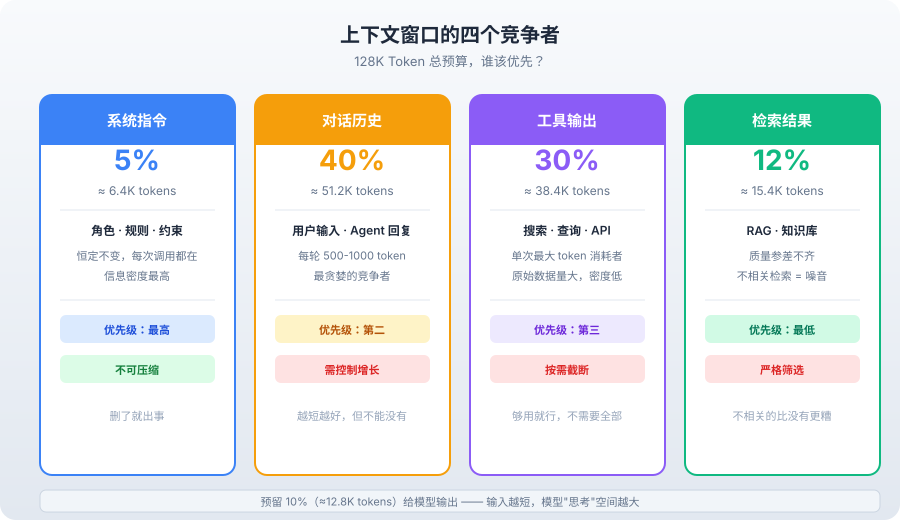
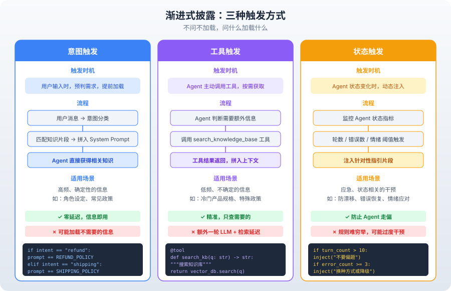

# 上下文工程——2026 年 Agent 最核心的技能

---

大家好，我是Q。

同一个 GPT-4o，换个 System Prompt，Agent 像换了个脑子。

一个客户服务 Agent，System Prompt 里写了"你是一个专业的客服，请耐心回答用户问题"——回复平庸，像模板。

另一个 Agent，System Prompt 里写了当前用户的订单状态、最近的投诉记录、可用的补偿方案——回复精准，像真人。

模型没变。变的是上下文。

**Agent 的智商不取决于模型，取决于你喂给它什么上下文。**

这就是 Context Engineering（上下文工程）要解决的问题。

它和 Prompt Engineering 不是一回事。Prompt Engineering 是写指令——"你是什么角色、怎么回答、注意什么规则"。Context Engineering 是设计信息架构——上下文窗口里放什么、不放什么、什么时候放、放多少。

2026 年，GPT-4o、Claude 4、Gemini 2 的能力已经非常接近。模型不再是瓶颈，上下文才是。

这篇文章，就来讲清楚上下文工程的每一个架构决策：窗口里的四个竞争者怎么平衡、渐进式披露怎么做、预算怎么分配、压缩策略怎么选。每个决策都有取舍，没有标准答案。

---

### 一、Context Engineering ≠ Prompt Engineering

先统一认知。

很多工程师以为"优化 Agent 就是优化 Prompt"。这个理解在聊天机器人时代没问题，但在 Agent 时代不够了。

Prompt Engineering 解决的问题是：**怎么让模型按你的要求输出。** 它关注的是指令的措辞、格式、示例。

Context Engineering 解决的问题是：**怎么让模型在正确的信息环境下做决策。** 它关注的是信息的筛选、排序、时机、量级。

一个类比：Prompt Engineering 是给员工写岗位职责，Context Engineering 是给员工配工作台——桌上放什么文件、开什么系统、能看到哪些数据。

岗位职责写得再好，桌上没有正确的工作材料，员工也干不了活。

Agent 也一样。System Prompt 写得再精炼，如果上下文窗口里塞满了无关的工具输出和历史对话，模型也做不出正确决策。

举个生产环境的例子。一个代码助手 Agent，用户说"帮我修一下这个 bug"。

如果上下文里只有用户的描述，Agent 只能靠猜——猜是哪个文件、猜是什么错误。大概率猜错。

如果上下文里有报错日志、相关源码、最近的 git diff，Agent 可以精确定位问题。不是因为它更聪明，是因为它有更好的信息。

**Context Engineering 的核心约束是：上下文窗口是有限的。**

GPT-4o 的上下文窗口是 128K token。听起来很大，但实际用起来远远不够：

- 系统指令：2K-5K token
- 工具 schema：每个工具 200-500 token，10 个工具就是 2K-5K
- 对话历史：每轮 500-1000 token，20 轮就是 10K-20K
- 工具输出：每次 500-5000 token，5 次调用就是 2.5K-25K
- 检索结果：每条 200-500 token，5 条就是 1K-2.5K

加起来，一个 20 轮的 Agent 对话，轻松吃掉 30K-50K token。

如果任务更复杂——40 轮对话、多个工具、RAG 检索——100K 就满了。

**窗口满了会怎样？模型开始"忘记"前面的信息。** 最早的 System Prompt 被挤出窗口，最关键的任务目标被稀释在噪音里。Agent 的表现断崖式下降。

更隐蔽的问题是：即使窗口没满，过多的无关信息也会降低模型的表现。OpenAI 的研究表明，当上下文中包含不相关信息时，模型的推理准确率会下降 10%-30%——即使关键信息仍然在窗口里。

这就是为什么上下文工程是 2026 年 Agent 最核心的技能——不是模型不够聪明，是你没给它足够好的信息环境。

---

### 二、上下文窗口的四个竞争者

上下文窗口里有四个"竞争者"，每个都在抢 token：

**竞争者一：系统指令（System Prompt）**

系统指令定义了 Agent 的角色、规则、约束。它是恒定的——每次调用都在，不会变。

它占的 token 不多（通常 2K-5K），但信息密度最高。一个好的 System Prompt 能让模型少犯 80% 的低级错误。

举个例子。一个退款处理 Agent，System Prompt 里写"如果用户提到法律威胁，立即升级到人工"——这一条规则，可能帮你避免 90% 的公关危机。

**竞争者二：对话历史（Messages）**

对话历史是动态的——每轮对话都在增长。它记录了用户说了什么、Agent 做了什么、工具返回了什么。

对话历史是最"贪婪"的竞争者。不加控制的话，它会把整个窗口吃满。

为什么会这样？因为 Agent 的对话历史不只是"用户说/Agent说"。它还包括工具调用和工具返回。一轮典型的 ReAct 循环是：用户提问 → Agent 思考 → Agent 调用工具 → 工具返回结果 → Agent 基于结果回答。这一轮下来，就是 4-5 条消息。

5 轮 ReAct 循环 = 20-25 条消息。每条 200-500 token，就是 4K-12.5K token。

**竞争者三：工具输出（Tool Results）**

工具输出是 Agent 的"眼睛"——搜索结果、数据库查询、API 响应。它通常是单次最大的 token 消耗者。

一次搜索 API 返回 10 条结果，每条 500 字，就是 5000 token。一次数据库查询返回 50 行记录，可能是 10000 token。

工具输出的特点是：量大、密度低。10 条搜索结果里，Agent 可能只用到了 1 条。剩下的 9 条就是噪音。

**竞争者四：检索结果（RAG / 外部知识）**

检索结果来自向量数据库或知识库。它为 Agent 提供领域知识——产品文档、公司政策、历史案例。

检索结果的特点是：质量参差不齐。有些高度相关，有些完全无关。如果不做筛选，检索结果会成为上下文窗口里最大的噪音源。



这四个竞争者不是平等的。谁该优先？

**系统指令优先级最高，不可压缩。** 它是 Agent 的"宪法"，删了就出事。

**对话历史优先级第二，但要控制增长。** 它是 Agent 理解上下文的基础，但不能无限膨胀。

**工具输出优先级第三，要按需截断。** Agent 只需要"够用"的信息，不需要全部原始数据。

**检索结果优先级最低，要严格筛选。** 不相关的检索结果比没有更糟——它占用 token 的同时误导模型。

理解了这四个竞争者，接下来的问题就是：怎么在它们之间做平衡？

---

### 三、渐进式披露：按需加载，不是一次性全塞进去

最常见的上下文工程错误是什么？

**把所有信息一次性塞进 System Prompt。**

"你是客服 Agent。以下是我们的所有产品文档（5000 字）、所有退款政策（3000 字）、所有常见问题（2000 字）、所有系统操作指南（4000 字）……"

结果：System Prompt 占了 14K token，模型在 14K token 的噪音里找 200 token 的有用信息。效率和准确率都很低。

我见过一个真实的案例。一个电商客服 Agent，System Prompt 有 18000 token——包含了全部 200 个 SKU 的详细信息、所有 30 条售后政策、5 个仓库的配送规则。

结果呢？Agent 经常给出错误的产品信息，因为它在 18000 token 里找不到正确的那一条。后来做了上下文工程，System Prompt 压缩到 2000 token，产品信息改用工具按需查询，准确率反而提升了 40%。

正确做法是**渐进式披露（Progressive Disclosure）**——只在需要的时候加载需要的信息。

#### 3.1 意图触发

根据用户的意图，动态加载相关的上下文。

```python
# 意图触发：根据用户意图加载不同的知识片段
KNOWLEDGE_FRAGMENTS = {
    "refund": "退款政策：7天无理由退款，30天质量问题退款……",
    "shipping": "配送政策：标准配送3-5天，加急配送1-2天……",
    "product": "产品规格：A型号重量1.2kg，B型号重量0.8kg……",
}

def build_system_prompt(user_message: str) -> str:
    """根据用户意图动态构建 System Prompt。"""
    base_prompt = "你是客服 Agent，帮助用户解决问题。"
    
    # 意图检测：判断用户可能涉及哪个领域
    intent = detect_intent(user_message)  # 简化版，实际可用 LLM 分类
    
    if intent in KNOWLEDGE_FRAGMENTS:
        return base_prompt + "\n\n" + KNOWLEDGE_FRAGMENTS[intent]
    
    return base_prompt

# 用户问退款 → 只加载退款政策
# 用户问配送 → 只加载配送政策
# 用户闲聊 → 不加载额外知识
```

意图触发的关键是：**不问不加载，问什么加载什么。**

意图检测怎么做？有三种方式：

1. **关键词匹配**：最简单，用户消息里出现"退款"就加载退款政策。优点是零成本，缺点是容易误判——"我不想退款"也会触发。
2. **规则分类**：用正则或简单的分类器判断意图。比关键词更精确，但规则需要维护。
3. **LLM 分类**：用小模型（比如 GPT-4o-mini）做意图分类。最灵活，但有延迟和成本。

生产系统通常组合使用：先用关键词做快速筛选，命中了直接加载；没命中再用 LLM 分类。

#### 3.2 工具触发

Agent 不需要提前知道所有信息。它可以通过工具按需获取。

```python
# 工具触发：用工具按需获取，不提前加载
@tool(permission="low")
def search_knowledge_base(query: str) -> str:
    """搜索知识库。当你不确定某个政策或规格时使用。"""
    results = vector_db.search(query, top_k=3)
    return "\n".join(f"- {r['content'][:200]}" for r in results)
```

工具触发和意图触发的区别：

意图触发是在用户输入时预判需要什么信息，提前加载到 System Prompt。

工具触发是让 Agent 自己决定什么时候查什么信息。

**工具触发更灵活，但有额外开销**——每次工具调用都是一轮 LLM 推理 + 一次检索延迟。对于高频需求（比如"你是客服"这种每轮都用到的角色设定），意图触发更高效。对于低频需求（比如"查某个冷门产品规格"），工具触发更省 token。

一个判断标准：如果某个信息在 80% 的对话中都会用到，就预加载（意图触发）。如果只有 20% 的对话会用到，就按需查询（工具触发）。

#### 3.3 状态触发

根据 Agent 的当前状态，动态调整上下文。

```python
# 状态触发：根据执行状态调整上下文
def build_dynamic_context(state: dict) -> str:
    """根据当前状态动态构建上下文片段。"""
    fragments = []
    
    # 状态：对话轮数超过 10 轮 → 注入任务提醒，防漂移
    if state.get("turn_count", 0) > 10:
        fragments.append(f"[提醒] 对话已进行{state['turn_count']}轮。"
                        f"原始任务：{state['original_goal']}。请不要偏题。")
    
    # 状态：工具调用失败超过 3 次 → 注入错误处理指引
    if state.get("error_count", 0) >= 3:
        fragments.append("[指引] 工具多次调用失败。"
                        "请考虑：1) 换一种查询方式 2) 告知用户当前无法完成 3) 降级处理。")
    
    # 状态：检测到用户情绪变化 → 注入情绪处理指引
    if state.get("user_sentiment") == "frustrated":
        fragments.append("[指引] 用户可能感到沮丧。请先表达理解，再提供解决方案。")
    
    return "\n".join(fragments)
```

状态触发的核心思想：**上下文不是静态的，是随 Agent 状态动态演化的。**

状态触发的另一种应用是"注意力重定向"。Agent 在长对话中容易漂移——用户最初问的是 A，Agent 在第 8 轮开始回答 B。通过状态触发，在检测到漂移时注入提醒，把 Agent 拉回正题。

三种触发方式不是互斥的——生产系统通常组合使用。



- 高频、确定性的信息 → 意图触发（预加载到 System Prompt）
- 低频、不确定的信息 → 工具触发（按需调用）
- 应急、状态相关 → 状态触发（动态注入）

一个实际的组合案例：

客服 Agent 启动时，System Prompt 只有 200 token 的基础规则（意图触发）。用户提到退款，动态加载退款政策到 System Prompt（意图触发）。用户问了一个冷门问题，Agent 调用 search_knowledge_base 工具（工具触发）。对话超过 10 轮，系统注入"不要偏题"提醒（状态触发）。

---

### 四、上下文预算管理

Token 不是无限的。上下文窗口是 128K，但你的预算可能更少——因为推理成本和延迟随 token 数增长。

GPT-4o 的输入价格是 $2.50/1M token。一个 50K token 的请求，每次花费 $0.125。如果 Agent 一个用户会话平均 5 次请求，就是 $0.625。一天 1000 个用户，就是 $625/天，接近 $19,000/月。

上下文越短，成本越低，延迟也越低。GPT-4o 的首 token 延迟大约是 0.5-2 秒，取决于输入长度。50K token 的输入可能需要 1.5 秒才开始输出，5K token 的输入可能只需要 0.3 秒。

**上下文预算管理就是回答一个问题：每个信息源最多能占多少 token？**

#### 4.1 预算分配原则

```python
class ContextBudget:
    """上下文窗口的预算管理。"""
    
    def __init__(self, total_tokens: int = 128000):
        self.total = total_tokens
        # 分配比例：参考值，按需调整
        self.allocation = {
            "system_prompt": int(total_tokens * 0.05),  # 5%：6.4K
            "tool_schemas":  int(total_tokens * 0.03),  # 3%：3.8K
            "messages":      int(total_tokens * 0.40),  # 40%：51.2K
            "tool_results":  int(total_tokens * 0.30),  # 30%：38.4K
            "rag_results":   int(total_tokens * 0.12),  # 12%：15.4K
            "reserved":      int(total_tokens * 0.10),  # 10%：12.8K（留给模型输出）
        }
    
    def check(self, category: str, current_tokens: int) -> bool:
        """检查某个类别是否超预算。"""
        return current_tokens <= self.allocation.get(category, 0)
    
    def truncate(self, category: str, content: str) -> str:
        """按预算截断内容。"""
        budget = self.allocation.get(category, 0)
        # 粗略估算：1 token ≈ 4 字符（中文约 1.5 字符）
        max_chars = budget * 2  # 保守估计
        if len(content) > max_chars:
            return content[:max_chars] + "\n...[已截断]"
        return content
```

为什么这样分配？

**系统指令只占 5%。** 好的 System Prompt 是精炼的，不是冗长的。如果超过 5K token，说明你没做好信息筛选——很可能把文档当成了指令。

**对话历史占 40%。** 这是最重要的上下文来源——Agent 需要理解"之前发生了什么"。但 40% 是上限，不是目标。越短越好。

**工具输出占 30%。** 工具输出是 Agent 的"感官数据"，量大但信息密度低。必须截断和格式化。

**检索结果占 12%。** 检索结果是补充性信息，不应成为主体。超过 12% 说明检索太粗糙，需要提高召回精度。

**预留 10% 给模型输出。** 模型的推理也需要 token。如果输入占了 95% 的窗口，模型就没有空间"思考"了。

这个分配不是固定的。不同的 Agent 类型，比例不同：

- **简单问答 Agent**（轮数少、工具少）：对话历史可以占到 60%，工具输出 15%
- **数据分析 Agent**（工具密集、输出量大）：工具输出可以占到 50%，对话历史 20%
- **知识库 Agent**（RAG 为主）：检索结果可以占到 25%，工具输出 15%

关键是：**先定总预算，再按场景分配，然后严格执行。** 不要等到窗口溢出了才想起来压缩。

#### 4.2 预算溢出的处理

当某个类别超预算时，怎么办？

```python
def trim_messages(messages: list, budget: int) -> list:
    """按预算裁剪对话历史。策略：保留首尾，压缩中间。"""
    if estimate_tokens(messages) <= budget:
        return messages
    
    trimmed = []
    remaining_budget = budget
    
    # 1. 必须保留：第一条 system message 和最后一条 user message
    trimmed.append(messages[0])  # system
    remaining_budget -= estimate_tokens([messages[0]])
    
    # 2. 从最新消息往前保留，直到预算用完
    for msg in reversed(messages[1:]):
        msg_tokens = estimate_tokens([msg])
        if remaining_budget >= msg_tokens:
            trimmed.insert(1, msg)  # 插在 system 之后
            remaining_budget -= msg_tokens
        else:
            break
    
    # 3. 如果中间有大量被裁掉的消息，插入一条摘要
    skipped = len(messages) - len(trimmed)
    if skipped > 0:
        summary = SystemMessage(
            content=f"[系统] 为节省上下文空间，已省略{skipped}条历史消息。"
                    f"关键信息：用户主要在讨论{extract_topic(messages)}。"
        )
        trimmed.insert(1, summary)
    
    return trimmed
```

这个策略的核心是：**保留最早的指令和最新的交互，压缩中间的历史。**

为什么？因为最早的 System Prompt 包含规则，最新的消息包含当前任务。中间的历史通常是已经完成的步骤，信息价值最低。

但这里有一个微妙之处：有时候中间的历史恰恰是最关键的。比如第 5 轮对话里，用户提到了一个关键约束"我的预算不超过 500 元"。如果这条消息被裁掉了，Agent 可能推荐一个 800 元的方案。

怎么解决这个问题？后面讲"选择性遗忘"时会详细讨论。

#### 4.3 动态预算调整

预算不是一成不变的。随着对话进展，预算应该动态调整。

```python
class DynamicBudget:
    """动态上下文预算：随对话进展调整分配。"""
    
    def __init__(self, total: int = 128000):
        self.total = total
        self.turn = 0
    
    def allocate(self) -> dict:
        """根据当前轮数动态分配预算。"""
        self.turn += 1
        
        if self.turn <= 5:
            # 初期：对话历史少，给工具输出更多空间
            return {
                "system_prompt": int(self.total * 0.05),
                "messages":      int(self.total * 0.25),
                "tool_results":  int(self.total * 0.45),
                "rag_results":   int(self.total * 0.15),
                "reserved":      int(self.total * 0.10),
            }
        elif self.turn <= 15:
            # 中期：平衡分配
            return {
                "system_prompt": int(self.total * 0.05),
                "messages":      int(self.total * 0.40),
                "tool_results":  int(self.total * 0.30),
                "rag_results":   int(self.total * 0.15),
                "reserved":      int(self.total * 0.10),
            }
        else:
            # 后期：对话历史膨胀，压缩工具输出
            return {
                "system_prompt": int(self.total * 0.05),
                "messages":      int(self.total * 0.55),
                "tool_results":  int(self.total * 0.15),
                "rag_results":   int(self.total * 0.10),
                "reserved":      int(self.total * 0.15),
            }
```

动态预算的逻辑：对话初期，历史少，工具输出空间大；对话后期，历史膨胀，工具输出空间被压缩。

---

### 五、上下文压缩策略

当对话历史超过预算，你需要压缩。有三种策略，各有取舍。

#### 5.1 摘要（Summary）

把多轮对话压缩成一段摘要。

```python
def summarize_messages(messages: list, llm) -> str:
    """用 LLM 生成对话摘要。"""
    conversation = "\n".join(
        f"{m['role']}: {m['content'][:200]}" for m in messages
    )
    
    prompt = f"""请将以下对话历史压缩为一段简洁的摘要。保留：
1. 用户的原始需求和目标
2. 已经完成的关键步骤和结果
3. 仍然待解决的问题
4. 用户提到的任何约束条件（如预算、时间、偏好等）

对话历史：
{conversation}

摘要："""
    
    return llm.invoke(prompt).content

# 使用：把旧的 20 轮对话替换为一段摘要
summary = summarize_messages(old_messages, llm)
compressed = [
    {"role": "system", "content": SYSTEM_PROMPT},
    {"role": "system", "content": f"[历史摘要] {summary}"},
    # 保留最近 5 轮的完整对话
    *recent_messages
]
```

摘要的优点：**精度高。** LLM 生成的摘要保留了关键信息，丢掉的是无关细节。

摘要的缺点：**成本高。** 每次摘要本身就是一次 LLM 调用。而且摘要过程可能丢失对后续推理至关重要的细节——比如"Agent 在第 8 轮用了搜索工具，返回了一个特定的 URL"这种精确信息，摘要往往会模糊化。

什么时候该用摘要？

当对话超过 20 轮，中间的历史信息价值已经很低了。这时候摘要的性价比最高——用一次 LLM 调用换来 10K+ token 的空间。

但要注意：**摘要不要一次性把所有历史都压缩。** 保留最近 5-10 轮的完整对话，只摘要更早的部分。因为最近的对话和当前任务最相关，不应该被压缩。

#### 5.2 截断（Truncation）

直接砍掉超过预算的消息。最简单，最粗暴。

```python
def truncate_messages(messages: list, max_tokens: int) -> list:
    """截断策略：保留 system + 最近 N 轮。"""
    result = []
    budget = max_tokens
    
    for msg in reversed(messages):
        msg_tokens = estimate_tokens([msg])
        if budget >= msg_tokens:
            result.insert(0, msg)
            budget -= msg_tokens
        else:
            break
    
    # 确保 system message 在最前面
    system_msgs = [m for m in messages if m["role"] == "system"]
    non_system = [m for m in result if m["role"] != "system"]
    
    return system_msgs + non_system
```

截断的优点：**零成本，零延迟。** 不需要额外的 LLM 调用。

截断的缺点：**信息丢失不可控。** 你不知道被截掉的消息里有没有关键信息。有时候第 3 轮对话里的一个关键参数，被截掉后 Agent 就再也想不起来了。

截断适合什么场景？短对话（10 轮以内），或者对信息完整性要求不高的场景。比如闲聊 Agent——丢几轮对话对体验影响不大。

#### 5.3 选择性遗忘（Selective Forgetting）

按重要性评分保留消息。比截断更精细，比摘要更省钱。

```python
def selective_forget(messages: list, max_tokens: int) -> list:
    """选择性遗忘：按重要性评分保留消息。"""
    # 重要性评分规则
    def importance(msg: dict, position: int, total: int) -> float:
        score = 1.0
        
        # System message 永远保留
        if msg["role"] == "system":
            return 100.0
        
        # 包含工具调用的消息更重要
        if msg.get("tool_calls"):
            score += 3.0
        
        # 工具返回的消息中等重要
        if msg["role"] == "tool":
            score += 1.5
        
        # 包含数字、ID、日期的消息更重要
        content = msg.get("content", "")
        if any(c.isdigit() for c in content[:100]):
            score += 2.0
        
        # 用户消息比 assistant 消息更重要
        if msg["role"] == "user":
            score += 1.5
        
        # 位置衰减：越近的消息越重要
        recency = position / total  # 0（最早）到 1（最新）
        score += recency * 3.0
        
        return score
    
    total = len(messages)
    scored = [(importance(m, i, total), m) for i, m in enumerate(messages)]
    scored.sort(key=lambda x: x[0], reverse=True)
    
    result = []
    used = 0
    for score, msg in scored:
        tokens = estimate_tokens([msg])
        if used + tokens <= max_tokens:
            result.append(msg)
            used += tokens
    
    # 恢复原始顺序
    result.sort(key=lambda m: messages.index(m))
    return result
```

选择性遗忘的优点：**比截断更智能，比摘要更省钱。** 关键信息被保留，无关对话被丢弃。

选择性遗忘的缺点：**重要性评分难以精确。** "重要性"是上下文相关的——同一条消息，在不同任务中重要性不同。简单的评分规则（有没有数字、有没有工具调用）只能做粗略判断。

一个改进方向是用 LLM 做重要性评分——但这就又回到了摘要的成本问题。

实际生产中，选择性遗忘最适合的场景是：中等长度的对话（10-20 轮），需要精细控制信息保留，但又不想额外调用 LLM。

#### 5.4 混合策略

生产环境很少只用一种策略。更常见的做法是混合使用。

```python
def compress_messages(messages: list, budget: int, llm=None) -> list:
    """混合压缩策略：根据情况选择最合适的压缩方式。"""
    current_tokens = estimate_tokens(messages)
    
    if current_tokens <= budget:
        return messages  # 不需要压缩
    
    # 阶段一：先做选择性遗忘，去除最不重要的消息
    after_forgetting = selective_forget(messages, budget)
    if estimate_tokens(after_forgetting) <= budget:
        return after_forgetting
    
    # 阶段二：如果还是超预算，对早期消息做摘要
    if llm:
        # 找到分界点：保留最近 10 轮，摘要更早的
        recent = messages[-20:]  # 最近 20 条消息
        old = messages[:-20]
        
        if old:
            summary = summarize_messages(old, llm)
            compressed = [
                messages[0],  # system
                {"role": "system", "content": f"[历史摘要] {summary}"},
                *recent
            ]
            return compressed
    
    # 阶段三：如果连摘要都不行，只能截断
    return truncate_messages(messages, budget)
```

混合策略的逻辑：先试选择性遗忘（成本最低），不行再试摘要（成本高但效果好），最后兜底用截断（最粗暴但保证不会超预算）。

#### 5.5 三种策略对比

| | 摘要 | 截断 | 选择性遗忘 | 混合策略 |
|---|---|---|---|---|
| 信息保留度 | 中（有损但保留要点） | 低（可能丢失关键信息） | 中高（保留重要信息） | 高（逐级压缩） |
| Token 成本 | 高（额外 LLM 调用） | 零 | 零 | 中（仅在需要时调用 LLM） |
| 延迟 | 高（LLM 生成摘要） | 零 | 极低 | 低-中 |
| 实现复杂度 | 中 | 低 | 高 | 高 |
| 适用场景 | 长对话（20+ 轮） | 短对话（10 轮以内） | 中等对话（10-20 轮） | 通用 |

**架构原则：不压缩是理想状态，压缩是不得已的手段。** 最好的上下文工程不是把信息压进窗口，而是从一开始就不放无关信息。

---

### 六、工具输出的上下文污染

工具输出是上下文窗口里最大的"污染源"。

为什么？因为工具返回的是原始数据，而 Agent 需要的是精炼信息。

一个搜索 API 返回 10 条结果，每条 500 字。Agent 可能只需要其中一条的 50 字。剩下 4950 字都是噪音。

这个噪音不仅浪费 token，还会误导模型——模型在 5000 字的搜索结果里，可能把注意力放在了第 5 条无关结果上。

工具输出污染有一个特别隐蔽的表现：**工具输出的格式影响模型的推理方式。**

如果工具返回的是 JSON，模型倾向于结构化回答。如果工具返回的是长段落，模型倾向于模仿那种冗长的风格。如果你不想让 Agent 啰嗦，就别给它啰嗦的工具输出。

#### 6.1 工具输出格式化

**原则：工具只返回 Agent 需要的字段，不返回原始 API 响应。**

```python
# 差：返回完整的 API 响应
@tool(permission="low")
def search_products(keyword: str) -> str:
    """搜索产品。"""
    resp = requests.get(f"https://api.example.com/products?keyword={keyword}")
    return json.dumps(resp.json())  # 可能返回 50 个字段 × 20 条结果 = 海量数据

# 好：只返回 Agent 需要的字段
@tool(permission="low")
def search_products(keyword: str) -> str:
    """搜索产品。返回匹配产品的名称、价格和库存状态。"""
    resp = requests.get(f"https://api.example.com/products?keyword={keyword}")
    products = resp.json().get("products", [])[:5]  # 最多 5 条
    return json.dumps([{
        "name": p["name"],
        "price": p["price"],
        "in_stock": p["inventory"] > 0
    } for p in products], ensure_ascii=False)
```

格式化有两个效果：

1. **减少了 token 消耗**——从可能的 5000 token 压缩到 500 token
2. **提高了信息密度**——模型看到的全是相关字段，不会被无关字段分散注意力

格式化的一个重要原则：**工具的 docstring 决定了模型对工具返回值的预期。** 如果 docstring 写"返回匹配产品的名称、价格和库存状态"，模型就知道返回值是精简的，不需要再去猜测还有没有隐藏字段。

#### 6.2 工具输出截断

即使格式化了，工具输出仍然可能过长。需要硬性截断。

```python
MAX_TOOL_OUTPUT_TOKENS = 1000  # 单次工具输出上限

def format_tool_output(content: str, max_tokens: int = MAX_TOOL_OUTPUT_TOKENS) -> str:
    """格式化工具输出：截断超长内容。"""
    estimated_tokens = len(content) // 2  # 粗略估算
    
    if estimated_tokens <= max_tokens:
        return content
    
    # 截断，保留开头部分
    max_chars = max_tokens * 2
    return content[:max_chars] + "\n\n[输出过长，已截断。如需更多细节，请再次查询并缩小范围。]"
```

截断的关键原则：**宁可少给，不要多给。** 如果信息不够，Agent 可以再次调用工具——多一轮对话的成本，远低于上下文污染的代价。

但截断不能一刀切。不同的工具需要不同的截断阈值：

- 搜索类工具：500 token 够了，Agent 只需要知道"有没有"和"关键信息"
- 查询类工具：1000 token，Agent 需要看到完整记录
- 代码类工具：2000 token，代码截断会破坏完整性，需要特殊处理

#### 6.3 工具输出摘要

对于必须返回大量数据的场景（比如"列出所有订单"），可以先摘要再拼入。

```python
@tool(permission="low")
def list_orders(user_id: str) -> str:
    """获取用户订单列表。返回摘要统计和最近3条订单。"""
    orders = fetch_orders(user_id)
    
    if not orders:
        return "没有找到订单。"
    
    # 摘要：总数 + 统计 + 最近 3 条
    total = len(orders)
    pending = sum(1 for o in orders if o["status"] == "pending")
    recent = orders[:3]
    
    summary = f"共{total}个订单，{pending}个待处理。最近3个：\n"
    for o in recent:
        summary += f"- {o['id']}: {o['product']}, {o['status']}, {o['amount']}元\n"
    
    return summary
```

这个策略把"50 条订单 × 每条 10 个字段 = 5000 token"压缩成"3 条摘要 + 统计 = 200 token"。

如果 Agent 需要看更多订单，它可以调用另一个工具 `get_order_detail(order_id)`——这是渐进式披露的应用。

#### 6.4 工具输出的去重

一个容易被忽视的问题：**多个工具可能返回重叠的信息。**

比如用户问"我的退款到账了吗"，Agent 可能同时调用了两个工具：`get_refund_status` 和 `get_user_orders`。两个工具都返回了退款订单的信息。如果不去重，同一个订单的信息就占了两份 token。

```python
def deduplicate_tool_results(results: list) -> list:
    """去重工具输出：避免相同信息重复出现。"""
    seen_ids = set()
    deduped = []
    
    for result in results:
        # 提取结果中的唯一标识（如订单 ID）
        result_id = result.get("id") or result.get("order_id")
        if result_id and result_id in seen_ids:
            continue
        if result_id:
            seen_ids.add(result_id)
        deduped.append(result)
    
    return deduped
```

去重的前提是：工具输出必须包含唯一标识。这也是工具格式化的一部分——不仅返回内容，还要返回 ID。

---

### 七、RAG 的上下文优化

RAG（Retrieval-Augmented Generation）是 Agent 获取外部知识的主要方式。但 RAG 的检索结果如果处理不当，会成为上下文窗口里最大的噪音源。

RAG 的上下文优化和通用的上下文工程有一些不同：检索结果的质量取决于检索策略，而不仅仅是压缩和格式化。你需要从源头控制——提高检索的精准度，减少不相关结果进入上下文窗口的机会。

#### 7.1 top-k 的 k 怎么选

检索结果不是越多越好。

k=3 时，3 条结果可能全相关。k=10 时，可能有 5 条不相关。k=20 时，可能有 15 条不相关。

**不相关的检索结果比没有更糟。** 它占用 token 的同时误导模型——模型可能基于不相关的检索结果做出错误推理。

```python
# 差：k=10，返回大量可能不相关的结果
results = vector_db.search(query, top_k=10)

# 好：k=5 + 相关性阈值
results = vector_db.search(query, top_k=5)
relevant = [r for r in results if r["score"] > 0.75]  # 只保留高度相关的
if not relevant:
    relevant = results[:1]  # 至少保留 1 条，避免空结果
```

k 值的选择取决于你的向量数据库质量。如果 embedding 模型好、分块策略合理，k=3 可能就够了。如果检索质量一般，k=5-7 是更安全的选择。

关键原则：**k 是上限，不是目标。** 检索 5 条但只保留 3 条高度相关的，比检索 3 条但全是低相关性的好。

#### 7.2 相关性排序：把最相关的放最前面

LLM 有一个已知的偏差：**Primacy Bias（首因偏差）和 Recency Bias（近因偏差）**——模型对上下文窗口开头和结尾的信息关注度最高，中间的信息容易被忽略。

这在 RAG 场景下特别重要。如果你的检索结果里最相关的那条被放在了中间位置，模型可能忽略它。

利用这个偏差，检索结果应该按相关性降序排列——最相关的放最前面。

```python
def format_rag_results(results: list) -> str:
    """格式化检索结果：按相关性降序，精简内容。"""
    # 按分数降序排列
    sorted_results = sorted(results, key=lambda r: r["score"], reverse=True)
    
    formatted = []
    for i, r in enumerate(sorted_results, 1):
        # 截断每条结果，只保留前 200 字
        content = r["content"][:200]
        formatted.append(f"{i}. [相关度:{r['score']:.2f}] {content}")
    
    return "\n".join(formatted)
```

Google Research 在 2024 年的论文"Lost in the Middle"中验证了这个现象：当相关信息被放在上下文中间时，模型的回答准确率比放在开头或结尾低 10%-20%。

#### 7.3 检索结果的格式化：结构化 > 纯文本

检索结果从向量数据库里取出来时，通常是纯文本块。直接拼入上下文，模型很难快速提取关键信息。

更好的做法是把检索结果结构化——提取标题、关键数据、摘要。

```python
# 差：直接返回原始检索文本
"本公司退款政策规定，自购买之日起7天内可无理由退款，退款将在3-5个工作日内原路返回。30天内如有质量问题，可凭购买凭证申请退货退款。特价商品不支持7天无理由退款。"

# 好：结构化呈现
"退款政策：
- 7天无理由退款：自购买日起7天内，支持无理由退款
- 30天质量退款：凭购买凭证，支持质量问题退货退款
- 例外：特价商品不支持7天无理由退款
- 到账时间：3-5个工作日原路返回"
```

结构化格式让模型在更少的 token 里获取更多的信息。上例中，结构化版本只有原始版本的 60% 长度，但信息量相同。

结构化的另一个好处：**结构化文本更适合模型做推理。** 列表格式让模型可以逐条对比，段落格式让模型需要先提取再对比，容易遗漏。

#### 7.4 分块策略对上下文的影响

RAG 的检索质量很大程度上取决于分块（Chunking）策略。分块做得好，检索结果自然精准；分块做得差，再怎么优化格式也救不回来。

分块的关键参数是 chunk size（分块大小）：

- **小分块（200-500 字）**：检索精准，但可能丢失上下文。比如一个分块里只有"7天无理由退款"，但没说是哪个产品。
- **大分块（1000-2000 字）**：上下文完整，但检索噪音大。一个分块里可能包含多个不相关的政策。
- **中等分块（500-1000 字）**：是大多数场景的折中选择。

```python
# 按语义分块：比固定长度分块效果更好
def semantic_chunk(document: str, max_chunk_size: int = 800) -> list:
    """按语义边界分块，优先在段落和标题处切分。"""
    paragraphs = document.split("\n\n")
    chunks = []
    current_chunk = ""
    
    for para in paragraphs:
        if len(current_chunk) + len(para) > max_chunk_size and current_chunk:
            chunks.append(current_chunk.strip())
            current_chunk = para
        else:
            current_chunk += "\n\n" + para
    
    if current_chunk.strip():
        chunks.append(current_chunk.strip())
    
    return chunks
```

按语义分块的好处：每个分块是一个完整的信息单元，不会在句子中间切断。检索出来的结果也更容易理解，不需要额外的上下文。

#### 7.5 检索结果与对话历史的冲突

一个常见问题：检索结果和对话历史中的信息矛盾。

比如用户在第 3 轮说"我要退款"，检索结果返回了最新的退款政策（7 天改成了 14 天），但对话历史里 Agent 基于旧政策（7 天）做了承诺。

这种情况怎么处理？

**架构对策：检索结果优先于对话历史中的旧承诺。** 并在返回检索结果时标注数据来源和时效性。

```python
def format_with_freshness(results: list) -> str:
    """格式化检索结果，标注时效性。"""
    formatted = []
    for r in results:
        freshness = r.get("updated_at", "未知")
        formatted.append(f"[更新于{freshness}] {r['content'][:200]}")
    return "\n".join(formatted)
```

标注时效性的好处：模型看到 `[更新于2026-05-01]` 和 `[更新于2025-03-15]`，会自然地优先使用更新的信息。

但这还不够完美。如果 Agent 在之前的对话中已经基于旧信息做了承诺，用户会觉得 Agent 出尔反尔。更好的做法是在检测到矛盾时，主动向用户说明政策的变更。

---

### 八、常见陷阱

#### 陷阱一：System Prompt 写成文档

"以下是我们的完整产品手册……（5000 字）"

System Prompt 是指令，不是文档。把文档塞进 System Prompt，模型会在 5000 字里找不到 200 字的规则。

**架构对策：** System Prompt 只放规则和约束（不超过 2000 字）。知识性内容放 RAG，让 Agent 按需检索。

判断标准：如果你的 System Prompt 里有"以下是……"这样的句式，大概率就是在塞文档了。

#### 陷阱二：对话历史无限增长

不做任何压缩，对话历史从 1K 增长到 50K，直到窗口溢出。

这种情况在长任务 Agent 中最常见——比如一个数据分析 Agent，用户可能和它交互 30-40 轮。不做压缩的话，历史消息能占到 80% 的窗口。

**架构对策：** 从第一天就设置对话历史的 token 上限。超过上限就触发压缩策略（摘要/截断/选择性遗忘）。不要等到出了问题再补救。

#### 陷阱三：工具返回原始 API 响应

`return json.dumps(resp.json())`——这是最偷懒也最危险的做法。原始 API 响应可能包含几十个字段、上百条记录，一次就把上下文窗口占满。

更危险的是，原始 API 响应可能包含敏感信息——用户密码哈希、内部 IP 地址、调试日志。这些信息一旦进入上下文窗口，Agent 可能在后续对话中把这些信息"说"出来。

**架构对策：** 每个工具都必须格式化输出——只返回 Agent 需要的字段，限制条数，截断过长内容。这也是安全最佳实践。

#### 陷阱四：检索结果不分优先级

k=10 返回 10 条结果，全拼进上下文。其中 6 条不相关，浪费 token 还误导模型。

**架构对策：** 设置相关性阈值，只保留高度相关的检索结果。宁可少给，不要多给。

一个常见的误区："多给几条结果，让模型自己判断相关性。"这不靠谱——模型在噪音环境下的判断力远低于在干净环境下。你帮模型过滤掉噪音，比让模型自己过滤效果好得多。

#### 陷阱五：忽视模型输出的预算

上下文窗口 128K，输入占了 120K，模型只剩 8K 做"思考"。结果模型回复被截断，推理不完整。

**架构对策：** 永远预留至少 10% 的窗口给模型输出。输入越短，模型"思考"的空间越大，输出质量越高。

一个经验法则：如果你的 Agent 经常出现"回复不完整"或"突然中断"，第一步检查输入 token 数——很可能输入太长了，模型没有足够空间生成完整回答。

#### 陷阱六：忽视 token 估算误差

你按 128K 预算做了分配，结果实际跑了 140K token——因为 token 估算有误差。

中文的 token 计算尤其不准确。GPT-4o 的 tokenizer 对中文的编码效率低于英文——一个中文字符可能对应 1-3 个 token，而不是英文的约 0.25 token/字符。

**架构对策：** token 估算要留 20% 的余量。如果你的预算是 128K，实际分配时按 100K 来做。

```python
# 安全的预算计算
EFFECTIVE_BUDGET = int(NOMINAL_BUDGET * 0.8)  # 留 20% 余量
```

#### 陷阱七：所有工具用同一个截断阈值

搜索结果截断到 500 token，代码文件也截断到 500 token。结果代码被截断后语法不完整，Agent 无法理解。

**架构对策：** 不同类型的工具输出使用不同的截断策略。代码类输出不截断（或者按行数截断，而不是按字符数）；搜索类输出可以激进截断；数据类输出先摘要再截断。

---

### 核心决策清单

1. **Context Engineering ≠ Prompt Engineering**——前者是信息架构设计，后者是指令优化；Agent 时代瓶颈在信息环境，不在措辞

2. **四个竞争者有优先级**——系统指令不可压缩 > 对话历史需控制增长 > 工具输出需截断 > 检索结果需筛选

3. **渐进式披露优于一次性加载**——高频信息预加载、低频信息按需调用、状态相关动态注入；80% 对话用到的信息预加载，20% 用到的按需查询

4. **上下文需要预算管理**——系统指令 5%、对话历史 40%、工具输出 30%、检索结果 12%、预留 10%；不同 Agent 类型比例不同，但必须先定预算再分配

5. **压缩是不得已的手段**——不压缩是理想；必须压缩时，先选择性遗忘再摘要最后截断；混合策略最稳健

6. **工具输出是最大的污染源**——格式化、截断、摘要、去重四管齐下；宁可少给不要多给；不同工具不同截断策略

7. **RAG 结果宁精勿多**——k 值取 3-5、设相关性阈值、按相关性降序排列、结构化呈现、标注时效性、分块策略先行

**Agent 的智商不取决于模型，取决于你喂给它什么上下文。上下文窗口是 Agent 最稀缺的资源——每一 token 都要花在刀刃上。**

---

*(本文基于 LangGraph v1.2+、OpenAI GPT-4o 官方文档及生产实践经验撰写。Token 估算基于 GPT-4o tokenizer 实测。)*
