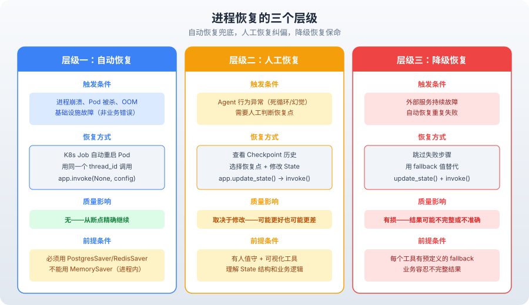
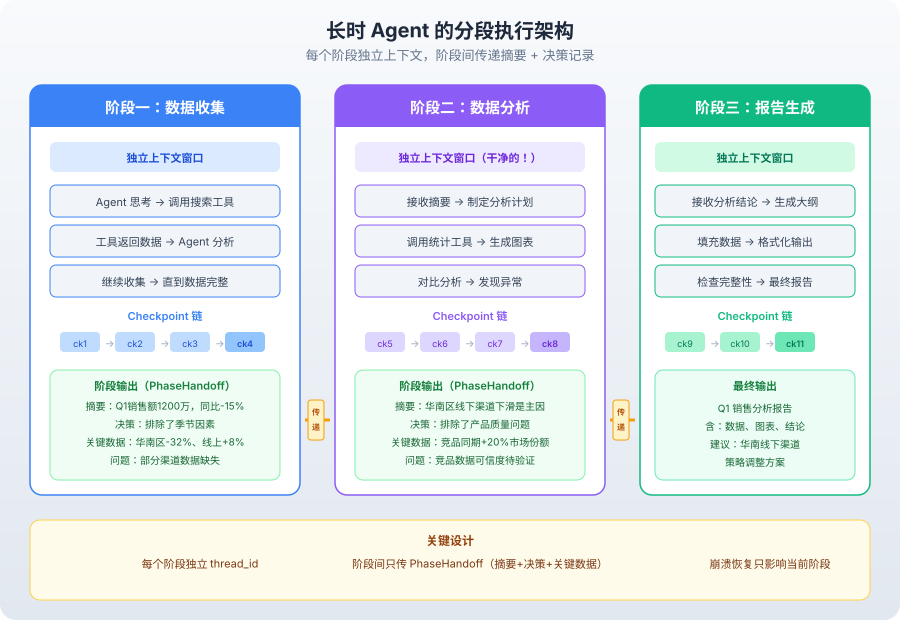

# 第 4 篇：Agent 要跑 2 小时

---

你的 Agent 跑了 40 分钟，在第 38 步崩溃了。

OOM？API 限流？K8s 把 Pod 踢了？原因不重要。重要的是——前 37 步的结果全丢了。

你只能从头开始。用户等了 40 分钟，等来一句"抱歉，请重试"。

这不是假设。这是生产环境中每天都在发生的事。

短时 Agent（5-10 步，30 秒跑完）崩溃了，重跑就好，用户感知不大。但长时 Agent（50-200 步，几十分钟甚至几小时）崩溃了，重跑的代价是时间和成本——一次 2 小时的任务可能消耗 50 万 token，成本几十块。

**长时 Agent 不是"跑得更久的短时 Agent"，是不同的架构物种。**

短时 Agent 的假设是：进程不会挂，上下文不会溢出，任务目标不会漂移。这些假设在秒级任务中基本成立。

长时 Agent 的现实是：进程随时可能挂，上下文一定会溢出，任务目标大概率漂移。你必须在架构层面解决这些问题。

这篇文章讲清楚长时 Agent 的五个架构决策：进程可能在任何一步挂掉怎么办、Checkpoint 怎么存才不亏、挂了怎么恢复、上下文漂移怎么防、长任务怎么拆。

---

### 一、短时 Agent vs 长时 Agent：本质区别在哪？

先看一个对比：

| | 短时 Agent | 长时 Agent |
|---|---|---|
| 典型步数 | 5-10 步 | 50-200 步 |
| 运行时间 | 10-60 秒 | 10 分钟 - 数小时 |
| 崩溃概率 | 低（跑完就结束） | 高（进程随时可能被杀） |
| 上下文压力 | 小（窗口够用） | 大（对话历史 + 工具输出膨胀） |
| 用户容忍度 | 失败重跑可以接受 | 失败重跑代价巨大 |
| 典型场景 | 问答、翻译、简单搜索 | 数据分析、代码重构、研究任务、多步骤审批 |

表面上看，区别是"步数多、时间长"。但架构上的本质区别只有一个：

**进程可能在任何一步挂掉。**

这句话听起来简单，但它推翻了短时 Agent 的所有假设：

- **进程挂了 → 状态丢失**：内存中的 State 全没了，对话历史没了，工具返回值没了
- **API 限流 → 中间结果作废**：第 30 步调了一个搜索 API，限流了。前 29 步的推理白费了
- **K8s 滚动更新 → Pod 被杀**：你的 Agent 跑在 K8s 里，集群更新时 Pod 被重建，进程直接没了
- **OOM → 整个进程崩溃**：长时 Agent 的上下文不断膨胀，内存占用持续增长，可能触发 OOM Killer

短时 Agent 可以假装这些不会发生。长时 Agent 不行。

**架构决策一：长时 Agent 必须假设"每一步都可能是最后一步"。**

---

### 二、Checkpoint：不是"保存"，是执行历史的链表

Checkpoint 是长时 Agent 的基础能力。但很多人对它的理解是错的。

Checkpoint 不是"存档点"——存一个快照，出问题了读回来。这种理解太粗糙了。

**Checkpoint 是一条不可变的单向链表。** 每执行一个 superstep（一个节点执行完毕），就追加一个新的 Checkpoint，指向前一个。

```
root → ckpt_1 → ckpt_2 → ckpt_3 → ... → ckpt_n（当前）
```

每个 Checkpoint 包含：

- `values`：当前 State 的完整快照
- `next`：下一步要执行的节点
- `config`：thread_id + checkpoint_id
- `metadata`：步数、写入记录等
- `parent_config`：指向前一个 Checkpoint

为什么是链表而不是单个快照？因为链表提供了三种单快照做不到的能力：

**能力一：Time Travel**——回到任意一步重放。调试时你可以回到第 15 步，看看当时的 State 是什么，为什么做了错误的决策。

**能力二：Fork**——从同一个 Checkpoint 分叉出多条路径。审批场景中，"同意"和"拒绝"就是两条分叉。

**能力三：精确恢复**——崩溃后从最后一个成功的 Checkpoint 继续，不需要从头跑。

```python
from langgraph.checkpoint.postgres import PostgresSaver

# 生产环境用 PostgresSaver，不是 MemorySaver
checkpointer = PostgresSaver.from_conn_string("postgresql://...")

# 编译图时绑定 checkpointer
app = workflow.compile(checkpointer=checkpointer)

# 每个 thread_id 对应一条独立的 Checkpoint 链
config = {"configurable": {"thread_id": "task-12345"}}

# 执行——每个 superstep 自动生成 Checkpoint
result = app.invoke({"messages": [user_message]}, config)

# 崩溃后恢复——用同一个 thread_id 调用即可
result = app.invoke(None, config)  # 从最后一个 Checkpoint 继续
```

注意最后一行：`app.invoke(None, config)`。传 `None` 意味着不提供新的输入，而是从 Checkpoint 恢复 State，从断点继续执行。

**这就是长时 Agent 恢复的核心机制。不是"暂停线程"，是"保存状态 → 进程退出 → 从状态恢复 → 继续执行"。**

进程可以在两次调用之间完全重启，甚至换一台机器——只要 Checkpoint 数据库还在，就能恢复。

---

### 三、Checkpoint 的频率权衡

理论上，每一步都存 Checkpoint 最安全。但实际不行。

**问题一：存储成本**

一个 State 有 1MB。100 个 superstep = 100MB 的 Checkpoint 存储。如果同时有 1000 个长时 Agent 在跑，就是 100GB。

**问题二：写入延迟**

每次 Checkpoint 都要序列化整个 State 并写入数据库。State 越大，写入越慢。如果 State 有 5MB，PostgresSaver 的写入可能要 100-200ms。对于需要高吞吐的 Agent，这个延迟不可忽略。

**问题三：Delta Channel 的取舍**

LangGraph 1.2+ 提供了 Delta Channel——只存增量，不存全量。存储大幅减少，但读取早期 Checkpoint 需要回放整条增量链，时间复杂度从 O(1) 变成 O(n)。

| 策略 | 存储成本 | 写入延迟 | 恢复粒度 | 适用场景 |
|---|---|---|---|---|
| 每步全量 | 高（O(n) × State 大小） | 中 | 精确到每一步 | 关键任务、需要 Time Travel |
| 每步增量（Delta） | 低 | 低 | 精确到每一步，但回放慢 | 长任务、存储敏感 |
| 关键步全量 | 中 | 低 | 粗（只到关键步） | 非关键任务、成本敏感 |

**架构决策二：Checkpoint 频率取决于任务的失败成本。**

- 失败成本高（每一步都很贵）→ 每步 Checkpoint + Delta Channel
- 失败成本低（重跑几步没关系）→ 关键步 Checkpoint
- 需要调试和审计 → 每步 Checkpoint（Time Travel 是刚需）

```python
# 关键步 Checkpoint 的实现思路
class SelectiveCheckpointGraph:
    """只在关键步保存 Checkpoint。"""
    
    def __init__(self, workflow, critical_steps: set):
        self.workflow = workflow
        self.critical_steps = critical_steps  # 需要精确恢复的节点集合
    
    def should_checkpoint(self, node_name: str, step: int) -> bool:
        # 关键步必存
        if node_name in self.critical_steps:
            return True
        # 每 10 步存一次（兜底）
        if step % 10 == 0:
            return True
        return False
```

注意：LangGraph 原生不支持选择性 Checkpoint——它每个 superstep 都存。上面的代码是思路，实际实现需要在自定义 Checkpointer 中过滤写入。

---

### 四、进程恢复的三个层级

进程挂了，恢复不是只有"重跑"一种选择。有三个层级：

#### 4.1 自动恢复：K8s Job + 心跳

最理想的场景——进程崩溃后，调度器自动重启，Agent 从最后一个 Checkpoint 继续。

```yaml
# K8s Job 配置：Agent 进程崩溃后自动重启
apiVersion: batch/v1
kind: Job
metadata:
  name: long-agent-task
spec:
  backoffLimit: 3          # 最多重启 3 次
  template:
    spec:
      restartPolicy: OnFailure
      containers:
      - name: agent
        image: my-agent:latest
        command: ["python", "-m", "agent.runner"]
        env:
        - name: THREAD_ID    # 传入 thread_id，用于恢复
          value: "task-12345"
```

```python
# agent/runner.py：启动时尝试从 Checkpoint 恢复
import os
from my_app import app

thread_id = os.environ.get("THREAD_ID")
config = {"configurable": {"thread_id": thread_id}}

# 如果有未完成的 Checkpoint，invoke(None) 会从断点继续
# 如果没有，需要提供初始输入
result = app.invoke(None, config)
```

自动恢复的关键：**进程是无状态的。** 所有状态都在 Checkpoint 数据库里。进程重启后，用同一个 `thread_id` 调用 `invoke(None)`，就能从断点继续。

**适用场景**：进程崩溃、Pod 被杀、OOM。只要 Checkpoint 数据库没挂，就能恢复。

#### 4.2 人工恢复：thread_id + 手动触发

自动恢复不是万能的。有些故障需要人工判断：

- Agent 进入了死循环，不断重复同样的步骤
- LLM 的输出质量严重下降（幻觉），自动恢复只会继续出错
- 外部服务故障（数据库挂了），自动恢复也会失败

这时候需要人工介入：查看 Checkpoint 链，判断从哪一步恢复，甚至修改 State 后再恢复。

```python
# 人工恢复：查看 Checkpoint 历史，选择恢复点
from langgraph.checkpoint.postgres import PostgresSaver

checkpointer = PostgresSaver.from_conn_string("postgresql://...")

# 列出所有 Checkpoint
thread_id = "task-12345"
config = {"configurable": {"thread_id": thread_id}}

# 获取 Checkpoint 历史
history = list(checkpointer.list(config))

for cp in history:
    print(f"Step {cp.metadata['step']}: next={cp.next}, "
          f"checkpoint_id={cp.config['configurable']['checkpoint_id']}")

# 选择一个 Checkpoint 恢复
target_config = {
    "configurable": {
        "thread_id": thread_id,
        "checkpoint_id": "ckpt_15"  # 从第 15 步恢复
    }
}

# 修改 State 后恢复（可选）
current_state = app.get_state(target_config)
# ... 检查或修改 State ...
app.update_state(target_config, {"messages": corrected_messages})

# 从修改后的 State 继续执行
result = app.invoke(None, target_config)
```

**适用场景**：Agent 行为异常、需要人工判断恢复点、需要修改 State 后再恢复。

#### 4.3 降级恢复：跳过失败步

有时候最好的恢复策略不是"从断点继续"，而是"跳过失败步骤，用替代方案"。

比如第 30 步调用了搜索 API，但搜索引擎挂了。自动恢复会重试，但搜索引擎还是挂的，又失败。人工恢复需要等人处理。

降级恢复的思路：**跳过搜索，用缓存数据或默认值代替。**

```python
# 降级恢复：检测到重复失败后，修改 State 跳过失败步骤
def degraded_recovery(app, config, failed_step: str, fallback_value: str):
    """降级恢复：用 fallback 值替代失败步骤的结果。"""
    state = app.get_state(config)
    
    # 在 State 中注入 fallback 值
    fallback_message = {
        "role": "tool",
        "content": fallback_value,
        "name": failed_step,
    }
    
    # 更新 State，跳过失败步骤
    app.update_state(config, {"messages": [fallback_message]})
    
    # 从更新后的 State 继续
    return app.invoke(None, config)

# 使用：搜索 API 连续失败 3 次，用默认结果代替
degraded_recovery(
    app, config,
    failed_step="search",
    fallback_value="[搜索服务暂不可用，基于已有信息继续推理]"
)
```

降级恢复的代价是**结果质量下降**——跳过了一些步骤，最终结果可能不完整或不准确。但比整个任务失败要好。



| 恢复层级 | 触发条件 | 恢复方式 | 质量影响 | 适用场景 |
|---|---|---|---|---|
| 自动恢复 | 进程崩溃、Pod 被杀 | K8s 重启 + Checkpoint | 无 | 基础设施故障 |
| 人工恢复 | Agent 行为异常、需要修改 State | 人工选 Checkpoint + 修改 | 取决于修改 | Agent 出错、需要纠偏 |
| 降级恢复 | 外部服务故障、重复失败 | 跳过失败步 + fallback | 有损 | 外部依赖不可用 |

**架构决策三：三种恢复层级不是互斥的，生产系统三层都要有。自动恢复兜底，人工恢复纠偏，降级恢复保命。**

---

### 五、上下文漂移：Agent 跑着跑着就忘了最初要干嘛

长时 Agent 有一个隐蔽但致命的问题：**上下文漂移（Context Drift）。**

用户说"帮我分析一下 Q1 的销售数据"。Agent 开始干活：搜索数据、清洗数据、生成图表。到了第 30 步，Agent 开始分析 Q2 的数据——因为搜索结果里混入了 Q2 的数据，Agent 被"带偏了"。

或者更常见的：用户说"帮我修这个 bug"。Agent 先搜索代码，发现了一个相关的代码风格问题，开始优化代码风格。修着修着，原来的 bug 还在，但 Agent 已经忘了最初的目的是修 bug，不是优化代码风格。

**为什么会漂移？** 因为 LLM 的注意力受上下文窗口中最突出的信息驱动。对话越长、工具输出越多，原始任务目标在上下文中的"信号强度"就越弱。

这不是模型能力问题——GPT-4o 也会漂移。这是上下文工程问题。

#### 5.1 目标锚定

最直接的防漂移策略：**在 State 中维护一个不可变的"任务目标"字段，每步注入。**

```python
from typing import TypedDict, Annotated
from langgraph.graph import add_messages

class AgentState(TypedDict):
    messages: Annotated[list, add_messages]
    original_goal: str       # 不可变：用户的原始目标
    current_plan: list[str]  # 可变：当前执行计划
    completed_steps: int     # 计数：已完成步骤数

def agent_node(state: AgentState) -> dict:
    """Agent 节点：在 System Prompt 中锚定原始目标。"""
    goal = state["original_goal"]
    completed = state.get("completed_steps", 0)
    
    system_prompt = f"""你是任务执行 Agent。

【核心目标】{goal}
【已完成步骤】{completed}

重要提醒：
- 你的所有决策都必须服务于核心目标
- 不要被工具返回的次要信息带偏
- 如果当前步骤与核心目标无关，立即停止并回到正题
"""
    
    # 调用 LLM...
    return {"messages": [response]}
```

目标锚定的关键是 `original_goal` 字段**不可变**——从第一步设定后就不能修改。这样无论对话多长，每一步都能读到原始目标。

#### 5.2 漂移检测

光靠锚定不够，你还需要**主动检测漂移**。

```python
def detect_drift(state: AgentState, current_action: str) -> bool:
    """检测当前动作是否偏离了原始目标。"""
    goal = state["original_goal"]
    
    # 简化版：用 LLM 判断当前动作是否与目标相关
    # 生产环境可以用更轻量的分类器
    prompt = f"""判断当前动作是否服务于原始目标。

原始目标：{goal}
当前动作：{current_action}

只回答"是"或"否"。"""
    
    response = llm.invoke(prompt).content.strip()
    return response == "否"

# 在 Agent 节点中使用
def agent_node_with_drift_detection(state: AgentState) -> dict:
    current_action = extract_action(state["messages"][-1])
    
    if detect_drift(state, current_action):
        # 检测到漂移，注入纠正提示
        correction = {
            "role": "system",
            "content": f"[漂移警告] 当前动作偏离了原始目标：{state['original_goal']}。"
                       f"请重新聚焦于核心任务。"
        }
        return {"messages": [correction]}
    
    # 正常执行...
```

漂移检测的代价是额外的 LLM 调用。但比起 Agent 跑偏 30 分钟后才发现，这个成本微不足道。

#### 5.3 分段执行

最根本的防漂移策略：**把长任务拆成多个短时子图，每个子图独立 Checkpoint。**

```python
from langgraph.graph import StateGraph

# 大任务拆成三个阶段
phase1 = StateGraph(AgentState)  # 数据收集
phase2 = StateGraph(AgentState)  # 数据分析
phase3 = StateGraph(AgentState)  # 报告生成

# 每个阶段独立编译、独立 Checkpoint
phase1_app = phase1.compile(checkpointer=checkpointer)
phase2_app = phase2.compile(checkpointer=checkpointer)
phase3_app = phase3.compile(checkpointer=checkpointer)

# 顺序执行，每个阶段完成后传递上下文
def run_long_task(task_config: dict):
    """分段执行长任务。每个阶段有独立的上下文窗口。"""
    
    # 阶段一：数据收集
    phase1_result = phase1_app.invoke(
        {"messages": ["收集 Q1 销售数据"], "original_goal": task_config["goal"]},
        {"configurable": {"thread_id": f"{task_config['task_id']}_phase1"}}
    )
    
    # 提取关键结果，压缩上下文
    phase1_summary = summarize(phase1_result["messages"])
    
    # 阶段二：数据分析（用阶段一的摘要，不用完整历史）
    phase2_result = phase2_app.invoke(
        {
            "messages": [f"基于以下数据进行分析：{phase1_summary}"],
            "original_goal": task_config["goal"],
        },
        {"configurable": {"thread_id": f"{task_config['task_id']}_phase2"}}
    )
    
    phase2_summary = summarize(phase2_result["messages"])
    
    # 阶段三：报告生成
    phase3_result = phase3_app.invoke(
        {
            "messages": [f"基于以下分析生成报告：{phase2_summary}"],
            "original_goal": task_config["goal"],
        },
        {"configurable": {"thread_id": f"{task_config['task_id']}_phase3"}}
    )
    
    return phase3_result
```

分段执行的核心思想：**每个阶段有独立的上下文窗口，不携带前一阶段的完整历史，只携带摘要。**

这样每个阶段的上下文都是干净的，不会被前 30 步的工具输出污染。漂移自然就少了。



分段执行的代价是**阶段间的信息损失**。摘要不可能保留所有细节。如果阶段二需要阶段一的具体数据点，摘要里可能没有。

**架构决策四：分段执行是防漂移的最有效手段，但要接受阶段间的信息损失。对于信息密度高的任务，目标锚定 + 漂移检测更合适。**

---

### 六、超时与成本控制

长时 Agent 还有一个现实问题：**它可能跑飞了。**

不是崩溃，不是漂移，是卡在一个循环里不停重试，或者 LLM 一直在生成无用的中间推理。Token 消耗持续增长，账单持续膨胀。

你需要在架构层面设置"刹车"。

#### 6.1 步数上限

最简单的刹车：**设置最大步数。** 超过上限，强制终止。

```python
class AgentState(TypedDict):
    messages: Annotated[list, add_messages]
    step_count: int
    max_steps: int = 50  # 默认上限

def should_continue(state: AgentState) -> str:
    """条件边：检查是否应该继续执行。"""
    if state["step_count"] >= state["max_steps"]:
        return "terminate"  # 超过步数上限，终止
    if state["messages"][-1].get("tool_calls"):
        return "tools"      # 还有工具要调用
    return "end"             # 正常结束
```

步数上限是硬性限制，不管 Agent 当前的状态如何，到了就停。

#### 6.2 Token 预算

更精细的刹车：**设置 Token 预算。** 超过预算，降级或终止。

```python
class TokenBudget:
    """Token 预算管理。"""
    
    def __init__(self, max_tokens: int = 500000):
        self.max_tokens = max_tokens
        self.used_tokens = 0
    
    def check(self, new_tokens: int) -> str:
        """检查是否超预算，返回策略。"""
        self.used_tokens += new_tokens
        
        if self.used_tokens >= self.max_tokens:
            return "terminate"         # 预算耗尽，终止
        elif self.used_tokens >= self.max_tokens * 0.8:
            return "economize"         # 接近预算，进入经济模式
        else:
            return "normal"            # 正常执行

# 在 Agent 节点中使用
def agent_node_with_budget(state: AgentState, budget: TokenBudget) -> dict:
    response = llm.invoke(state["messages"])
    
    strategy = budget.check(response.usage_metadata["total_tokens"])
    
    if strategy == "terminate":
        return {"messages": [{
            "role": "assistant",
            "content": "Token 预算已耗尽。以下是当前的分析结果摘要：..."
        }]}
    elif strategy == "economize":
        # 经济模式：减少工具调用，用缓存结果
        return {"messages": [response], "mode": "economize"}
    else:
        return {"messages": [response]}
```

Token 预算比步数上限更精确——因为有些步骤消耗 100 token，有些消耗 10000 token。步数上限无法区分，Token 预算可以。

#### 6.3 心跳检测

长时 Agent 应该有心跳机制——定期报告"我还活着，正在做什么"。

```python
import time

class Heartbeat:
    """心跳：定期报告 Agent 状态。"""
    
    def __init__(self, interval_seconds: int = 60):
        self.interval = interval_seconds
        self.last_beat = time.time()
    
    def check(self, state: AgentState) -> bool:
        """检查是否需要发送心跳。"""
        now = time.time()
        if now - self.last_beat >= self.interval:
            self.last_beat = now
            return True
        return False

# 使用：在条件边中检查心跳
def route_after_node(state: AgentState) -> str:
    heartbeat = Heartbeat(60)
    
    if heartbeat.check(state):
        # 发送心跳信号
        report_status(state)
    
    if state["step_count"] >= state["max_steps"]:
        return "terminate"
    
    return "continue"
```

心跳不仅用于监控，还用于触发超时判断。如果调度器 5 分钟没收到心跳，就认为 Agent 卡死了，可以强制重启。

---

### 七、长时 Agent 的架构模板

把上面的所有决策组合起来，一个生产级长时 Agent 的架构大概长这样：

```
┌──────────────────────────────────────────────┐
│                  调度层                        │
│  K8s Job + 心跳检测 + 自动重启               │
│  失败后用 thread_id 恢复                      │
├──────────────────────────────────────────────┤
│                  编排层                        │
│  StateGraph + Checkpoint + 目标锚定           │
│  步数上限 + Token 预算 + 漂移检测             │
├──────────────────────────────────────────────┤
│                  存储层                        │
│  PostgresSaver（Checkpoint）                  │
│  Delta Channel（增量存储）                    │
│  进度文件（跨阶段上下文传递）                  │
└──────────────────────────────────────────────┘
```

```python
# 生产级长时 Agent 的核心代码模板
from langgraph.graph import StateGraph, END
from langgraph.checkpoint.postgres import PostgresSaver

# 1. State 设计：包含目标锚定和预算控制
class LongTaskState(TypedDict):
    messages: Annotated[list, add_messages]
    original_goal: str          # 不可变目标
    step_count: int             # 步数计数
    max_steps: int              # 步数上限
    token_budget_remaining: int # Token 预算
    phase: str                  # 当前阶段

# 2. 构建 Graph
graph = StateGraph(LongTaskState)

graph.add_node("agent", agent_node)
graph.add_node("tools", tool_node)

graph.set_entry_point("agent")
graph.add_conditional_edges("agent", should_continue, {
    "tools": "tools",
    "terminate": END,
    "end": END,
})
graph.add_edge("tools", "agent")

# 3. 编译：绑定 PostgresSaver
checkpointer = PostgresSaver.from_conn_string("postgresql://...")
app = graph.compile(checkpointer=checkpointer)

# 4. 执行：传入 thread_id
config = {"configurable": {"thread_id": "task-12345"}}

initial_state = {
    "messages": [{"role": "user", "content": "分析 Q1 销售数据"}],
    "original_goal": "分析 Q1 销售数据，找出下滑原因",
    "step_count": 0,
    "max_steps": 50,
    "token_budget_remaining": 500000,
    "phase": "data_collection",
}

result = app.invoke(initial_state, config)

# 5. 崩溃后恢复（可能是自动的，也可能是手动的）
result = app.invoke(None, config)  # 从最后一个 Checkpoint 继续
```

---

### 八、常见陷阱

#### 陷阱一：用 MemorySaver 跑长时任务

MemorySaver 是内存存储，进程一挂数据全丢。长时 Agent 必须用 PostgresSaver 或 RedisSaver。

这不是建议，是硬性要求。

#### 陷阱二：State 里放了大对象

有人在 State 里存了整个 PDF 的文本（500KB），结果 50 个 superstep 的 Checkpoint 就占了 25MB 存储空间。

**对策**：大对象不要放 State，放外部存储（S3、数据库），State 里只存引用 ID。

```python
# 差：把整个 PDF 放 State
class BadState(TypedDict):
    messages: Annotated[list, add_messages]
    pdf_content: str  # 500KB！

# 好：只存引用
class GoodState(TypedDict):
    messages: Annotated[list, add_messages]
    pdf_reference: str  # "s3://bucket/doc-12345"
```

#### 陷阱三：不设步数上限

Agent 进入了死循环——重复调用同一个工具，每次都得到相同的结果，又重新调用。没有步数上限的话，它会一直跑到 Token 用完或 API 限流。

**对策**：从第一天就设置步数上限。50 步是一个合理的起点。

#### 陷阱四：Checkpoint 里放了不确定数据

有人在 State 里存了当前时间戳 `time.time()`。恢复后，时间戳是旧的，但 Agent 基于旧时间戳做决策，可能导致逻辑错误。

**对策**：不确定数据（时间戳、随机数）放 Checkpoint 的 `metadata`，不放 State。或者在恢复后重新生成。

#### 陷阱五：分段执行时丢失关键信息

把长任务拆成三个阶段，阶段间的摘要太粗略，丢掉了阶段二需要的关键数据点。

**对策**：阶段间不只传摘要，还要传"关键决策记录"——每个阶段做了什么决策、为什么做、产出了什么关键数据。

```python
# 阶段间传递的不仅是摘要，还有决策记录
class PhaseHandoff:
    """阶段交接：摘要 + 决策记录 + 关键数据。"""
    summary: str           # 阶段摘要
    decisions: list[str]   # 关键决策记录
    key_data: dict         # 后续阶段需要的关键数据点
    errors: list[str]      # 遇到的问题
```

---

### 核心决策清单

1. **长时 Agent 不是"跑得更久的短时 Agent"**——进程随时可能挂，上下文一定会溢出，目标大概率漂移。架构必须假设"每一步都可能是最后一步"

2. **Checkpoint 是不可变的链表**——不是单个快照。链表支持 Time Travel、Fork、精确恢复。生产环境必须用 PostgresSaver，不能用 MemorySaver

3. **Checkpoint 频率取决于失败成本**——失败成本高就每步存 + Delta Channel，失败成本低就关键步存。选型标准不是性能，是故障恢复粒度

4. **三层恢复机制都要有**——自动恢复（K8s + Checkpoint）兜底，人工恢复（选 Checkpoint + 修改 State）纠偏，降级恢复（跳过失败步 + fallback）保命

5. **防漂移三板斧**——目标锚定（不可变 goal 字段）、漂移检测（LLM 判断相关性）、分段执行（独立上下文窗口）。最有效的是分段，但要接受信息损失

6. **必须设刹车**——步数上限是硬性要求，Token 预算是精细控制。没有刹车的长时 Agent，不是在跑任务，是在烧钱

**长时 Agent 的架构核心：假设会崩、确保能恢复、防止跑偏、必须刹车。**

---

*(本文基于 LangGraph v1.2+ 官方文档、K8s Job 调度机制及生产实践经验撰写。Checkpoint 机制基于 LangGraph Checkpoint Protocol 规范。)*
