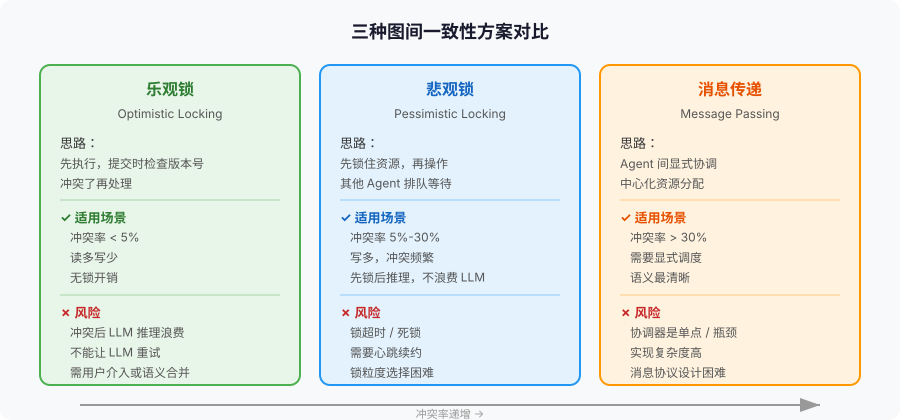
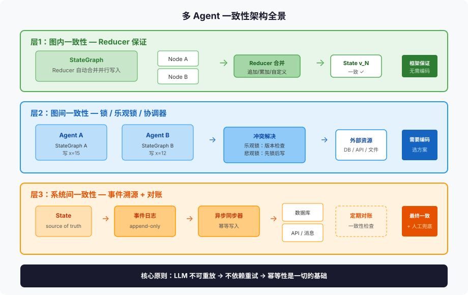

# 第 5 篇：两个 Agent 同时改一条数据，谁覆盖谁

---

上一篇我们聊了长时 Agent 的架构设计，核心是"进程随时可能挂"。这一篇，我们把视线从单个 Agent 拉到多个 Agent——问题从"挂了怎么办"变成了"同时改怎么办"。

两个 Agent 同时修改同一条数据，谁覆盖谁？

这不是分布式系统的老问题吗？乐观锁、悲观锁、CAS、CRDT——经典方案一大堆。但 Agent 系统的一致性问题，比传统分布式系统多了一层根本性的困难：**LLM 的输出不确定，你不能靠重放来解决冲突。**

传统系统里，两个事务冲突了，你可以 abort 一个、重放一遍，结果和原来一样。Agent 系统里，你 abort 一个节点的执行、让 LLM 重新推理一遍，得到的可能是完全不同的输出。你连"重试"都做不到确定性。

这是 Agent 一致性设计的核心挑战。这篇文章从图内一致性、图间一致性、锁策略、幂等性四个层面，把这个挑战拆解清楚。

---

### 一、一致性问题的三个层次

在聊具体方案之前，先搞清楚"多 Agent 一致性"到底包含哪些问题。很多人把不同层次的问题混在一起，导致方案选错。

**层次一：图内一致性——同一个 StateGraph 内，并行节点写同一个 key 怎么合并？**

这是最基础的层次。LangGraph 的 Reducer 机制已经解决了这个问题。上一篇我们详细讲过：两个并行节点同时写 `messages`，`add_messages` Reducer 自动追加合并；同时写 `retry_count`，`operator.add` 自动累加；没有 Reducer 的字段并发写入，直接抛 `InvalidUpdateError`。

如果你还没搞清楚 Reducer，建议先看第 1 篇的第三、四节。这里只补充一个视角：

**Reducer 本质上是一种一致性协议。** 它定义了"多个写入者同时修改同一份数据时，最终结果是什么"。`add_messages` 是追加协议，`operator.add` 是累加协议，`LastValue` 是覆盖协议，自定义 Reducer 是你定义的协议。

这个协议有两个性质值得关注：

**结合律（Associativity）**：Reducer 必须满足结合律——`reduce(reduce(a, b), c) == reduce(a, reduce(b, c))`。否则并行节点的合并顺序不同会导致不同结果。`add_messages`、`operator.add` 天然满足结合律。但如果你写了一个"按时间戳取最新"的自定义 Reducer，要注意时间戳的来源——如果来自节点内部生成（非确定性），结合律虽然成立，但结果不可重放。

**幂等性（Idempotency）**：同一个 Reducer 调用执行两次，结果必须相同。因为 Checkpoint 恢复时可能重新执行 Reducer。这个约束在第 1 篇讲过，不再展开。

**层次二：图间一致性——两个独立的 StateGraph 操作同一外部资源，怎么防冲突？**

这是真正困难的层次。两个 Agent 各自跑各自的 StateGraph，它们之间没有共享 State，没有共享 Reducer，但它们可能操作同一个外部资源——同一个数据库行、同一个文件、同一个 API 资源。

Agent A 把文档状态改成"已审核"，Agent B 把同一篇文档改成"草稿"。谁赢？

LangGraph 的 Reducer 机制管不了这个问题。因为 Reducer 只在图内生效，两个独立的图之间没有协调机制。

**层次三：系统间一致性——Agent 系统和外部系统之间的数据同步怎么保证？**

Agent 修改了内部 State，同时要写数据库、调 API、发消息。如果 Agent 写了 State 但数据库写入失败，怎么回滚？如果数据库写入成功但 Agent 在下一个 superstep 崩溃了，State 回滚到上一个 Checkpoint，但数据库的改动已经生效了，怎么办？

这是分布式事务问题在 Agent 系统中的体现。传统系统用 Saga、TCC、两阶段提交解决。Agent 系统的特殊性在于：Agent 的"事务"不是数据库事务，而是一个 superstep——它包含 LLM 调用、工具调用、State 更新，这些操作横跨多个系统，无法用数据库事务保证原子性。

这篇文章的重点是层次二和层次三。层次一已经被 Reducer 解决了，我们只需要知道它的边界在哪。

---

### 二、为什么 Agent 的一致性比传统分布式系统更难

先看传统分布式系统的一致性方案，再看 Agent 为什么不一样。

#### 2.1 传统方案：重放 + 确定性

传统分布式系统的核心武器是**重放**。两个事务冲突了？abort 一个，重新执行一遍。因为操作是确定性的——同样的输入产生同样的输出——重放的结果和原来一样。

```
传统系统冲突解决：
  事务A: 读取x=10 → 写入x=15
  事务B: 读取x=10 → 写入x=12
  冲突！abort B → 重放 B → 读取x=15 → 写入x=17 ✓（确定性，结果可预测）
```

乐观并发控制（OCC）就是这个思路：假设冲突很少，先让事务执行，提交时检查版本号，有冲突就重试。因为操作确定性，重试的结果可预期。

#### 2.2 Agent 系统的致命差异：LLM 输出不确定

Agent 的核心节点是 LLM 调用。LLM 的输出是不确定的——同样的 prompt，不同的 run 可能产生不同的回复。即使你设置 `temperature=0`，也不能保证完全确定（top-p 采样、batch 推理的差异、不同 API 版本的模型权重更新）。

这意味着：

**你不能靠重放解决冲突。**

```
Agent 系统冲突解决：
  AgentA: 读取文档状态="待审核" → LLM推理 → 写入状态="已通过"
  AgentB: 读取文档状态="待审核" → LLM推理 → 写入状态="需修改"
  冲突！abort B → 重放 B → LLM推理 → 写入状态="已通过" ???
  
  重放后 AgentB 可能做出完全不同的决策——这不是 bug，是 LLM 的本质特性
```

abort 了 Agent B，让它重新推理一遍，它可能得出和上次完全不同的结论。上次觉得"需修改"，这次可能觉得"已通过"。你没法预测重试的结果。

**你不能靠回滚恢复到一致状态。**

传统系统里，事务失败就回滚，数据回到之前的一致状态。Agent 系统里，一个 superstep 可能调了 3 个工具、改了 2 个外部系统。LLM 调用本身不可回滚（你已经消耗了 token 和时间），工具调用的副作用可能不可逆（你已经发了邮件、扣了款、部署了代码）。

**你不能靠确定性测试验证一致性。**

传统并发程序可以用固定 seed 的随机数来复现竞态条件。Agent 的并发测试没法这么做——LLM 的输出无法通过 seed 控制。你测了一次没问题，不代表下次没问题。

#### 2.3 用一个例子感受差异

假设你有一个"文档审核 Agent"和"文档修订 Agent"，它们同时处理同一篇文档：

```python
# 审核Agent
class ReviewAgent:
    def review(self, doc: Document) -> dict:
        llm_result = llm.invoke(f"审核这篇文档：{doc.content}")
        return {"status": llm_result.status, "comment": llm_result.comment}

# 修订Agent
class ReviseAgent:
    def revise(self, doc: Document) -> dict:
        llm_result = llm.invoke(f"修订这篇文档：{doc.content}")
        return {"content": llm_result.revised_content, "change_summary": llm_result.summary}
```

两个 Agent 同时读到了文档的原始版本。审核 Agent 把 status 改成了"已通过"，修订 Agent 把 content 改成了新版本。这两个修改在数据库层面是不同字段，看起来不冲突。

但语义上呢？审核通过的是旧版本，修改后的新版本没被审核。数据一致，语义不一致。

这种"语义冲突"在传统系统中也存在，但传统系统的事务模型更容易处理——你可以在事务里加约束、加触发器。Agent 系统里，"约束"和"触发器"是什么？谁来定义"审核的版本和当前版本必须一致"？这是业务层的一致性，框架层面没法自动解决。

**核心论点：Agent 的一致性比传统分布式系统更难，不是因为并发问题更复杂，而是因为核心操作（LLM 调用）不可重放、不可回滚、不可确定。你必须设计出"不依赖重试"的一致性方案。**

---

### 三、图内一致性：Reducer 的边界和局限

第 1 篇已经详细讲过 Reducer，这里只补充几个在"多 Agent 一致性"视角下的新认识。

#### 3.1 Reducer 是图内的"最终一致性"协议

很多人以为 Reducer 提供的是"强一致性"。实际上，Reducer 提供的是图内的最终一致性——所有并行节点的写入最终会被合并成一个确定的结果。

为什么不是强一致性？因为在同一个 superstep 内，节点 A 看不到节点 B 的写入。节点 A 和 B 都基于同一份 State 快照执行，它们各自独立写入，最后由 Reducer 合并。这和分布式系统中的"读已提交"隔离级别类似——你不会看到其他事务的中间状态，但你提交时可能遇到冲突。

区别在于：传统数据库遇到冲突会 abort 一个事务，Reducer 遇到冲突会合并。合并的结果由 Reducer 的语义决定——`add_messages` 是两者都保留，`operator.add` 是两者都累加，`LastValue` 是抛异常让你自己决定。

#### 3.2 Reducer 管不了跨 superstep 的竞态

Reducer 解决的是同一个 superstep 内的并行写入。但跨 superstep 的竞态条件，Reducer 管不了。

```python
# Superstep 1: 节点A读取 counter=0
# Superstep 2: 节点A写入 counter=1
# 但在 Superstep 1 和 2 之间，另一个外部进程把 counter 改成了 5
# 节点A的写入把 counter 覆盖回 1——外部进程的修改丢了
```

这不是 Reducer 的问题，是"读取-修改-写入"的原子性问题。传统系统用 CAS（Compare-And-Swap）或乐观锁解决。Agent 系统里怎么解决？后面讲。

#### 3.3 Reducer 管不了图间冲突

两个独立的 StateGraph 之间没有共享 Reducer。Agent A 的 StateGraph 有自己的 Reducer，Agent B 的 StateGraph 也有自己的。它们写同一个外部资源时，各管各的，没有协调。

```
Agent A (StateGraph A)          外部资源          Agent B (StateGraph B)
    │                              │                     │
    ├── 读取 x=10                  │                  ───┤ 读取 x=10
    │                              │                     │
    ├── LLM 推理...               │                     ├── LLM 推理...
    │                              │                     │
    ├── 写入 x=15 ────────────────►│                     │
    │                              │◄──────────────── 写入 x=12
    │                              │
    │                     x=? (15 被覆盖成 12？12 被覆盖成 15？)
```

这种"两个 Agent 之间的写写冲突"，是 Agent 一致性设计中最常见也最头疼的问题。

---

### 四、图间一致性：两个 Agent 操作同一资源怎么办

这是本文的重点。两个独立的 Agent 操作同一个外部资源，怎么保证一致性？

先定义问题：假设 Agent A 和 Agent B 都需要修改数据库中的同一行记录，它们各自有独立的 StateGraph、独立的 Checkpoint、独立的执行流程。它们之间唯一的共享点是"操作同一个数据库行"。

#### 4.1 方案一：乐观锁——假设不冲突，冲突了再处理

乐观锁的思路是：先让两个 Agent 都执行，提交时检查版本号，有冲突就让后提交的 Agent 重新执行。

```python
import sqlalchemy as sa

class Document(Base):
    __tablename__ = "documents"
    id = sa.Column(sa.Integer, primary_key=True)
    content = sa.Column(sa.Text)
    status = sa.Column(sa.String(50))
    version = sa.Column(sa.Integer, default=1)  # 乐观锁版本号

def agent_update_with_optimistic_lock(doc_id: int, updates: dict, expected_version: int):
    """Agent 用乐观锁更新文档"""
    with Session() as session:
        doc = session.query(Document).get(doc_id)
        
        # 检查版本号
        if doc.version != expected_version:
            raise ConflictError(
                f"版本冲突：期望 {expected_version}，实际 {doc.version}。"
                f"其他 Agent 已修改此文档。"
            )
        
        # 应用更新
        for key, value in updates.items():
            setattr(doc, key, value)
        doc.version += 1
        
        session.commit()
```

Agent 在开始处理时读取文档和版本号，处理完后提交时检查版本号是否变化。如果没变，说明没有冲突，正常提交。如果变了，说明其他 Agent 改过了。

**问题来了：冲突了怎么办？**

传统系统里，乐观锁冲突后让事务重试——重新读取最新数据，重新执行操作。但 Agent 的"操作"包含 LLM 调用，重试意味着让 LLM 重新推理一遍。LLM 的输出不确定，重试的结果可能和上次完全不同。

两种处理策略：

**策略一：简单粗暴——通知用户**

冲突了，不要自动重试，而是把冲突信息展示给用户，让用户决定怎么处理。

```python
def agent_update_with_human_resolution(doc_id: int, agent_id: str):
    """冲突时交给用户处理"""
    try:
        doc = read_document(doc_id)
        updates = llm_process(doc)  # LLM 推理
        
        agent_update_with_optimistic_lock(doc_id, updates, doc.version)
        
    except ConflictError as e:
        # 不自动重试，通知用户
        return {
            "status": "conflict",
            "message": f"Agent {agent_id} 检测到冲突：{e}",
            "current_version": e.current_version,
            "agent_proposed_updates": updates,
            "resolution_options": [
                "覆盖（忽略其他 Agent 的修改）",
                "放弃（保留其他 Agent 的修改）",
                "合并（手动编辑合并）",
            ]
        }
```

这是最安全的做法。缺点是用户体验差——如果冲突频繁，用户会被不停打断。适用于冲突率低的场景。

**策略二：语义合并——理解冲突的语义，自动合并**

如果两个 Agent 修改的是不同字段，可以自动合并。审核 Agent 改了 `status`，修订 Agent 改了 `content`，字段不冲突，可以同时保留。

```python
def semantic_merge(agent_a_updates: dict, agent_b_updates: dict) -> dict:
    """语义合并：不同字段的修改自动合并"""
    # 检查字段是否冲突
    common_keys = set(agent_a_updates.keys()) & set(agent_b_updates.keys())
    
    if not common_keys:
        # 无冲突，直接合并
        return {**agent_a_updates, **agent_b_updates}
    
    # 有冲突字段，需要更精细的合并策略
    merged = {}
    for key in set(agent_a_updates.keys()) | set(agent_b_updates.keys()):
        if key in agent_a_updates and key in agent_b_updates:
            # 同一字段被两个 Agent 修改——需要 Reducer 级别的合并逻辑
            merged[key] = resolve_field_conflict(key, agent_a_updates[key], agent_b_updates[key])
        elif key in agent_a_updates:
            merged[key] = agent_a_updates[key]
        else:
            merged[key] = agent_b_updates[key]
    
    return merged

def resolve_field_conflict(key: str, value_a, value_b):
    """字段级冲突解决策略"""
    # 策略1：列表字段 → 追加合并
    if isinstance(value_a, list) and isinstance(value_b, list):
        return value_a + value_b
    
    # 策略2：数值字段 → 取最大值（或最小值，取决于语义）
    if isinstance(value_a, (int, float)) and isinstance(value_b, (int, float)):
        return max(value_a, value_b)
    
    # 策略3：无法自动合并 → 标记为冲突
    return ConflictMarker(value_a, value_b, reason=f"字段 {key} 的两个值无法自动合并")
```

语义合并的关键是：**你需要为每个字段定义合并策略，就像在 State 里定义 Reducer 一样。** 实际上，你可以把图内的 Reducer 思维延伸到图间——给外部资源的每个字段也定义"图间 Reducer"。

#### 4.2 方案二：悲观锁——先锁住，再操作

悲观锁的思路是：Agent 开始操作资源时先加锁，操作完了再释放。其他 Agent 看到锁，就等着。

```python
import redis
import uuid

class AgentResourceLock:
    """基于 Redis 的 Agent 资源锁"""
    
    def __init__(self, redis_url: str = "redis://localhost:6379"):
        self.redis = redis.from_url(redis_url)
    
    def acquire(self, resource_id: str, agent_id: str, ttl: int = 300) -> bool:
        """获取资源锁。ttl 是锁的超时时间（秒），防止 Agent 崩溃后锁永远不释放"""
        lock_key = f"agent_lock:{resource_id}"
        return self.redis.set(lock_key, agent_id, nx=True, ex=ttl)
    
    def release(self, resource_id: str, agent_id: str):
        """释放资源锁。只有锁的持有者才能释放"""
        lock_key = f"agent_lock:{resource_id}"
        current_holder = self.redis.get(lock_key)
        if current_holder and current_holder.decode() == agent_id:
            self.redis.delete(lock_key)
    
    def is_locked(self, resource_id: str) -> bool:
        return self.redis.exists(f"agent_lock:{resource_id}")
```

使用方式：

```python
lock = AgentResourceLock()

def agent_process_with_lock(agent_id: str, doc_id: int):
    """带锁的 Agent 处理流程"""
    
    # 1. 尝试获取锁
    if not lock.acquire(str(doc_id), agent_id, ttl=300):
        return {"status": "locked", "message": "资源被其他 Agent 占用"}
    
    try:
        # 2. 安全地读取和处理
        doc = read_document(doc_id)
        updates = llm_process(doc)
        update_document(doc_id, updates)
        
    finally:
        # 3. 释放锁
        lock.release(str(doc_id), agent_id)
```

**悲观锁在 Agent 系统中的三个问题：**

**问题一：锁粒度。** 锁整个文档太粗——两个 Agent 改不同字段，本来不需要互斥。锁单个字段太细——管理成本高，容易死锁。怎么选粒度？

一般原则：**锁粒度 = 冲突粒度。** 如果你的 Agent 只改文档的特定字段（审核 Agent 只改 status，修订 Agent 只改 content），那就按字段加锁。如果 Agent 会改多个字段，就按文档加锁。

**问题二：锁超时。** Agent 操作的时间不确定——LLM 调用可能 2 秒返回，也可能 20 秒返回。锁的超时时间怎么设？设短了，Agent 还没处理完锁就过期了，其他 Agent 闯进来；设长了，Agent 崩溃了锁迟迟不释放，其他 Agent 一直等着。

实用的做法是**心跳续约**：Agent 每隔一段时间（比如 30 秒）给锁续约。如果 Agent 崩溃了，心跳停止，锁自然过期。

```python
import threading

class HeartbeatLock:
    """带心跳续约的资源锁"""
    
    def __init__(self, redis_url: str = "redis://localhost:6379"):
        self.redis = redis.from_url(redis_url)
        self._stop_events: dict[str, threading.Event] = {}
    
    def acquire(self, resource_id: str, agent_id: str, 
                ttl: int = 60, heartbeat_interval: int = 20) -> bool:
        """获取锁并启动心跳"""
        lock_key = f"agent_lock:{resource_id}"
        if not self.redis.set(lock_key, agent_id, nx=True, ex=ttl):
            return False
        
        # 启动心跳线程
        stop = threading.Event()
        self._stop_events[resource_id] = stop
        
        def heartbeat():
            while not stop.wait(heartbeat_interval):
                current = self.redis.get(lock_key)
                if current and current.decode() == agent_id:
                    self.redis.expire(lock_key, ttl)
                else:
                    break  # 锁已丢失，停止心跳
        
        thread = threading.Thread(target=heartbeat, daemon=True)
        thread.start()
        return True
    
    def release(self, resource_id: str, agent_id: str):
        """释放锁并停止心跳"""
        if resource_id in self._stop_events:
            self._stop_events[resource_id].set()
            del self._stop_events[resource_id]
        
        lock_key = f"agent_lock:{resource_id}"
        current = self.redis.get(lock_key)
        if current and current.decode() == agent_id:
            self.redis.delete(lock_key)
```

**问题三：死锁。** Agent A 锁了资源 X 等 Y，Agent B 锁了资源 Y 等 X。传统系统用超时或等待图检测解决。Agent 系统也一样，但更难检测——Agent 的"等待"可能不是显式的锁等待，而是隐式的（比如等 LLM 返回结果后再请求另一个资源）。

实用的做法：**给锁加获取顺序约束。** 所有 Agent 必须按固定顺序获取锁。比如按资源 ID 排序——Agent A 和 B 都必须先锁 ID 小的资源，再锁 ID 大的资源。这保证了不会出现循环等待。

#### 4.3 方案三：消息传递——让 Agent 之间显式协调

乐观锁和悲观锁都是"隐式协调"——Agent 不需要知道其他 Agent 的存在，靠锁或版本号来避免冲突。

还有一种思路是"显式协调"——Agent 之间通过消息传递来协商。你要改这个资源？先告诉其他 Agent，让它们让路。

```python
from typing import Annotated
from langgraph.graph.message import add_messages
from langgraph.graph import StateGraph

class CoordinatorState(TypedDict):
    """协调器 State：管理资源分配"""
    resource_requests: Annotated[list[dict], add_messages]   # 资源请求队列
    resource_allocations: dict[str, str]  # resource_id → agent_id 的分配表

def request_resource(state: CoordinatorState, agent_id: str, resource_id: str) -> dict:
    """Agent 向协调器请求资源"""
    # 检查资源是否已被分配
    if resource_id in state["resource_allocations"]:
        holder = state["resource_allocations"][resource_id]
        if holder != agent_id:
            return {
                "resource_requests": [{
                    "agent_id": agent_id,
                    "resource_id": resource_id,
                    "status": "waiting",
                    "held_by": holder
                }]
            }
    
    # 资源可用，分配给 Agent
    new_allocations = dict(state["resource_allocations"])
    new_allocations[resource_id] = agent_id
    return {
        "resource_allocations": new_allocations,
        "resource_requests": [{
            "agent_id": agent_id,
            "resource_id": resource_id,
            "status": "granted"
        }]
    }

def release_resource(state: CoordinatorState, agent_id: str, resource_id: str) -> dict:
    """Agent 释放资源"""
    if state["resource_allocations"].get(resource_id) == agent_id:
        new_allocations = dict(state["resource_allocations"])
        del new_allocations[resource_id]
        return {"resource_allocations": new_allocations}
    return {}
```

消息传递的优点是语义清晰——每个 Agent 都知道"谁在用这个资源"。缺点是需要一个中心化的协调器，协调器本身成为单点和瓶颈。



#### 4.4 三种方案怎么选

| | 乐观锁 | 悲观锁 | 消息传递 |
|---|---|---|---|
| 冲突频率低时 | 最优（无锁开销） | 可用（锁开销浪费） | 可用（但消息开销浪费） |
| 冲突频率高时 | 最差（频繁冲突→频繁重试/通知） | 较优（直接排队） | 最优（显式协调避免冲突） |
| LLM 调用代价 | 高（冲突后 LLM 推理浪费） | 低（先锁住再推理） | 低（确认获得资源再推理） |
| 实现复杂度 | 低（版本号检查） | 中（锁管理+超时+心跳） | 高（协调器+消息协议） |
| 可扩展性 | 好（无中心节点） | 好（Redis 分布式锁） | 差（协调器是瓶颈） |

**选型原则：**

- **冲突率 < 5%** → 乐观锁 + 用户通知。大部分时候不冲突，偶尔冲突让用户处理
- **冲突率 5%-30%** → 悲观锁。冲突频率足够高，值得用锁来避免
- **冲突率 > 30%** → 消息传递 + 协调器。冲突太频繁，需要显式调度
- **LLM 调用成本特别高** → 倾向悲观锁或消息传递。避免"LLM 推理完了才发现冲突，推理白费"

一个常见的误区是"我的场景冲突率很低，用乐观锁就好"。但冲突率不是静态的——业务高峰期、数据热点区域、Agent 数量增长都可能让冲突率飙升。设计时按"冲突率可能达到多少"来选，而不是"当前冲突率是多少"。

---

### 五、Agent 操作的幂等性设计

无论你用哪种一致性方案，都有一个基础要求：**Agent 的操作必须是幂等的。**

幂等性是指：同一个操作执行一次和执行多次，效果相同。这在 Agent 系统中极其重要，因为 Agent 的操作可能被重复执行——网络超时后重试、Checkpoint 恢复后重放、人工审核后重新执行。

#### 5.1 为什么幂等性是 Agent 系统的刚需

传统系统的幂等性是"锦上添花"——不幂等也能跑，只是重试时可能重复执行。Agent 系统的幂等性是"刚需"——没有幂等性，你的 Agent 根本无法安全地重试任何操作。

原因有三：

**原因一：Agent 的重试是常态。** LLM 调用可能超时、工具调用可能限流、Checkpoint 恢复后重新执行。如果每次重试都会产生副作用（多发一封邮件、多扣一次款、多部署一次代码），系统根本没法用。

**原因二：Agent 的超时不可预测。** LLM 调用的延迟从 1 秒到 30 秒都有可能。你的超时阈值设多少？设 10 秒，有些合法的长推理被误杀；设 30 秒，真的卡住了用户等半天。实际的做法是"超时后重试"——但重试的前提是幂等。

**原因三：Agent 的 Checkpoint 恢复可能重放已完成的操作。** Checkpoint 保存的是 superstep 的输入和输出。恢复时，框架从上一个成功的 Checkpoint 开始重新执行。如果上一个 superstep 的工具调用已经生效了（比如已经向数据库写入了一条记录），恢复后再执行一次，就会重复写入。

#### 5.2 四种幂等性实现模式

**模式一：唯一请求 ID**

给每个操作分配一个唯一 ID，外部系统根据 ID 去重。

```python
import uuid

class IdempotentToolCall:
    """幂等的工具调用包装器"""
    
    def __init__(self, tool_client):
        self.client = tool_client
        self.executed_ids: set[str] = set()  # 已执行的操作ID（内存去重）
    
    def call(self, tool_name: str, params: dict) -> dict:
        """幂等地调用工具"""
        # 生成操作ID（基于工具名+参数的确定性hash）
        operation_id = self._make_operation_id(tool_name, params)
        
        # 去重检查
        if operation_id in self.executed_ids:
            return {"status": "already_executed", "operation_id": operation_id}
        
        # 执行
        result = self.client.call(tool_name, params)
        self.executed_ids.add(operation_id)
        return result
    
    def _make_operation_id(self, tool_name: str, params: dict) -> str:
        """基于工具名和参数生成确定性ID"""
        import hashlib, json
        content = json.dumps({"tool": tool_name, "params": params}, sort_keys=True)
        return hashlib.sha256(content.encode()).hexdigest()[:16]
```

唯一请求 ID 的关键是：**ID 必须基于操作的确定性内容生成**，而不是用随机 UUID。因为 Checkpoint 恢复后重新执行时，你需要用同一个 ID 查重——随机 UUID 每次不同，起不到去重作用。

这正是第 1 篇讲的反模式——不要在 State 里放随机数和 UUID。如果你用 `uuid.uuid4()` 生成请求 ID，恢复后重放时 ID 变了，去重失效。

**模式二：条件写入（CAS）**

写入时检查当前值是否符合预期，符合才写入。

```python
def idempotent_update(doc_id: int, updates: dict, expected_version: int) -> dict:
    """CAS 式的条件写入"""
    with Session() as session:
        doc = session.query(Document).get(doc_id)
        
        if doc.version != expected_version:
            # 版本已变，说明操作可能已经执行过了，或其他 Agent 已修改
            return {"status": "version_mismatch", "current_version": doc.version}
        
        # 版本匹配，执行更新
        for key, value in updates.items():
            setattr(doc, key, value)
        doc.version += 1
        session.commit()
        
        return {"status": "updated", "new_version": doc.version}
```

CAS 和乐观锁的区别是语义上的：乐观锁的版本检查是为了检测冲突，CAS 的版本检查是为了保证幂等——"我只想在版本是 N 的时候写入，如果不是 N，说明这个操作已经不需要了"。

**模式三：补偿操作（Saga 模式）**

如果操作不可逆，就设计一个"反向操作"来撤销。

```python
class SagaStep:
    """Saga 模式的单步操作"""
    def __init__(self, action, compensation):
        self.action = action        # 正向操作
        self.compensation = compensation  # 补偿操作

class AgentSaga:
    """Agent 的 Saga 执行器"""
    
    def __init__(self):
        self.completed_steps: list[SagaStep] = []
    
    def execute(self, steps: list[SagaStep]):
        """顺序执行 Saga 步骤，任何一步失败则补偿"""
        try:
            for step in steps:
                step.action()
                self.completed_steps.append(step)
        except Exception as e:
            # 反向补偿已完成的步骤
            for step in reversed(self.completed_steps):
                try:
                    step.compensation()
                except Exception as comp_err:
                    # 补偿失败是灾难性的——需要人工介入
                    alert_human(f"补偿失败：{comp_err}，原始错误：{e}")
            raise

# 使用示例
def process_order_agent(order_id: str):
    """订单处理 Agent 的 Saga"""
    saga = AgentSaga()
    
    saga.execute([
        SagaStep(
            action=lambda: deduct_inventory(order_id),      # 扣库存
            compensation=lambda: restore_inventory(order_id) # 恢复库存
        ),
        SagaStep(
            action=lambda: charge_payment(order_id),         # 扣款
            compensation=lambda: refund_payment(order_id)    # 退款
        ),
        SagaStep(
            action=lambda: create_shipping(order_id),        # 创建物流
            compensation=lambda: cancel_shipping(order_id)   # 取消物流
        ),
    ])
```

Saga 模式在 Agent 系统中的挑战是：**补偿操作本身也可能是 LLM 调用**。"撤销审核"不是简单的数据库回滚，而是让 LLM 重新评估。这意味着补偿操作也是不确定的——补偿的结果可能和预期不一致。

所以 Saga 在 Agent 系统中更适合"补偿操作是确定性的"场景——数据库回滚、API 撤销、文件删除。如果补偿操作本身需要 LLM 参与，Saga 就不太适用。

**模式四：外部状态检查**

执行操作前，先查询外部系统确认操作是否已经执行过。

```python
def idempotent_send_email(recipient: str, subject: str, body: str, operation_id: str):
    """幂等的邮件发送"""
    # 先查数据库，看这个操作是否已经执行过
    with Session() as session:
        existing = session.query(EmailLog).filter_by(operation_id=operation_id).first()
        if existing:
            return {"status": "already_sent", "email_id": existing.email_id}
    
    # 没执行过，发送邮件
    email_id = email_client.send(recipient, subject, body)
    
    # 记录操作日志
    with Session() as session:
        session.add(EmailLog(operation_id=operation_id, email_id=email_id))
        session.commit()
    
    return {"status": "sent", "email_id": email_id}
```

这个模式的关键是：**操作日志必须在业务操作之前查询，在业务操作之后写入。** 查询和写入之间有竞态窗口，但在实践中够用——两个 Agent 在同一毫秒内用同一个 operation_id 发邮件的概率极低。如果你需要更严格的保证，可以用数据库的唯一约束。

#### 5.3 幂等性检查清单

设计 Agent 操作时，用这个清单逐项检查：

| 检查项 | 问题 | 不幂等的后果 |
|---|---|---|
| 写入数据库 | 有唯一约束吗？ | 重复写入产生重复记录 |
| 调用 API | API 支持幂等吗？ | 重复调用产生重复操作（重复发邮件、重复扣款） |
| 修改文件 | 写前检查文件状态了吗？ | 覆盖其他 Agent 的修改 |
| 发送消息 | 消息有去重 ID 吗？ | 重复发送相同消息 |
| State 更新 | Reducer 是幂等的吗？ | Checkpoint 恢复后 State 不一致 |
| 外部资源 | 操作可撤销吗？ | 不可逆操作重复执行无法恢复 |

---

### 六、LLM 不确定性对一致性的影响及应对

前面讲了"LLM 输出不确定，不能靠重放解决冲突"。但 LLM 的不确定性不只是影响重放——它影响一致性的方方面面。这一节系统梳理。

#### 6.1 不确定性的三种表现

**表现一：输出内容不确定。** 同样的 prompt，不同的 run 产生不同的回复。这是最直观的不确定性。

**表现二：工具选择不确定。** LLM 可能这次选择搜索工具，下次选择计算工具。这意味着同一个 Agent 面对同一个输入，可能走完全不同的执行路径。

**表现三：输出格式不确定。** LLM 可能这次返回结构化 JSON，下次返回一段散文。即使你用 function calling 约束输出格式，也不能 100% 保证——LLM 可能返回参数类型不匹配的 JSON。

这三种不确定性加在一起，意味着：**Agent 的执行路径是不可预测的。** 你无法在执行前知道 Agent 会调用哪些工具、修改哪些资源、走哪条分支。

#### 6.2 应对策略

**策略一：缩小不确定性的范围**

你无法消除 LLM 的不确定性，但可以缩小它的影响范围。

```python
from pydantic import BaseModel
from typing import Literal

class AgentDecision(BaseModel):
    """约束 LLM 输出的决策结构"""
    action: Literal["approve", "reject", "escalate"]  # 只允许三种动作
    reason: str                                        # 理由是自由文本
    confidence: float                                  # 置信度 0-1

def make_decision(doc: Document) -> AgentDecision:
    """让 LLM 做出决策，输出被约束在有限集合内"""
    prompt = f"审核以下文档，只能选择 approve/reject/escalate：\n{doc.content}"
    
    # 使用 structured output 约束 LLM 输出
    result = llm.with_structured_output(AgentDecision).invoke(prompt)
    return result
```

`action` 字段只有三种取值，LLM 再不确定，也只可能输出这三种之一。你的后续逻辑只需要处理这三种情况。`reason` 字段是自由文本，不确定——但你的后续逻辑不依赖 `reason` 的具体内容，只用来展示。

**原则：让不确定的部分不参与一致性决策，让参与一致性决策的部分确定。**

**策略二：分离"决策"和"执行"**

LLM 负责决策，确定性的代码负责执行。决策是不确定的，但执行是确定的。

```python
def agent_process_with_separation(doc_id: int):
    """分离决策和执行的 Agent 流程"""
    
    # 阶段1：LLM 决策（不确定）
    doc = read_document(doc_id)
    decision = make_decision(doc)  # LLM 输出，不确定
    
    # 阶段2：确定性执行
    # decision.action 只有三种取值，每种对应的执行逻辑是确定的
    if decision.action == "approve":
        idempotent_update(doc_id, {"status": "approved"}, expected_version=doc.version)
    elif decision.action == "reject":
        idempotent_update(doc_id, {"status": "rejected"}, expected_version=doc.version)
    elif decision.action == "escalate":
        notify_human(doc_id, decision.reason)
```

这种分离使得执行阶段是确定性的——同样的 `decision.action`，执行结果相同。即使 LLM 两次做出不同决策，每次决策对应的执行都是确定的、幂等的。

**策略三：用确定性种子控制可复现的测试**

生产环境无法控制 LLM 的输出，但测试环境可以 mock。

```python
from unittest.mock import patch

def test_agent_concurrency():
    """测试 Agent 并发写入的一致性"""
    
    # Mock LLM 输出，确保测试确定性
    with patch("llm.invoke") as mock_llm:
        mock_llm.return_value = AgentDecision(action="approve", reason="符合规范", confidence=0.95)
        
        # 模拟两个 Agent 并发操作
        agent_a_result = agent_process_with_separation(doc_id=1)
        agent_b_result = agent_process_with_separation(doc_id=1)
        
        # 至少有一个应该检测到冲突
        assert "conflict" in [agent_a_result["status"], agent_b_result["status"]]
```

测试时 mock LLM 输出，确保测试可复现。生产环境用真实 LLM，接受不确定性。

#### 6.3 一个容易被忽略的陷阱：LLM 的"幻觉式一致"

有时候 LLM 两次调用返回的输出"看起来一致但实际不一致"——同样选择了 `approve`，但理由不同、置信度不同、对文档细节的关注点不同。如果你基于"LLM 两次输出相同"来假设一致性，就会掉进这个陷阱。

```python
# 危险！不要依赖 LLM 输出的一致性
def dangerous_retry(agent_id: str, doc_id: int):
    """危险的重试逻辑：假设 LLM 重试后输出一致"""
    doc = read_document(doc_id)
    
    decision = make_decision(doc)  # 第一次 LLM 调用
    if decision.confidence < 0.8:
        decision = make_decision(doc)  # 第二次 LLM 调用——"重新考虑"
        # 两次结果可能完全不同！不能假设"重新考虑"后的结果更可靠
```

LLM 不是"重新考虑"——它是"重新生成"。两次调用之间没有因果关系。第二次的输出不比第一次"更正确"，也不比第一次"更一致"。

---

### 七、CRDT 在 Agent 系统中的应用前景

CRDT（Conflict-free Replicated Data Types，无冲突复制数据类型）是分布式系统中解决一致性问题的理论框架。它的核心思想是：**设计数据结构使得任何合并顺序都产生相同结果，从而无需协调。**

听起来和 Reducer 的思路很像？没错。Reducer 其实就是一种 CRDT 的应用——`add_messages` 是 OR-Set（Observed-Remove Set），`operator.add` 是 G-Counter（Grow-only Counter）。

#### 7.1 CRDT 的两个数学性质

**交换律（Commutativity）**：`merge(a, b) == merge(b, a)`。合并的顺序不影响结果。

**结合律（Associativity）**：`merge(merge(a, b), c) == merge(a, merge(b, c))`。合并的分组不影响结果。

满足这两个性质的数据结构，可以以任意顺序合并，最终结果一致。这正是 Agent 系统需要的——多个 Agent 的写入以任意顺序到达，最终结果一致。

#### 7.2 常见 CRDT 在 Agent 中的对应

| CRDT 类型 | Agent 对应 | 示例 |
|---|---|---|
| G-Counter | `operator.add` 累加器 | retry_count, call_count |
| PN-Counter | 可增减的计数器 | 信用额度、剩余配额 |
| G-Set | `operator.add` 列表（只追加） | 已完成的任务 ID |
| OR-Set | `add_messages` 消息列表 | 对话历史（支持删除/更新） |
| LWW-Register | `LastValue` 覆盖 | status, next_action |
| RGA | 协同编辑 | 文档共同编辑 |

注意 LWW-Register（Last Writer Wins Register）也是 CRDT——它通过时间戳决定"谁赢"。但在 Agent 系统中，LWW-Register 有一个微妙的问题：**谁的时间戳更晚？** 如果两个 Agent 的时钟不同步，"更晚"的判断可能出错。

LangGraph 用 superstep 的序号替代时间戳——后执行的 superstep 序号更大，写入优先级更高。这比用物理时钟更可靠，因为 superstep 序号是逻辑序号，不存在时钟偏移问题。

#### 7.3 CRDT 的局限

CRDT 不是银弹。它的局限在 Agent 系统中尤其明显：

**局限一：不是所有数据都能用 CRDT 表达。** "审核通过"和"修改草稿"的冲突不是简单的数据合并——它涉及业务语义。CRDT 可以合并两个列表、两个计数器，但没法自动决定"审核通过和修改草稿哪个优先"。

**局限二：CRDT 的语义可能和业务语义不匹配。** G-Counter 只增不减——但"信用额度"需要可增可减。PN-Counter 可以增减，但两个 Agent 同时加减，最终结果的语义可能不是你想要的。用户充值了 100 元，退款扣了 50 元，Agent 同时又扣了 30 元。PN-Counter 的合并结果是正确的（+100 -50 -30 = +20），但"扣了 30 元"的 Agent 可能不知道退款已经发生了，它以为余额是 50 元。

**局限三：CRDT 保证了数据一致性，不保证语义一致性。** 两个 Agent 分别给文档追加了"通过"和"驳回"的审核意见。OR-Set 会保留两条意见——数据一致了，但语义矛盾了。

所以 CRDT 在 Agent 系统中的定位是：**图内一致性用 Reducer（CRDT 思想），图间一致性用锁或协调器（非 CRDT 思想）。** 不要试图用 CRDT 解决所有一致性问题——它只适合数据层面的合并，不适合业务层面的冲突解决。

---

### 八、系统间一致性：Agent 和外部系统怎么保持同步

最后一层：Agent 的 State 和外部系统（数据库、API、消息队列）之间怎么保持一致？

#### 8.1 问题的本质：分布式事务

Agent 的一个 superstep 可能包含多个操作：

```
Superstep N:
  1. LLM 调用 → 消耗 token（不可逆）
  2. 搜索工具 → 写入搜索结果到 State（可逆）
  3. 数据库写入 → 修改外部数据（可逆/不可逆，取决于操作）
  4. 邮件发送 → 通知用户（不可逆）
```

如果步骤 3 失败了，步骤 2 的 State 更新需要回滚，步骤 1 的 token 消耗无法回滚，步骤 4 的邮件已经发出去了也无法回滚。

这就是分布式事务问题。传统方案有：

- **两阶段提交（2PC）**：协调者先问所有参与者"能提交吗"，都回答"能"才真正提交。问题：LLM 调用不是数据库事务，没法"预提交"
- **TCC（Try-Confirm-Cancel）**：每个操作分三步。问题：LLM 调用没法拆成 Try 和 Confirm 两步
- **Saga**：顺序执行，失败则反向补偿。前面讲过，补偿操作本身可能是 LLM 调用

Agent 系统的特殊性让传统分布式事务方案都不完全适用。实用的做法是**分层处理**：

#### 8.2 分层一致性策略

**层1：State 内部——框架保证一致**

LangGraph 的 Checkpoint 机制保证了 State 内部的一致性。一个 superstep 要么全部成功（State 更新 + Checkpoint 保存），要么全部失败（State 回滚到上一个 Checkpoint）。

这一层不需要你做任何事，框架已经保证了。

**层2：State 和外部系统——最终一致**

State 更新和外部系统操作之间无法做到强一致。实用的做法是**事件溯源（Event Sourcing）+ 异步同步**：

```python
class AgentEvent:
    """Agent 产生的事件"""
    event_id: str
    event_type: str       # "document_updated", "email_sent", "api_called"
    agent_id: str
    resource_id: str
    payload: dict
    timestamp: float

class EventStore:
    """事件存储——Agent 所有操作的日志"""
    
    def append(self, event: AgentEvent):
        """追加事件"""
        # 事件存储是 append-only，天然幂等
        self.store.append(event)
    
    def get_events(self, resource_id: str) -> list[AgentEvent]:
        """查询某个资源的所有事件"""
        return [e for e in self.store if e.resource_id == resource_id]

class StateExternalSync:
    """State 和外部系统的异步同步器"""
    
    def __init__(self, event_store: EventStore, checkpointer):
        self.event_store = event_store
        self.checkpointer = checkpointer
    
    def sync_to_external(self, thread_id: str):
        """将 State 的变更同步到外部系统"""
        # 获取最新的 Checkpoint
        checkpoint = self.checkpointer.get({"configurable": {"thread_id": thread_id}})
        
        # 获取上次同步的位置
        last_synced_step = self._get_last_synced_step(thread_id)
        
        # 获取未同步的事件
        events = self.event_store.get_events_since(thread_id, last_synced_step)
        
        # 按顺序应用到外部系统
        for event in events:
            self._apply_to_external(event)
        
        # 更新同步位置
        self._update_last_synced_step(thread_id, checkpoint.metadata["step"])
    
    def _apply_to_external(self, event: AgentEvent):
        """将单个事件应用到外部系统"""
        if event.event_type == "document_updated":
            idempotent_update(
                event.resource_id, 
                event.payload["updates"],
                expected_version=event.payload["expected_version"]
            )
        elif event.event_type == "email_sent":
            idempotent_send_email(
                event.payload["recipient"],
                event.payload["subject"],
                event.payload["body"],
                operation_id=event.event_id
            )
```

核心思路：**Agent 只写 State 和事件日志，外部系统的更新由异步同步器负责。** State 是真相的来源（source of truth），外部系统是 State 的投影。如果外部系统和 State 不一致，以 State 为准，重新同步。

这和数据库的"读写分离"思路类似——主库（State）是权威的，从库（外部系统）可能有延迟，但最终一致。

**层3：不可逆操作——人工兜底**

如果操作不可逆（发邮件、扣款、部署），不能用异步同步——你没法"异步发一封邮件"。这类操作需要在执行前做确认，执行后做记录。

```python
class IrreversibleOperationGuard:
    """不可逆操作的守卫"""
    
    def execute(self, operation, operation_id: str, requires_human: bool = True):
        """执行不可逆操作"""
        
        # 1. 幂等性检查
        if self._already_executed(operation_id):
            return {"status": "already_executed"}
        
        # 2. 人工确认（可选）
        if requires_human:
            approval = self._request_human_approval(operation, operation_id)
            if not approval.granted:
                return {"status": "rejected", "reason": approval.reason}
        
        # 3. 执行操作
        try:
            result = operation()
            self._record_execution(operation_id, result)
            return {"status": "executed", "result": result}
        except Exception as e:
            # 执行失败——可能已经部分执行了（比如邮件发送了一半）
            # 这种情况需要人工介入
            self._alert_human(operation_id, str(e))
            raise
```

不可逆操作的三层保护：幂等性检查（防止重复执行）→ 人工确认（确保应该执行）→ 执行后记录（方便审计和回溯）。

#### 8.3 一致性检查：定期对账

无论你用哪种策略，State 和外部系统之间都可能出现不一致。定期对账是最后一道防线。

```python
class ConsistencyChecker:
    """State 和外部系统的一致性检查器"""
    
    def check(self, thread_id: str) -> list[dict]:
        """检查 State 和外部系统的一致性"""
        inconsistencies = []
        
        # 获取最新 State
        state = self._get_latest_state(thread_id)
        
        # 获取 State 中涉及的所有外部资源
        for resource_id, expected_state in state.get("external_resources", {}).items():
            # 读取外部系统的实际状态
            actual_state = self._read_external(resource_id)
            
            # 比对
            if expected_state != actual_state:
                inconsistencies.append({
                    "resource_id": resource_id,
                    "expected": expected_state,
                    "actual": actual_state,
                    "type": self._classify_inconsistency(expected_state, actual_state)
                })
        
        return inconsistencies
    
    def _classify_inconsistency(self, expected, actual) -> str:
        """分类不一致的类型"""
        if expected["version"] > actual["version"]:
            return "sync_lag"       # 外部系统落后于 State（同步延迟）
        elif expected["version"] < actual["version"]:
            return "external_ahead"  # 外部系统领先于 State（其他系统修改了）
        else:
            return "data_diverge"    # 版本相同但数据不同（数据损坏）
```

对账发现不一致后的处理：

- **sync_lag**：等待同步，或手动触发同步
- **external_ahead**：以外部系统为准，更新 State（谨慎——要确认是其他系统合法修改，不是数据错误）
- **data_diverge**：人工介入，检查数据完整性

---

### 九、一个完整的多 Agent 一致性架构

把前面讲的所有内容整合起来，给一个完整的多 Agent 一致性架构。

```python
from typing import Annotated, TypedDict, Literal
from langgraph.graph import StateGraph, START, END
from langgraph.graph.message import add_messages
from langgraph.checkpoint.postgres import PostgresSaver
import operator

# === 1. State 定义：内置一致性协议 ===

class ConsistentAgentState(TypedDict):
    messages: Annotated[list, add_messages]
    
    # 控制流
    next_action: Literal["process", "wait", "conflict", "done"]
    retry_count: Annotated[int, operator.add]
    
    # 外部资源追踪
    resource_locks_held: dict[str, str]        # resource_id → lock_id
    pending_operations: Annotated[list[dict], add_messages]  # 待执行的操作队列
    completed_operations: Annotated[list[str], operator.add] # 已完成的操作ID

# === 2. 节点定义 ===

def acquire_resources(state: ConsistentAgentState) -> dict:
    """获取所需资源的锁"""
    lock = AgentResourceLock()
    agent_id = state.get("agent_id", "unknown")
    
    # 分析 LLM 输出，确定需要哪些资源
    needed_resources = analyze_needed_resources(state["messages"])
    locks_held = {}
    
    for resource_id in sorted(needed_resources):  # 按固定顺序获取锁，防死锁
        if lock.acquire(resource_id, agent_id, ttl=60):
            locks_held[resource_id] = f"lock:{agent_id}:{resource_id}"
        else:
            # 获取失败——释放已获得的锁，返回等待状态
            for rid in locks_held:
                lock.release(rid, agent_id)
            return {"next_action": "wait", "resource_locks_held": {}}
    
    return {"next_action": "process", "resource_locks_held": locks_held}

def process_with_idempotency(state: ConsistentAgentState) -> dict:
    """幂等地执行操作"""
    operations = []
    completed = []
    
    for op in state.get("pending_operations", []):
        # 幂等性检查
        if op["operation_id"] in state.get("completed_operations", []):
            continue  # 已执行，跳过
        
        # 执行操作
        result = execute_operation(op)
        
        if result["status"] == "conflict":
            return {"next_action": "conflict"}
        
        completed.append(op["operation_id"])
    
    return {
        "next_action": "done",
        "completed_operations": completed
    }

def release_resources(state: ConsistentAgentState) -> dict:
    """释放资源锁"""
    lock = AgentResourceLock()
    agent_id = state.get("agent_id", "unknown")
    
    for resource_id in state.get("resource_locks_held", {}):
        lock.release(resource_id, agent_id)
    
    return {"resource_locks_held": {}}

# === 3. 图定义 ===

graph = StateGraph(ConsistentAgentState)
graph.add_node("acquire", acquire_resources)
graph.add_node("process", process_with_idempotency)
graph.add_node("release", release_resources)

graph.add_edge(START, "acquire")
graph.add_conditional_edges("acquire", lambda s: s["next_action"], {
    "process": "process",
    "wait": END,  # 资源被占用，等待重试
})
graph.add_edge("process", "release")
graph.add_conditional_edges("release", lambda s: s["next_action"], {
    "done": END,
    "conflict": "acquire",  # 冲突了，重新获取资源
})

# === 4. 编译和运行 ===

checkpointer = PostgresSaver.from_conn_string("postgresql://...")
app = graph.compile(checkpointer=checkpointer)

# 运行
config = {"configurable": {"thread_id": "agent-consistency-demo"}}
result = app.invoke({"messages": [], "agent_id": "agent-1"}, config)
```



这个架构的关键设计点：

1. **锁获取顺序固定**：按 resource_id 排序获取锁，防止死锁
2. **操作幂等执行**：每个操作有唯一 ID，执行前检查是否已完成
3. **冲突时重试获取锁**：不是让 LLM 重新推理，而是重新获取资源锁
4. **释放锁是必须的**：放在 finally 逻辑中，确保异常时也不忘记释放
5. **Checkpoint 保证 State 一致**：PostgresSaver 持久化 State，即使进程崩溃也能恢复

---

### 十、踩过的坑和避坑指南

#### 坑1：以为 Reducer 能解决所有一致性问题

Reducer 只解决图内的并行写入。图间冲突、外部系统同步、语义一致——这些 Reducer 都管不了。

**避坑**：画一个"一致性边界图"，标清楚哪些一致性由 Reducer 保证，哪些需要额外机制。

```
一致性边界：
  ┌─────────────────────────────────────────┐
  │ 图内：Reducer 保证                      │
  │  - 并行节点的 State 写入合并            │
  │  - Checkpoint 恢复后的 State 一致       │
  └─────────────────────────────────────────┘
  ┌─────────────────────────────────────────┐
  │ 图间：锁 / 乐观锁 / 协调器             │
  │  - 多 Agent 操作同一外部资源            │
  │  - 多 Agent 操作同一数据库行            │
  └─────────────────────────────────────────┘
  ┌─────────────────────────────────────────┐
  │ 系统间：事件溯源 + 对账                 │
  │  - State 和外部系统的同步               │
  │  - 不可逆操作的守卫                     │
  └─────────────────────────────────────────┘
```

#### 坑2：乐观锁冲突后让 LLM 重试

这是最常见的错误。冲突了，abort 掉，让 LLM 重新推理。问题是 LLM 重试后的输出可能完全不同——你没法保证重试的语义和原来一致。

**避坑**：乐观锁冲突后，不要让 LLM 重试。两种选择：
- 通知用户，让用户决定
- 保存 LLM 的原始决策，基于最新数据重新执行（不是重新推理）

```python
# 错误
def handle_conflict_wrong(state):
    new_decision = llm.invoke(...)  # 重新让 LLM 推理——结果可能完全不同
    return new_decision

# 正确
def handle_conflict_right(state):
    # 保留 LLM 的原始决策，只重新执行
    original_decision = state["pending_decision"]  # 从 State 中取回原始决策
    latest_data = read_latest_data()               # 读取最新数据
    # 基于最新数据，用原始决策的逻辑重新执行
    return execute_decision(original_decision, latest_data)
```

#### 坑3：悲观锁忘记设置超时

Agent 加了锁，处理到一半崩溃了。锁没有超时，其他 Agent 永远等不到。

**避坑**：所有锁必须设置 TTL，并且用心跳续约。TTL 应该是"正常处理时间的 3-5 倍"——太短容易误杀，太长影响可用性。

#### 坑4：在 State 里放请求 ID 用随机 UUID

第 1 篇讲过：不要在 State 里放 `uuid.uuid4()` 和 `time.time()`。Checkpoint 恢复后，这些值会和原始执行不一致。

但幂等性的"唯一请求 ID"模式需要生成 ID。怎么办？

**避坑**：用确定性 ID——基于操作内容的 hash。

```python
# 错误：随机 UUID
operation_id = str(uuid.uuid4())  # Checkpoint 恢复后 ID 不同，幂等性失效

# 正确：确定性 hash
import hashlib, json
def make_operation_id(tool_name: str, params: dict, step: int) -> str:
    """基于操作内容 + 步骤号生成确定性 ID"""
    content = json.dumps({"tool": tool_name, "params": params, "step": step}, sort_keys=True)
    return hashlib.sha256(content.encode()).hexdigest()[:16]
```

`step` 来自 State 或 Checkpoint 的 metadata，是确定性的。`tool_name` 和 `params` 也是确定性的。三者的组合保证了：同一个 superstep 的同一个工具调用，无论执行多少次，operation_id 都相同。

#### 坑5：以为 CRDT 能解决语义冲突

CRDT 保证数据合并的一致性，不保证语义的一致性。两个 Agent 分别给文档打了"通过"和"驳回"的标签，CRDT 会把两个标签都保留——数据一致了，但业务矛盾了。

**避坑**：CRDT 适合"数据层面的合并"（追加消息、累加计数器），不适合"业务层面的冲突解决"（审核通过 vs 驳回、分配资源 vs 释放资源）。业务冲突需要业务规则来仲裁。

#### 坑6：忘记处理"半成功"的操作

Agent 调了一个 API，API 返回了 200，但响应超时了，Agent 没收到响应。Agent 以为调用失败了，重试了一次。结果 API 被调用了两次。

**避坑**：对任何可能"半成功"的操作（网络超时、部分写入），都要设计幂等性。不要根据"是否收到响应"判断操作是否成功——根据"操作是否已经生效"判断。

```python
def safe_api_call(api_client, operation_id: str, params: dict):
    """安全的 API 调用：不依赖响应判断操作状态"""
    try:
        result = api_client.call(params)
        return result
    except TimeoutError:
        # 超时不代表失败——需要查询 API 状态
        actual_status = api_client.query_status(operation_id)
        if actual_status == "completed":
            return api_client.get_result(operation_id)  # 已经成功了，取结果
        elif actual_status == "failed":
            return safe_api_call(api_client, operation_id, params)  # 确认失败，重试
        else:
            # 还在处理中——等待
            raise OperationPendingError(operation_id)
```

---

### 十一、总结

多 Agent 一致性问题的本质是：**LLM 的输出不确定，你不能靠重放来解决冲突。** 这使得传统分布式系统的核心武器（重试、回滚、确定性测试）在 Agent 系统中全部失效。

应对这个挑战的框架：

1. **图内一致性**由 Reducer 保证——但只限于同一个 StateGraph 内的并行写入
2. **图间一致性**根据冲突率选方案——乐观锁（低频）、悲观锁（中频）、消息传递（高频）
3. **系统间一致性**用分层策略——State 内部框架保证、State 和外部系统最终一致、不可逆操作人工兜底
4. **幂等性是一切的基础**——没有幂等性，重试、恢复、对账都无从谈起
5. **LLM 不确定性必须被约束**——让不确定的部分不参与一致性决策，让参与决策的部分确定

最后一个建议：**一致性设计不是"越强越好"，而是"够用就好"。** 强一致性意味着更多的锁、更多的协调、更低的吞吐。大部分 Agent 场景只需要最终一致性 + 幂等性 + 冲突检测。过度设计一致性，和忽略一致性一样危险。

---

*下一篇，我们聊 Agent 系统的级联故障——一个 Agent 挂了，整个系统跟着挂，怎么防。*
