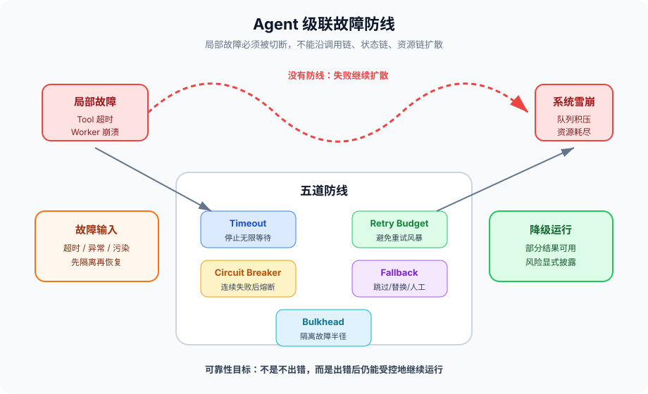
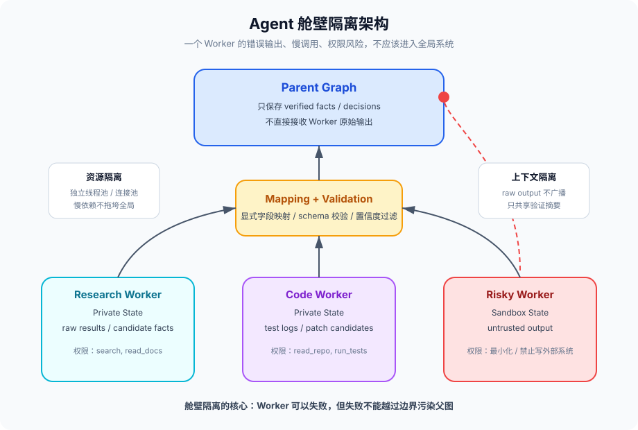
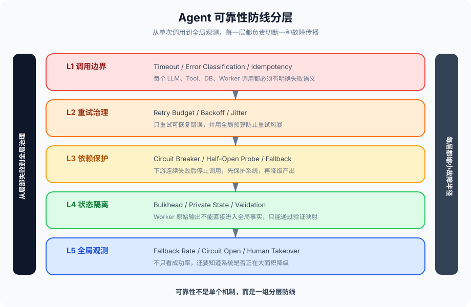

# 第 6 篇：一个 Agent 挂了，整个系统跟着挂

---

大家好，我是Q。

上一篇我们讲多 Agent 一致性，核心问题是"两个 Agent 同时改一条数据，谁覆盖谁"。这一篇继续往生产环境走一步：不是数据冲突，而是故障扩散。

一个检索 Agent 超时，Supervisor 一直等。

Supervisor 等不到结果，就让规划 Agent 重新规划。

规划 Agent 发现信息不完整，又触发更多检索请求。

更多请求打到同一个外部搜索服务，搜索服务开始限流。

限流导致更多 Agent 失败，失败又触发更多重试。

最后，不是一个 Agent 挂了，而是整个系统都被拖垮了。

这就是级联故障。

传统后端系统也有级联故障：一个下游服务慢了，上游线程池被打满，网关超时，流量继续涌入，最终雪崩。Agent 系统的级联故障更隐蔽，因为它不只是服务调用链的问题，还叠加了 LLM 推理、工具调用、状态传播、任务编排、人工审批、Checkpoint 恢复。

**Agent 系统的可靠性目标，不是"不出错"，而是"出错后系统还能降级运行"。**

这句话很重要。

不要幻想 Agent 不会错。LLM 会输出格式错误，工具会超时，外部 API 会限流，Worker 会卡死，Supervisor 会误判，人工审批会迟迟不处理。生产系统必须假设这些都会发生。

真正的架构能力，是把一个局部故障限制在局部：一个 Worker 挂了，不影响其他 Worker；一个工具超时，不拖垮整个任务；一个状态被污染，不传播到全局；一个审批没人处理，不让线程永久阻塞。

这篇文章，我们系统讲清楚 Agent 级联故障的五种模式，以及五条防线：Timeout、Retry、Circuit Breaker、Fallback、Bulkhead。

---

### 一、Agent 系统为什么更容易发生级联故障

先说结论：Agent 系统不是普通微服务套了一个 LLM。它有自己的故障传播方式。

传统微服务的调用链通常比较清晰：A 调 B，B 调 C，C 慢了，B 慢，A 慢。你可以通过链路追踪看到请求从哪里开始变慢。

Agent 系统的调用链更像一张动态生成的图：

- LLM 决定下一步调用哪个工具
- 工具结果再影响下一次 LLM 决策
- Supervisor 根据 Worker 输出决定是否继续派活
- Worker 输出可能写入共享 State
- 共享 State 又影响其他 Worker
- 某个失败可能触发重试、重规划、人工审批、降级分支

也就是说，Agent 系统的故障不是沿着固定链路传播，而是沿着"决策路径 + 状态路径 + 工具路径"一起传播。

这让级联故障更难发现，也更难切断。

#### 1.1 传播路径一：调用链传播

这是最容易理解的。

Agent 调了一个搜索工具，搜索工具超时。Agent 等待工具返回，Supervisor 等待 Agent 返回，用户请求等待 Supervisor 返回。一个工具慢，整个请求慢。

```
User → Supervisor → ResearchAgent → SearchTool
                                      ↓
                                   timeout
                                      ↓
User ← Supervisor ← ResearchAgent ← 等待失败
```

如果只是一次超时，问题不大。真正危险的是重试。

ResearchAgent 觉得搜索失败了，重试一次。Supervisor 觉得 ResearchAgent 不可靠，再启动一个备用 ResearchAgent。两个 Agent 同时打 SearchTool，SearchTool 压力更大，更容易超时。超时更多，重试更多，压力更大。

这就是典型的重试风暴。

#### 1.2 传播路径二：状态传播

Agent 系统有 State。State 是节点之间共享数据的协议，也可能成为故障传播的管道。

一个 Worker 输出了错误结果：

```python
{"user_intent": "delete_all_files", "confidence": 0.99}
```

如果这个结果直接写入全局 State，后面的 Planner、Executor、Reviewer 都会基于这个错误结果继续行动。一个 Worker 的误判，变成整个系统的共识。

这比调用超时更危险。调用超时至少会报错，状态污染经常不会报错。它看起来像正常输出，只是语义错了。

#### 1.3 传播路径三：控制流传播

Agent 的控制流经常由 LLM 决定。

LLM 判断："信息不足，继续搜索"。

搜索失败后，LLM 又判断："信息仍不足，继续搜索"。

如果没有上限，系统会进入循环：搜索 → 失败 → 继续搜索 → 失败 → 继续搜索。这个循环不一定是代码死循环，而是语义死循环。

传统程序的死循环可以靠 CPU 飙高发现。Agent 的语义死循环可能只是不断消耗 token、不断调用工具、不断等待外部依赖，直到成本爆炸。

#### 1.4 传播路径四：资源传播

一个 Agent 卡住，会占用资源：线程、连接、锁、上下文窗口、预算、队列槽位。

如果系统没有隔离，一个慢 Agent 会逐渐吃掉共享资源，导致其他正常 Agent 也拿不到资源。

比如：

- 所有 Agent 共用一个线程池
- 一个下游 API 慢，导致大量线程阻塞
- 线程池耗尽，其他不依赖这个 API 的 Agent 也无法执行

这就是资源层面的级联。

#### 1.5 传播路径五：恢复传播

恢复机制也可能放大故障。

Checkpoint 恢复本来是好事。但如果恢复后会重新执行外部副作用，而这些副作用没有幂等性，就会出事故。

比如 Agent 发邮件后崩溃，Checkpoint 记录还没写成功。恢复后从上一个 Checkpoint 继续，又发了一次邮件。用户收到两封邮件。

更严重的场景是扣款、下单、部署、删除文件。恢复机制如果没有幂等性，就不是修复故障，而是在制造新故障。

---

### 二、五种典型故障模式

第 6 篇的核心主题，是识别并切断故障扩散。先把故障模式讲清楚。

#### 2.1 Agent 崩溃

Agent 崩溃是最直接的故障。

可能原因很多：

- 进程 OOM
- Python 异常没有捕获
- LLM 返回格式不符合预期
- 工具调用抛异常
- Checkpoint 写入失败
- 容器被 K8s 杀掉

单个 Agent 崩溃并不可怕。可怕的是：上游不知道它崩溃了，还在等；下游不知道它已经失败，还在持有锁；共享 State 里留下半截结果，其他 Agent 继续读取。

所以，Agent 崩溃要解决三个问题：

1. **尽快发现**：不能让上游无限等
2. **释放资源**：锁、线程、预算、队列槽位必须释放
3. **隔离状态**：半成品输出不能进入全局 State

#### 2.2 通信超时

通信超时是最常见的生产故障。

Agent 系统里有大量通信边界：

- Agent 调 LLM API
- Agent 调工具
- Supervisor 调 Worker
- Worker 调数据库
- 人工审批等待用户响应
- Checkpoint 写入存储

任何一个边界都可能超时。

超时有两个陷阱。

**陷阱一：没有超时。**

这听起来离谱，但很多原型代码就是这样写的：

```python
result = tool.invoke(input)  # 没有 timeout
```

工具卡住，Agent 永远等。Agent 永远等，Supervisor 永远等。一个没有 timeout 的调用，就能把整个任务拖死。

**陷阱二：超时后盲目重试。**

超时不等于失败。

请求可能已经到达服务端，服务端也处理成功了，只是响应包在网络上丢了。你以为失败，重试一次，服务端执行两次。

所以超时之后，不能简单地"再来一次"。必须结合幂等性和状态查询。

#### 2.3 任务死锁

Agent 任务死锁分两类。

**资源死锁。**

Agent A 拿了资源 X，等资源 Y。

Agent B 拿了资源 Y，等资源 X。

两个 Agent 都不释放，系统卡住。

这和传统分布式锁死锁类似，可以通过固定锁顺序、锁超时、死锁检测解决。

**语义死锁。**

语义死锁更像 Agent 系统特有的问题。

Planner 等 ResearchAgent 给足够信息。

ResearchAgent 等 Planner 给更明确的问题。

Reviewer 等 Executor 产出结果。

Executor 等 Reviewer 批准执行。

每个 Agent 都在等一个"合理"的输入，但没有任何一个 Agent 往前推进。

这种死锁不一定有锁，也不一定有阻塞线程。它可能表现为：任务一直在等待状态之间切换，日志里没有异常，但就是不完成。

#### 2.4 级联失败

级联失败是局部故障没有被隔离，继续向上传播、向旁路传播、向资源层传播，最终导致系统整体不可用。

典型链路：

```
SearchTool 变慢
  ↓
ResearchAgent 超时
  ↓
Supervisor 重试 ResearchAgent
  ↓
更多 SearchTool 请求
  ↓
SearchTool 限流
  ↓
更多 Agent 失败
  ↓
全局任务队列积压
  ↓
正常任务也无法执行
```

这类故障的关键不是"谁先错"，而是"为什么错误没有被切断"。

#### 2.5 状态污染

状态污染是最隐蔽、也最难排查的一类。

一个 Agent 的错误输出进入共享 State，其他 Agent 把它当作事实继续使用。

比如：

```python
class GlobalState(TypedDict):
    facts: list[str]
    decisions: list[dict]
    user_profile: dict
```

ResearchAgent 检索到一个错误事实，写入 `facts`。

Planner 基于这个错误事实制定计划。

Executor 按计划执行。

Reviewer 看到 Planner 和 Executor 都一致，误以为结果可靠。

最后系统输出一个看起来逻辑完整、但根基错误的答案。

状态污染的问题在于：它不会像异常一样立刻爆炸。它会悄悄扩散，直到很后面才暴露。

---

### 三、第一道防线：Timeout，不要让等待无限传播

防级联的第一原则：**任何跨边界调用都必须有 timeout。**

跨边界包括：

- 调 LLM
- 调工具
- 调 Worker Agent
- 调数据库
- 调外部 API
- 等人工审批
- 等锁
- 等队列

没有 timeout 的调用，就是一个潜在的永久阻塞点。

#### 3.1 Timeout 不是性能优化，是故障隔离

很多人把 timeout 当成体验优化：超过 30 秒就提示用户慢一点。

这是误解。

Timeout 的本质是故障隔离：当下游没有响应时，上游必须停止等待，释放资源，进入可控分支。

```python
from dataclasses import dataclass
from typing import Callable, Any
import time

@dataclass
class TimeoutPolicy:
    name: str
    timeout_seconds: float
    on_timeout: str  # "fail", "fallback", "retry", "escalate"

class TimeoutGuard:
    def __init__(self, policy: TimeoutPolicy):
        self.policy = policy

    def run(self, fn: Callable[[], Any]) -> dict:
        start = time.monotonic()
        try:
            result = fn()
            elapsed = time.monotonic() - start
            return {"status": "ok", "result": result, "elapsed": elapsed}
        except TimeoutError:
            elapsed = time.monotonic() - start
            return {
                "status": "timeout",
                "policy": self.policy.name,
                "elapsed": elapsed,
                "action": self.policy.on_timeout,
            }
```

这段代码只是示意。真实实现里，Python 同步函数的强制超时需要线程、进程、asyncio 或底层客户端支持。但架构思想很简单：每个调用边界都必须有明确的超时策略。

#### 3.2 不同调用要有不同 timeout

不要全系统一个 30 秒 timeout。

不同调用的语义不同，timeout 也不同。

| 调用类型 | 建议策略 | 原因 |
|---|---|---|
| LLM 简短分类 | 3-8 秒 | 输出很短，超时通常说明服务异常 |
| LLM 长文本生成 | 30-120 秒 | 生成时间与输出长度相关 |
| 检索工具 | 5-15 秒 | 检索慢了可以降级使用已有上下文 |
| 数据库查询 | 1-5 秒 | 数据库慢通常会拖垮整个系统 |
| 外部 SaaS API | 3-10 秒 | 不受控依赖，必须保守 |
| 人工审批 | 10 分钟-24 小时 | 取决于业务，但必须有到期策略 |
| 分布式锁 | 1-3 秒获取失败 | 锁拿不到就排队或降级，不要长等 |

Timeout 不是越短越好。太短会误杀正常请求，导致无意义重试；太长会放大故障影响面。

一个实用原则：**timeout 应该低于上游 SLA，高于下游 P99 延迟。**

如果用户请求的 SLA 是 60 秒，某个工具的 P99 是 8 秒，那 timeout 可以设 10-12 秒。不要设 50 秒，因为它会吃掉整个请求预算。

#### 3.3 超时必须消耗预算

长时 Agent 里，任务应该有总预算：时间预算、token 预算、工具调用预算、重试预算。

每一次 timeout 都要消耗预算。

```python
class ExecutionBudget:
    def __init__(self, max_seconds: int, max_tool_calls: int, max_retries: int):
        self.max_seconds = max_seconds
        self.max_tool_calls = max_tool_calls
        self.max_retries = max_retries
        self.start_time = time.monotonic()
        self.tool_calls = 0
        self.retries = 0

    def can_call_tool(self) -> bool:
        return (
            time.monotonic() - self.start_time < self.max_seconds
            and self.tool_calls < self.max_tool_calls
        )

    def can_retry(self) -> bool:
        return self.retries < self.max_retries

    def record_tool_call(self):
        self.tool_calls += 1

    def record_retry(self):
        self.retries += 1
```

没有预算的 Agent 会无限努力。无限努力在 demo 里显得智能，在生产里就是灾难。

#### 3.4 人工环节也必须 timeout

HITL 很容易被忽视。

系统发起人工审批后，如果用户一直不处理怎么办？

很多系统默认"等着"。这在生产环境非常危险：任务占着资源、锁不释放、后续步骤不执行、用户看不到明确状态。

人工审批也要有 timeout：

- 低风险操作：超时自动通过
- 中风险操作：超时自动拒绝
- 高风险操作：超时升级给更高权限的人
- 不确定风险：超时暂停任务并释放资源

```python
def handle_approval_timeout(approval_request: dict) -> dict:
    risk = approval_request["risk_level"]

    if risk == "low":
        return {"status": "approved", "reason": "低风险审批超时自动通过"}

    if risk == "medium":
        return {"status": "rejected", "reason": "审批超时，默认拒绝"}

    if risk == "high":
        return {
            "status": "escalated",
            "next_reviewer": approval_request["manager_id"],
            "reason": "高风险审批超时升级",
        }

    return {"status": "paused", "reason": "审批超时，任务暂停"}
```

关键不是选择哪种策略，而是不能没有策略。

---

### 四、第二道防线：Retry 有边界，别把恢复变成风暴

重试是可靠性设计里最常见的工具，也是最容易被滥用的工具。

一句话：**不是所有失败都应该重试。**

#### 4.1 先分类，再重试

错误至少分三类。

**可恢复错误：**

- 网络抖动
- 连接超时
- 429 限流
- 5xx 服务端错误
- 临时资源不足

这类可以重试。

**不可恢复错误：**

- 400 参数错误
- 401/403 权限错误
- schema 校验失败
- 文件不存在
- 用户输入非法

这类不该重试。重试 100 次也不会好。

**未知错误：**

- LLM 输出格式异常
- 工具返回了不符合预期的结构
- 下游返回了模糊错误码

这类要谨慎。可以少量重试，但必须记录并快速转入 fallback 或人工处理。

```python
from enum import Enum

class ErrorType(Enum):
    RETRYABLE = "retryable"
    NON_RETRYABLE = "non_retryable"
    UNKNOWN = "unknown"


def classify_error(error: Exception) -> ErrorType:
    message = str(error).lower()

    if "timeout" in message or "429" in message or "5xx" in message:
        return ErrorType.RETRYABLE

    if "permission" in message or "unauthorized" in message or "invalid parameter" in message:
        return ErrorType.NON_RETRYABLE

    return ErrorType.UNKNOWN
```

实际系统不要靠字符串判断，应基于异常类型、错误码、响应结构。但思想一样：先分类，再决定。

#### 4.2 指数退避 + 抖动

如果 100 个 Agent 同时遇到下游 429，然后都在 1 秒后重试，下游会被第二波请求再次打爆。

所以重试不能固定间隔，要指数退避，并加随机抖动。

```python
import random
import time


def retry_with_backoff(fn, max_retries: int = 3, base_delay: float = 0.5):
    for attempt in range(max_retries + 1):
        try:
            return fn()
        except Exception as error:
            error_type = classify_error(error)

            if error_type == ErrorType.NON_RETRYABLE:
                raise

            if attempt == max_retries:
                raise

            # 指数退避 + jitter，避免所有 Agent 同时重试
            delay = base_delay * (2 ** attempt)
            jitter = random.uniform(0, delay * 0.2)
            time.sleep(delay + jitter)
```

指数退避不是为了让单个请求更快成功，而是为了保护整个系统。

#### 4.3 重试要有全局预算

单个节点 max_retries=3 看起来不多。但一个任务有 20 个节点，每个节点 3 次重试，总重试可能达到 60 次。

如果每次重试都是 LLM 调用或外部 API 调用，成本会非常高。

所以需要全局重试预算：

```python
class RetryBudget:
    def __init__(self, total_retry_limit: int):
        self.total_retry_limit = total_retry_limit
        self.used = 0

    def acquire(self) -> bool:
        if self.used >= self.total_retry_limit:
            return False
        self.used += 1
        return True


def guarded_retry(fn, retry_budget: RetryBudget):
    try:
        return fn()
    except Exception as error:
        if classify_error(error) != ErrorType.RETRYABLE:
            raise

        if not retry_budget.acquire():
            return {"status": "retry_budget_exhausted", "error": str(error)}

        return fn()
```

全局预算让系统从"每个节点都觉得自己只重试一点"变成"整个任务知道自己还能承受多少失败"。

#### 4.4 幂等性是重试的前提

上一篇讲过幂等性，这里再强调一次。

只要你允许重试，就必须保证外部副作用幂等。

否则重试会把故障放大：

- 邮件发送超时 → 重试 → 用户收到两封
- 订单创建超时 → 重试 → 创建两个订单
- 扣款接口超时 → 重试 → 扣两次款
- 文件删除超时 → 重试 → 删除了新创建的同名文件

安全的做法是给每个外部副作用一个确定性的 `operation_id`。

```python
import hashlib
import json


def make_operation_id(agent_id: str, thread_id: str, step: int, action: str, params: dict) -> str:
    payload = {
        "agent_id": agent_id,
        "thread_id": thread_id,
        "step": step,
        "action": action,
        "params": params,
    }
    content = json.dumps(payload, sort_keys=True, ensure_ascii=False)
    return hashlib.sha256(content.encode("utf-8")).hexdigest()[:24]
```

注意：不要用随机 UUID。Checkpoint 恢复后随机 UUID 会变，幂等性失效。

---

### 五、第三道防线：Circuit Breaker，连续失败后自动熔断

Timeout 解决"不能无限等"。

Retry 解决"临时故障可以再试"。

Circuit Breaker 解决的是：**当下游已经明显不健康时，不要继续打它。**

熔断器的目标不是让当前请求成功，而是保护系统不被持续失败拖垮。

#### 5.1 熔断器的三个状态

经典 Circuit Breaker 有三个状态：

**Closed（关闭）**：正常状态，请求照常通过。

**Open（打开）**：熔断状态，请求直接失败或走 fallback，不再调用下游。

**Half-Open（半开）**：探测状态，允许少量请求通过，看看下游是否恢复。

```
Closed --连续失败N次--> Open --冷却时间到--> Half-Open
  ↑                         ↓                    |
  |                         fallback             |
  └----------探测成功--------┴------探测失败------┘
```

#### 5.2 Agent 版熔断器实现

```python
from dataclasses import dataclass
from enum import Enum
import time

class BreakerState(Enum):
    CLOSED = "closed"
    OPEN = "open"
    HALF_OPEN = "half_open"

@dataclass
class CircuitBreakerConfig:
    failure_threshold: int = 5       # 连续失败 5 次熔断
    recovery_timeout: float = 60.0   # 60 秒后进入半开
    half_open_max_calls: int = 2     # 半开状态最多放 2 个探测请求

class CircuitBreaker:
    def __init__(self, name: str, config: CircuitBreakerConfig):
        self.name = name
        self.config = config
        self.state = BreakerState.CLOSED
        self.failure_count = 0
        self.last_failure_time: float | None = None
        self.half_open_calls = 0

    def allow_request(self) -> bool:
        now = time.monotonic()

        if self.state == BreakerState.CLOSED:
            return True

        if self.state == BreakerState.OPEN:
            if self.last_failure_time and now - self.last_failure_time >= self.config.recovery_timeout:
                self.state = BreakerState.HALF_OPEN
                self.half_open_calls = 0
                return True
            return False

        if self.state == BreakerState.HALF_OPEN:
            if self.half_open_calls < self.config.half_open_max_calls:
                self.half_open_calls += 1
                return True
            return False

        return False

    def record_success(self):
        self.failure_count = 0
        self.state = BreakerState.CLOSED
        self.half_open_calls = 0

    def record_failure(self):
        self.failure_count += 1
        self.last_failure_time = time.monotonic()

        if self.state == BreakerState.HALF_OPEN:
            self.state = BreakerState.OPEN
            return

        if self.failure_count >= self.config.failure_threshold:
            self.state = BreakerState.OPEN
```

使用方式：

```python
def call_tool_with_breaker(tool_name: str, fn):
    breaker = breaker_registry.get(tool_name)

    if not breaker.allow_request():
        return {
            "status": "degraded",
            "reason": f"tool {tool_name} circuit open",
            "fallback": get_tool_fallback(tool_name),
        }

    try:
        result = fn()
        breaker.record_success()
        return {"status": "ok", "result": result}
    except Exception as error:
        breaker.record_failure()
        raise
```

#### 5.3 Agent 里哪些地方需要熔断

不是只有外部 API 需要熔断。Agent 系统里至少有五类熔断对象。

**1. LLM Provider 熔断**

某个模型服务连续超时或 5xx，就切到备用模型，或者进入低配模型降级。

```python
if gpt4_breaker.is_open():
    model = "gpt-4o-mini"  # 降级模型
else:
    model = "gpt-4o"
```

**2. Tool 熔断**

搜索、数据库、爬虫、代码执行器都应该有独立熔断器。某个工具不健康，不应该影响不依赖它的任务。

**3. Worker Agent 熔断**

某个 Worker 连续输出格式错误、连续超时、连续失败，就暂时不要再派任务给它。

**4. 外部资源熔断**

比如某个用户的知识库、某个第三方账号、某个 Git 仓库持续失败，可以对这个资源单独熔断，而不是全局熔断。

**5. 路由分支熔断**

Router 总是把某类任务路由到失败分支，就可以临时禁用这个分支，走通用 Agent 或人工处理。

#### 5.4 熔断粒度怎么选

熔断粒度太粗，会误伤正常流量。

熔断粒度太细，状态管理复杂。

常见粒度：

| 粒度 | 示例 | 优点 | 风险 |
|---|---|---|---|
| 全局服务级 | search_tool 全局熔断 | 简单，保护强 | 一个租户故障影响所有租户 |
| 租户级 | tenant_a 的 search 熔断 | 隔离租户 | 状态数量增加 |
| 资源级 | repo_x 的 code_agent 熔断 | 最精准 | 维护成本最高 |
| Agent 类型级 | ResearchAgent 熔断 | 防止坏 Worker 扩散 | 可能降低系统能力 |

实用建议：

- 外部服务先做服务级熔断
- 多租户系统补租户级熔断
- 热点资源补资源级熔断
- Worker 质量不稳定时做 Agent 类型熔断

#### 5.5 熔断不是失败，熔断必须接 fallback

很多系统实现了熔断，但熔断后只返回错误。

这只完成了一半。

熔断解决"别再试了"，降级解决"那我怎么继续"。

如果搜索工具熔断，可以：

- 使用已有上下文继续回答
- 使用缓存搜索结果
- 缩小任务范围
- 告诉用户当前无法联网检索，只基于已有资料分析
- 转人工

如果代码执行器熔断，可以：

- 只做静态分析
- 给出待验证方案
- 请求用户本地运行测试
- 延迟执行

没有 fallback 的熔断，只是更快失败；有 fallback 的熔断，才是可靠性设计。



---

### 六、第四道防线：Fallback，单点失败后的 Plan B

Fallback 是 Agent 系统从"脆弱"变成"可降级"的关键。

一个 Agent 失败后，系统不应该只有两种状态：成功或崩溃。中间应该有很多降级状态。

#### 6.1 三种降级策略：跳过、替换、人工接管

**策略一：跳过**

某个步骤不是关键路径，可以跳过。

比如：生成报告时，"补充行业背景"失败了，但核心数据分析已经完成。那就跳过背景补充，在报告里标注"背景信息未检索"。

```python
def fallback_skip(step_name: str, reason: str) -> dict:
    return {
        "status": "skipped",
        "step": step_name,
        "reason": reason,
        "quality": "degraded",
    }
```

跳过适用于非关键步骤。不能把关键步骤也随便跳过。

**策略二：替换**

某个 Agent 或工具失败，换一个能力较弱但可用的替代方案。

- 高级模型失败 → 小模型
- 实时搜索失败 → 缓存搜索
- 专业 Worker 失败 → 通用 Worker
- 自动执行失败 → 只生成执行计划

```python
def fallback_replace(agent_role: str, task: dict) -> dict:
    fallback_map = {
        "research_agent": "cached_research_agent",
        "code_executor": "static_code_analyzer",
        "advanced_model": "basic_model",
    }

    fallback_agent = fallback_map.get(agent_role)
    if not fallback_agent:
        return {"status": "no_fallback", "agent_role": agent_role}

    return run_agent(fallback_agent, task)
```

替换适用于能力有层级的场景。降级后质量可能下降，但系统仍能给出有用结果。

**策略三：人工接管**

高风险、不可逆、语义复杂的失败，不要硬降级，交给人。

比如：

- 删除生产数据前工具状态不确定
- 支付接口超时但无法确认是否扣款
- 两个 Agent 对审核结论冲突
- 安全策略判断不一致

```python
def fallback_human_takeover(task_id: str, context: dict, reason: str) -> dict:
    ticket = create_human_review_ticket(
        task_id=task_id,
        reason=reason,
        context=context,
        options=["continue", "rollback", "retry", "abort"],
    )
    return {
        "status": "human_required",
        "ticket_id": ticket.id,
        "reason": reason,
    }
```

人工接管不是失败，而是系统承认：当前自动化判断不够安全。

#### 6.2 Fallback 不能隐藏风险

降级后必须让用户知道。

不要把降级结果包装成完整成功。

如果搜索失败，只基于缓存回答，就要明确标注：

> 当前外部搜索不可用，以下结论基于已有上下文和缓存资料，可能不是最新信息。

如果代码执行器不可用，只做静态分析，也要标注：

> 未实际运行测试，以下为静态分析结果。

这是产品体验问题，也是可靠性问题。用户不知道系统已经降级，就会误用低置信结果。

#### 6.3 给 State 设计降级字段

降级状态应该进入 State，而不是只写日志。

```python
from typing import Annotated, TypedDict, Literal
import operator

class ReliabilityState(TypedDict):
    task_status: Literal["running", "degraded", "failed", "completed"]
    degradation_reasons: Annotated[list[str], operator.add]
    skipped_steps: Annotated[list[str], operator.add]
    fallback_used: Annotated[list[dict], operator.add]
    human_required: bool
```

这样后续节点能感知系统已经降级。

比如最终回答节点可以根据 `degradation_reasons` 调整表述，不要给出过度确定的结论。

#### 6.4 降级策略要提前设计，不要失败时现想

很多团队的 fallback 是事故发生后临时补的：搜索挂了怎么办？先返回缓存吧。缓存没有怎么办？让模型编一个？

这很危险。

Fallback 必须在设计阶段定义：

| 失败点 | 首选方案 | 降级方案 | 是否需要告知用户 | 是否需要人工 |
|---|---|---|---|---|
| 搜索工具超时 | 实时搜索 | 缓存 / 已有上下文 | 是 | 否 |
| 代码执行失败 | 运行测试 | 静态分析 | 是 | 视风险 |
| 支付状态未知 | 查询支付状态 | 暂停任务 | 是 | 是 |
| Worker 输出格式错 | 修复格式 | 换通用 Worker | 否/视情况 | 否 |
| 审批超时 | 等审批 | 自动拒绝/升级 | 是 | 可能 |

---

### 七、第五道防线：Bulkhead，舱壁隔离故障影响面

Bulkhead 是航海术语。船舱之间用隔板隔开，一个舱进水，不会让整艘船沉没。

在后端系统里，Bulkhead 通常指线程池隔离、连接池隔离、资源池隔离。

在 Agent 系统里，Bulkhead 更丰富，至少包括四种隔离：

1. 资源隔离
2. 状态隔离
3. 上下文隔离
4. 权限隔离

#### 7.1 资源隔离：不要共用一个池子

如果所有 Agent 共用一个线程池，一个慢工具就能占满线程池，导致其他 Agent 也无法运行。

应该按依赖或 Agent 类型隔离资源池：

```python
class AgentResourcePools:
    def __init__(self):
        self.pools = {
            "llm": ThreadPool(max_workers=50),
            "search": ThreadPool(max_workers=20),
            "code_execution": ThreadPool(max_workers=5),
            "database": ThreadPool(max_workers=30),
        }

    def submit(self, pool_name: str, fn, *args, **kwargs):
        pool = self.pools[pool_name]
        return pool.submit(fn, *args, **kwargs)
```

代码执行器风险高、耗时长，就给它小池子。搜索工具容易慢，就不要让它占用 LLM 池。数据库是关键依赖，要单独保护。

资源隔离的目标是：一个依赖慢了，只耗尽自己的池子，不影响其他路径。

#### 7.2 状态隔离：子图不要随便写父图 State

这是 Agent 系统最重要的 Bulkhead。

如果所有 Worker 都能读写全局 State，任何一个 Worker 都可能污染全局。

坏设计：

```python
class GlobalState(TypedDict):
    messages: list
    facts: list[str]
    decisions: list[dict]
    final_answer: str
    user_profile: dict
    permissions: dict

# 所有 Worker 都拿 GlobalState，想写什么写什么
```

好设计：给 Worker 子图独立 State，只通过显式映射和父图交互。

```python
class ParentState(TypedDict):
    user_request: str
    verified_facts: list[str]
    final_answer: str

class ResearchWorkerState(TypedDict):
    query: str
    raw_results: list[str]
    candidate_facts: list[str]
    confidence: float


def map_parent_to_research(parent: ParentState) -> ResearchWorkerState:
    return {
        "query": parent["user_request"],
        "raw_results": [],
        "candidate_facts": [],
        "confidence": 0.0,
    }


def map_research_to_parent(worker: ResearchWorkerState) -> dict:
    # 只有通过验证的事实才能写回父图
    facts = verify_facts(worker["candidate_facts"])
    return {"verified_facts": facts}
```

这就是 Agent 版舱壁隔离：Worker 内部可以失败、可以输出脏数据，但只有通过映射和验证的数据能进入父图。

#### 7.3 上下文隔离：不要让坏输出进入所有人的 prompt

很多多 Agent 系统会把所有 Worker 的输出都塞进 Supervisor 的上下文。

这很危险。

一个 Worker 输出了错误推理、幻觉事实、恶意提示，Supervisor 和其他 Worker 都会看到。上下文成了污染传播的通道。

更安全的做法：

- Worker 原始输出进入私有日志
- 结构化摘要进入共享上下文
- 关键信息经过验证再进入全局事实库
- 可疑输出标记风险，不参与决策

```python
class WorkerOutput(TypedDict):
    raw_output: str          # 私有，不直接进入全局 prompt
    summary: str             # 可共享摘要
    claims: list[str]        # 待验证事实
    confidence: float
    risk_flags: list[str]


def sanitize_worker_output(output: WorkerOutput) -> dict:
    verified_claims = []
    for claim in output["claims"]:
        if verify_claim(claim):
            verified_claims.append(claim)

    return {
        "summary": output["summary"],
        "verified_claims": verified_claims,
        "confidence": output["confidence"],
        "risk_flags": output["risk_flags"],
    }
```

不要把原始输出直接广播给所有 Agent。原始输出是证据，不是事实。

#### 7.4 权限隔离：失败 Agent 不该有全局权限

一个 ResearchAgent 不应该有删除数据库的权限。

一个 WriterAgent 不应该有部署生产代码的权限。

一个 ReviewerAgent 不应该能直接修改用户数据。

权限隔离的原则是最小权限：每个 Agent 只拿完成任务所需的工具和权限。

```python
AGENT_PERMISSIONS = {
    "research_agent": ["search", "read_docs"],
    "writer_agent": ["read_docs", "draft_text"],
    "code_agent": ["read_repo", "run_tests"],
    "deploy_agent": ["read_repo", "deploy_staging"],
}


def can_call_tool(agent_role: str, tool_name: str) -> bool:
    return tool_name in AGENT_PERMISSIONS.get(agent_role, [])
```

权限隔离不是安全团队才关心的事。它也是可靠性设计：一个 Agent 出错时，它能造成的破坏被限制在权限范围内。



---

### 八、状态污染怎么防

状态污染值得单独展开。因为它和传统服务故障不同，传统监控很难发现。

#### 8.1 把 State 分成三类

不要把所有信息都放在一个 `state` 里。

至少分三类：

**Raw State：原始输出**

包括工具原始返回、LLM 原始回答、Worker 原始日志。它只用于审计和调试，不直接参与决策。

**Candidate State：候选信息**

包括待验证事实、待审核计划、待确认决策。它可以被后续节点读取，但必须带置信度和来源。

**Verified State：已验证信息**

只有通过校验、交叉验证、人工确认或规则验证的信息，才能进入 Verified State。最终决策优先使用 Verified State。

```python
class SafeAgentState(TypedDict):
    raw_outputs: Annotated[list[dict], operator.add]
    candidate_facts: Annotated[list[dict], operator.add]
    verified_facts: Annotated[list[dict], operator.add]
    decisions: Annotated[list[dict], operator.add]
```

这个分层让系统不会把"模型说的"直接当成"事实"。

#### 8.2 所有跨 Agent 输出都要带来源

状态污染难排查，一个重要原因是信息没有来源。

看到 State 里有一条事实：

```python
"用户已经授权删除文件"
```

这是谁写的？什么时候写的？基于什么证据？置信度多少？有没有人工确认？

如果没有这些元数据，出问题时很难定位。

更好的结构：

```python
class Fact(TypedDict):
    content: str
    source_agent: str
    source_tool: str | None
    evidence: list[str]
    confidence: float
    created_step: int
    verified: bool
```

Agent 系统里的 State 不应该只存值，还应该存 provenance（来源链路）。

#### 8.3 引入验证节点

关键 State 写入前，加验证节点。

```python
def validate_candidate_facts(state: SafeAgentState) -> dict:
    verified = []
    rejected = []

    for fact in state.get("candidate_facts", []):
        if fact["confidence"] < 0.7:
            rejected.append({**fact, "reject_reason": "confidence too low"})
            continue

        if not has_evidence(fact):
            rejected.append({**fact, "reject_reason": "missing evidence"})
            continue

        verified.append({**fact, "verified": True})

    return {
        "verified_facts": verified,
        "raw_outputs": [{"type": "rejected_facts", "items": rejected}],
    }
```

验证节点不一定要用 LLM。很多验证可以用确定性规则：schema 校验、权限检查、版本检查、引用检查、数值范围检查。

#### 8.4 状态污染后的恢复

如果发现 State 已经被污染，不要在原 State 上继续修。

更安全的方式是：回到污染前的 Checkpoint，清除污染写入，从干净状态重新执行。

这就是 Checkpoint 链表的价值。

```python
def recover_from_state_contamination(thread_id: str, clean_checkpoint_id: str):
    clean_config = {
        "configurable": {
            "thread_id": thread_id,
            "checkpoint_id": clean_checkpoint_id,
        }
    }

    # 从干净 checkpoint fork 一条新执行路径
    return app.invoke(None, clean_config)
```

注意：如果污染已经传播到外部系统，单纯回滚 State 不够，还要对账和补偿。

---

### 九、Supervisor 是单点，必须特殊保护

多 Agent 系统里，Supervisor 很容易成为可靠性瓶颈。

它负责分配任务、汇总结果、决定下一步。它一旦挂了，所有 Worker 都没方向。它一旦误判，所有 Worker 都会被带偏。

#### 9.1 Supervisor 的三种风险

**风险一：上下文膨胀。**

所有 Worker 输出都汇总到 Supervisor，上下文越来越长。上下文越长，成本越高，延迟越大，遗漏关键信息的概率也越高。

**风险二：决策单点。**

Supervisor 决定调谁、何时停止、是否重试。如果它的策略错了，整个系统都会错。

**风险三：等待放大。**

Supervisor 等多个 Worker 返回。一个 Worker 卡住，Supervisor 可能一直等，导致整个任务不能进入下一步。

#### 9.2 Supervisor 不应该等待所有 Worker

很多系统会这样写：

```python
results = await gather(worker_a(), worker_b(), worker_c())
```

默认含义是：三个都完成才继续。

更可靠的做法是部分成功策略：

```python
async def gather_with_partial_success(workers, min_success: int, timeout: float):
    results = []
    failures = []

    for worker in workers:
        try:
            result = await run_with_timeout(worker, timeout)
            results.append(result)
        except Exception as error:
            failures.append({"worker": worker.name, "error": str(error)})

    if len(results) >= min_success:
        return {
            "status": "partial_success",
            "results": results,
            "failures": failures,
        }

    return {
        "status": "insufficient_results",
        "results": results,
        "failures": failures,
    }
```

并不是所有任务都需要所有 Worker 成功。

如果 3 个检索 Worker 成功 2 个，可能已经够了。如果 5 个候选方案生成器成功 3 个，也许可以进入评审。关键是把"最小可用成功数"设计出来。

#### 9.3 Supervisor 也要有 fallback

Supervisor 失败后怎么办？

常见 fallback：

- 使用静态流程替代动态规划
- 降级成单 Agent 模式
- 只返回已完成部分
- 转人工调度
- 暂停任务，等待恢复

```python
def supervisor_fallback(state: dict, reason: str) -> dict:
    completed = state.get("completed_worker_results", [])

    if len(completed) > 0:
        return {
            "next_action": "summarize_partial",
            "reason": reason,
            "available_results": completed,
        }

    if state.get("risk_level") == "high":
        return {
            "next_action": "human_takeover",
            "reason": reason,
        }

    return {
        "next_action": "single_agent_mode",
        "reason": reason,
    }
```

Supervisor 不是神。它也会失败，也需要降级路径。

#### 9.4 把 Supervisor 的决策写入结构化日志

Supervisor 的每次决策都应该可追踪：

```python
class SupervisorDecision(TypedDict):
    step: int
    selected_agent: str
    reason: str
    input_summary: str
    expected_output: str
    timeout_seconds: int
    fallback_plan: str
```

没有结构化决策日志，级联故障发生后你很难复盘：为什么它当时继续重试？为什么没有转人工？为什么派给了这个 Worker？

---

### 十、一个生产级防级联架构模板

把前面所有防线组合起来，可以形成一个比较完整的架构模板。

#### 10.1 State 设计

```python
from typing import Annotated, TypedDict, Literal
import operator

class FailureRecord(TypedDict):
    component: str
    error_type: str
    message: str
    step: int
    recoverable: bool

class AgentReliabilityState(TypedDict):
    # 任务状态
    task_status: Literal["running", "degraded", "waiting", "failed", "completed"]
    current_step: int

    # 结果分层
    raw_outputs: Annotated[list[dict], operator.add]
    candidate_results: Annotated[list[dict], operator.add]
    verified_results: Annotated[list[dict], operator.add]

    # 可靠性信息
    failures: Annotated[list[FailureRecord], operator.add]
    degradation_reasons: Annotated[list[str], operator.add]
    skipped_steps: Annotated[list[str], operator.add]
    fallback_used: Annotated[list[dict], operator.add]

    # 预算
    retry_count: Annotated[int, operator.add]
    tool_call_count: Annotated[int, operator.add]

    # 控制流
    next_action: Literal["plan", "execute", "validate", "fallback", "human", "end"]
```

这个 State 把业务结果和可靠性元数据放在一起。后续节点不仅知道"任务做了什么"，还知道"任务是否降级、哪里失败过、哪些结果可信"。

#### 10.2 工具调用包装器

```python
class ReliableToolRunner:
    def __init__(self, breaker_registry, retry_budget):
        self.breaker_registry = breaker_registry
        self.retry_budget = retry_budget

    def run(self, tool_name: str, params: dict, timeout: float) -> dict:
        breaker = self.breaker_registry.get(tool_name)

        if not breaker.allow_request():
            return {
                "status": "degraded",
                "tool": tool_name,
                "reason": "circuit_open",
                "fallback": get_tool_fallback(tool_name, params),
            }

        try:
            result = self._run_with_timeout(tool_name, params, timeout)
            breaker.record_success()
            return {"status": "ok", "tool": tool_name, "result": result}

        except Exception as error:
            breaker.record_failure()
            error_type = classify_error(error)

            if error_type == ErrorType.RETRYABLE and self.retry_budget.acquire():
                return self.run(tool_name, params, timeout)

            return {
                "status": "failed",
                "tool": tool_name,
                "error_type": error_type.value,
                "message": str(error),
            }

    def _run_with_timeout(self, tool_name: str, params: dict, timeout: float):
        # 这里用具体客户端实现 timeout
        return tool_registry[tool_name].invoke(params, timeout=timeout)
```

所有工具调用都经过同一个可靠性包装器，而不是每个节点自己写 try/except。

#### 10.3 节点执行包装器

```python
class ReliableNodeRunner:
    def __init__(self, timeout_policy, fallback_policy):
        self.timeout_policy = timeout_policy
        self.fallback_policy = fallback_policy

    def run_node(self, node_name: str, node_fn, state: AgentReliabilityState) -> dict:
        try:
            result = run_with_timeout(
                lambda: node_fn(state),
                timeout=self.timeout_policy.get(node_name),
            )
            return result

        except TimeoutError as error:
            return self._handle_failure(node_name, "timeout", str(error), state)

        except Exception as error:
            return self._handle_failure(node_name, "exception", str(error), state)

    def _handle_failure(self, node_name: str, error_type: str, message: str, state: AgentReliabilityState) -> dict:
        fallback = self.fallback_policy.get(node_name)

        failure = {
            "component": node_name,
            "error_type": error_type,
            "message": message,
            "step": state["current_step"],
            "recoverable": fallback is not None,
        }

        if fallback is None:
            return {
                "task_status": "failed",
                "failures": [failure],
                "next_action": "end",
            }

        fallback_result = fallback(state, failure)
        return {
            "task_status": "degraded",
            "failures": [failure],
            "fallback_used": [{"node": node_name, "fallback": fallback.__name__}],
            **fallback_result,
        }
```

节点执行也要统一治理：timeout、异常分类、fallback、failure record。

#### 10.4 路由逻辑

```python
def route_by_reliability(state: AgentReliabilityState) -> str:
    # 高风险失败直接人工
    high_risk_failures = [
        f for f in state.get("failures", [])
        if not f["recoverable"]
    ]
    if high_risk_failures:
        return "human"

    # 重试预算耗尽，进入降级
    if state.get("retry_count", 0) >= 5:
        return "fallback"

    # 已有验证结果，可以完成
    if state.get("verified_results"):
        return "end"

    return state.get("next_action", "plan")
```

可靠性状态应该影响控制流。系统不能只根据业务状态路由，也要根据故障状态路由。

#### 10.5 完整防线图



这套架构的核心原则：

- 每个边界都有 timeout
- 每次重试都有预算
- 每个依赖都有熔断
- 每个关键步骤都有 fallback
- 每个子图都有状态边界
- 每个外部副作用都有幂等 ID
- 每个降级都进入 State
- 每个不可恢复故障都能转人工

---

### 十一、监控和告警：你要知道系统正在降级

防级联不是只靠代码，还要靠观测。

如果系统已经大量降级，但监控仍然显示"请求成功率 99%"，那是危险的。因为成功率掩盖了质量下降。

Agent 系统至少要监控这些指标。

#### 11.1 基础故障指标

- Agent 崩溃次数
- 节点异常次数
- 工具超时次数
- LLM 调用失败率
- Checkpoint 写入失败率
- Worker 超时率

这些是传统可靠性指标，必须有。

#### 11.2 降级指标

- fallback 使用次数
- fallback 使用率
- 熔断器 open 次数
- 熔断持续时间
- 部分成功任务占比
- 人工接管次数
- 自动跳过步骤次数

这些指标比成功率更能反映 Agent 系统健康度。

如果成功率很高，但 60% 请求都走了 fallback，说明系统已经处于半失效状态。

#### 11.3 质量指标

Agent 系统还要监控质量：

- 低置信输出比例
- 未验证事实进入最终回答的比例
- 用户追问/纠错比例
- 人工驳回比例
- 输出格式修复次数
- 状态污染检测次数

级联故障不一定表现为 5xx，也可能表现为质量突然下降。

#### 11.4 告警规则

告警不要只盯错误率。

可以设置这些规则：

```yaml
alerts:
  - name: search_tool_circuit_open
    condition: circuit_open_duration{tool="search"} > 300s
    severity: warning

  - name: fallback_rate_high
    condition: fallback_rate > 0.2 for 10m
    severity: warning

  - name: worker_timeout_spike
    condition: worker_timeout_rate > 0.1 for 5m
    severity: critical

  - name: state_contamination_detected
    condition: rejected_verified_fact_count > 10 for 10m
    severity: critical

  - name: human_takeover_spike
    condition: human_takeover_rate > 0.15 for 15m
    severity: warning
```

告警的目标不是让值班同学知道"挂了"，而是尽早知道"系统开始降级了"。

---

### 十二、六个常见反模式

#### 反模式一：所有异常都 retry

这是最常见的错误。

参数错了 retry，权限错了 retry，schema 错了 retry，用户输入非法也 retry。结果是浪费 token、打爆下游、拖慢任务。

正确做法：错误分类。只有可恢复错误才 retry。

#### 反模式二：没有 timeout 的工具调用

工具调用没有 timeout，就等于把系统可靠性交给下游。

正确做法：每个工具的 schema 里声明 timeout、retries、fallback。

```python
class ToolMetadata(TypedDict):
    name: str
    timeout_seconds: float
    max_retries: int
    fallback: str | None
    idempotent: bool
```

#### 反模式三：熔断后没有 fallback

熔断器打开后直接返回失败，用户只看到系统不可用。

正确做法：熔断必须绑定降级策略。没有降级策略的熔断，只能保护下游，不能保护用户体验。

#### 反模式四：所有 Worker 共用全局 State

全局 State 很方便，但也是污染传播通道。

正确做法：可复用 Worker、第三方 Worker、高风险 Worker 必须隔离 State，通过显式映射写回父图。

#### 反模式五：把降级结果伪装成完整成功

系统明明没联网搜索，却给用户一个看起来很确定的答案。这会让用户错误地信任低质量结果。

正确做法：降级必须进入 State，最终输出必须披露降级信息。

#### 反模式六：恢复机制没有幂等性

Checkpoint 恢复后重复执行外部副作用，造成重复发信、重复扣款、重复创建资源。

正确做法：所有外部副作用都有确定性 operation_id，并在外部系统或操作日志中去重。

---

### 十三、落地检查清单

最后给一个生产落地检查清单。做多 Agent 系统上线前，逐项过一遍。

#### 13.1 Timeout 检查

- 每个 LLM 调用是否设置 timeout？
- 每个工具调用是否设置 timeout？
- 每个 Worker 是否有最大执行时间？
- 每个锁获取是否有 timeout？
- 每个人工审批是否有到期策略？
- 超时后是 fail、retry、fallback 还是 human？是否明确？

#### 13.2 Retry 检查

- 是否区分可恢复和不可恢复错误？
- 是否使用指数退避和 jitter？
- 是否有单节点重试上限？
- 是否有全局重试预算？
- 重试的操作是否幂等？
- 超时后是否能查询操作真实状态？

#### 13.3 Circuit Breaker 检查

- LLM provider 是否有熔断？
- 外部工具是否有熔断？
- Worker Agent 是否有熔断？
- 熔断粒度是全局、租户还是资源？
- half-open 探测策略是否明确？
- 熔断后 fallback 是什么？

#### 13.4 Fallback 检查

- 每个关键节点是否有 Plan B？
- 失败后是跳过、替换还是人工接管？
- 降级结果是否写入 State？
- 最终回答是否披露降级信息？
- 高风险操作是否禁止自动降级？

#### 13.5 Bulkhead 检查

- 慢工具是否有独立资源池？
- 代码执行是否和普通工具隔离？
- 子图是否使用独立 State？
- Worker 原始输出是否直接进入全局上下文？
- Agent 权限是否最小化？
- 第三方 Agent 是否有沙箱？

#### 13.6 状态污染检查

- State 是否区分 raw / candidate / verified？
- 跨 Agent 输出是否带来源、证据、置信度？
- 关键事实写入前是否验证？
- 被拒绝的事实是否进入审计日志？
- 发现污染后能否回到干净 Checkpoint？

#### 13.7 观测检查

- 是否监控 fallback rate？
- 是否监控 circuit open duration？
- 是否监控 partial success rate？
- 是否监控 human takeover rate？
- 是否监控低置信输出比例？
- 是否能按 thread_id 追踪一次任务的故障链路？

---

### 十四、总结

Agent 级联故障的本质，不是某个组件失败，而是失败没有被限制在局部。

一个工具超时不可怕，可怕的是上游无限等待。

一次 LLM 输出格式错不可怕，可怕的是错误结果进入全局 State。

一个 Worker 崩溃不可怕，可怕的是 Supervisor 没有 fallback。

一次重试不可怕，可怕的是所有 Agent 同时重试，把下游打爆。

所以，Agent 可靠性设计的目标不是消灭错误，而是控制错误的传播半径。

这篇文章的核心框架可以压缩成五句话：

1. **Timeout**：任何跨边界调用都不能无限等
2. **Retry**：只重试可恢复错误，并且必须有预算
3. **Circuit Breaker**：连续失败后停止调用，保护系统
4. **Fallback**：失败后还能跳过、替换或人工接管
5. **Bulkhead**：资源、状态、上下文、权限都要隔离

最后再强调一次：**Agent 系统的可靠性目标不是"不出错"，是"出错后系统还能降级运行"。**

能做到这一点，Agent 才能从 demo 走向生产。

---

*下一篇，我们聊 Agent 怎么测——一个输出每次都不一样的系统，如何做评估架构。*
