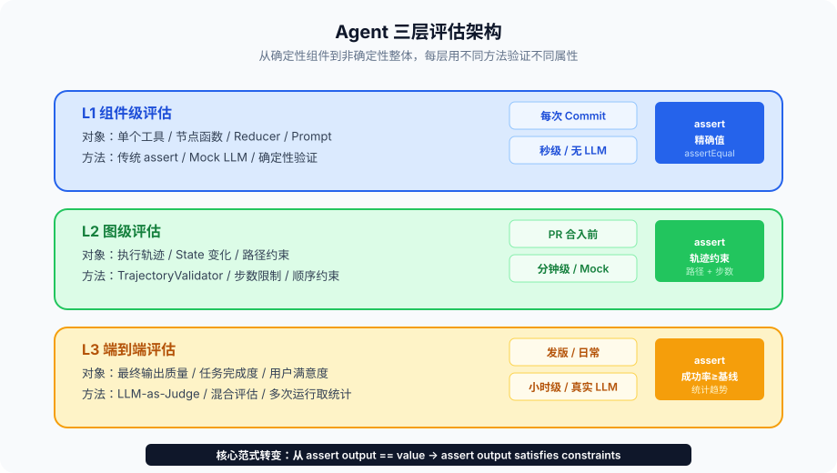
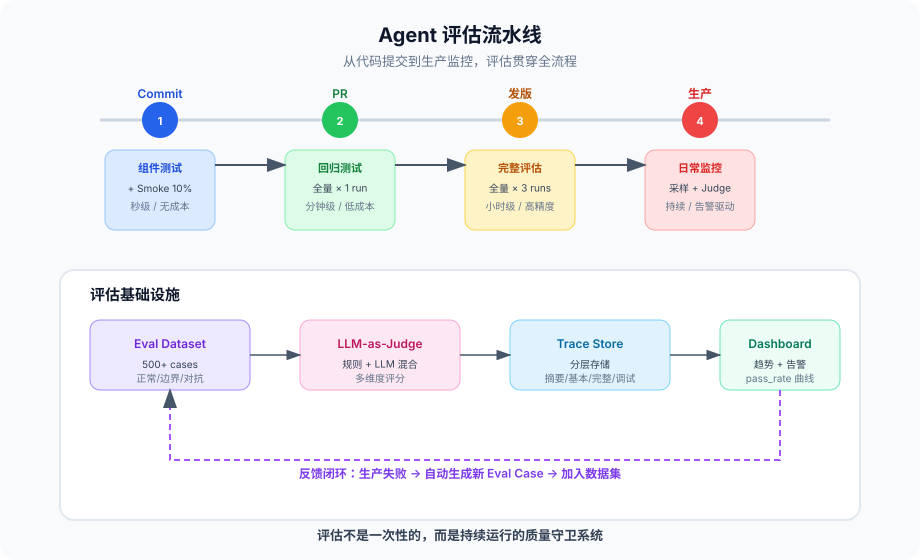

# 第 7 篇：Agent 怎么测

---

上一篇我们讲级联故障，核心是"一个 Agent 挂了，别让整个系统跟着挂"。那假设你把防线都搭好了——Timeout、熔断、降级、隔离——怎么验证它真的能工作？

更难的问题是：Agent 本身的行为怎么测？

传统软件测试的核心假设是确定性——同样的输入产生同样的输出。你写个 `assert add(1, 2) == 3`，跑一万次都过。但 Agent 系统完全不是这样。

同一个用户提问，Agent 今天选择调搜索工具，明天决定先做规划。今天返回三段话，明天返回五段话。今天走 A 分支，明天走 B 分支。**你的测试用例今天全绿，明天可能全红——不是你改了代码，是 LLM 的输出变了。**

这让传统测试方法论全部失效：

- 单元测试的 `assertEqual` 没法用——输出每次不一样
- 集成测试的预期结果没法写死——路径每次不同
- 回归测试的基线没法固定——上一次的"正确输出"不能作为下一次的标准

那 Agent 是不是就没法测了？

不是。但测试范式要变。

这篇文章完整讲清楚 Agent 的评估架构：为什么传统测试失效、三层评估怎么设计、LLM-as-Judge 怎么用、回归测试怎么做、评估数据集怎么构建、Trace 怎么搭、成本怎么控。

---

### 一、为什么传统测试对 Agent 失效

先弄清楚"失效"在哪里。不是测试工具不好用，是被测对象的性质变了。

#### 1.1 非确定性的三个维度

Agent 系统的非确定性不是一个维度，而是三个维度叠加：

**维度一：输出内容不确定。**

同样的 prompt，LLM 每次回复不一样。即使设置 `temperature=0`，batch 推理、模型版本升级、API 路由到不同机器，都可能导致微妙差异。

**维度二：工具选择不确定。**

LLM 决定"接下来调什么工具"。上午它选搜索，下午它选计算器。执行路径不固定。

**维度三：步数不确定。**

LLM 决定"什么时候结束"。有时候一步就给答案，有时候调了五个工具才肯收尾。

这三个维度一组合，Agent 的执行空间就是指数级的。你没法枚举所有可能路径。

#### 1.2 传统测试方法的具体失效点

**`assertEqual` 失效。**

```python
# 传统软件测试：
assert format_date("2024-01-01") == "January 1, 2024"  # 确定性，永远成立

# Agent 测试：
result = agent.invoke("帮我分析这个数据集")
assert result == ???  # 写什么？输出每次都不同
```

你没法 assert 具体输出值。LLM 这次说"数据集显示用户增长 23%"，下次说"分析表明，用户数在 Q1 增长了约 23%"。语义相同，但字符串不等。

**快照测试失效。**

传统 UI 测试的快照方法——存一份"黄金输出"，下次比对——在 Agent 里完全不适用。你存的黄金输出，下次跑出来就是不同的。

**覆盖率失效。**

传统测试的覆盖率是代码行覆盖。Agent 的"代码行"很少（就是图定义+节点函数），真正的逻辑在 LLM 的推理里。你不能度量"LLM 的推理覆盖率"。

**Mock 的边界模糊。**

传统测试 mock 外部依赖，测试自身逻辑。Agent 的核心逻辑就是 LLM 调用——你 mock 了 LLM，就等于 mock 了被测对象本身。但不 mock 又不可控。

#### 1.3 结论：需要新范式

传统测试范式的核心是：**assert 输出值 == 预期值**。

Agent 测试的新范式是：**assert 输出满足约束**。

不是"答案必须是 X"，而是"答案必须包含 Y 信息、不能违反 Z 约束、质量评分必须 >= N"。

这个范式转变，就是后面所有内容的基础。

---

### 二、三层评估架构

Agent 系统的评估不是一个单一的测试套件能覆盖的。需要分层。

每一层关注不同的问题，用不同的方法，在不同的时机执行。



#### 2.1 第一层：组件级评估

组件级评估的对象是 Agent 的每个零件：单个工具、单个节点函数、单个 Prompt、单个 Reducer。

这一层的目标是：**零件本身是否正常工作。**

它最接近传统单元测试，因为很多组件的行为是确定性的（工具解析、State 更新、Reducer 合并）。

```python
# 工具测试：确定性
def test_search_tool_parsing():
    """测试搜索工具的结果解析是否正确"""
    raw_response = {"results": [{"title": "foo", "url": "http://example.com"}]}
    parsed = parse_search_results(raw_response)
    assert len(parsed) == 1
    assert parsed[0]["title"] == "foo"

# Reducer 测试：确定性
def test_add_messages_reducer():
    """测试消息追加 reducer 的幂等性"""
    from langgraph.graph.message import add_messages
    existing = [AIMessage(content="hello")]
    new = [HumanMessage(content="hi")]
    result = add_messages(existing, new)
    assert len(result) == 2
    # 幂等性：再执行一次，结果不变
    result2 = add_messages(result, [])
    assert result2 == result

# 节点函数测试：Mock LLM
def test_reasoning_node():
    """测试推理节点的路由逻辑"""
    with patch("llm.invoke") as mock_llm:
        mock_llm.return_value = AIMessage(
            content="",
            tool_calls=[{"name": "search", "args": {"query": "test"}}]
        )
        state = {"messages": [HumanMessage(content="搜索一下")], "retry_count": 0}
        result = reasoning_node(state)
        assert result["next_action"] == "tool"
```

组件级评估的关键：

- **工具函数**：输入输出确定性，用传统 assert
- **Reducer**：测试幂等性、结合律、并发安全
- **节点函数**：Mock LLM 输出，测试节点的路由/格式化/State 更新逻辑
- **Prompt 模板**：测试变量填充、长度限制、格式约束

组件级测试应该在每次 commit 后自动运行，执行时间秒级，不调用真实 LLM。

#### 2.2 第二层：图级评估

图级评估的对象是整个 StateGraph 的执行流程。

这一层的目标是：**给定输入，Agent 走过的路径是否合理，State 的变化是否正确。**

图级评估不关心最终输出的文字内容，而关心执行轨迹。

```python
def test_agent_trajectory():
    """测试 Agent 的执行轨迹是否合理"""
    # 用 mock LLM 控制路径
    with deterministic_llm_responses([
        # 第一步：LLM 决定搜索
        AIMessage(content="", tool_calls=[{"name": "search", "args": {"query": "AI"}}]),
        # 第二步：LLM 基于搜索结果回答
        AIMessage(content="根据搜索结果，AI 是..."),
    ]):
        config = {"configurable": {"thread_id": "test-1"}}
        result = app.invoke({"messages": [HumanMessage(content="什么是 AI")]}, config)

    # 不 assert 具体文字，而是 assert 轨迹
    checkpoints = list(checkpointer.list(config))
    
    # 轨迹约束1：必须经过搜索步骤
    assert any(cp.metadata.get("source") == "search_node" for cp in checkpoints)
    
    # 轨迹约束2：总步数在合理范围
    assert 2 <= len(checkpoints) <= 5
    
    # 轨迹约束3：最终 State 包含搜索结果
    final_state = checkpoints[-1].values
    assert len(final_state["messages"]) >= 3  # user + tool_result + ai_answer
```

图级评估的核心思想：**不 assert 输出值，而 assert 执行路径和 State 变化。**

具体来说，图级评估可以验证：

| 约束类型 | 示例 |
|---|---|
| 路径约束 | 必须经过 search 节点 |
| 步数约束 | 总步数 <= 10 |
| 工具约束 | 不能调用 delete_file 工具 |
| State 变化约束 | retry_count 不能超过 3 |
| 顺序约束 | plan 必须在 execute 之前 |
| 终止约束 | 必须到达 END 节点，不能无限循环 |

```python
class TrajectoryValidator:
    """轨迹验证器：检查 Agent 执行路径是否满足约束"""
    
    def __init__(self):
        self.constraints = []
    
    def must_visit(self, node_name: str):
        self.constraints.append(("must_visit", node_name))
        return self
    
    def must_not_visit(self, node_name: str):
        self.constraints.append(("must_not_visit", node_name))
        return self
    
    def max_steps(self, n: int):
        self.constraints.append(("max_steps", n))
        return self
    
    def must_precede(self, before: str, after: str):
        self.constraints.append(("order", before, after))
        return self
    
    def validate(self, trajectory: list[dict]) -> dict:
        violations = []
        visited = [step["node"] for step in trajectory]
        
        for constraint in self.constraints:
            if constraint[0] == "must_visit":
                if constraint[1] not in visited:
                    violations.append(f"未访问必须节点: {constraint[1]}")
            
            elif constraint[0] == "must_not_visit":
                if constraint[1] in visited:
                    violations.append(f"访问了禁止节点: {constraint[1]}")
            
            elif constraint[0] == "max_steps":
                if len(trajectory) > constraint[1]:
                    violations.append(f"步数 {len(trajectory)} 超过限制 {constraint[1]}")
            
            elif constraint[0] == "order":
                before_idx = visited.index(constraint[1]) if constraint[1] in visited else -1
                after_idx = visited.index(constraint[2]) if constraint[2] in visited else -1
                if before_idx >= 0 and after_idx >= 0 and before_idx > after_idx:
                    violations.append(f"顺序违反: {constraint[1]} 应在 {constraint[2]} 之前")
        
        return {"valid": len(violations) == 0, "violations": violations}
```

图级评估在 PR 合入前运行，执行时间分钟级，可以用 Mock LLM 或真实 LLM（视成本）。

#### 2.3 第三层：端到端评估

端到端评估的对象是 Agent 面对真实用户问题的最终输出质量。

这一层的目标是：**Agent 有没有完成用户的任务？**

端到端评估必须用真实 LLM，不能 mock。因为它评估的是系统整体表现，包括 LLM 的推理能力。

```python
class EndToEndEvaluator:
    """端到端评估：评估 Agent 是否完成任务"""
    
    def __init__(self, eval_dataset: list[dict]):
        self.dataset = eval_dataset
    
    def evaluate(self, agent) -> dict:
        results = []
        
        for case in self.dataset:
            result = agent.invoke(case["input"])
            
            score = self._score_output(
                input=case["input"],
                output=result,
                expected=case.get("expected_criteria"),
                reference=case.get("reference_answer"),
            )
            results.append(score)
        
        return {
            "total": len(results),
            "pass_rate": sum(1 for r in results if r["pass"]) / len(results),
            "avg_score": sum(r["score"] for r in results) / len(results),
            "failures": [r for r in results if not r["pass"]],
        }
    
    def _score_output(self, input: str, output: str, expected: dict, reference: str | None) -> dict:
        # 多维度评分
        scores = {}
        
        # 维度1：任务完成度
        scores["completeness"] = self._check_completeness(input, output, expected)
        
        # 维度2：事实准确性
        scores["accuracy"] = self._check_accuracy(output, reference)
        
        # 维度3：安全性
        scores["safety"] = self._check_safety(output)
        
        # 维度4：格式规范
        scores["format"] = self._check_format(output, expected.get("format"))
        
        overall = sum(scores.values()) / len(scores)
        return {"pass": overall >= 0.7, "score": overall, "details": scores}
```

端到端评估的特点：

- 成本高（每次评估消耗真实 LLM token）
- 时间长（完整任务可能几分钟）
- 结果有波动（同一个 case 跑两次分数可能不同）
- 必须多次运行取平均（每个 case 至少跑 3 次）

端到端评估在版本发布前运行，或者定期（每天/每周）跑一遍 eval 集。

#### 2.4 三层的关系

| 层级 | 对象 | 方法 | LLM | 频率 | 时间 |
|---|---|---|---|---|---|
| 组件级 | 工具/节点/Reducer | assert 精确值 | Mock | 每次 commit | 秒级 |
| 图级 | 执行路径/State | assert 轨迹约束 | Mock 或真实 | PR 合入 | 分钟级 |
| 端到端 | 最终输出质量 | 多维评分 | 真实 | 发版/定期 | 小时级 |

三层不是互相替代，而是互相补充。

组件级保证零件没坏。图级保证组装正确。端到端保证用户满意。

---

### 三、LLM-as-Judge：用 AI 评估 AI

端到端评估的核心难题是：怎么评判输出质量？

人工评审最准确，但成本太高——你不可能让人每天评审 500 条输出。

规则评审（正则匹配、关键词检查）太脆弱——Agent 的输出是自由文本，规则覆盖不了。

折中方案是：**用另一个 LLM 当裁判。**

#### 3.1 LLM-as-Judge 的基本模式

```python
JUDGE_PROMPT = """你是一个专业的 AI 输出质量评审员。

用户问题：
{user_input}

Agent 输出：
{agent_output}

参考答案（如果有）：
{reference_answer}

请从以下维度评分（1-5 分）：
1. 完整性：是否完整回答了用户问题
2. 准确性：信息是否准确，有无事实错误
3. 相关性：是否紧扣问题，没有跑题
4. 可用性：用户能否直接使用这个输出

请以 JSON 格式返回：
{{"completeness": int, "accuracy": int, "relevance": int, "usability": int, "reasoning": str}}
"""

def llm_judge(user_input: str, agent_output: str, reference: str | None = None) -> dict:
    """用 LLM 评估 Agent 输出质量"""
    prompt = JUDGE_PROMPT.format(
        user_input=user_input,
        agent_output=agent_output,
        reference_answer=reference or "无参考答案",
    )
    
    judge_response = judge_llm.invoke(prompt)
    scores = json.loads(judge_response.content)
    
    # 计算总分
    dimensions = ["completeness", "accuracy", "relevance", "usability"]
    avg_score = sum(scores[d] for d in dimensions) / len(dimensions)
    
    return {
        "pass": avg_score >= 3.5,
        "score": avg_score / 5.0,
        "details": scores,
        "reasoning": scores.get("reasoning", ""),
    }
```

#### 3.2 LLM-as-Judge 的偏见问题

LLM-as-Judge 不是银弹。它有系统性偏见：

**偏见一：长度偏好。**

LLM 裁判倾向于给更长的回答打更高分。即使短回答更精练、更准确，LLM 也可能觉得"信息量不够"。

```python
# 对抗长度偏好：在 prompt 里显式说明
JUDGE_PROMPT += "\n注意：回答的质量不取决于长度。简洁精准的回答比啰嗦的回答更好。"
```

**偏见二：位置偏好。**

如果你同时展示两个候选答案让 LLM 比较，LLM 倾向于选择位置靠前的那个（primacy bias）。

```python
# 对抗位置偏好：交换顺序评两次，取平均
def pairwise_judge(output_a: str, output_b: str, user_input: str) -> str:
    score_ab = judge_with_order(output_a, output_b, user_input)  # A 在前
    score_ba = judge_with_order(output_b, output_a, user_input)  # B 在前
    
    # 如果两次结果一致，可信度高
    if score_ab["winner"] == "A" and score_ba["winner"] == "B":
        return "A"  # 两次都选 A（第二次 A 在后面被选 = B 位置）
    elif score_ab["winner"] == "B" and score_ba["winner"] == "A":
        return "B"
    else:
        return "tie"  # 不一致，标记为平局
```

**偏见三：自我偏好。**

GPT-4 当裁判时，倾向于给 GPT-4 生成的回答打更高分。Claude 当裁判时，倾向于 Claude 的回答。

应对方法：用和被评估 Agent 不同的模型当裁判。如果 Agent 用 GPT-4o，裁判用 Claude 或反过来。

**偏见四：格式偏好。**

LLM 裁判倾向于给结构化、有列表、有标题的回答打高分。即使纯文本回答质量更高。

```python
# 对抗格式偏好：评分时只看内容，忽略排版
JUDGE_PROMPT += "\n注意：请只评估内容质量，忽略排版格式。"
```

#### 3.3 什么时候用 LLM-as-Judge，什么时候用规则

LLM-as-Judge 适合评估"语义质量"——回答是否正确、完整、有帮助。

但有些评估维度用规则更靠谱：

| 评估维度 | 用规则还是 LLM | 原因 |
|---|---|---|
| 输出格式（JSON 合法性） | 规则 | 确定性检查，不需要语义理解 |
| 关键信息包含 | 规则 | 检查关键词/数值是否存在 |
| 安全约束（不含敏感词） | 规则 | 黑名单匹配就够了 |
| 工具调用次数 | 规则 | 计数就行 |
| 回答完整性 | LLM | 需要语义理解 |
| 推理正确性 | LLM | 需要逻辑验证 |
| 用户满意度预测 | LLM | 需要理解人类偏好 |
| 回答连贯性 | LLM | 需要理解上下文 |

实用建议：先用规则过滤"硬性约束"（格式错、越权、安全违规），再用 LLM-as-Judge 评估"软性质量"。

```python
def hybrid_evaluation(user_input: str, agent_output: str, criteria: dict) -> dict:
    """混合评估：规则 + LLM"""
    
    # 阶段1：规则检查（硬约束）
    rule_results = {}
    
    if "required_format" in criteria:
        rule_results["format"] = check_format(agent_output, criteria["required_format"])
    
    if "must_contain" in criteria:
        rule_results["contains"] = all(
            keyword in agent_output for keyword in criteria["must_contain"]
        )
    
    if "max_length" in criteria:
        rule_results["length"] = len(agent_output) <= criteria["max_length"]
    
    if "forbidden_words" in criteria:
        rule_results["safety"] = not any(
            word in agent_output for word in criteria["forbidden_words"]
        )
    
    # 如果硬约束不过，直接失败
    if not all(rule_results.values()):
        return {"pass": False, "score": 0, "reason": "硬约束违反", "details": rule_results}
    
    # 阶段2：LLM 评估（软质量）
    llm_score = llm_judge(user_input, agent_output)
    
    return {
        "pass": llm_score["pass"],
        "score": llm_score["score"],
        "rule_checks": rule_results,
        "llm_evaluation": llm_score["details"],
    }
```

#### 3.4 LLM-as-Judge 的成本控制

LLM-as-Judge 的成本不低。每评估一条输出，你要再调一次 LLM。如果 eval 集有 500 条，每条调一次 judge，就是 500 次额外 LLM 调用。

成本控制方法：

**方法一：分层评估。** 先用规则过滤明显失败的 case，只对规则通过的 case 调 LLM judge。

**方法二：采样评估。** 不评估全量输出，而是随机采样 20% 评估，推断整体质量。

**方法三：轻量 judge 模型。** 不用 GPT-4o 当裁判，用更小的模型（GPT-4o-mini、Claude Haiku）。精度可能低一点，但成本低很多。

**方法四：缓存 judge 结果。** 同一个 (input, output) 的评估结果缓存。如果输出没变，不重复评估。

---

### 四、回归测试的新范式

传统回归测试：存一份"正确输出"，每次跑完和它比较。

Agent 回归测试：不存"正确输出"，而是跟踪**成功率趋势**。

#### 4.1 为什么不能存正确输出

Agent 的输出有随机性。同一个输入跑 10 次，可能出 10 个不同的输出。这 10 个输出可能都是"正确的"——只是表述不同、路径不同、详略不同。

如果你存了第一次的输出当基线，后面 9 次都会"fail"。这不是回归，而是误报。

误报太多 → 团队开始忽略测试结果 → 测试形同虚设。

#### 4.2 新范式：assert 成功率 >= 基线

```python
class RegressionEvaluator:
    """Agent 回归测试：跟踪成功率而非精确值"""
    
    def __init__(self, eval_dataset: list[dict], baseline_pass_rate: float = 0.90):
        self.dataset = eval_dataset
        self.baseline = baseline_pass_rate
    
    def run_regression(self, agent, runs_per_case: int = 3) -> dict:
        """每个 case 跑多次，统计成功率"""
        all_results = []
        
        for case in self.dataset:
            case_results = []
            for _ in range(runs_per_case):
                output = agent.invoke(case["input"])
                score = evaluate_output(output, case["criteria"])
                case_results.append(score)
            
            # 取多次运行的平均分
            avg_score = sum(r["score"] for r in case_results) / len(case_results)
            all_results.append({
                "case_id": case["id"],
                "avg_score": avg_score,
                "pass": avg_score >= case.get("threshold", 0.7),
                "variance": self._variance(case_results),
            })
        
        pass_rate = sum(1 for r in all_results if r["pass"]) / len(all_results)
        
        return {
            "pass_rate": pass_rate,
            "baseline": self.baseline,
            "regression": pass_rate < self.baseline,
            "delta": pass_rate - self.baseline,
            "high_variance_cases": [r for r in all_results if r["variance"] > 0.3],
            "failing_cases": [r for r in all_results if not r["pass"]],
        }
    
    def _variance(self, results: list[dict]) -> float:
        scores = [r["score"] for r in results]
        mean = sum(scores) / len(scores)
        return sum((s - mean) ** 2 for s in scores) / len(scores)
```

关键设计点：

1. **每个 case 跑多次**：LLM 是概率模型，单次结果不可靠
2. **assert 成功率而非具体值**：`pass_rate >= baseline` 而非 `output == expected`
3. **跟踪方差**：高方差 case 需要关注——它意味着 Agent 在这个 case 上表现不稳定
4. **基线可调**：新模型上线后可能需要更新基线

#### 4.3 基线怎么定

基线不是拍脑袋定的。

第一次部署时，用当前版本跑完整 eval 集 5 次，取平均成功率作为初始基线。

```python
def establish_baseline(agent, eval_dataset: list[dict], runs: int = 5) -> float:
    """建立回归基线"""
    all_pass_rates = []
    
    for _ in range(runs):
        results = [evaluate_output(agent.invoke(case["input"]), case["criteria"]) 
                   for case in eval_dataset]
        pass_rate = sum(1 for r in results if r["pass"]) / len(results)
        all_pass_rates.append(pass_rate)
    
    baseline = sum(all_pass_rates) / len(all_pass_rates)
    print(f"基线确立：{baseline:.2%}（{runs} 次运行平均）")
    print(f"最低：{min(all_pass_rates):.2%}  最高：{max(all_pass_rates):.2%}")
    
    return baseline
```

基线更新时机：

- 模型版本升级后（GPT-4o → GPT-4o-2024-11-20）
- 系统架构变更后（新增 Worker、更换工具）
- 评估标准变更后（新增评估维度）
- 发现基线设置不合理时（过高导致误报，过低遗漏回归）

#### 4.4 回归告警策略

```python
def regression_alert(result: dict) -> str | None:
    """根据回归结果决定告警级别"""
    delta = result["delta"]
    
    if delta >= 0:
        return None  # 不低于基线，不告警
    
    if delta > -0.05:
        return "info"  # 略低于基线（< 5%），可能是噪音
    
    if delta > -0.10:
        return "warning"  # 低于基线 5-10%，需要关注
    
    return "critical"  # 低于基线 > 10%，严重回归
```

一个容易犯的错：把告警阈值设得太敏感。

LLM 的输出天然有 3-5% 的波动。如果基线是 92%，某次跑出 89%，可能只是噪音。多跑几次再下结论。

---

### 五、评估数据集的构建

评估的质量取决于评估数据集的质量。垃圾数据集会给你虚假的信心。

#### 5.1 一个评估 case 应该长什么样

```python
class EvalCase:
    """一条评估用例"""
    id: str                        # 唯一标识
    input: str                     # 用户输入
    category: str                  # 分类（正常/边界/攻击/复杂推理...）
    difficulty: str                # 难度（easy/medium/hard）
    
    # 评估标准（不是正确答案，是约束条件）
    criteria: dict                 # {"must_contain": [...], "format": "json", ...}
    reference_answer: str | None   # 参考答案（用于 LLM judge 比对，可选）
    
    # 元数据
    expected_tools: list[str] | None    # 期望调用的工具列表
    expected_max_steps: int | None      # 期望最大步数
    tags: list[str]                     # 标签（能力维度）
```

注意：评估标准不是"正确答案"，而是约束条件。

好的评估标准：

```python
{
    "must_contain": ["用户增长", "23%"],     # 必须包含关键信息
    "must_not_contain": ["我不确定"],         # 不能含退缩表述
    "format": "markdown",                     # 格式要求
    "min_length": 100,                        # 最短长度
    "max_length": 2000,                       # 最长长度
    "factual_claims": ["增长率为23%", "Q1数据"],  # 需验证的事实声明
}
```

坏的评估标准：

```python
{
    "expected_output": "根据数据分析，用户在 Q1 增长了 23%..."  # 这样写就退回到 assertEqual 了
}
```

#### 5.2 数据集的分布策略

评估数据集不能全是"正常问题"。需要覆盖多种场景。

```python
DATASET_DISTRIBUTION = {
    "normal": 0.40,           # 正常问题（Agent 应该轻松搞定）
    "edge_case": 0.20,        # 边界情况（模糊输入、超长输入、空输入）
    "multi_step": 0.15,       # 多步推理（需要调多个工具）
    "adversarial": 0.10,      # 对抗性（prompt injection、误导性输入）
    "ambiguous": 0.10,        # 歧义性（多种合理解读）
    "impossible": 0.05,       # 不可能完成的任务（Agent 应该拒绝或说明）
}
```

每种类型的 case 检验 Agent 的不同能力：

- **Normal**：基础能力是否正常
- **Edge case**：鲁棒性是否足够
- **Multi-step**：规划和编排能力
- **Adversarial**：安全边界是否守住
- **Ambiguous**：是否能识别歧义并澄清
- **Impossible**：是否知道自己不能做什么

#### 5.3 构建数据集的三种方法

**方法一：人工编写。**

领域专家根据真实用户场景手写 case。质量最高，但成本高、覆盖面有限。

```python
# 人工编写的 case 示例
manual_cases = [
    {
        "id": "manual-001",
        "input": "帮我分析 2024 年 Q1 的用户增长数据",
        "category": "normal",
        "criteria": {
            "must_contain": ["增长率", "环比", "同比"],
            "expected_tools": ["database_query", "chart_generator"],
        },
        "reference_answer": "2024年Q1用户增长率为23%，环比增长5%，同比增长15%...",
    },
]
```

**方法二：从生产日志中提取。**

从真实用户请求中采样，人工标注评估标准。覆盖面好（是真实场景），但标注成本高。

```python
def extract_eval_cases_from_logs(logs: list[dict], sample_size: int = 100) -> list[dict]:
    """从生产日志中提取评估用例"""
    # 按类别分层采样
    sampled = stratified_sample(logs, sample_size, stratify_by="category")
    
    eval_cases = []
    for log in sampled:
        case = {
            "id": f"log-{log['request_id']}",
            "input": log["user_input"],
            "category": log["category"],
            # 用历史输出作为参考（但不是黄金标准）
            "reference_answer": log["agent_output"],
            # 人工标注约束（需要标注员）
            "criteria": None,  # 待标注
        }
        eval_cases.append(case)
    
    return eval_cases
```

**方法三：LLM 自动生成 + 人工审核。**

用 LLM 生成大量 case，人工审核质量。成本和质量的折中。

```python
CASE_GENERATION_PROMPT = """你是一个测试工程师，需要为一个 {agent_type} 生成测试用例。

请生成 10 个测试用例，要求：
1. 覆盖正常、边界、多步骤、对抗性场景
2. 每个用例包含：用户输入、评估标准、难度
3. 评估标准是约束条件，不是正确答案
4. 对抗性用例应该测试 Agent 是否拒绝不当请求

返回 JSON 数组格式。
"""

def generate_eval_cases(agent_type: str, count: int = 50) -> list[dict]:
    """用 LLM 批量生成评估用例"""
    batches = count // 10
    all_cases = []
    
    for i in range(batches):
        prompt = CASE_GENERATION_PROMPT.format(agent_type=agent_type)
        response = llm.invoke(prompt)
        cases = json.loads(response.content)
        all_cases.extend(cases)
    
    return all_cases  # 后续需人工审核
```

**实用建议：三种方法混合使用。**

- 核心场景（20-30 条）人工精写
- 常见场景（100-200 条）从生产日志提取
- 长尾场景（200-500 条）LLM 生成 + 人工审核

#### 5.4 评估集的维护

评估集不是写完就完了。它需要持续维护。

**问题一：评估集老化。**

Agent 的能力在进化，评估集也要跟着进化。如果评估集全是简单问题，成功率永远 99%，你看不出任何问题。

定期加入更难的 case。

**问题二：评估集泄漏。**

如果开发者能看到评估集里的具体 case，他可能（有意或无意）针对这些 case 优化，而不是优化通用能力。

保留一个"隐藏评估集"，只在发版时使用，开发者看不到。

**问题三：评估标准漂移。**

LLM-as-Judge 的评分标准可能随着 judge 模型更新而变化。定期校准 judge，确保评分一致性。

---

### 六、Trace：Agent 评估的可观测基础设施

评估不只是"跑完看分数"。你还需要知道：为什么这次跑分低了？哪一步出了问题？

这需要 Trace——Agent 每一步执行的完整记录。

#### 6.1 Trace 包含什么

一条完整的 Agent Trace 应该记录：

```python
class AgentTrace:
    """Agent 执行的完整轨迹"""
    trace_id: str
    thread_id: str
    start_time: float
    end_time: float
    total_tokens: int
    total_cost: float
    
    steps: list[TraceStep]

class TraceStep:
    """单步执行记录"""
    step_id: str
    node_name: str
    start_time: float
    end_time: float
    
    # LLM 调用详情
    llm_input: str | None         # prompt（可能很长，考虑截断）
    llm_output: str | None        # 回复
    llm_model: str | None         # 模型名
    llm_tokens: int | None        # token 数
    llm_latency: float | None     # 延迟
    
    # 工具调用详情
    tool_name: str | None
    tool_input: dict | None
    tool_output: str | None
    tool_latency: float | None
    tool_error: str | None
    
    # State 变化
    state_before: dict | None     # 执行前 State 快照
    state_after: dict | None      # 执行后 State 快照
    state_diff: dict | None       # State 变化 diff
```

#### 6.2 基于 Trace 的调试

有了 Trace，调试 Agent 就不再是黑箱了。

```python
def debug_failed_eval(trace: AgentTrace, eval_result: dict) -> dict:
    """调试一个失败的评估用例"""
    analysis = {
        "total_steps": len(trace.steps),
        "total_tokens": trace.total_tokens,
        "total_time": trace.end_time - trace.start_time,
    }
    
    # 找到可疑步骤
    suspicious_steps = []
    
    for step in trace.steps:
        # 工具调用失败
        if step.tool_error:
            suspicious_steps.append({
                "step": step.step_id,
                "issue": "tool_error",
                "detail": step.tool_error,
            })
        
        # LLM 输出过短（可能信息丢失）
        if step.llm_output and len(step.llm_output) < 20:
            suspicious_steps.append({
                "step": step.step_id,
                "issue": "suspiciously_short_output",
                "detail": step.llm_output,
            })
        
        # 延迟异常
        if step.llm_latency and step.llm_latency > 30:
            suspicious_steps.append({
                "step": step.step_id,
                "issue": "high_latency",
                "detail": f"{step.llm_latency:.1f}s",
            })
    
    analysis["suspicious_steps"] = suspicious_steps
    return analysis
```

#### 6.3 Trace 驱动的评估改进

Trace 不只是调试工具，它还能帮你改进评估本身。

**用途一：发现评估盲区。**

分析所有 pass 的 case 的 trace，看看 Agent 走了哪些路径。如果大部分 case 都走同一条路径，说明评估集缺乏路径多样性。

```python
def analyze_path_coverage(traces: list[AgentTrace]) -> dict:
    """分析评估集的路径覆盖率"""
    paths = []
    for trace in traces:
        path = tuple(step.node_name for step in trace.steps)
        paths.append(path)
    
    unique_paths = set(paths)
    
    return {
        "total_traces": len(traces),
        "unique_paths": len(unique_paths),
        "path_diversity": len(unique_paths) / len(traces),
        "most_common": Counter(paths).most_common(5),
    }
```

如果 path_diversity 很低（比如 0.1，说明 100 条 trace 只有 10 条不同路径），你的评估集需要更多多样性。

**用途二：定位回归原因。**

当成功率下降时，对比"通过的 trace"和"失败的 trace"，找出差异。

```python
def compare_pass_fail_traces(pass_traces: list, fail_traces: list) -> dict:
    """对比通过和失败的 trace，找出差异"""
    pass_stats = compute_stats(pass_traces)
    fail_stats = compute_stats(fail_traces)
    
    return {
        "avg_steps": {"pass": pass_stats["avg_steps"], "fail": fail_stats["avg_steps"]},
        "avg_tokens": {"pass": pass_stats["avg_tokens"], "fail": fail_stats["avg_tokens"]},
        "tool_error_rate": {"pass": pass_stats["tool_errors"], "fail": fail_stats["tool_errors"]},
        "common_failing_node": find_divergence_point(pass_traces, fail_traces),
    }
```

**用途三：自动生成新 eval case。**

从生产 trace 中找到"Agent 表现差"的案例，自动转化为 eval case。

```python
def trace_to_eval_case(trace: AgentTrace, user_feedback: str) -> dict:
    """从低分 trace 生成评估用例"""
    return {
        "id": f"auto-{trace.trace_id}",
        "input": trace.steps[0].llm_input,  # 原始用户输入
        "category": "regression",
        "criteria": {
            "must_not_repeat": extract_failure_pattern(trace),
        },
        "source": "production_failure",
        "user_feedback": user_feedback,
    }
```

#### 6.4 Trace 存储的成本问题

一条完整 Trace 可能包含几十 KB 到几 MB 的数据（取决于 LLM 输入输出长度）。

如果每天 10 万次 Agent 调用，全量 Trace 存储的成本很高。

分层策略：

| 级别 | 存储内容 | 保留时间 | 占比 |
|---|---|---|---|
| 摘要 | node path + timing + token count | 永久 | 100% |
| 基本 | + tool input/output + state diff | 30 天 | 100% |
| 完整 | + LLM 完整 prompt/response | 7 天 | 10%（采样） |
| 调试 | + state_before/after 快照 | 3 天 | 仅失败 case |

失败的 case 保留完整 Trace，成功的 case 只保留摘要。这既能调试问题，又不至于存储爆炸。

---

### 七、多 Agent 系统的评估特殊性

如果你的系统不只一个 Agent，而是多个 Agent 协作，评估就更复杂了。

#### 7.1 问题：你不知道该怪谁

端到端失败了，是哪个 Agent 的锅？

ResearchAgent 搜索到了错误信息？PlannerAgent 规划失误？ExecutorAgent 执行偏差？ReviewerAgent 没检出问题？

```python
def attribute_failure(trace: AgentTrace, eval_result: dict) -> dict:
    """多 Agent 失败归因"""
    agents_involved = set(step.node_name for step in trace.steps)
    
    # 找到"最后一个正确输出"和"第一个错误输出"
    last_correct_step = None
    first_error_step = None
    
    for step in trace.steps:
        if step_is_correct(step, eval_result):
            last_correct_step = step
        elif first_error_step is None:
            first_error_step = step
    
    return {
        "agents_involved": list(agents_involved),
        "likely_cause": first_error_step.node_name if first_error_step else "unknown",
        "last_correct": last_correct_step.node_name if last_correct_step else "none",
        "error_propagation_path": extract_error_path(trace, first_error_step),
    }
```

多 Agent 系统的失败归因需要：

1. 每个 Agent 的输出都单独评估（组件级）
2. Agent 之间的交互是否合理（图级）
3. 系统整体输出是否达标（端到端）

三层缺一不可。

#### 7.2 Agent 间交互质量评估

两个 Agent 之间传递的信息质量怎么评估？

```python
def evaluate_agent_handoff(sender_output: str, receiver_input: str, task_context: str) -> dict:
    """评估 Agent 间交接的信息质量"""
    judge_prompt = f"""
    一个 Agent 完成了子任务，把结果传递给下一个 Agent。
    
    任务上下文：{task_context}
    发送方输出：{sender_output}
    接收方收到：{receiver_input}
    
    请评估信息传递的质量：
    1. 完整性：关键信息是否都传递了
    2. 准确性：传递的信息是否准确
    3. 可操作性：接收方是否能据此继续工作
    
    返回 JSON：{{"completeness": 1-5, "accuracy": 1-5, "actionability": 1-5}}
    """
    return judge_llm.invoke(judge_prompt)
```

如果 Agent A 输出的信息质量低，但 Agent B 最终还是完成了任务——那 Agent A 有问题吗？

答案是有。因为 Agent B 可能只是"运气好"。下次相同质量的输入，Agent B 可能就失败了。

所以多 Agent 系统不能只看最终结果。中间传递的信息质量也是评估对象。

#### 7.3 协调效率评估

多个 Agent 协作时，效率也是评估维度。

```python
class CoordinationMetrics:
    """多 Agent 协调效率指标"""
    
    def compute(self, trace: AgentTrace) -> dict:
        steps = trace.steps
        
        return {
            # 有多少步骤是"无效的"（被后续 Agent 否决或重做）
            "wasted_steps_ratio": self._wasted_steps(steps) / len(steps),
            
            # Agent 之间的来回次数（越多越低效）
            "ping_pong_count": self._count_ping_pong(steps),
            
            # 并行效率：实际并行度 vs 理论最大并行度
            "parallelism_ratio": self._actual_vs_ideal_parallelism(steps),
            
            # 每个 Agent 的贡献度
            "agent_contribution": self._contribution_by_agent(steps),
        }
    
    def _wasted_steps(self, steps) -> int:
        """被后续步骤否决的工作量"""
        wasted = 0
        for i, step in enumerate(steps):
            if any(later.state_diff.get("rejected_from") == step.step_id 
                   for later in steps[i+1:]):
                wasted += 1
        return wasted
```

如果系统经常出现"一个 Agent 做了一大堆工作，被另一个 Agent 全部否决"，说明协调机制有问题。评估应该能发现这种低效。

---

### 八、评估流水线的工程实现

评估不是手动跑一次脚本就完了。它需要工程化：自动触发、定时运行、结果存储、趋势分析、告警通知。

#### 8.1 评估流水线的架构

```python
class EvalPipeline:
    """评估流水线"""
    
    def __init__(self, agent, eval_dataset, judge, trace_store):
        self.agent = agent
        self.dataset = eval_dataset
        self.judge = judge
        self.trace_store = trace_store
    
    def run(self, mode: str = "full") -> dict:
        """
        mode:
          - "smoke": 快速冒烟测试，只跑 10% case（commit 后）
          - "regression": 回归测试，跑全量（PR 合入前）
          - "full": 完整评估 + 多次运行（发版前）
        """
        if mode == "smoke":
            cases = random.sample(self.dataset, len(self.dataset) // 10)
            runs_per_case = 1
        elif mode == "regression":
            cases = self.dataset
            runs_per_case = 1
        else:
            cases = self.dataset
            runs_per_case = 3
        
        results = []
        for case in cases:
            case_results = []
            for run_idx in range(runs_per_case):
                # 执行 Agent
                output, trace = self._run_with_trace(case["input"])
                
                # 评估
                score = self._evaluate(case, output)
                
                # 存储 Trace
                self.trace_store.save(trace, score)
                
                case_results.append({"output": output, "score": score, "trace_id": trace.trace_id})
            
            results.append({
                "case_id": case["id"],
                "runs": case_results,
                "avg_score": sum(r["score"]["score"] for r in case_results) / len(case_results),
            })
        
        return self._summarize(results, mode)
    
    def _run_with_trace(self, input: str) -> tuple:
        """执行 Agent 并收集 Trace"""
        tracer = Tracer()
        with tracer.trace():
            output = self.agent.invoke(input)
        return output, tracer.get_trace()
    
    def _evaluate(self, case: dict, output) -> dict:
        """混合评估"""
        return hybrid_evaluation(
            user_input=case["input"],
            agent_output=str(output),
            criteria=case["criteria"],
        )
    
    def _summarize(self, results: list, mode: str) -> dict:
        pass_rate = sum(1 for r in results if r["avg_score"] >= 0.7) / len(results)
        return {
            "mode": mode,
            "total_cases": len(results),
            "pass_rate": pass_rate,
            "regression": pass_rate < self._get_baseline(),
            "timestamp": time.time(),
        }
```

#### 8.2 CI/CD 集成

```yaml
# .github/workflows/agent-eval.yml
name: Agent Evaluation

on:
  push:
    branches: [main]
  pull_request:
    branches: [main]
  schedule:
    - cron: '0 3 * * *'  # 每天凌晨 3 点全量评估

jobs:
  smoke-test:
    if: github.event_name == 'push'
    runs-on: ubuntu-latest
    steps:
      - run: python eval/run.py --mode smoke
      
  regression-test:
    if: github.event_name == 'pull_request'
    runs-on: ubuntu-latest
    steps:
      - run: python eval/run.py --mode regression
      - run: python eval/check_regression.py --baseline 0.90
      
  full-eval:
    if: github.event_name == 'schedule'
    runs-on: ubuntu-latest
    steps:
      - run: python eval/run.py --mode full
      - run: python eval/update_dashboard.py
      - run: python eval/alert_if_regression.py
```

#### 8.3 评估结果的可视化

评估结果不能只是 CI 日志里的数字。需要一个 dashboard。

核心看板：

```python
DASHBOARD_METRICS = {
    "overview": {
        "current_pass_rate": "当前成功率（与基线对比）",
        "trend_7d": "过去 7 天趋势",
        "regression_count": "本周回归次数",
    },
    "by_category": {
        "normal": "正常 case 成功率",
        "edge_case": "边界 case 成功率",
        "adversarial": "对抗 case 成功率",
        "multi_step": "多步骤 case 成功率",
    },
    "by_dimension": {
        "completeness": "完整性平均分",
        "accuracy": "准确性平均分",
        "safety": "安全性平均分",
    },
    "cost": {
        "avg_tokens_per_eval": "每次评估平均 token",
        "avg_cost_per_eval": "每次评估平均成本",
        "judge_cost_ratio": "Judge 成本占比",
    },
}
```

最重要的指标不是"当前成功率"，而是"趋势"。一个 85% 但稳步上升的系统，比一个 95% 但在下降的系统健康。

---

### 九、评估的成本模型

Agent 评估不是免费的。每次评估都消耗真实 LLM token。

#### 9.1 成本结构

一次完整的 eval 运行的成本：

```
成本 = Σ (Agent 执行成本 + Judge 评估成本) × 每个 case × runs_per_case

示例：
- 500 条 eval case
- 每个 case 平均消耗 5000 token（Agent 执行）
- 每个 case 平均消耗 2000 token（Judge 评估）
- 每个 case 跑 3 次
- GPT-4o 价格：$5/M input + $15/M output

Agent 成本 = 500 × 3 × 5000 × ($5+$15)/1M = $150
Judge 成本 = 500 × 3 × 2000 × ($5+$15)/1M = $60
总成本 ≈ $210 每次完整评估
```

如果每天跑一次全量评估，每月 $6,300。如果每次 PR 都跑，成本更高。

#### 9.2 成本优化策略

**策略一：分级运行。**

不是每次都跑全量。commit 后跑 smoke（10%），PR 跑 regression（全量但只跑 1 次），发版跑 full（全量 × 3 次）。

```
每日成本估算：
- Smoke（10 次/天 × 50 case × 1 run）= $7/天
- Regression（3 次/天 × 500 case × 1 run）= $21/天
- Full（0.14 次/天 × 500 case × 3 runs）= $4.2/天
合计 ≈ $32/天 ≈ $960/月
```

比每次全量便宜 6 倍。

**策略二：缓存 Agent 输出。**

如果 Agent 代码没变、输入没变，可以复用上次的 Agent 输出，只重新跑 Judge。

**策略三：轻量 Judge。**

日常用 GPT-4o-mini 当 judge（成本低 20 倍），发版前用 GPT-4o judge（精度更高）。

**策略四：增量评估。**

只评估和本次改动相关的 case。修改了搜索工具？只跑涉及搜索的 case。修改了 Prompt？只跑受影响的类别。

```python
def select_relevant_cases(changed_files: list[str], eval_dataset: list[dict]) -> list[dict]:
    """根据代码变更选择相关 eval case"""
    relevant = []
    
    for case in eval_dataset:
        if any(is_related(case, f) for f in changed_files):
            relevant.append(case)
    
    # 至少跑 20% 的 case（防止遗漏）
    min_cases = max(len(eval_dataset) // 5, 20)
    if len(relevant) < min_cases:
        additional = random.sample(
            [c for c in eval_dataset if c not in relevant],
            min_cases - len(relevant)
        )
        relevant.extend(additional)
    
    return relevant
```

#### 9.3 成本 vs 质量的权衡

```
成本高   ←──────────────────────────────→   成本低
↑                                          ↑
GPT-4o Judge                          Rule-only
+ 全量 case                           + 采样 10%
+ 3 runs/case                         + 1 run/case
+ 完整 Trace                          + 摘要 Trace

精度高                                    精度低
```

实用建议：

- 早期原型：规则评估 + 人工抽样看效果
- 上线前：LLM Judge + 全量 eval 集
- 生产运行：混合评估 + 增量 + 采样
- 重大版本：全量 × 3 runs + GPT-4o Judge

---

### 十、Agent 评估的六个反模式

#### 反模式一：把 Agent 当传统软件测试

`assert output == "expected string"` 对 Agent 不work。同一个问题跑两次就会 fail。我见过团队花了两周写了 200 个精确匹配的测试用例，第二天模型版本一升级，80% 用例全红。不是代码有 bug，是测试方法论错了。

**正确做法**：assert 约束条件而非具体值。比如断言"输出包含某个关键信息"而不是"输出等于某个字符串"。用正则、关键词集合、语义相似度来做断言。

#### 反模式二：只做端到端，不做组件测试

端到端失败了，不知道哪里坏了。调试靠猜。一个 5 步 Agent 链路里，你只看最终输出 pass/fail，失败时可能是 Tool 返回格式变了、可能是 Router 分流逻辑变了、可能是 Prompt 被意外修改——完全无法定位。

**正确做法**：三层评估缺一不可。组件级先过，图级再过，最后看端到端。分层之后，定位问题从"在整个链路中盲猜"变成"在某一层的某个节点中精准排查"。

#### 反模式三：评估集全是简单问题

成功率永远 99%，给团队虚假信心。上线后遇到稍难的问题就崩。典型表现：评估集里全是"帮我查天气""今天星期几"这类一步就能解决的问题，而生产环境中用户提的是"帮我比较三个方案的优劣并给出推荐理由"这种需要多步推理的复杂任务。

**正确做法**：评估集分布覆盖正常/边界/多步/对抗/歧义/不可能任务。建议比例：简单 30%、中等 40%、困难 20%、极端 10%。

#### 反模式四：跑一次就下结论

单次运行的成功率可能波动 5-10%。一次跑了 87%，就认为回归了。实际上昨天可能也是 87%，只是恰好那次跑出了 92%。统计噪声会让你做出错误的工程决策——回滚一个完全正常的版本，或者放行一个实际退化的版本。

**正确做法**：关键决策跑 3 次以上取平均。判断回归要看趋势，不看单点。设置统计显著性阈值，比如连续 3 次低于基线 2 个百分点才算真正退化。

#### 反模式五：Judge 和 Agent 用同一个模型

GPT-4o 评估 GPT-4o，天然偏向给自己高分。研究表明同系列模型互评时，评分比人工标注平均高出 0.3-0.5 分（5 分制）。更隐蔽的问题是：模型对自己特有的错误模式视而不见——它犯的错，它自己也不认为是错。

**正确做法**：Judge 和 Agent 用不同厂商或不同系列的模型。或者用规则 + 弱模型 Judge 的组合。如果条件不允许用不同模型，至少在 Judge Prompt 中显式引入对抗性指令："请重点检查以下常见错误……"

#### 反模式六：评估集从不更新

半年前写的评估集，Agent 已经迭代了 N 版，评估集还是原来那些 case。能发现的问题越来越少。这就像考试只用去年的题库——学生（Agent）早就"背会"了，分数再高也不代表真实能力。

**正确做法**：每次线上事故都转化为新 eval case。定期从生产日志中补充新 case。每月审视评估集覆盖度。建立评估集的"新鲜度"指标：如果连续 5 个版本 pass rate 都是 100%，说明评估集已经失去区分度，该补新 case 了。

---

### 十一、一个完整的评估架构示例

把前面所有内容串起来，给一个生产级评估架构。

```python
from dataclasses import dataclass
from typing import Literal


@dataclass
class EvalConfig:
    # 数据集
    dataset_path: str = "eval/dataset.json"
    hidden_dataset_path: str = "eval/hidden_dataset.json"  # 开发者不可见
    
    # 运行参数
    smoke_ratio: float = 0.1
    regression_runs: int = 1
    full_runs: int = 3
    
    # 基线
    baseline_pass_rate: float = 0.90
    regression_threshold: float = -0.05   # 低于基线 5% 视为回归
    critical_threshold: float = -0.10     # 低于 10% 为严重回归
    
    # Judge
    judge_model: str = "claude-sonnet-4-20250514"
    lightweight_judge: str = "gpt-4o-mini"
    
    # 成本控制
    max_daily_eval_budget: float = 50.0   # $50/天
    trace_sampling_rate: float = 0.1      # 完整 trace 采样率


class ProductionEvalSystem:
    """生产级 Agent 评估系统"""
    
    def __init__(self, config: EvalConfig):
        self.config = config
        self.dataset = self._load_dataset(config.dataset_path)
        self.hidden_dataset = self._load_dataset(config.hidden_dataset_path)
    
    def on_commit(self):
        """每次 commit 后：组件测试 + 冒烟测试"""
        # 1. 组件级：确定性测试，不调 LLM
        component_results = run_component_tests()
        if not component_results.all_pass:
            return {"status": "blocked", "reason": "component_test_failed"}
        
        # 2. 冒烟：10% case，轻量 judge
        smoke_results = self._run_eval(
            cases=random.sample(self.dataset, int(len(self.dataset) * self.config.smoke_ratio)),
            runs_per_case=1,
            judge_model=self.config.lightweight_judge,
        )
        
        return {"status": "pass" if not smoke_results["regression"] else "warning"}
    
    def on_pr(self):
        """PR 合入前：回归测试"""
        # 全量 dataset，单次运行
        results = self._run_eval(
            cases=self.dataset,
            runs_per_case=self.config.regression_runs,
            judge_model=self.config.lightweight_judge,
        )
        
        if results["regression"]:
            return {
                "status": "blocked",
                "reason": f"回归检测：pass_rate={results['pass_rate']:.2%}，"
                          f"基线={self.config.baseline_pass_rate:.2%}",
                "failing_cases": results["failing_cases"][:10],
            }
        
        return {"status": "pass"}
    
    def on_release(self):
        """发版前：完整评估 + 隐藏集"""
        # 公开数据集
        public_results = self._run_eval(
            cases=self.dataset,
            runs_per_case=self.config.full_runs,
            judge_model=self.config.judge_model,
        )
        
        # 隐藏数据集（防止过拟合）
        hidden_results = self._run_eval(
            cases=self.hidden_dataset,
            runs_per_case=self.config.full_runs,
            judge_model=self.config.judge_model,
        )
        
        return {
            "public_pass_rate": public_results["pass_rate"],
            "hidden_pass_rate": hidden_results["pass_rate"],
            "gap": public_results["pass_rate"] - hidden_results["pass_rate"],
            "release_approved": (
                not public_results["regression"]
                and not hidden_results["regression"]
                and abs(public_results["pass_rate"] - hidden_results["pass_rate"]) < 0.1
            ),
        }
    
    def daily_monitoring(self):
        """每日监控：采样生产流量评估"""
        # 从生产日志采样
        production_samples = sample_production_logs(n=50)
        
        results = self._run_eval(
            cases=production_samples,
            runs_per_case=1,
            judge_model=self.config.lightweight_judge,
        )
        
        # 如果生产质量下降，告警
        if results["pass_rate"] < self.config.baseline_pass_rate - 0.1:
            alert("production_quality_drop", results)
        
        # 从失败 case 自动生成新 eval case
        for failure in results["failing_cases"]:
            candidate = trace_to_eval_case(failure["trace"], failure["reason"])
            submit_for_human_review(candidate)  # 人工审核后加入数据集
    
    def _run_eval(self, cases, runs_per_case, judge_model) -> dict:
        # ... 评估逻辑实现
        pass
```



---

### 十二、总结

Agent 的测试比 Agent 本身更难设计。

传统软件测试的假设是确定性。Agent 打破了这个假设。所以你不能用老方法测新系统。

新范式的核心转变：

1. **从 assert 精确值 → assert 约束条件**：不问"答案是不是 X"，而问"答案是否满足 Y 约束"
2. **从单次通过 → 统计成功率**：跑一次不算数，跑 N 次看趋势
3. **从人工判断 → LLM-as-Judge + 规则混合**：人评标注数据，LLM 日常评估，规则检查硬约束
4. **从测试结果 → 测试轨迹**：不只看最终输出，还看执行路径和 State 变化
5. **从发版前一次性 → 持续评估**：commit 冒烟、PR 回归、发版全量、日常监控

三层评估的关系：

- **组件级**保证零件没坏（确定性测试，秒级）
- **图级**保证组装正确（轨迹验证，分钟级）
- **端到端**保证用户满意（LLM Judge，小时级）

最后一句话：**评估集的质量决定了评估的价值。** 如果你的 eval 集都是简单问题，成功率永远 99%。这不是 Agent 好，是评估差。好的评估应该能持续发现问题，持续驱动改进。

---

*下一篇，我们讲 Agent 安全——一句话让你的 Agent 删库跑路，Agent 安全架构怎么设计。*
