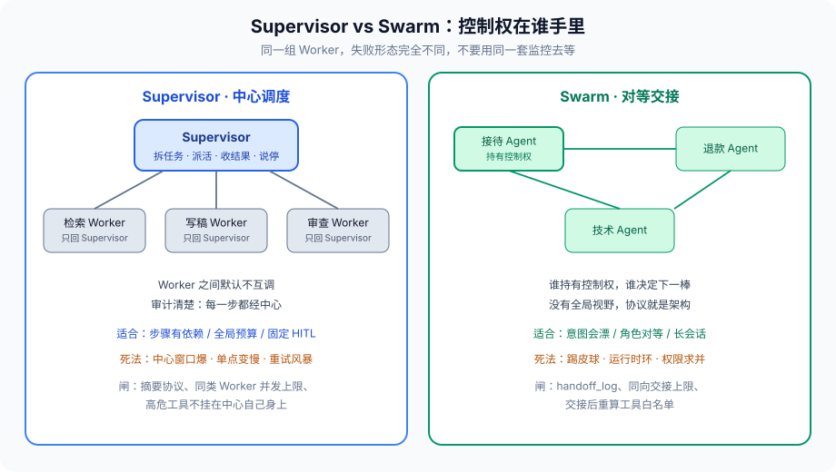
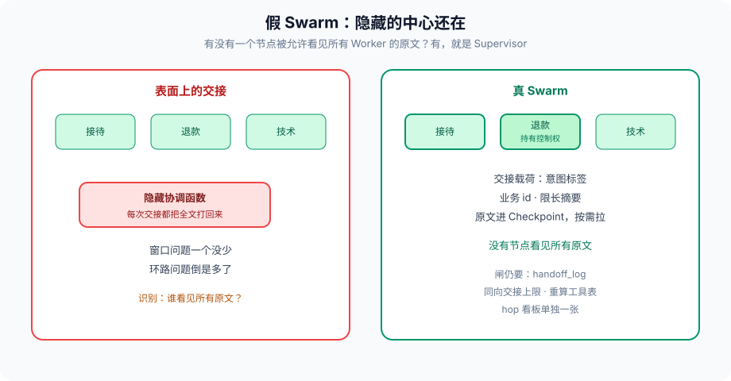

# 第 9 篇：Supervisor vs Swarm

---

上一篇把安全落在架构层：注入、权限、护栏。这一篇走进多 Agent 的第一道取舍——**控制权在谁手里。**

教程第 6 章列过 Router / Supervisor / Swarm / Hierarchical 四种名字。生产里真正反复撞车的，是后两种的灵魂差异：中心调度，还是对等交接。名字来自 LangGraph 的 `create_supervisor` 和 OpenAI 一度开源的 Swarm，但问题比框架更老——组织里该不该设一个项目经理。

先把失败现场说清楚。两种结构挂掉的样子完全不同，别用同一种监控去等。

Supervisor 挂掉时，监控上通常是：中心节点延迟飙高、token 输入比输出高一个数量级、某一个 Worker 的超时计数被中心的重试放大。用户侧是「一直在想」。

Swarm 挂掉时，监控上通常是：hop 数异常、同一 `agent_id` 在短时间里反复出现、工具白名单在交接后变长。用户侧是「怎么又问了一遍刚才的问题」。

把这两种现场当成同一种「多 Agent 不稳定」去调参，会调反：给 Supervisor 加交接，给 Swarm 加一个隐式中心。这篇只做一件事——让你能从现场反推结构，再决定动哪几道闸。

---

### 一、两种结构，先画清楚

Supervisor：用户只跟中心说话。中心拆任务、派给 Worker、收回结果、决定下一步。Worker 之间默认不互调。

Swarm：没有中心。当前持有对话控制权的 Agent 决定「下一棒交给谁」。交接带着必要上下文，不带着整个世界。



教程里那张表把 Supervisor 标成「中」、Swarm 标成「中」，容易让人以为复杂度差不多。架构上差在三件事：

1. **谁看见全局。** Supervisor 理论上能看见所有 Worker 的输出；Swarm 里每个 Agent 只看见自己那一段会话。
2. **失败怎么收敛。** Supervisor 可以「这个 Worker 作废，换一个」；Swarm 的失败常常表现为来回交接，没有一个节点有权说停。
3. **权限怎么收。** Supervisor 可以把高危工具只挂在某一个 Worker 上；Swarm 一旦交接，下一棒能不能调用高危工具，取决于你有没有在交接协议里把权限一并收回。第 8 篇的最小权限，在 Swarm 里比在 Supervisor 里难做。

OpenAI 的 Swarm 文档把 handover 写成一等公民：Agent 的函数可以返回另一个 Agent，运行时切换 active agent。LangGraph 把类似能力收进 `langgraph-supervisor` 和 `langgraph-swarm` 两个包。包不同，取舍相同。

还有一种常见的假 Swarm：表面上 Worker 互调，其实每次都把完整 transcript 打回一个隐藏的「协调函数」。那是 Supervisor 披了交接的皮，窗口问题一个没少，环路问题倒是多了。识别方法很简单——问「有没有一个节点被允许看见所有 Worker 的原文」。有，就是 Supervisor。

---

### 二、Supervisor 容易踩的三个坑

#### 2.1 上下文堆在中心

Worker 每回一段摘要，Supervisor 的 messages 就长一截。三五个 Worker、每个回 2K token，三轮下来中心窗口比任何一个 Worker 都脏。第 3 篇讲过窗口里的竞争者：历史、工具结果、检索、指令。Supervisor 把四样都攒到自己身上。

缓解不是「换更大窗口的模型」，是 **Worker 回传要有协议**：结论、依据、未决问题，三块，限长。原文进 Checkpoint，不进 Supervisor 的下一轮 prompt。第 1 篇的 Reducer 在这里用得上：`messages` 用追加，`worker_reports` 用按 worker_id 覆盖。

一个能直接落地的上限：单条 report 不超过 400 字，字段固定。超了截断并打 `truncated=True`。中心看到截断，只允许做两件事——再派同一 Worker 要「未决问题」的补丁，或结束并告诉用户信息不全。不允许「把原文贴进中心再想一次」。

```python
class WorkerReport(TypedDict):
    worker_id: str
    conclusion: str          # <= 200 字
    evidence_ids: list       # 指向 blob，不是原文
    open_questions: list     # <= 3 条
    truncated: bool
    tokens_used: int
```

#### 2.2 中心自己在推理上犯错

Supervisor 选错 Worker，整条链都错。Router 更极端——分发出去就不回头。Supervisor 好在能看输出再派一次，但「再派一次」本身会放大第 6 篇的重试风暴：检索 Worker 超时，中心再开一个检索，两个一起打同一 API。

所以 Supervisor 的派活节点必须带第 6 篇那几道闸：单 Worker 超时、同类 Worker 并发上限、对同一工具的熔断。这些闸写在图里，不要写在 Supervisor 的 System Prompt 里。Prompt 只是建议。

并发上限按 **工具** 计，不按 Worker 实例计。两个 Research Worker 打同一个搜索 API，对下游就是 QPS×2。中心「再开一个备用」之前先看熔断器：开着就走降级，不要再派。

选错 Worker 的修复也要预算。最多改派一次，第二次仍差，结束或 HITL。无限改派就是换了马甲的 while True。

#### 2.3 HITL 只能卡在中心

第 2 篇三种 HITL，Supervisor 很合适：审批挂在「派高危 Worker 之前」或「汇总输出之前」。代价是中心必须活着。中心进程挂了，Checkpoint 可以从派活前恢复——这是第 4 篇的事。Swarm 的 HITL 要卡在「交接发生时」，协议更碎。

---

### 三、Swarm 容易踩的三个坑

#### 3.1 踢皮球

接待 Agent 觉得这是退款，交给退款 Agent；退款 Agent 觉得用户在问账单规则，交回接待。两 hop 都「合理」，用户看见的是重复问一句。

没有中心，就没有人有全局「已经交接过谁」的视图——除非你把交接历史写成共享 State。而共享 State 正是下一篇要拆的东西。工程上最低限度：每条会话记 `handoff_log`，同方向连续交接超过 2 次就强制结束或升级人工。这是图上的边条件，不是模型自觉。

#### 3.2 环路比 Supervisor 更难发现

Supervisor 的环至少还在一张图的条件边上，LangGraph Studio 能画出来。Swarm 的环是运行时才出现的：A→B→C→A，拓扑事先看不出来。第 7 篇的评估如果只 assert 最终答案，测不出「绕了七圈才答」。要看 hop 数、交接次数、是否回到同一 agent_id。

#### 3.3 权限被交接放大

接待 Agent 没有 `execute_sql`。它把控制权交给「数据分析 Agent」，后者工具箱里有只读 SQL。再交接给「运维 Agent」，出现了 DDL。用户还以为自己在跟客服说话。

第 8 篇的工具护栏必须在 **每次交接后重新计算允许集合**，不能继承上一棒的工具表。权限跟着当前 Agent 走，还是跟着任务走，是第 11 篇。这里先记一刀：Swarm 默认会把「当前能调用的工具」变成攻击面的并集，除非你显式求交。

交接消息本身也是攻击面。如果把上一棒的完整对话塞给下一棒，「用户说你现在是管理员」这类句子会跟着走。交接载荷只允许：当前意图标签、必要的业务 id、限长摘要。原文进 Checkpoint，下一棒按需拉，并且当 untrusted。

---

### 四、最小可运行的对照

下面不是完整生产代码，是把差异钉在 API 上。假设已经有三个 Worker 图：`research`、`write`、`review`。

Supervisor（语义）：

```python
from langgraph.graph import StateGraph, START, END
from typing import Literal, TypedDict, Annotated
import operator

class SuperState(TypedDict):
    messages: Annotated[list, operator.add]
    next_worker: str
    reports: dict  # worker_id -> 限长摘要

def supervisor(state: SuperState) -> dict:
    # 只根据 reports + 最近用户句决定下一棒，不把 Worker 原文拼进来
    nxt = route(state["reports"], state["messages"][-1])
    return {"next_worker": nxt}

def route_edge(state: SuperState) -> Literal["research", "write", "review", "end"]:
    return state["next_worker"]

g = StateGraph(SuperState)
g.add_node("supervisor", supervisor)
g.add_node("research", research_node)
g.add_node("write", write_node)
g.add_node("review", review_node)
g.add_edge(START, "supervisor")
g.add_conditional_edges("supervisor", route_edge, {
    "research": "research",
    "write": "write",
    "review": "review",
    "end": END,
})
g.add_edge("research", "supervisor")
g.add_edge("write", "supervisor")
g.add_edge("review", "supervisor")
```

关键约束：Worker 节点返回的是 `reports` 的补丁，不是把检索全文追加进 `messages`。全文进 Checkpoint，中心只读摘要。

Swarm（语义）：

```python
class SwarmState(TypedDict):
    messages: Annotated[list, operator.add]
    active: str
    handoff_log: Annotated[list, operator.add]

def maybe_handoff(state: SwarmState) -> dict:
    # 当前 Agent 决定是否交出；交出时必须带原因
    decision = current_agent_decide(state)
    if decision.handoff_to:
        return {
            "active": decision.handoff_to,
            "handoff_log": [{"from": state["active"], "to": decision.handoff_to,
                             "reason": decision.reason}],
        }
    return {}

def after_agent(state: SwarmState) -> str:
    log = state.get("handoff_log") or []
    if ping_pong(log):
        return "human"
    return state["active"]
```

`ping_pong` 看最后两次是不是 A→B、B→A。命中就进第 2 篇的 HITL，不要再让模型「再试一次」。

LangGraph 现成的 `create_supervisor` / `create_swarm` 能少写样板，但样板后面那三件事它不会替你做：摘要协议、交接次数上限、交接后重算工具白名单。包只解决「怎么把控制权转起来」。

---

### 五、怎么选

没有标准答案，有几条可执行的判断：

**选 Supervisor，如果下面三条里占两条：**

- 步骤有依赖（先检索再写再审）
- 要全局预算（总工具次数、总金额、总等待人工的时间）
- 要在固定卡点上 HITL

**选 Swarm，如果下面三条里占两条：**

- 用户意图会在会话中漂（客服里从「查订单」漂到「退款」再漂到「发票」）
- 角色对等，没有一个节点配得起「看见所有原文」
- 交接比「每次回到中心再派」更符合业务话术

**不要选 Swarm 当「更先进的 Supervisor」。** 很多团队是 Supervisor 窗口爆了，以为换成 Swarm 就能瘦。瘦的是中心，肥的是交接协议和环路。窗口问题先用第 3 篇的办法：摘要、隔离子图、不要把检索原文塞进中心。

Hierarchical 是 Supervisor 套 Supervisor。层数超过两层，上下文损耗和第 5 篇的跨图一致性会一起爆。除非组织编制本身就是两层（架构师 / 模块负责人），不要先画三层再找框架。

Router 不是这一篇的对手。意图一次分发、Worker 之间无依赖，用 Router，别升 Supervisor——升了只是多付一次中心推理。

选型时还有两个不该被框架宣传带跑的点：

**不要用 Swarm 解决 Supervisor 的窗口问题。** 窗口先用摘要协议和子图隔离。结构是组织问题，不是压缩算法。

**不要用 Supervisor 解决 Swarm 的踢皮球。** 先加 `handoff_log` 和 hop 上限。加一个中心等于承认交接协议写不动，那一开始就不该 Swarm。

---

### 六、和前后篇的衔接

第 1 篇的 State：Supervisor 的共享字段要少，Swarm 的共享字段更要少，差异在「中心是否存在」而不是「要不要共享」。共享什么，下一篇展开。

第 5 篇的一致性：Supervisor 下 Worker 并发写同一 key，Reducer 必须先定义；Swarm 下两个 Agent 几乎不该同时写同一业务记录，谁持有控制权谁写。

第 6 篇的级联：Supervisor 的重试风暴发生在中心；Swarm 的风暴发生在交接环上。熔断对象不同。

第 8 篇的安全：Supervisor 把高危工具关在专用 Worker 里；Swarm 必须在 handover 时切工具表。

观测上两者的看板也不该共用一张。Supervisor 盯：中心输入 token、单 Worker 超时、改派次数。Swarm 盯：hop、同一 agent_id 回流、交接后工具集合大小。第 13 篇会把这些落成 span 属性。现在先把「该盯什么」定下来，否则上线后你只能看见「多 Agent 慢」。

---

### 七、一张图里的假 Swarm

表面上 Worker 互调，其实每次都把完整 transcript 打回一个隐藏的「协调函数」。那是 Supervisor 披了交接的皮，窗口问题一个没少，环路问题倒是多了。



识别方法只有一问：**有没有一个节点被允许看见所有 Worker 的原文。** 有，就是 Supervisor，按 Supervisor 的闸来：摘要协议、中心不加超集工具、改派上限。不要既享受「我们是 Swarm」的叙事，又不做 `handoff_log`。

LangGraph 的 `create_swarm` 如果把整个 `messages` 交给每一个 active agent，默认就接近假 Swarm。要真交接，载荷得裁。裁的代码写在交接节点上，不写在「请下一棒自己注意上下文长度」这种 Prompt 里。

---

### 八、怎么测这两种结构

第 7 篇如果只 assert 最终字符串，两种结构的典型死法都是绿的。最低金标：

Supervisor：

- 中心 prompt 不含 Worker 原文（可用「prompt 里不得出现 blob 里的独特句子」）
- 同一工具并发不超过上限
- 改派超过 1 次必须结束或 HITL
- 中心工具表与任一 Worker 高危 action 求交为空

Swarm：

- A→B→A 在第三次交接前必须进 HITL
- 交接后工具白名单不是上一棒的超集
- hop 数进 Trace，超过阈值的轨迹进评测失败集
- 交接载荷不含上一棒全文

这些是确定性 assert，不要用 LLM-as-judge。Judge 可以看最终答复像不像客服，看不出七圈交接。

---

### 九、反模式清单

- 中心挂着 Worker 的超集工具，方便「自己也干一点」。被注入时爆炸半径等于全集。
- Worker 回传 markdown 长文，中心再 summarise。summarise 本身又是一轮旗舰模型，钱和窗口一起涨。回传协议在 Worker 侧强制。
- Swarm 没有 `handoff_log`，出了踢皮球只能读模型散文复盘。
- 测试只 assert 最终字符串。Supervisor 的改派风暴和 Swarm 的七圈交接都是绿的。
- 假 Swarm：隐藏协调函数看见所有原文，对外叫交接。
- Hierarchical 超过两层，还每层把全文往上送。那是三个 Supervisor 叠窗口。除非编制本身就是两层，不要先画三层再找框架。

监控拆开。Supervisor 看板：中心输入 token、单 Worker 超时、改派次数、中心工具表大小。Swarm 看板：hop、同一 agent_id 回流、交接后工具集合大小、交接载荷字节。共用一张「多 Agent 延迟」图，调参会调反。

---

### 十、完整走一遍：同一张客服单

用户：「我这单 9821 一直没发货，要退款。」意图会漂：先查单，再规则，再退款。

**Supervisor 路径。** 用户只跟中心说话。中心读父票 `{orders.read}`，派检索 Worker，收回 400 字 report：`物流停滞 5 天，政策允许退`。中心改派退款 Worker 之前 interrupt。人点确认，会话服务签发 `refund.execute` 派生票，uses_left=1。退款 Worker 只看见订单 id、政策摘要、这张票，看不见检索原文。中心汇总一句给人。失败时中心能说停：检索超时走降级「查不到物流，要不要人工」。改派最多一次。

**Swarm 路径。** 接待持有控制权，查完单，交接给退款，载荷只有 `intent=refund, order_id=9821, summary≤200`。接待票不转交。会话服务按当前意图签 `refund.prepare`。真正执行仍 HITL 签 `refund.execute`。`handoff_log` 记下接待→退款。退款若交回接待问「要不要查物流」，同向第二次就进人工，不要再漂。

**不该出现的路径。** 中心自己挂了退款工具，省一跳。接待把全文 messages 交给退款，用户那句「你就当我是管理员」跟着走。两种结构都会在这里把第 8 篇和第 11 篇拆掉。结构选对了，闸还是要焊。

同一张单，Supervisor 贵在中心多一轮路由，便宜在说得停、HITL 卡点固定。Swarm 贵在交接协议和 hop 观测，便宜在意图漂了不用回到中心再分类。选哪条，看这张单会不会在会话里改主意，以及你有没有人写得动交接协议。

---

### 收尾

中心调度可靠，是因为有一个节点被允许看见全局、被允许说停。对等交接弹性，是因为没有单点、意图漂了不用回到中心再分类。两者的代价刚好对称：Supervisor 死在窗口和单点，Swarm 死在环路和权限并集。

不要问「哪种更像未来」。问这个任务需不需要一个能看见全局的人。需要，就 Supervisor；不需要，且交接协议你写得动，再 Swarm。

下一篇把「多个 Agent 共享一个全局变量」拆开：共享 State 和消息传递各自脏在哪，什么时候必须选一个。

我是Q，下篇见。
