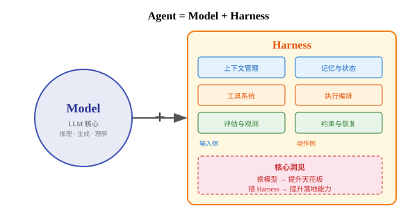
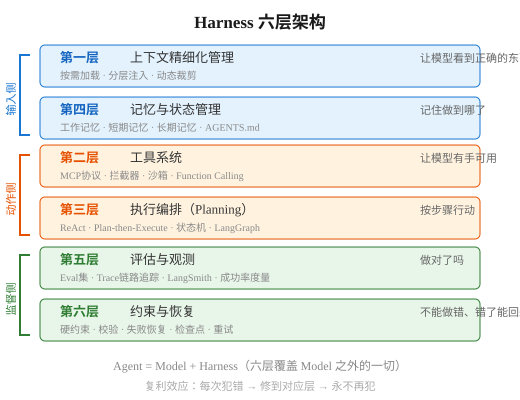
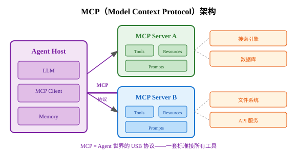
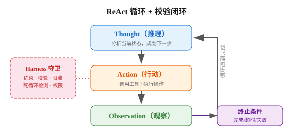
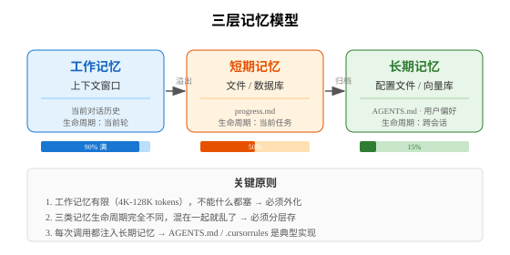
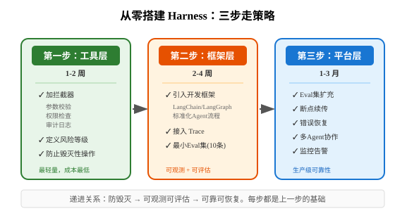

# 50道 AI Agent Harness 面试题（含详细解答、图解与代码示例）

大家好，我是Q。

期待已久的Agent Harness面试题来啦~

> 核心等式：**Agent = Model + Harness**
> 涵盖：Harness基础、上下文工程、工具系统与MCP、执行编排、记忆与状态、评估与可靠性、多Agent协作与框架选型七大领域。
> 每道题包含：核心原理 + 深度展开 + 实践案例 + 代码片段 + 面试追问方向。

## 一、Harness 基础概念（1~8）

### Q1：什么是 Harness Engineering？它解决什么问题？

**核心原理：**

Harness Engineering 是给 AI Agent 装上"缰绳"的工程学科。LLM 很强，但没有约束就是脱缰的野马——可能跑偏、幻觉、越权、悄悄变差。Harness 就是在模型之外，所有让 Agent 稳定、可靠、持续做对的东西。

**来源：** 2026年2月，Mitchell Hashimoto（HashiCorp 联合创始人，Vagrant/Terraform 作者）在博客《My AI Adoption Journey》中首次明确提出 "Engineer the Harness"——

> 每次当你发现 Agent 犯了一个错误，就花点时间去工程化一个解决方案，让它永远不会再犯同样的错误。

一周后 OpenAI 发文《Harness engineering: leveraging Codex in an agent-first world》背书，描述他们用5个月靠Agent写出100万行代码、合并1500个PR的实践。

**它解决什么问题：**

传统 AI 工程的重心经历了三次转移：
- **Prompt Engineering** 解决"怎么说让模型一次答对"——关注输入措辞
- **Context Engineering** 解决"给什么信息让模型看对"——关注信息供给
- **Harness Engineering** 解决"模型答错了怎么办、上下文乱了怎么恢复、子任务怎么调度"——关注整个执行闭环

三者不是替代关系，而是包含关系：Prompt ⊂ Context ⊂ Harness。Prompt 是 Context 的一部分，Context 是 Harness 的一部分。

**为什么 Harness Engineering 在2026年突然火了？** 不是因为又造了个新词，而是因为 AI 真正上了生产。银行用 LLM 审贷款、医院用 LLM 辅助诊断、客服用 Agent 处理投诉——能用不等于可靠，模型幻觉一次就是真金白银的损失。Harness 解决的就是"从能用到可靠"的最后一公里。

**面试追问方向：** "你之前做的 Agent 项目中，有没有用到 Harness 的思想？" → 重点不是用了什么工具，而是你有没有"每次犯错修到环境里"的意识。

### Q2：Agent = Model + Harness，怎么理解这个等式？

**核心等式：**

```
Agent = Model + Harness
Harness = Agent − Model
```

在一个 Agent 系统中，除了模型本身之外，几乎所有决定它能不能稳定交付的东西，都属于 Harness。模型决定"能不能想"，Harness 决定"能不能持续做对"。



**Harness 包含的内容（对照模型不包含的）：**

| 层次 | Harness 组件 | 作用 | 具体实现 |
|------|-------------|------|---------|
| 输入侧 | 上下文管理 | 让模型看到正确的东西 | RAG、按需加载、动态裁剪 |
| 输入侧 | 记忆与状态 | 让模型知道"做到哪了" | progress.md、AGENTS.md、向量库 |
| 动作侧 | 工具系统 | 让模型有"手"可用 | MCP、拦截器、沙箱、Function Calling |
| 动作侧 | 执行编排 | 让模型按正确步骤行动 | ReAct、Plan-then-Execute、LangGraph |
| 监督侧 | 评估与观测 | 让模型"被看见"做得对不对 | Eval集、Trace、LangSmith |
| 监督侧 | 约束与恢复 | 让模型"不能做错"和"错了能回来" | 硬约束、校验、重试、检查点 |

**类比：** 模型是发动机，Harness 是整辆车——方向盘、刹车、仪表盘、安全气囊、导航系统。发动机再强，没有这些也上不了路。换模型提升天花板，搭 Harness 提升落地能力。会调 Prompt 的人越来越多，但能让 Agent 在生产环境稳定运行的人，才是稀缺的。

**面试追问：** "如果模型能力翻倍，Harness 还需要吗？" → 更需要。模型越强，能做的事情越多，跑偏的后果越严重。GPT-4 比 GPT-3 更需要 Harness，因为 GPT-4 能执行更复杂的多步任务，每一步出错的影响更大。

### Q3：Harness 的六层架构是什么？

**核心架构：**



**分三组理解：**
- **输入侧（1、4层）**：上下文 + 记忆 → 让模型看到正确的信息
- **动作侧（2、3层）**：工具 + 编排 → 让模型做出正确的行为
- **监督侧（5、6层）**：评估 + 约束 → 让模型被监督和兜底

**逐层详解：**

**第一层：上下文精细化管理** — 不是"给得更多"，而是"按需给、分层给、在正确的时机给"。Anthropic 的 Agent Skills 就是这个思路——一开始只给模型看"目录"，等它真的需要某个工具时再动态加载详细说明。

**第二层：工具系统** — 解决"一着不慎，满盘皆失"的稳定性问题。最轻量的 Harness 改造就是在工具调用外围加拦截器：参数校验、权限检查、日志记录。这是让 Agent 从"玩具"变"可用"的第一步。

**第三层：执行编排** — Agent 的本质是一个 for 循环（思考→行动→观察→再思考），但魔鬼藏在这个循环里。Agent 经常翻车：每一步它都会做，但串起来就不会了。这层给模型一条明确的工作轨道。

**第四层：记忆与状态** — 没有状态管理的 Agent，每一轮调用之间都是失忆的。Anthropic 的关键做法：状态应该外化到文件系统，而非放在上下文窗口里。

**第五层：评估与观测** — 最容易被跳过，但跳过之后进退两难。没有 Eval 集，你对 Agent 的判断永远停留在"我感觉这次变好了"的玄学阶段。没有 Trace，调试就从"看"变成了"猜"。

**第六层：约束与恢复** — 在真实环境里，失败不是例外，是常态。约束（什么事不能做）、校验（每步输出前后自动检查）、恢复（失败后有预案）是三大支柱。

**面试追问：** "如果让你从零搭一个 Harness，先搭哪层？" → 先搭第二层（工具拦截器）——最轻量，成本最低，防止毁灭性操作。然后搭第五层（最小Eval集10条 + Trace），让你知道"做得好不好"。最后逐步补齐其他层。

### Q4：Harness Engineering 的"复利效应"是什么？

**核心原理：** Mitchell Hashimoto 的核心洞见——

> 每次 Agent 犯错，把修复沉到环境里，而不是留在人脑子里。

绝大多数人遇到 Agent 犯错，骂两句手动改掉，祈祷下次别再犯。但 Mitchell 不是这么干的——他每次 Agent 犯错，都会停下来问自己：我能不能把这个错误永久性地修到环境里，让它下次在结构上就不可能再犯？

**修复落到哪一层？**

| Agent 总是犯的错 | 修复应该沉到 | 具体修法 |
|-----------------|------------|---------|
| 总是漏掉某个上下文信息 | 第一层（上下文） | 在 AGENTS.md 里补上规则，或修改 RAG 检索策略 |
| 总是用错工具 | 第二层（工具） | 在工具描述中加更明确的 when_to_use，或加拦截器 |
| 步骤乱、顺序错 | 第三层（编排） | 用 LangGraph 状态机约束执行路径 |
| 跨天记不住进度 | 第四层（记忆） | 实现 progress.md + 断点续传 |
| 没法判断做得好不好 | 第五层（评估） | 建 Eval 集 + 自动化回归 |
| 一失败就崩溃 | 第六层（约束与恢复） | 加重试逻辑 + 检查点保存 |

**复利机制：** 每次犯错 → 修到环境里 → 环境变强 → Agent 下次更少犯错 → 你改进速度更快 → Harness 越来越坚固。时间一长，Agent 在你这个项目里越跑越稳。

**关键区分：** 修复必须**沉淀到代码/配置/linter/规则文件里**，而不是"我下次提醒它"。写在提示词里靠 Agent 自己遵守不算——必须让它在结构上不可能再犯。博客发出来一周后，OpenAI 紧接着发了一篇官方博客，标题就叫《Harness engineering: leveraging Codex in an agent-first world》，用他们内部的实践验证了这个思路。

### Q5：Harness 和传统软件工程中的"中间件"有什么异同？

**相似之处：**
- 都是"在核心逻辑外围包裹的基础设施"
- 都关注：日志、监控、限流、重试、错误处理
- 都是"不写业务逻辑但决定系统能不能跑稳"的层
- 都遵循"关注点分离"的原则

**关键区别：**

| 维度 | 传统中间件 | Agent Harness |
|------|-----------|--------------|
| 输入确定性 | 确定性输入（参数类型固定） | 非确定性输入（LLM 每次可能不同） |
| 错误模式 | 可枚举、可预测 | 不可枚举（幻觉、跑偏、上下文遗忘） |
| 核心挑战 | 性能、可用性 | **可靠性、可控性** |
| 约束方式 | 硬编码（类型系统、参数校验） | 软约束（提示词）+ 硬约束（代码校验） |
| 状态管理 | 请求无状态 | 必须管理长期状态和上下文 |
| 测试策略 | 单元测试 + 集成测试 | Eval集 + Trace + 回归测试 |
| "正确"的定义 | 功能正确 | 任务成功（模糊、多维度） |

**深层区别：** 传统中间件假设"输入合法则输出合法"，Agent Harness 这个假设不成立——合法输入也可能产生幻觉输出。所以 Harness 需要**双重校验**：输入校验（参数是否正确）+ 输出校验（结果是否合理），传统中间件通常只做前者。

**面试追问：** "为什么传统中间件的套路不能直接搬到 Agent 上？" → 因为 LLM 输出不可预测，你不能像传统系统那样"定义好接口就完事"。Agent 可能用对工具但理解错结果，可能步骤都对但串起来就跑偏。Harness 需要在每一步都做校验和兜底。

### Q6：从 Prompt Engineering 到 Context Engineering 到 Harness Engineering 的演进

**三个阶段的演进不是替代，而是包含：**

| 阶段 | 关注点 | 核心问题 | 代表实践 | 时代 |
|------|--------|---------|---------|------|
| Prompt Engineering | 输入措辞 | "怎么说让模型一次答对" | Few-shot、CoT、System Prompt | 2023-2024 |
| Context Engineering | 信息供给 | "给什么信息让模型看对" | RAG、长上下文管理、按需加载 | 2024-2025 |
| Harness Engineering | 执行闭环 | "模型答错了怎么办" | 约束、校验、恢复、评估、编排 | 2025-2026 |

**为什么必须演进：**
- Prompt 解决单步问题，但 Agent 是多步连续决策
- 单步做对 ≠ 整体做对（步骤间可能跑偏、遗忘、矛盾）
- 生产环境需要的是"持续做对"，不是"偶尔做对"
- 模型能力越强，能执行的任务越复杂，出错的后果越严重

**代码类比：**
```python
# Prompt Engineering: 写好函数签名和文档
def process(query: str) -> str:
    """You are a helpful assistant..."""

# Context Engineering: 传入正确的参数和依赖
def process(query: str, context: list[Document], memory: State) -> str:

# Harness Engineering: 加上错误处理、重试、校验、日志
@retry(max_attempts=3)
@validate_output(schema=ResponseSchema)
@trace(logger=agent_tracer)
@guard(forbidden_actions=["delete_db", "send_email"])
def process(query: str, context: list[Document], memory: State) -> str:
```

**面试追问：** "你在项目中处于哪个阶段？" → 大部分团队还在 Prompt Engineering 阶段，少数到了 Context Engineering。真正在做 Harness 的团队不多，这就是面试的区分度所在。

### Q7：一个生产级 Agent 系统和 Demo 级 Agent 的核心差距在哪？

**差距不在模型，在 Harness：**

| 维度 | Demo 级 | 生产级 | 差距体现 |
|------|---------|--------|---------|
| 错误处理 | 崩溃就崩溃 | 每种典型失败有恢复路径 | 1行 vs 50行恢复代码 |
| 工具调用 | 直接调，无校验 | 拦截器：参数校验、权限检查、审计日志 | 0个 vs 3-5个拦截器 |
| 状态管理 | 靠上下文窗口 | 外化到文件/数据库，支持断点续传 | 上下文溢出即死 vs 无限续传 |
| 可观测性 | print 大法 | LangSmith/Langfuse trace，每步可追溯 | 出了问题靠猜 vs 出了问题看trace |
| 评估 | "感觉还行" | Eval 集 + 自动化回归测试 | 主观判断 vs 量化指标 |
| 约束 | 写在提示词里 | 硬编码到代码 + linter + CI 检查 | 模型可能不遵守 vs 结构性不可能违反 |
| 成功率 | 70% 碰运气 | 95%+ 可量化 | 10次3次错 vs 20次1次错 |

**典型 Demo 级代码：**
```python
# Demo: 直接调，没有任何保护
result = agent.run("帮我删除过期的日志文件")
# 如果 agent 理解错了，直接删了重要文件，没有任何挽回手段
```

**典型生产级代码：**
```python
# Production: Harness 完整
@guard(forbidden_actions=["delete_system_files"])
@validate_output(schema=ActionSchema)
@trace("agent_tracer")
@retry(max_attempts=3, backoff=exponential)
@checkpoint(save_interval=5)
def run_agent(task):
    result = agent.run(task)
    eval_result = eval_suite.evaluate(result, task)
    if not eval_result.passed:
        alert("Agent 输出未通过评估", eval_result.details)
    return result
```

**面试追问：** "你觉得从 Demo 到生产，最应该先补哪块？" → 评估与观测（第五层）——没有评估，你连"差在哪"都不知道；没有 Trace，调试就是猜。先有了度量手段，才知道该修什么。

### Q8：OpenAI Codex 团队的 Harness 实践给你什么启发？

**OpenAI 的案例：** 5个月，从一个空仓库出发，靠 Agent 写出100万行代码，合并1500个PR，全程没人手动写过一行代码。

**关键实践与启发：**

1. **Harness 先于代码**：先搭好约束和校验环境，再让 Agent 开始写代码。这就像先建好安全网再走钢丝——不是走完再补网。

2. **Git 作为 Harness 的一部分**：每个 PR 有 CI 检查、代码审查、测试覆盖要求，Agent 生成的代码必须通过全部检查才能合并。Git 不是版本控制工具，是 Harness 的约束机制。

3. **渐进式信任**：初期 Agent 只能提 PR 不能合并，随着 Agent 表现稳定逐步放开权限。就像新员工先实习再转正。

4. **复利积累**：每次 Agent 犯错，就加强 CI 规则或 linter 规则。下次不可能再犯同样的错。规则越积越多，Agent 越跑越稳。

5. **多层级校验**：linter → 单元测试 → 集成测试 → 代码审查 → 人工抽检，每层都是 Harness 的一层防线。如果 linter 没拦住，测试来拦；测试没拦住，审查来拦。

**启发总结：** "能用"和"可靠"之间差的就是 Harness。Codex 的成功不是因为模型强，而是因为 Harness 让模型的输出始终在安全轨道内。同样的模型，没有 Harness 就是一堆不可预测的代码生成；有了 Harness 就是可控的、可验证的、可信赖的开发流程。

## 二、上下文工程与 Prompt 设计（9~16）

### Q9：Context Engineering 的核心原则是什么？

**三大原则：按需给、分层给、在正确的时机给。**

上下文管理的本质不是"给得更多"，而是"按需给、分层给、在正确的时机给"。如果你把所有信息一股脑塞进上下文，模型反而分不清主次，关键信息被淹没在噪声中。

**常见错误做法与正确做法对比：**

| 错误做法 | 问题 | 正确做法 |
|---------|------|---------|
| 把所有信息一股脑塞进上下文 | 信息过载，模型分不清主次 | 只在需要时加载详细信息 |
| 只给工具名不给使用说明 | Agent 乱调工具 | 工具描述包含 when_to_use |
| 上下文窗口用满才管理 | 已经开始丢信息 | 预留20%缓冲空间 |
| RAG返回30条结果全部注入 | 噪声太多 | 先提炼再注入，控制在5-8条 |
| System Prompt 写几百行 | 模型记不住那么多规则 | 核心规则 < 20条，其余外化 |

**Anthropic Agent Skills 的实践：** 一开始只给模型看"目录"（工具名+简短描述），等它真的需要某个工具时再动态加载详细说明。这就是"按需给"的最佳示例——默认信息量小，需要时才展开。

**面试追问：** "如果上下文窗口只有4K tokens，但你的任务需要20K的信息，怎么办？" → 分步执行 + 外化存储。不在一个上下文窗口里处理所有信息，而是将信息外化到文件系统，每步只加载当前步骤需要的内容。

### Q10：System Prompt 在 Harness 中的最佳实践？

**System Prompt 是 Harness 的"宪法"**——定义 Agent 的行为边界、角色、约束。它是最基础的 Harness 组件，也是最容易被忽视的。

**好的 System Prompt 结构（推荐模板）：**
```
1. 角色定义：你是什么，你能做什么（2-3句话）
2. 行为约束：你不能做什么（硬规则，5-8条）
3. 工具使用指南：什么时候用哪个工具（每个工具一句话）
4. 输出格式：必须按照什么格式输出（给出模板）
5. 错误处理：遇到不确定的情况怎么办（具体策略）
6. 安全规则：绝对不能做的事（3-5条红线）
```

**关键原则：**

1. **规则要具体而非模糊**：
   - ❌ "不要泄露用户隐私"
   - ✅ "不要在输出中包含 email、手机号、身份证号、银行卡号"

2. **用负面示例补充正面指令**：
   - ❌ "回答要准确"
   - ✅ "如果不确定，说'我无法确认'而不是编造答案"

3. **约束写在 System Prompt，但不只靠它**：
   - 模型可能不遵守 System Prompt（尤其是长对话后）
   - 必须配合代码层校验（硬约束兜底）

4. **控制总长度**：
   - System Prompt 超过2000 tokens 后，模型遵守率明显下降
   - 核心规则控制在20条以内，其余外化到规则文件

### Q11：如何防止 Agent 的"上下文焦虑"（Context Anxiety）？

**现象：** Cognition（Devin 团队）在用 Claude Sonnet 4.5 重做 Devin 时，观察到一个有趣的现象，他们叫"上下文焦虑"——Agent 跑久了会"感觉快撑不住了"，具体表现为：

- 忘记最初目标和之前的关键决策
- 重复劳动——做过的步骤又做一遍
- 急匆匆宣布"任务完成"——突然简化方案、跳过验证
- 对"还剩多少上下文"估计严重不准——经常以为自己快没空间了，其实还剩一大半

**这不是模型能力问题，而是状态管理问题。** 模型把所有信息都塞在上下文窗口里，上下文越长，关键信息越容易被"稀释"。

**解决方案：**

| 方案 | 实现 | 效果 |
|------|------|------|
| 上下文预算管理 | 在 System Prompt 中明确告知当前上下文用量 | 模型对剩余空间判断更准确 |
| 分段执行 | 将长任务拆成多段，每段独立上下文窗口 | 避免上下文无限增长 |
| 状态外化 | 进度写到文件而非全塞上下文 | 上下文只保留当前步骤信息 |
| 主动检查点 | 每N步自动总结当前进度和剩余任务 | 防止"忘了做到哪" |
| 渐进式输出 | 边做边输出中间结果 | 不用等全部完成才输出 |

**代码示例：**
```python
class ContextAwareAgent:
    def __init__(self, max_tokens=8000):
        self.max_tokens = max_tokens
        self.progress_file = "agent_progress.md"
    
    def estimate_remaining(self, messages):
        used = sum(len(m["content"]) for m in messages) // 4
        remaining = self.max_tokens - used
        if remaining < self.max_tokens * 0.2:
            # 上下文快满了，外化当前状态到文件
            self._save_progress(messages)
            return "LOW"  # 触发分段执行
        return "OK"
    
    def _save_progress(self, messages):
        # 将关键决策和进度写入文件，而非留在上下文
        summary = self.llm.summarize(messages, 
            prompt="提取关键决策、已完成步骤和待办事项")
        with open(self.progress_file, "w") as f:
            f.write(summary)
```

### Q12：Few-shot / CoT / ToT 在 Agent 中的适用场景？

**四种推理范式对比：**

| 方法 | 原理 | 适用场景 | Agent 中的局限 | Token 开销 |
|------|------|---------|---------------|-----------|
| Zero-shot | 直接给指令 | 简单明确任务 | 复杂任务不够 | 最低 |
| Few-shot | 给几个示例 | 格式/风格要求高 | 占用上下文空间 | 中 |
| CoT | 让模型分步推理 | 数学、逻辑、多步推理 | 不与外部交互，可能幻觉 | 中高 |
| ToT | 树状搜索多条路径 | 需要探索多种方案 | 计算成本高，延迟大 | 很高 |
| ReAct | 推理+行动交替 | **Agent 标准范式** | 步骤多延迟高 | 高 |

**Agent 场景推荐：** ReAct 为默认范式，CoT 用于内部推理步骤（Thought 中），ToT 用于关键决策点的方案探索（如"选哪种架构"）。

**CoT 为什么能减少幻觉？** 因为分步推理把一个大的"跳跃"拆成了多个小的"步进"，每步的推理空间更小，出错概率更低。但 CoT 无法与外部交互——如果推理需要真实数据，CoT 会编造。

**ReAct 为什么比纯 CoT 更适合 Agent？** 因为 ReAct 通过 Action 调用外部工具获取真实数据，通过 Observe 验证推理。CoT 可能在第3步就基于幻觉推理了，ReAct 在第3步会先查数据再继续。

### Q13：上下文窗口不够用怎么办？长任务的状态管理策略

**核心思路：上下文外化 + 按需加载。**

Anthropic 的关键做法：Agent 的状态不应该放在上下文窗口里，而应该外化到文件系统。让 Agent 维护进度日志、启动脚本、git history，作为"长期记忆介质"。下一轮换一个全新的上下文窗口接手时，从这些文件里一读，立刻就知道"现在到哪一步了"。

**具体策略——五步法：**

1. **任务开始前**：将任务目标、约束、步骤写入 progress.md
2. **每步执行后**：更新进度文件，记录关键决策和中间结果
3. **上下文快满时**：对早期对话做摘要压缩，只保留关键决策
4. **切换上下文时**：新上下文从 progress.md 恢复状态
5. **任务完成后**：归档 progress.md，清理临时文件

**代码示例：**
```python
class SegmentedExecutor:
    """分段执行长任务，每段独立上下文"""
    
    def run(self, task):
        subtasks = self.planner.decompose(task)
        for i, subtask in enumerate(subtasks):
            # 每段独立上下文，从进度文件恢复状态
            state = self._load_progress(i)
            result = self.agent.execute(subtask, context=state)
            self._save_progress(i + 1, result)
            # 上下文窗口重置，不累积
```

**为什么不能只在上下文里管理？** 因为上下文窗口是有限的、昂贵的、不可靠的。有限（4K-128K tokens），昂贵（每token都要算注意力），不可靠（长上下文中关键信息容易被"稀释"）。外化到文件后，上下文窗口只需要放当前步骤需要的信息。

### Q14：RAG 在 Agent Harness 中的角色？

**RAG 是 Agent 的一种"工具"和"记忆组件"，在 Harness 中跨多层存在：**

| RAG 在 Harness 中的位置 | 作用 | 实现方式 |
|------------------------|------|---------|
| 第一层（上下文） | 按需检索相关知识注入上下文 | 查询时动态检索 |
| 第四层（记忆） | 作为长期记忆的检索接口 | 知识库持久化 |
| 第二层（工具） | Agent 可主动调用 RAG 检索 | 作为 Tool 注册 |

**Agent 中 RAG 的进阶用法：**

- **Self-RAG**：Agent 判断检索结果是否相关，不相关则重新检索或换策略。这比传统的"检索到什么就给什么"更可靠。
- **Corrective RAG**：检索质量低时回退到网络搜索或其他数据源。不是所有信息都能从知识库里找到。
- **Adaptive RAG**：根据问题复杂度决定是否需要检索。简单问题直接回答，复杂问题才触发检索。
- **GraphRAG**：用知识图谱支持多跳推理。传统 RAG 只能检索相关文档片段，无法做"A影响了B，B影响了C"这样的链式推理。

**RAG 在 Agent 中的常见问题：**
- 检索到了但内容太多，塞进上下文后信息过载 → 需要提炼策略
- 检索不到相关信息 → 需要回退策略（网络搜索/直接回答"我不知道"）
- 检索到了错误/过时的信息 → 需要时效性校验

### Q15：如何设计 Agent 的指令，使其不会"越权"操作？

**分层容忍度策略——越敏感的操作，越不能让AI说了算：**

```python
RISK_LEVELS = {
    "low": {      # 查询类操作
        "actions": ["search", "query", "read", "list"],
        "auto_approve": True
    },
    "medium": {   # 修改类操作
        "actions": ["update", "write", "modify", "send"],
        "auto_approve": False,
        "require_confirmation": True  # 需要用户确认
    },
    "high": {     # 危险操作
        "actions": ["delete", "refund", "drop_table", "send_email"],
        "auto_approve": False,
        "require_human": True  # 必须转人工
    }
}
```

**拦截器实现：**
```python
class GuardInterceptor:
    def before_execute(self, action):
        level = self._classify_risk(action)
        if level == "high":
            raise GuardError(f"危险操作 {action} 需要人工审批")
        if level == "medium":
            if not self._user_confirmed(action):
                raise GuardError(f"操作 {action} 需要用户确认")
```

**关键原则：** 约束写在代码里，不靠提示词。模型可能忽略提示词中的"不要做X"，但代码层的拦截器它绕不过去。

### Q16：如何在 System Prompt 中定义"硬规则" vs "软建议"？

**硬规则（必须遵守，代码层兜底）：**
- 绝对不能删除数据库
- 绝对不能发送未审核的邮件
- 输出必须符合指定 JSON Schema
- 敏感信息不能出现在输出中
- 不能执行未经沙箱隔离的代码

**软建议（尽量遵守，但不强求）：**
- 回答简洁
- 优先使用搜索工具
- 给出多个选项供用户选择
- 附上信息来源

**实现原则：**
```
硬规则 → 代码层校验（拦截器、linter、CI检查）+ 提示词声明
软建议 → 只在提示词中引导
两者结合 → 提示词 + 代码双重保障
```

**为什么不能只靠提示词实现硬规则？** 因为：
1. 模型可能不遵守提示词（尤其是长对话后注意力衰减）
2. 恶意用户可以通过 prompt injection 绕过提示词约束
3. 代码层约束是确定性的，不依赖模型行为
4. 合规审计需要可验证的硬约束，不能依赖"模型应该会遵守"

**面试追问：** "prompt injection 攻击怎么防？" → 多层防御：提示词中声明规则（软）+ 输入过滤器检测 injection 模式（中）+ 输出校验器检查是否违反硬规则（硬）+ 关键操作需人工审批（兜底）。

## 三、工具系统与 MCP 协议（17~24）

### Q17：给 Agent 接工具时，"少即是多"的原则？

**OpenAI Codex 早期的教训：** 一开始给 Agent 接了一堆工具，想着"选择多总是好的"，结果 Agent 频繁用错工具、用错时机。后来砍掉一大半，效果反而上去了。

**工具设计的三个核心问题：**

| 问题 | 原则 | 反例 | 正例 |
|------|------|------|------|
| 给它哪些工具？ | 只给真正需要的 | 给了10个搜索工具但只用1个 | 给1个通用搜索工具 |
| 什么时候用哪个？ | 工具描述要精确说明适用场景 | "这个工具可以搜索各种信息" | "仅在用户提供订单号时使用" |
| 结果怎么喂回？ | 先提炼再喂，不要原样塞 | 30条搜索结果原样塞进上下文 | 提取Top3摘要后注入 |

**工具注册的精确描述示例：**
```python
tools = [{
    "name": "search_order",
    "description": "根据订单号查询订单状态。仅在用户提供订单号时使用。",
    "parameters": {
        "order_id": {
            "type": "string",
            "pattern": "^ORD-\\d{8}$",
            "description": "8位订单号，格式ORD-XXXXXXXX"
        }
    }
}]
```

**面试追问：** "怎么判断工具是多了还是少了？" → 看 Trace 数据。如果某个工具从未被调用，说明多了；如果 Agent 经常在两个工具间犹豫（来回切换），说明工具职责不清晰。

### Q18：MCP（Model Context Protocol）是什么？为什么重要？

**核心定义：** MCP 是 Anthropic 提出的开放协议，标准化 LLM 与外部工具/数据源的交互方式。类似于 USB 协议——让任何工具都能用同一种方式接到任何 Agent 上。

**MCP 架构：**



**MCP 的三大资源类型：**
- **Tools**：可调用的函数（如搜索、计算、数据库查询）
- **Resources**：可读取的数据（如文件、配置、知识库）
- **Prompts**：可重用的提示模板（如标准化的报告格式）

**为什么重要——三个维度：**

1. **标准化**：一套协议接所有工具，不用为每个工具写适配代码。之前每接一个新工具，都要写一套自定义的调用逻辑；有了MCP，工具开发者只需实现 MCP Server 即可。

2. **解耦**：工具开发者只需实现 MCP Server，Agent 开发者只需对接 MCP Client。两端独立演进，互不影响。

3. **生态**：类似 npm/PyPI 的工具生态，可复用。一个 MCP Server 写好了，所有支持 MCP 的 Agent 都能用。

**面试追问：** "MCP 和 Function Calling 的关系？" → MCP 是协议层（定义怎么通信），Function Calling 是模型能力（定义模型怎么输出工具调用）。MCP 可以承载 Function Calling 的工具定义——MCP Server 提供的 Tools 可以自动转换为 Function Calling 的 Schema。

### Q19：Function Calling 的实现机制与陷阱

**工作流程（四步循环）：**
1. 开发者提供工具定义（JSON Schema）→ 模型知道有哪些工具可用
2. LLM 判断是否需要调用 → 输出结构化 JSON（工具名 + 参数）
3. 外部系统执行工具 → 返回结果
4. LLM 基于结果生成最终回答

**常见陷阱与解决方案：**

| 陷阱 | 说明 | 解决方案 |
|------|------|---------|
| 幻觉调用 | 模型编造不存在的工具名 | 工具名白名单校验，不存在则拒绝 |
| 参数错误 | 类型/格式不匹配 | JSON Schema 严格校验 |
| 无限调用 | 循环调用同一工具 | 设置最大调用次数（如5次） |
| 不必要调用 | 简单问题也调工具 | 工具描述中明确"仅在...时使用" |
| 并行调用冲突 | 同时调两个互相依赖的工具 | 控制调用顺序，有依赖的串行化 |

**代码示例：安全的 Function Calling 实现**
```python
MAX_TOOL_CALLS = 5

def safe_function_call(llm_response, available_tools):
    # 校验1：工具名白名单
    tool_name = llm_response["function"]["name"]
    if tool_name not in available_tools:
        return {"error": f"未知工具: {tool_name}"}
    
    # 校验2：参数 JSON Schema 校验
    tool = available_tools[tool_name]
    try:
        validate(instance=llm_response["function"]["arguments"],
                 schema=tool["parameters"])
    except ValidationError as e:
        return {"error": f"参数校验失败: {e}"}
    
    # 校验3：执行工具
    return tool["handler"](**llm_response["function"]["arguments"])

# 主循环中控制调用次数
for step in range(MAX_TOOL_CALLS):
    response = llm.chat(messages)
    if not response.has_tool_call():
        break  # 模型不再调用工具，输出最终答案
    result = safe_function_call(response, tools)
    messages.append({"role": "tool", "content": result})
```

### Q20：工具的拦截器（Interceptor）模式

**拦截器是 Harness 第二层的核心机制**——在工具调用前后插入校验逻辑，不修改工具本身代码。

**四种常见拦截器：**

```python
class ToolInterceptor:
    """工具调用拦截器基类"""
    def before(self, tool_name, params):
        """调用前：校验参数、权限检查"""
        pass
    def after(self, tool_name, params, result):
        """调用后：审计日志、结果校验"""
        pass

# 1. 审计拦截器：记录所有工具调用
class AuditInterceptor(ToolInterceptor):
    def before(self, tool_name, params):
        logger.info(f"[AUDIT] 调用工具: {tool_name}, 参数: {params}")
        if tool_name in DANGEROUS_TOOLS:
            raise PermissionError(f"危险操作 {tool_name} 需要审批")

# 2. 限流拦截器：防止工具被过度调用
class RateLimitInterceptor(ToolInterceptor):
    def __init__(self, max_calls=10, window_seconds=60):
        self.counter = {}
    def before(self, tool_name, params):
        if self._count(tool_name) >= self.max_calls:
            raise RateLimitError(f"工具 {tool_name} 调用频率超限")

# 3. 缓存拦截器：相同参数不重复调用
class CacheInterceptor(ToolInterceptor):
    def before(self, tool_name, params):
        cache_key = f"{tool_name}:{hash(str(params))}"
        if cached := self.cache.get(cache_key):
            return cached  # 命中缓存，跳过实际调用

# 4. 结果校验拦截器：检查工具返回是否合法
class ResultValidator(ToolInterceptor):
    def after(self, tool_name, params, result):
        if tool_name == "search_order" and not result.get("order_id"):
            raise ValueError("搜索结果缺少 order_id")

# 注册拦截器链
agent.add_interceptor(AuditInterceptor())
agent.add_interceptor(RateLimitInterceptor())
agent.add_interceptor(CacheInterceptor())
agent.add_interceptor(ResultValidator())
```

**面试追问：** "拦截器和中间件有什么区别？" → 拦截器是针对工具调用的专用中间件，粒度更细。传统中间件处理 HTTP 请求，拦截器处理 Agent 的工具调用，需要处理 LLM 特有的问题（如幻觉调用、参数不确定）。

### Q21：工具结果如何喂回模型？提炼策略

**问题：** 搜索返回30条结果、API 返回10KB JSON、数据库返回100行记录——不能原样塞进上下文。

**提炼策略对比：**

| 策略 | 实现 | 适用场景 | 风险 |
|------|------|---------|------|
| 截断 | 只取前N条/前K tokens | 简单列表 | 可能丢掉重要信息 |
| 摘要 | LLM 提取关键信息 | 长文档 | 摘要可能不准确 |
| 结构化提取 | JSON Path 提取特定字段 | 结构化API响应 | 需要预知数据结构 |
| 去重 | 语义去重，避免重复信息 | 多源检索 | 去重标准难定 |
| 分页 | 首页5条 + "还有N条，是否查看更多" | 大量结果 | 需要多轮交互 |

**代码示例：**
```python
def refine_tool_result(raw_result, max_tokens=500):
    """提炼工具结果，控制注入上下文的信息量"""
    # 策略1：截断
    if isinstance(raw_result, list) and len(raw_result) > 5:
        raw_result = raw_result[:5]
    
    # 策略2：长度检查 + 摘要
    text = json.dumps(raw_result, ensure_ascii=False)
    if len(text) // 4 > max_tokens:
        text = llm.summarize(text, max_tokens=max_tokens,
            prompt="提取与用户问题最相关的关键信息")
    return text
```

### Q22：A2A（Agent-to-Agent）协议是什么？

**定义：** A2A 是 Google 提出的协议，标准化 Agent 之间的协作方式。类似 MCP 标准化 Agent 与工具的交互，A2A 标准化 Agent 之间的交互。

**MCP vs A2A：**

| 维度 | MCP | A2A |
|------|-----|-----|
| 连接对象 | Agent ↔ 工具 | Agent ↔ Agent |
| 协议重点 | 工具定义与调用 | 能力发现与任务委派 |
| 通信模式 | 请求-响应 | 对话/协商/委派 |
| 代表提出方 | Anthropic | Google |

**A2A 的核心能力：**
- **能力发现**：Agent A 可以查询 Agent B 支持哪些任务
- **任务委派**：Agent A 将子任务委派给 Agent B
- **状态同步**：多个 Agent 之间共享任务进度
- **结果聚合**：收集多个 Agent 的结果并整合

**MCP + A2A 组合：** Agent A 通过 A2A 发现 Agent B 的能力，Agent B 内部通过 MCP 调用工具完成任务。MCP 管"手"，A2A 管"协作"。

### Q23：沙箱执行环境在 Harness 中的作用

**为什么需要沙箱：** Agent 能执行代码、操作文件，如果不隔离，后果不堪设想：
- 可能误删系统文件（`rm -rf /`）
- 可能访问敏感数据（`cat /etc/passwd`）
- 可能执行恶意代码（来自不可信输入的注入攻击）
- 可能占用过多资源导致系统崩溃

**沙箱核心能力：**

| 能力 | 实现 | 限制什么 |
|------|------|---------|
| 文件隔离 | 限制在 `/mnt/workspace/` 目录 | 不能访问系统文件 |
| 网络隔离 | 白名单域名，禁止外联 | 不能发起未授权的网络请求 |
| 资源限制 | CPU/内存/执行时间上限 | 不能无限占用资源 |
| 权限控制 | 禁止 fork、exec 等系统调用 | 不能执行任意命令 |

**代表实现：**
- **Docker 容器**（AutoGen）— 标准化隔离，启动较慢
- **E2B 沙箱**（Code Interpreter）— 云端沙箱，毫秒级启动
- **WebAssembly**（轻量级隔离）— 最轻量，但功能受限
- **gVisor / Firecracker**（微VM）— 安全性最高

**面试追问：** "沙箱会不会影响 Agent 的能力？" → 会，但这是必要的 trade-off。你不会让一个实习生直接操作生产数据库，同理不应该让 Agent 在无隔离环境下执行代码。

### Q24：如何测试 Agent 的工具调用是否正确？

**测试策略——四层测试金字塔：**

| 测试类型 | 方法 | 关注点 | 运行频率 |
|---------|------|--------|---------|
| 单元测试 | Mock LLM 输出，测试拦截器 | 参数校验、权限检查 | 每次提交 |
| 集成测试 | Mock 工具返回，测试端到端 | 工具选择、结果处理 | 每次提交 |
| 回归测试 | Eval 集 + 自动化 | 成功率是否下降 | 每次改动 |
| 压力测试 | 并发调用 + 限流 | 限流器是否生效 | 上线前 |

**代码示例：**
```python
def test_guard_interceptor():
    guard = GuardInterceptor()
    # 测试低风险操作：应放行
    guard.before_execute({"action": "search", "query": "weather"})
    
    # 测试高风险操作：应拦截
    with pytest.raises(GuardError):
        guard.before_execute({"action": "delete_db", "table": "users"})

def test_function_calling_loop():
    # 测试工具调用次数限制
    agent = Agent(max_tool_calls=3)
    result = agent.run("帮我搜索所有相关资料")
    assert agent.tool_call_count <= 3

def test_eval_regression():
    # 回归测试：确保改动后成功率不下降
    results = eval_suite.run(agent)
    assert results.success_rate >= 0.90  # 基线90%
```

## 四、执行编排与规划（25~32）

### Q25：ReAct 范式的核心循环

**ReAct = Reasoning + Acting**，经典循环：



**ReAct vs 纯 CoT 的本质区别：**
- CoT：只在模型内部做线性推理，**无法与外部交互**，极易产生幻觉——模型可能"推理"出一个看似合理但完全错误的事实
- ReAct：通过 Action 调用外部工具获取**真实数据**，通过 Observe 验证推理，**幻觉风险大幅降低**

**具体例子——"2018年世界杯冠军国家的总统是谁"：**
- CoT 方式：模型推理"2018世界杯冠军是法国 → 法国总统是马克龙"。第一步如果猜错了，后面全错。
- ReAct 方式：先调搜索工具确认"2018世界杯冠军是法国"（Observe真实结果），再调搜索工具查询"法国现任总统"（Observe真实结果）。每一步都有真实数据验证。

**终止条件：**
1. Agent 生成最终答案（成功完成）
2. 达到最大迭代次数（超时强制终止）
3. 遇到不可修复的错误（如工具持续返回错误）

**ReAct 的最大问题：** 步骤多导致延迟高，且每步都可能出错，错误会累积。长任务中容易"跑偏"——知道每一步怎么做，但串起来就乱。这就是为什么需要第三层（执行编排）。

### Q26：Agent 的执行编排模式有哪些？

| 模式 | 描述 | 适用场景 | 优缺点 |
|------|------|---------|--------|
| ReAct | 思考→行动→观察循环 | 通用，默认选择 | 灵活但可能跑偏 |
| Plan-then-Execute | 先制定完整计划，再逐步执行 | 复杂多步任务 | 有全局视角但计划可能不准 |
| Dynamic Replanning | 执行中发现计划不对，重新规划 | 不确定性高的任务 | 适应性强但可能频繁重规划 |
| MapReduce | 并行处理子任务，合并结果 | 可并行的批量任务 | 快但合并可能丢信息 |

**Plan-then-Execute 的优势：** 先让 LLM 制定全局计划（"我要做A→B→C"），再逐步执行。比 ReAct 的"走一步看一步"更不容易跑偏。

```python
class PlanThenExecute:
    def run(self, task):
        # Step 1: 制定全局计划
        plan = self.planner.create_plan(task)
        # plan = [Step("查询数据"), Step("分析趋势"), Step("生成报告")]
        
        # Step 2: 逐步执行
        for step in plan:
            result = self.executor.execute(step)
            self.state.update(step, result)
            
            # Step 3: 动态检查是否需要重新规划
            if self._need_replan(result):
                plan = self.planner.replan(plan, self.state)
        
        return self.state.final_result()
```

### Q27：Agent 跑久了为什么会越走越偏？如何解决？

**根因分析（四大原因）：**

1. **上下文遗忘**：长对话中模型忘了最初目标和之前的关键决策。上下文越长，关键信息越容易被"稀释"。
2. **错误累积**：每步小偏差逐渐放大。第1步偏5%，第2步在此基础上又偏5%……10步后偏差就很大了。
3. **任务漂移**：中间步骤的结果引导模型偏离主线。比如任务是"写报告"，但搜索时发现一个有趣的数据，就开始深入分析那个数据而忘了报告。
4. **上下文焦虑**：模型感觉上下文快满了，急匆匆收尾（简化方案、跳过验证）。

**解决方案：**

| 方案 | 实现 | 解决什么 |
|------|------|---------|
| 阶段性回溯 | 每N步检查"当前行为是否与初始目标一致" | 任务漂移 |
| 进度文件 | 将任务目标和已完成步骤写入文件，每步重新读取 | 上下文遗忘 |
| 检查点机制 | 关键步骤后保存状态，跑偏时回滚 | 错误累积 |
| 子任务隔离 | 每个子任务独立上下文，防止信息污染 | 上下文焦虑 |
| 漂移检测器 | 用 LLM 判断当前行动是否偏离目标 | 任务漂移 |

```python
class DriftDetector:
    def check(self, original_goal, current_action):
        prompt = f"""
        原始目标: {original_goal}
        当前行动: {current_action}
        当前行动是否偏离原始目标？回答 YES 或 NO，并说明原因。
        """
        result = self.llm.ask(prompt)
        return "YES" in result
```

### Q28：状态机管理在 Agent 编排中的应用

**核心思想：** 用有限状态机（FSM）约束 Agent 的行为路径，确保不会进入非法状态。自由度越低，可靠性越高。

**典型工作流状态机：**
```
[规划] → [执行] → [检查] → [修正] → [完成]
   ↑                              │
   └──────────────────────────────┘
```

**LangGraph 的实现：** 将 Agent 流程建模为图（Graph），节点是状态，边是转移条件。

```python
from langgraph.graph import StateGraph

def plan(state): ...
def execute(state): ...
def verify(state): ...
def fix(state): ...

graph = StateGraph(AgentState)
graph.add_node("plan", plan)
graph.add_node("execute", execute)
graph.add_node("verify", verify)
graph.add_node("fix", fix)

graph.add_edge("plan", "execute")
graph.add_edge("execute", "verify")
# 条件转移：检查通过则完成，否则修正后重新执行
graph.add_conditional_edges("verify", 
    lambda s: "fix" if s["errors"] else "end")
graph.add_edge("fix", "execute")
```

**为什么状态机比纯 ReAct 更可靠？** 因为 ReAct 的每一步都是模型自由选择的，可能走任何路径。状态机限制了合法的路径——只能从"执行"到"检查"，不能从"执行"直接到"完成"。约束越多，出错空间越小。

### Q29：断点续传（Checkpoint）如何实现？

**场景：** Agent 执行长任务时中途崩溃（OOM、超时、API 限流），需要从断点恢复而非从头开始。没有断点续传，长任务的失败成本极高——跑了50步，第51步崩溃，要从头再来。

**实现方案：**

```python
class CheckpointManager:
    def save(self, state, step):
        checkpoint = {
            "step": step,
            "state": state,
            "timestamp": time.time()
        }
        with open(f"checkpoint_{step}.json", "w") as f:
            json.dump(checkpoint, f)
    
    def load_latest(self):
        checkpoints = sorted(glob("checkpoint_*.json"))
        if not checkpoints:
            return None, 0
        with open(checkpoints[-1]) as f:
            data = json.load(f)
        return data["state"], data["step"]

# 使用
for step, subtask in enumerate(tasks):
    checkpoint.save(state, step)
    try:
        result = agent.execute(subtask)
        state.update(result)
    except Exception:
        # 从最近检查点恢复
        state, step = checkpoint.load_latest()
        continue_from(step)
```

**关键设计决策：**
- 保存频率：每步保存（安全但IO大）vs 关键步骤保存（高效但可能多回滚几步）
- 保存内容：完整状态（占用大但恢复精确）vs 最小状态（占用小但恢复后需要重算）
- 清理策略：保留最近N个检查点，删除更早的

### Q30：Speculative Execution（投机执行）在 Agent 中的应用

**思路：** 在 Agent 等待某个耗时操作（如搜索、API调用）时，同时让 LLM 预测可能的结果并开始准备下一步。

```
时间线：
Agent调用搜索工具 ──────────────────── 等待结果（200ms）
                  LLM同时预测可能答案 ──── 准备下一步（50ms）

结果到达：
  - 如果预测正确 → 直接使用，跳过等待，节省200ms
  - 如果预测错误 → 丢弃，使用真实结果，仅浪费50ms
```

**适用场景：** 搜索/API调用耗时远大于 LLM 推理耗时的场景。在 LLM 推理只需50ms但工具调用需要200ms的情况下，投机执行可以节省约40%的端到端延迟。

**风险：** 如果预测错误率太高，投机执行反而增加了延迟（需要丢弃并重做）。需要对特定场景的预测准确率进行评估。

### Q31：如何处理 Agent 中的"死循环"问题？

**死循环的典型表现：**
- 反复调用同一工具，参数相同 → 说明工具返回结果有问题，Agent 不理解结果
- 在两个状态间反复切换（A→B→A→B）→ 说明判断条件有冲突
- 不断"重试"但永远不成功 → 说明需要换策略而不是重试

**检测与解决：**

```python
class LoopDetector:
    def __init__(self, window=3):
        self.history = []
        self.window = window
    
    def check(self, action):
        self.history.append(action)
        if len(self.history) < self.window:
            return False
        recent = self.history[-self.window:]
        # 检测1：连续相同动作
        if len(set(str(a) for a in recent)) == 1:
            return True  # 连续3次相同 → 死循环
        # 检测2：振荡（A-B-A模式）
        if recent[0] == recent[2] and recent[0] != recent[1]:
            return True  # A-B-A 振荡
        return False

# 主循环中
if loop_detector.check(current_action):
    # 打破循环：换策略或上报
    agent.switch_strategy()  # 如从搜索工具切换到直接回答
```

**面试追问：** "死循环和正常的重试怎么区分？" → 重试有进展（每次结果不同），死循环没有进展（每次结果相同或振荡）。通过比较最近N步的状态变化来判断。

### Q32：Agent 的"人在回路"（Human-in-the-Loop）设计

**三种模式：**

| 模式 | 触发条件 | 示例 | 实现方式 |
|------|---------|------|---------|
| 审批模式 | 危险操作前 | Agent 想删除文件 → 等用户确认 | 拦截器拦截高风险操作，弹出确认框 |
| 纠正模式 | Agent 不确定时 | "我找到了3个结果，您要哪个？" | Agent 主动请求用户选择 |
| 监督模式 | 关键节点 | 每完成一个阶段，展示结果给用户 | 阶段性输出 + 用户反馈 |

**代码示例：**
```python
class HumanInTheLoop:
    def approve(self, action):
        """审批模式：危险操作前询问"""
        if action.risk_level == "high":
            return self._ask_human(f"确认执行: {action}? (y/n)")
        return True
    
    def clarify(self, question, options):
        """纠正模式：不确定时请求选择"""
        return self._ask_human(f"{question}\n选项: {options}")
    
    def supervise(self, stage_result):
        """监督模式：关键节点展示结果"""
        return self._ask_human(
            f"阶段结果: {stage_result}\n是否继续? (y/n/修改)")
```

**人在回路的 trade-off：** 每次人工介入都增加延迟，但减少严重错误。关键是只在必要的时候介入——低风险操作全自动，中风险确认，高风险必须人工。

## 五、记忆与状态管理（33~38）

### Q33：Agent 的记忆为什么必须分层？

**三层记忆模型：**



| 记忆类型 | 存储位置 | 生命周期 | 示例 | 容量 |
|---------|---------|---------|------|------|
| 工作记忆 | 上下文窗口 | 当前轮对话 | 当前对话历史 | 4K-128K tokens |
| 短期记忆 | 文件/数据库 | 当前任务 | progress.md、中间结果 | 无限（磁盘） |
| 长期记忆 | 配置文件/向量库 | 跨会话持久 | AGENTS.md、用户偏好 | 无限（持久化） |

**为什么不能混在一起：**
- 工作记忆有限（上下文窗口），不能什么都塞 → 必须外化
- 短期记忆需要及时清理，不然上下文爆炸 → 任务完即归档
- 长期记忆需要每次注入，不然 Agent "失忆" → 每次调用都加载
- 三类记忆生命周期完全不同，混在一起就乱了 → 必须分层存

**Claude Code 的 CLAUDE.md**、**Cursor 的 .cursorrules** 就是"长期记忆"的典型实现——项目级规则文件，每次调用都自动注入。

### Q34：跨会话记忆如何实现？

**问题：** 用户今天问了一个问题，明天再问相关问题，Agent 应该记得之前的上下文，而不是每次从零开始。

**方案：**

```python
class CrossSessionMemory:
    def __init__(self, user_id):
        self.user_id = user_id
        self.store = VectorDB()  # 向量数据库存储历史交互
        self.profile = self._load_profile()  # 用户画像（长期记忆）
    
    def save_interaction(self, query, response, metadata):
        """保存交互记录到向量数据库"""
        self.store.upsert(
            id=f"{self.user_id}_{time.time()}",
            text=f"Q: {query}\nA: {response}",
            metadata=metadata  # 如任务类型、满意度等
        )
    
    def get_relevant(self, query, top_k=5):
        """检索与当前问题相关的历史交互"""
        return self.store.search(query, top_k=top_k)
    
    def update_profile(self, key, value):
        """更新用户画像（长期记忆，跨会话持久化）"""
        self.profile[key] = value
        self._save_profile()
```

**隐私考虑：** 跨会话记忆存储了用户的历史交互，需要：
- 明确告知用户数据存储策略
- 提供清除记忆的机制
- 敏感信息（如密码、银行卡号）不应存入记忆

### Q35：AGENTS.md / .cursorrules 这样的"规则文件"有什么用？

**本质：** Agent 的"长期记忆"——项目级规则，每次调用自动注入，不需要每次手动说明。

**AGENTS.md 典型内容：**
```markdown
# AGENTS.md

## 项目结构
- src/：核心代码
- tests/：测试代码（覆盖率 > 80%）
- docs/：文档

## 编码规范
- 使用 TypeScript strict mode
- 禁止使用 any 类型
- 函数不超过50行

## 安全规则
- 不在日志中输出用户敏感信息
- 所有 API 调用必须经过权限校验

## 工作流程
- 修改代码后必须运行测试
- PR 必须通过 CI 才能合并
- 新功能必须附带测试

## 已知问题
- search_api 在中文查询时偶尔超时，需要加重试
- 不要用 pandas.read_csv 处理大于1GB的文件
```

**规则文件 vs System Prompt：**

| 维度 | 规则文件（AGENTS.md） | System Prompt |
|------|---------------------|---------------|
| 作用范围 | 项目级，团队共享 | 会话级，开发者自定义 |
| 版本控制 | 可以 git 管理、code review | 通常硬编码在代码中 |
| 更新方式 | 团队成员随时更新 | 需要修改代码重新部署 |
| 包含内容 | 项目规范、已知问题、踩坑记录 | 角色定义、行为约束 |
| 持久性 | 跨会话持久 | 仅当前会话 |

**面试追问：** "规则文件应该写多少？" → 20-50行核心规则。太短没有指导意义，太长模型记不住。重点是写"踩坑记录"——那些模型容易犯但通过规则可以避免的错。

### Q36：进度文件（progress.md）的最佳实践

**为什么需要进度文件：** 当任务跨多个上下文窗口执行时，Agent 需要在新窗口中快速恢复"做到哪了"的状态。进度文件就是这个状态的持久化载体。

**格式模板：**
```markdown
# 任务进度

## 当前状态
- 正在执行：数据分析步骤3/5

## 已完成
- [x] 步骤1：数据收集（结果在 /tmp/data.json）
- [x] 步骤2：数据清洗（结果在 /tmp/cleaned.json）

## 待执行
- [ ] 步骤3：趋势分析
- [ ] 步骤4：报告生成
- [ ] 步骤5：结果校验

## 关键决策记录
- 决定使用移动平均而非指数平滑（原因：数据波动大，需要稳定性）
- 排除了异常值超过3σ的数据点（原因：传感器故障）

## 遇到的问题
- search_api 在步骤2超时了一次，已加入重试逻辑
```

**三个关键原则：**
1. 每步执行后立即更新，不要积累
2. 记录关键决策和原因（不只是"做了什么"，还有"为什么这么做"）
3. 保持格式统一，Agent 下次启动时可以自动解析

### Q37：上下文压缩与摘要策略

**场景：** 对话100轮后，上下文已经很长，需要压缩。不是等到溢出才压缩，而是预留20%缓冲空间。

**策略对比：**

| 策略 | 方法 | 优缺点 | 推荐度 |
|------|------|--------|-------|
| 滑动窗口 | 只保留最近N轮 | 简单但丢失早期关键决策 | ★★ |
| 摘要压缩 | LLM 对早期对话做摘要 | 保留关键信息，但摘要可能丢细节 | ★★★★ |
| 关键帧提取 | 只保留关键决策点 | 信息密度高，但实现复杂 | ★★★ |
| 混合策略 | 近期保持原文 + 早期摘要 | 平衡效果最好 | ★★★★★ |

```python
def compress_context(messages, max_recent=10):
    if len(messages) <= max_recent:
        return messages
    
    recent = messages[-max_recent:]   # 近期保持原文
    older = messages[:-max_recent]     # 早期做摘要
    
    summary = llm.summarize(older, 
        prompt="提取关键决策、结论和待办事项，丢弃闲聊和重复内容")
    
    return [{"role": "system", "content": f"历史摘要: {summary}"}] + recent
```

**摘要质量的关键：** 提示词很重要。不要用通用的"请总结"，而要用"提取关键决策、结论和待办事项"——这样摘要会保留对后续步骤有用的信息，丢弃闲聊和重复。

### Q38：Agent 的"自我反思"（Reflexion）机制

**Reflexion = 执行 → 评估 → 反思 → 改进 → 重试**

与 ReAct 的区别：ReAct 是单次执行中的循环（Thought→Action→Observe），Reflexion 是**跨次执行的循环**（失败后反思，带着经验重试）。

```python
class ReflexionAgent:
    def run(self, task, max_attempts=3):
        memory = []  # 反思记忆，跨次积累
        
        for attempt in range(max_attempts):
            result = self.execute(task, reflections=memory)
            evaluation = self.evaluate(result, task)
            
            if evaluation["success"]:
                return result
            
            # 反思：分析失败原因，形成经验
            reflection = self.reflect(result, evaluation, task)
            memory.append(reflection)
            # 例如："上次我失败了，原因是没有先验证数据格式，这次我应该先检查"
        
        return result  # 达到最大尝试次数
```

**Reflexion 的关键要素：**
1. **评估器**：判断结果是否正确（可以基于规则、LLM评估、或人工判断）
2. **反思器**：分析失败原因，生成可操作的改进建议
3. **反思记忆**：跨次积累的反思经验，注入后续尝试的上下文
4. **最大尝试次数**：防止无限循环

**面试追问：** "Reflexion 的反思记忆和普通的记忆有什么区别？" → 普通记忆记录"做了什么"，反思记忆记录"做错了什么、为什么、怎么改"。反思记忆的价值密度更高，因为它只记录失败经验。

## 六、评估、观测与可靠性（39~44）

### Q39：为什么"没有 Eval 集的 Agent 就是玄学"？

**现实问题：** 太多团队做出 Agent 高高兴兴上线，跑了两周才发现实际成功率只有50%——不是它不出结果，而是它每次都出结果，但一半时候是错的。这两周里没人发现，因为根本没有机制判断"这次到底做得对不对"。

**Eval 集怎么做——四步法：**

1. **收集典型任务**：覆盖主要场景 + 边界情况 + 常见失败场景
2. **标注正确答案**：每个任务标注"正确答案长啥样"（可以是精确匹配、关键词、或人工判断标准）
3. **自动化运行**：每次改完 Agent 跑一遍 Eval，对比成功率
4. **持续扩充**：每次线上出问题，把那个case加到 Eval 集

```python
class EvalSuite:
    def __init__(self):
        self.cases = self._load_cases()  # [{input, expected_output, eval_criteria}]
    
    def run(self, agent):
        results = []
        for case in self.cases:
            actual = agent.run(case["input"])
            passed = self._evaluate(actual, case["expected_output"], case["eval_criteria"])
            results.append({"case": case["id"], "passed": passed, "actual": actual})
        
        success_rate = sum(r["passed"] for r in results) / len(results)
        print(f"Eval 结果: {success_rate:.1%} ({sum(r['passed'] for r in results)}/{len(results)})")
        return results
```

**没有 Eval 集，你对 Agent 好不好的判断永远停留在"我感觉这次变好了"的玄学阶段。** 有了 Eval 集，你才能量化"这次改动让成功率从87%提升到92%"。

### Q40：Trace（链路追踪）为什么是 Agent 调试的生命线？

**没有 Trace：** Agent 出了问题，你只知道"结果不对"，不知道是哪一步出了问题——工具调错了？参数传错了？结果理解错了？还是规划就有问题？调试就像在黑箱里摸索。

**有 Trace：** 看到每一步的完整足迹——做了什么决策、调了哪个工具、拿到什么返回、花了多少 token。调试从"猜"变成了"看"。

```
[Trace] Step 1: Thought - 需要查询天气
[Trace] Step 2: Action  - weather_api(city="北京") 
[Trace] Step 3: Result  - {"temp": 25, "condition": "晴"} ✓
[Trace] Step 4: Thought - 天气好，推荐户外活动
[Trace] Step 5: Action  - search("北京户外景点") 
[Trace] Step 6: Result  - [颐和园, 北海公园, ...] ✓
[Trace] Step 7: Final   - 北京今天晴，推荐去颐和园... ✓

# 如果Step 5搜索参数错了：
[Trace] Step 5: Action  - search("北京户外") ← 参数不精确！
[Trace] Step 6: Result  - [北京户外广告公司, 户外用品店...] ← 结果不相关
```

**工具对比：**

| 工具 | 特点 | 适用场景 |
|------|------|---------|
| LangSmith | LangChain 官方，集成度高 | 用 LangChain 的项目 |
| Langfuse | 开源，模型无关 | 通用 |
| AgentOps | 轻量，快速集成 | 快速上手 |
| Arize Phoenix | 本地部署，数据不外传 | 安全敏感场景 |

**面试追问：** "你在项目中怎么用 Trace 的？" → 先上线 Trace 收集数据 → 分析失败模式（哪些步骤最容易出错）→ 定位到具体步骤 → 修复到 Harness 对应层。Trace 是发现问题的眼睛，Eval 是量化问题的尺子。

### Q41：Agent 的成功率如何定义和度量？

**指标体系——从粗到细：**

| 指标 | 定义 | 说明 | 目标值 |
|------|------|------|--------|
| 任务成功率 | 成功完成任务数 / 总任务数 | 最核心的指标 | >90% |
| 步骤成功率 | 正确步骤数 / 总步骤数 | 定位问题到具体步骤 | >95% |
| 工具调用准确率 | 正确的工具调用 / 总调用 | 评估工具选择能力 | >90% |
| 首次成功率 | 不需重试就成功的比例 | 衡量效率 | >80% |
| 端到端延迟 | 从输入到最终输出的时间 | 用户体验 | <5s |
| Token 消耗 | 每次任务消耗的 token 数 | 成本 | 越低越好 |
| 人工介入率 | 需要人工介入的任务比例 | 衡量自动化程度 | <10% |

**"成功"的定义需要精确：**
- 完全匹配？部分正确？包含关键信息就算？
- 需要人类判断还是可以用 LLM-as-Judge？
- 建议用 LLM-as-Judge 辅助评估，但关键场景仍需人工

**LLM-as-Judge 示例：**
```python
def llm_judge(task, agent_output, reference):
    prompt = f"""
    任务: {task}
    Agent输出: {agent_output}
    参考答案: {reference}
    
    评估Agent输出是否正确。标准：
    1. 是否完成了任务要求？
    2. 关键信息是否准确？
    3. 是否存在幻觉？
    
    输出: PASS 或 FAIL，并说明原因。
    """
    return self.llm.ask(prompt)
```

### Q42：约束层怎么做？硬约束 vs 软约束

**约束定义与实现方式：**

| 约束类型 | 实现方式 | 示例 | 可靠性 |
|---------|---------|------|--------|
| 硬约束 | 代码层强制 | linter、类型校验、权限拦截器 | 100%（结构上不可能违反） |
| 半硬约束 | 代码+提示词 | 输出格式校验 + 格式说明 | ~95%（代码兜底） |
| 软约束 | 提示词引导 | "尽量简洁"、"优先用搜索" | ~70%（模型可能不遵守） |

**关键原则：约束最好硬编码到代码或 linter 规则里，而不是写在提示词里靠 Agent 自己遵守。**

```python
# 硬约束：代码层
class OutputValidator:
    def validate(self, output):
        # 必须是合法 JSON
        try:
            data = json.loads(output)
        except json.JSONDecodeError:
            raise ValidationError("输出必须是合法 JSON")
        
        # 必须包含必要字段
        required = ["answer", "sources", "confidence"]
        for field in required:
            if field not in data:
                raise ValidationError(f"缺少必要字段: {field}")
        
        # 敏感信息检测
        if self._contains_pii(data):
            raise ValidationError("输出包含敏感信息")
        
        # confidence 必须在合理范围
        if not 0 <= data["confidence"] <= 1:
            raise ValidationError("confidence 必须在0-1之间")
```

### Q43：失败恢复策略有哪些？

**常见失败模式与恢复策略：**

| 失败模式 | 典型原因 | 恢复策略 | 实现要点 |
|---------|---------|---------|---------|
| API 限流 | 调用频率过高 | 指数退避重试 | 等待时间 = base × 2^retry_count |
| 工具调用超时 | 网络/服务问题 | 降级到备用工具或跳过 | 备用工具需预先注册 |
| 输出格式错误 | 模型未遵守格式 | 重新请求 + 加强格式提示 | 每次重试加强约束 |
| 上下文溢出 | 对话过长 | 压缩上下文 + 从检查点恢复 | 先保存再压缩 |
| 任务跑偏 | 漂移 | 回滚到最近检查点 + 重新规划 | 检查点需定期保存 |
| 幻觉输出 | 模型编造信息 | 结果校验 + 重新生成 | 校验器需覆盖关键事实 |
| Token 耗尽 | 任务太长 | 立即保存进度 + 终止 | 进度文件必须实时更新 |

```python
class RecoveryManager:
    def handle_failure(self, error, state):
        if isinstance(error, RateLimitError):
            time.sleep(2 ** state.retry_count)
            return "RETRY"
        elif isinstance(error, TimeoutError):
            return "FALLBACK"  # 降级到备用工具
        elif isinstance(error, FormatError):
            return "REGENERATE_WITH_STRICT_FORMAT"
        elif isinstance(error, ContextOverflowError):
            return "COMPRESS_AND_CONTINUE"
        elif isinstance(error, DriftError):
            return "ROLLBACK_AND_REPLAN"
        else:
            self._save_progress(state)
            return "ABORT"  # 保存进度后终止
```

### Q44：Agent 的监控告警怎么做？

**监控维度——四个层面：**

```
Agent 监控
├── 业务指标
│   ├── 任务成功率（按任务类型分）
│   ├── 平均完成步数
│   └── 用户满意度/反馈
├── 性能指标
│   ├── 端到端延迟（P50/P95/P99）
│   ├── 首 token 时间
│   └── Token 消耗
├── 可靠性指标
│   ├── 错误率（按错误类型分）
│   ├── 工具调用失败率
│   └── 上下文溢出次数
└── 成本指标
    ├── 每次任务 LLM 调用成本
    ├── 工具调用成本
    └── 人工介入次数
```

**告警规则：**
- 任务成功率 < 90% → P0 告警（立即处理）
- 工具调用失败率 > 5% → P1 告警（当天处理）
- 平均步数异常增长 → 可能存在死循环，需排查
- Token 消耗突增 → 可能被攻击或 prompt injection
- 人工介入率上升 → Agent 能力不足，需要改进

**监控工具：** Prometheus + Grafana（指标）、LangSmith/Langfuse（Trace）、ELK（日志聚合）

## 七、多Agent协作与框架选型（45~50）

### Q45：主流 Agent 框架对比

| 框架 | 核心定位 | GitHub Stars | 适配场景 | 优势 | 劣势 |
|------|---------|-------------|---------|------|------|
| **LangChain/LangGraph** | 企业级Agent开发 | 126K+ | 商业项目、定制化工作流 | 500+集成、生态成熟、治理完善 | 学习曲线陡、二次开发成本高 |
| **CrewAI** | 角色式多Agent协作 | 45K+ | 团队式任务、多角色分工 | 概念清晰、上手快、成本最低($0.12/query) | 定制性有限 |
| **AutoGen/MAF** | 对话式多Agent | 54K+ | 代码执行、研究验证 | 沙箱隔离、Docker支持、灵活 | 较重、成本高($0.35/query) |
| **OpenClaw** | 本地优先轻量化 | - | 个人助手、本地工具 | 极轻量、开箱即用、插件化 | 企业级特性弱 |
| **Harness Agent** | Java AI Agent框架 | - | Spring生态企业应用 | Spring完美集成、企业级特性 | 局限于Java生态 |
| **DeepAgents** | LangChain子项目 | - | 长任务、复杂编排 | 文件系统记忆、子Agent编排 | 较新，生态待成熟 |

**选型原则：** 个人轻量化选OpenClaw，企业定制选LangChain/LangGraph，学术验证选AutoGen，多角色协作选CrewAI，Java/Spring生态选Harness Agent。拒绝盲目选型，精准匹配场景。

### Q46：CrewAI 的角色式协作模式

**核心概念：** Crew = 一组 Agent，每个 Agent 有明确角色、目标和工具。类似真实团队——有人负责研究，有人负责写作，有人负责审核。

```python
from crewai import Agent, Task, Crew

researcher = Agent(
    role="研究员",
    goal="搜集和整理相关信息",
    backstory="你是一名资深研究员，擅长快速找到关键信息",
    tools=[search_tool, web_scraper],
    verbose=True
)

writer = Agent(
    role="撰写者", 
    goal="将研究内容转化为高质量文章",
    backstory="你是一名专业写手，擅长将复杂概念写得通俗易懂",
    tools=[text_editor]
)

reviewer = Agent(
    role="审核者",
    goal="确保文章质量，检查事实准确性",
    backstory="你是严格的编辑，对事实错误零容忍",
    tools=[fact_checker]
)

research_task = Task(description="研究AI Agent最新进展", agent=researcher)
write_task = Task(description="撰写技术博客", agent=writer)
review_task = Task(description="审核文章质量", agent=reviewer)

crew = Crew(
    agents=[researcher, writer, reviewer], 
    tasks=[research_task, write_task, review_task],
    process=Process.sequential  # 顺序执行
)
result = crew.kickoff()
```

**CrewAI 的三种执行模式：**
- **Sequential**：顺序执行，前一个任务完成后再执行下一个
- **Hierarchical**：层级管理，Manager Agent 分配和协调任务
- **Consensus**：协商模式，多个 Agent 讨论后达成共识

### Q47：LangGraph 的图式编排

**核心思想：** 将 Agent 流程建模为有向图，节点是处理步骤，边是条件转移。比线性的 Chain 更灵活，比自由 ReAct 更可控。

```python
from langgraph.graph import StateGraph, END

# 定义节点函数
def research(state): 
    # 搜索和收集信息
    ...
def draft(state): 
    # 撰写初稿
    ...  
def review(state): 
    # 审核质量
    ...
def revise(state): 
    # 修改草稿
    ...

# 构建图
graph = StateGraph(DocumentState)
graph.add_node("research", research)
graph.add_node("draft", draft)
graph.add_node("review", review)
graph.add_node("revise", revise)

# 定义边（执行路径）
graph.set_entry_point("research")
graph.add_edge("research", "draft")
graph.add_edge("draft", "review")

# 条件转移：review 通过则结束，否则修改后重新审核
graph.add_conditional_edges("review", 
    lambda state: "revise" if state["needs_revision"] else END)
graph.add_edge("revise", "draft")  # 修改后重新写

app = graph.compile()
result = app.invoke({"topic": "AI Agent Harness"})
```

**LangGraph vs 纯 ReAct：** LangGraph 用图结构显式定义执行路径，Agent 只能在图的边之间移动。ReAct 的每一步都是模型自由选择，可能走任何路径。约束越多，可靠性越高。

### Q48：多 Agent 系统中的通信模式

| 模式 | 描述 | 适用场景 | 代表框架 |
|------|------|---------|---------|
| 顺序传递 | A→B→C 链式 | 流水线式任务 | LangChain Chain |
| 广播 | 中心节点分发给所有Agent | 信息同步 | CrewAI Hierarchical |
| 协商 | Agent之间对话达成共识 | 需要多方决策 | AutoGen |
| 竞争 | 多Agent独立完成，选最优 | 提高成功率 | Self-Consistency |
| 分层 | Manager分配任务给Worker | 大规模任务管理 | CrewAI + LangGraph |

**通信的关键问题：**
- **上下文共享**：Agent之间共享多少信息？全量共享（成本高）vs 关键信息摘要（可能丢信息）
- **冲突解决**：两个Agent给出矛盾的建议怎么办？投票、加权、或转人工
- **死锁**：A等B的结果，B等A的结果 → 需要超时机制

### Q49：Agent 框架的"上下夹击"困境

**现状：** Agent 框架层正面临结构性压力：

- **上方压力**：模型厂商（OpenAI、Anthropic、Google）纷纷内建 Agent 能力：
  - OpenAI Agents SDK → 直接在模型层提供工具调用、记忆、编排
  - Claude Agent SDK → 原生支持 MCP、长上下文
  - 这意味着简单场景不需要框架了

- **下方压力**：应用层越来越成熟，简单场景一个 API 调用就够了

**框架的真正壁垒——五个隐性壁垒：**

1. **Eval 数据飞轮**：真实场景的评估数据越积越多，新竞争者无法复制
2. **Tool 集成深度**：不是接API就行，而是理解每个工具的边界、陷阱、最佳实践
3. **领域 Workflow 编码**：特定领域的最佳实践被编码到框架中（如客服场景的分层容忍度）
4. **可靠性工程积累**：生产环境踩过的1000+个edge case，不在任何代码行里，但都是真实竞争优势
5. **生态网络效应**：用户和开发者社区，插件和工具生态

**冰山水下模型：**
```
冰山水上（可见、可复制）：框架代码、架构模式、Prompt模板
冰山水下（不可见、难复制）：
  - 1000+ 个 edge case 的处理经验
  - 领域专家验证过的 Eval 数据集
  - 生产环境踩过的可靠性工程坑
  - 用户数据驱动的持续优化
  - 深度嵌入用户工作流创造的切换成本
```

### Q50：如何从零搭建一个生产级 Agent Harness？

**三步走策略：**



**第一步：工具层（1-2周）**
- 给工具加拦截器：参数校验、权限检查、审计日志
- 定义风险等级：低/中/高，高风险需人工审批
- 最轻量，成本最低，防止毁灭性操作
- 这是让 Agent 从"玩具"变"可用"的第一步

**第二步：框架层（2-4周）**
- 引入 LangChain/LangGraph 作为"脚手架"
- 标准化 Agent 流程：ReAct + Plan-then-Execute
- 接入 Trace 系统（LangSmith/Langfuse）
- 建最小 Eval 集（10条典型任务 + 正确答案）
- 这是让 Agent 从"可用"变"可观测、可评估"的关键

**第三步：平台层（1-3个月）**
- 搭建 Eval 集 + 自动化回归测试
- 实现断点续传、错误恢复
- 多 Agent 协作编排
- 监控告警体系
- 这是让 Agent 从"可观测"变"可靠"的工程化

**面试追问：** "如果只有1周时间，你先做什么？" → 工具层拦截器 + Trace + 最小Eval集（10条）。这三样上了，Agent 就从"玩具"变成"可观测、可约束、可评估"的系统。剩下的可以逐步补齐——记住，Harness 的核心就是"复利积累"，不需要一次搭完。

往期精选：

交流方式：