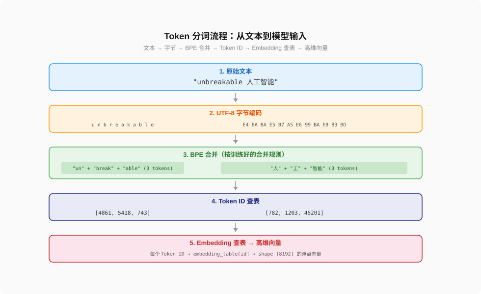
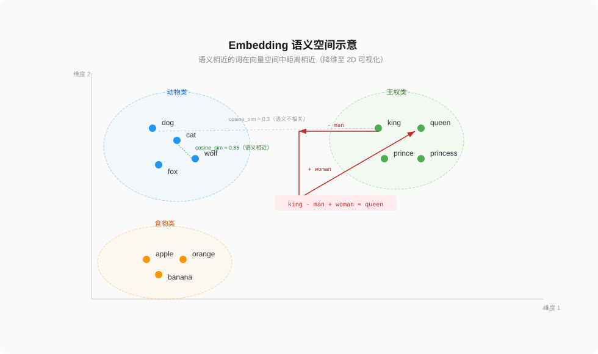
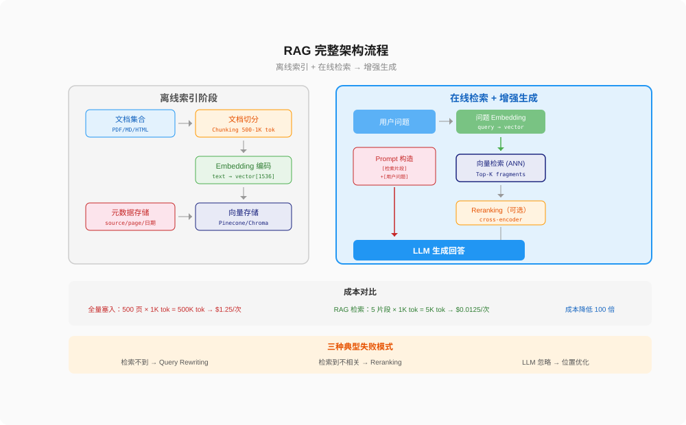
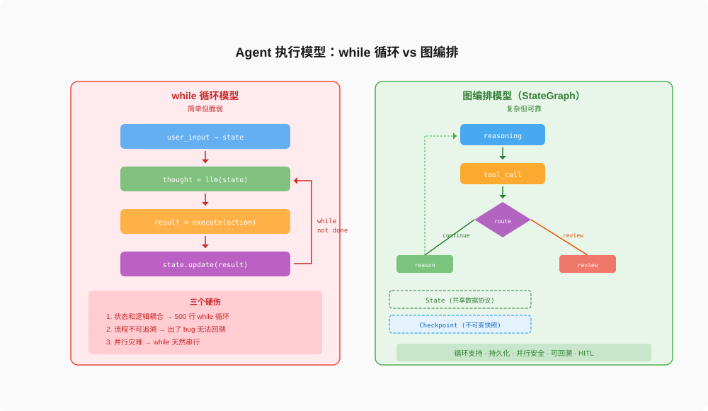
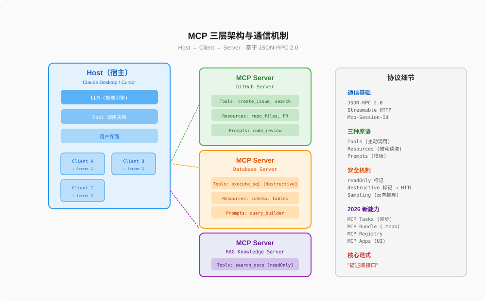

# AI 五大核心概念全解析

## Token、Embedding、RAG、Agent、MCP

---

大家好，我是Q。

做 AI 应用开发的人，每天都在跟这五个词打交道：Token、Embedding、RAG、Agent、MCP。但大部分人只知道它们"大概是什么"，说不清它们"到底怎么工作"，更说不清它们"为什么必须按这个顺序理解"。

因为这五个概念不是并列的——它们是**一层一层堆叠的**：

```
Token    → 文本怎么变成数字
Embedding → 数字怎么变成语义
RAG      → 语义怎么接入外部知识
Agent    → 知识怎么驱动自主行动
MCP      → 行动怎么标准化对接外部系统
```

每一层都依赖上一层的机制。不懂 Token，就理解不了 Embedding 的输入是什么；不懂 Embedding，就理解不了 RAG 的检索原理；不懂 RAG，就理解不了 Agent 的知识边界；不懂 Agent，就理解不了 MCP 要解决什么问题。

这篇文章，就从底层到顶层，把这五个概念的技术机制讲透。不是科普，是工程视角的深度解析。

---

### 一、Token：文本进入模型的第一道门

#### 1.1 Token 不是"词"

很多人说"Token 就是词"，这不对。Token 是分词算法把文本切分后的最小单位，它可能是一个词、一个词的一部分、甚至一个字符。

举个例子。GPT-4o 的 tokenizer 处理 `"unbreakable"` 这个词时，不会把它当作一个整体，而是切分成三个 token：

```
"unbreakable" → ["un", "break", "able"]
```

处理 `"hello"` 时，可能就是一个 token：

```
"hello" → ["hello"]
```

处理中文 `"人工智能"` 时，可能切分成：

```
"人工智能" → ["人", "工", "智能"]
```

或者根据训练数据的不同，可能是：

```
"人工智能" → ["人工", "智能"]
```

切分方式完全取决于 tokenizer 的词表和合并规则。同一个词在不同模型中的 token 数量可能不同——这是跨模型迁移时最容易踩的坑。

#### 1.2 BPE：最主流的分词算法

当前主流 LLM 使用的分词算法是 BPE（Byte Pair Encoding），或者它的变体 Byte-level BPE。

BPE 的核心思想：**从字符级别开始，反复合并最高频的字符对，直到达到预设词表大小。**

训练过程：

```
初始：每个字节是一个 token
第 1 轮：找到出现最频繁的相邻字节对，合并为新 token
第 2 轮：在上一轮结果上，再找最高频字节对，合并
...
第 N 轮：达到词表大小，停止
```

举个具体例子。假设训练数据中有：

```
"low lower lowest low lower lowest"
```

初始状态（按字符）：

```
l o w   l o w e r   l o w e s t   l o w   l o w e r   l o w e s t
```

第 1 轮统计：`l` + `o` 出现 6 次，最高频 → 合并为 `lo`

第 2 轮统计：`lo` + `w` 出现 6 次 → 合并为 `low`

第 3 轮统计：`e` + `r` 出现 2 次 → 合并为 `er`

...依此类推。

最终词表中既有完整的 `low`，也有子词 `er`、`est`。遇到未见过的 `lowering`，可以切分为 `low` + `er` + `ing`——这就是 BPE 处理未见词的能力：不需要 OOV（Out of Vocabulary）标记，任何文本都能被切分。

#### 1.3 Byte-level BPE：为什么现代模型都用它

原始 BPE 有一个问题：它基于 Unicode 字符构建词表，词表可能非常大（Unicode 有 15 万+字符）。Byte-level BPE 的改进是：**不以 Unicode 字符为基础，而是以 UTF-8 字节为基础。** UTF-8 只有 256 个可能的字节值，词表的基础大小固定为 256。

这意味着：**任何语言的任何文本，都能被 byte-level BPE 处理**——不需要为每种语言准备特殊字符集。这是 GPT-4o、Llama 4、DeepSeek-V3 都采用 byte-level BPE 的原因。

#### 1.4 各模型的词表大小

| 模型 | 词表大小 | 分词算法 |
|------|---------|---------|
| GPT-4o / o3 | ~200,000 | tiktoken (byte-level BPE) |
| Llama 4 | 202,048 | tiktoken-based |
| Gemini 3 | 262,144 | SentencePiece (Unigram/BPE) |
| DeepSeek-V3 | ~128,000 | Custom BPE |
| Qwen3 | ~151,936 | Custom BBPE |

词表大小是一个关键工程决策。词表越大，常见词越可能被保留为完整 token（减少 token 数量），但 embedding 层的参数量也越大。GPT-4o 的 200K 词表意味着 embedding 层有 200K × hidden_dim 个参数——如果 hidden_dim 是 8192，光 embedding 层就有 16 亿参数。

#### 1.5 Token 对成本和延迟的影响

Token 不是抽象概念——它直接决定你的 API 账单和响应速度。

**成本：** OpenAI 按 token 计费。GPT-4o 的输入价格是 $2.5/M input tokens，输出 $10/M output tokens。一个 1000 token 的请求，输入成本 $0.0025。如果你的 prompt 每次都带 50K token 的上下文，100 次调用就是 5M token，输入成本 $12.5。

**延迟：** LLM 的生成是逐 token 进行的。每秒生成的 token 数（tokens/second）是推理速度的核心指标。GPT-4o 的输出速度约 80-100 tok/s，生成 1000 个 token 大约需要 10-12 秒。

**中文的特殊代价：** 同样一段内容，中文的 token 数通常是英文的 2-3 倍。因为中文的每个汉字往往是一个独立 token，而英文的常见词可以合并为一个 token。"人工智能" 在 GPT-4o 中可能是 3-4 个 token，而 "artificial intelligence" 可能只需 2 个。这意味着中文场景下的 token 成本天然更高。

#### 1.6 Token 的技术边界

Token 机制有三个经常被忽略的技术边界：

**第一，Token 切分影响模型的"视野"。** 模型看到的世界是 token 序列，不是字符序列。如果 `"doctor"` 和 `"Doctor"` 被切分为不同的 token（因为大小写），模型需要分别学习它们的语义。这是为什么大多数现代 tokenizer 会在分词前做 lowercase 或 normalization。

**第二，Token 边界不对齐语义边界。** `"San Francisco"` 可能被切分为 `["San", " Francisco"]` 两个 token，而模型需要通过注意力机制重新"发现"它们是一个整体。更极端的情况：一个英文单词被切分成 5-6 个 token，模型需要多步推理才能理解它们的组合语义。

**第三，Token 计数不等于字符计数。** 你不能通过 `len(text)` 估算 token 数量。必须用 tokenizer 实际编码才能得到准确数字。这也是为什么所有 LLM 应用的输入校验都应该是 token-level，而不是 character-level。



---


#### 1.7 Token 计数的工程实践

在实际项目中，token 计数不是"数一下"这么简单。有三个工程问题必须解决：

**问题一：不同模型的 tokenizer 不兼容。**

同一段文本，GPT-4o 的 tiktoken 和 Claude 的 proprietary tokenizer 切分结果不同。1000 个中文字符，GPT-4o 可能切出 1500 个 token，Claude 可能只有 1000 个。这意味着你在 GPT-4o 上测试好的 prompt 长度限制，迁移到 Claude 上可能溢出。

工程解法：**抽象 tokenizer 层。** 不要在业务代码里硬编码 token 计数逻辑，而是通过统一的接口调用对应模型的 tokenizer。

```python
# 不好：硬编码
if len(text.split()) > 4000:  # 不准确
    raise ValueError("输入过长")

# 好：用对应模型的 tokenizer
from tiktoken import encoding_for_model
enc = encoding_for_model("gpt-4o")
if len(enc.encode(text)) > 4000:
    raise ValueError("输入过长")
```

**问题二：多轮对话的 token 累积。**

每轮对话的输入包含全部历史消息。5 轮后，如果每轮平均 1000 token 输出，上下文已经有 5000+ token 的历史。10 轮后就是 10000+。这意味着对话越长，每次调用的输入 token 越多，成本和延迟都在增长。

工程解法：设置滑动窗口（只保留最近 N 轮）、摘要压缩（每 5 轮压缩一次历史）、或者提前截断（超过 token 上限自动截断最早的消息）。

**问题三：Streaming 下的 token 计数。**

LLM 的流式输出是逐 token 返回的，你无法在生成前知道最终会有多少 token。这意味着你无法在流式生成中做精确的 token 上限控制——只能在生成后计数，超过上限则截断。

工程解法：设置 `max_tokens` 参数作为硬上限，同时在流式回调中累计计数，接近阈值时主动发送停止信号。

### 二、Embedding：从 Token 到语义空间的映射

#### 2.1 Embedding 解决什么问题

Token 化之后，文本变成了整数序列（token ID）。但整数本身没有语义——token ID 37 和 token ID 8521 之间的数值关系，不反映它们对应的词之间的语义关系。

Embedding 层做的事情就是：**把每个 token ID 映射到一个高维向量，使得语义相近的 token 在向量空间中距离相近。**

```python
# 简化示意
embedding_table = nn.Embedding(vocab_size=200000, embedding_dim=8192)

# token ID → 向量
token_id = tokenizer.encode("king")[0]  # 比如 18756
vector = embedding_table(token_id)       # shape: [8192]
```

这个映射不是手工设计的——它在模型训练过程中自动学习。训练的目标是：**让模型在预测下一个 token 时，那些能帮助预测的语义关系被编码进向量空间。**

#### 2.2 为什么是高维向量

Embedding 的维度通常在 768（小模型）到 8192（大模型）之间。为什么不是 3 维或 10 维？

因为语言语义是多面的。一个词有语法属性（名词/动词）、语义属性（动物/食物）、情感属性（正面/负面）、上下文属性（金融语境 vs 日常语境）。每一"面"都需要至少一个维度来表达。768 维的向量可以同时编码几百个语义维度——虽然我们无法逐个解释每个维度的含义（它们是学习得到的隐式表示），但它们共同构成了一个精确的语义空间。

#### 2.3 语义空间的关键性质

**距离 = 语义相似度。** 在训练良好的 embedding 空间中，余弦相似度（cosine similarity）衡量两个 token 的语义接近程度：

```python
from torch.nn.functional import cosine_similarity

king_vec = embedding_table(tokenizer.encode("king")[0])
queen_vec = embedding_table(tokenizer.encode("queen")[0])
man_vec = embedding_table(tokenizer.encode("man")[0])
woman_vec = embedding_table(tokenizer.encode("woman")[0])

cosine_similarity(king_vec, queen_vec)    # ~0.85 语义相近
cosine_similarity(king_vec, man_vec)      # ~0.75 语义相近
cosine_similarity(king_vec, "apple")      # ~0.3  语义不相关
```

**类比关系可以被向量运算捕获。** 最著名的例子：

```
king - man + woman ≈ queen
```

这个等式在向量空间中成立（余弦相似度意义上的"≈"），因为 `king - man` 提取了"王权"这个语义维度，加上 `woman` 就得到了"女王"。这不是魔法——是训练过程中模型发现这种关系有助于预测下一个 token。

**但类比关系不是总能成立。** `doctor - man + woman ≈ nurse` 这个等式也常常成立，它反映的不是"客观真理"，而是训练数据中的统计偏见。Embedding 空间反映的是训练语料的统计规律，不是现实世界的客观事实。

#### 2.4 两种 Embedding：静态 vs 上下文

**静态 Embedding（Word2Vec / GloVe）：** 每个词只有一个固定的向量。"bank" 无论在"river bank"还是"bank account"中，都是同一个向量。这是 2018 年之前的主流方案。

**上下文 Embedding（BERT / GPT / 所有现代 LLM）：** 同一个 token 在不同上下文中有不同的向量。模型通过注意力机制，把周围 token 的信息融合进当前 token 的表示。

```
"我去了银行存款" 中 "银行" 的 embedding  ≠
"河岸边的银行" 中 "银行" 的 embedding
```

这不是 embedding 层单独实现的——embedding 层只提供初始向量，上下文信息是在后续的 Transformer 层中通过自注意力逐步注入的。所以严格说，LLM 的"embedding"是一个从 token ID 到上下文感知表示的**过程**，不是一个静态查表操作。

#### 2.5 Embedding 的存储成本

Embedding 表的参数量 = 词表大小 × 嵌入维度。以 GPT-4o 为例：

```
200,000 (词表) × 8,192 (维度) × 2 bytes (FP16) = ~3.2 GB
```

仅 embedding 层就占 3.2GB 显存。这就是为什么词表大小是一个工程约束——更大的词表虽然能减少 token 数量，但 embedding 层的存储和计算成本线性增长。



---

### 三、RAG：让模型访问它训练数据之外的知识

#### 3.1 RAG 解决的根本问题

LLM 的知识有两个硬限制：

**第一，训练数据有截止日期。** GPT-4o 的训练数据截止到 2024 年，它不知道 2025 年之后发生的事。

**第二，上下文窗口有限。** GPT-4o 的上下文是 128K token。如果你有 500 页的内部文档，全部塞进上下文也不够——而且 token 成本爆炸。

RAG（Retrieval-Augmented Generation）的方案是：**不在 prompt 里塞所有知识，而是按需检索相关片段，只把最相关的内容注入上下文。**

#### 3.2 RAG 的完整流程

RAG 不是"搜一下然后拼进 prompt"这么简单。它是一个五步流水线：

**第一步：文档切分（Chunking）。** 把长文档切成小片段（通常 500-1000 token），因为检索的粒度是片段，不是整篇文档。切分策略直接影响检索质量——按段落切、按 token 数切、按语义边界切，效果差异很大。

**第二步：Embedding 编码。** 对每个片段生成 embedding 向量。这里用的是独立的 embedding 模型（如 text-embedding-3-small），不是 LLM 本身的 embedding 层。输出维度通常是 1536 或 3072。

**第三步：向量存储（Vector Store）。** 把 embedding 向量存入向量数据库（Pinecone、Weaviate、Chroma、Milvus 等）。向量数据库的核心能力是**近似最近邻搜索（ANN）**——在百万级向量中，毫秒级找到与查询向量最相似的 Top-K 个。

**第四步：检索（Retrieval）。** 用户提问时，把问题也 embedding 成向量，在向量数据库中检索最相似的文档片段。

**第五步：增强生成（Augmented Generation）。** 把检索到的片段和用户问题一起送给 LLM，LLM 基于这些片段生成回答。

```
用户问题 → Embedding → 向量检索 → 取出 Top-K 片段
                                         ↓
                 LLM ← [检索片段 + 用户问题] ← 拼接 prompt
                  ↓
               生成回答
```

#### 3.3 向量检索的原理：为什么用余弦相似度

向量数据库做检索时，最常用的是余弦相似度（cosine similarity）：

```python
def cosine_similarity(a, b):
    return dot(a, b) / (norm(a) * norm(b))
```

为什么不用欧氏距离？因为 embedding 向量的长度（模）受词频和文本长度影响——一个 500 token 的片段和一个 50 token 的片段的 embedding 模长可能差很多，但语义可能很接近。余弦相似度只看方向、不看长度，消除了模长的干扰。

ANN 算法（HNSW、IVF-PQ）牺牲了精度（不保证找到绝对最近的邻），换来了速度（从 O(n) 暴力搜索降到 O(log n)）。在实际应用中，95% 的召回率已经足够——RAG 的瓶颈通常是检索质量（chunk 切得不好、query 和 document 的语义鸿沟），不是 ANN 的精度损失。

#### 3.4 RAG 的三种典型失败模式

**失败模式一：检索不到。** 用户的问法和文档的写法差距太大。用户问"怎么报销"，文档写的是"费用结算流程"——语义相同，但 embedding 空间中距离可能很远。

解法：Query Rewriting——先用 LLM 把用户问题改写成更适合检索的形式。

**失败模式二：检索到了但不相关。** Top-K 的片段和问题有关联，但不是回答问题所需的信息。比如用户问"巴黎人口"，检索到的是"巴黎的美食文化"。

解法：Reranking——用一个交叉编码器（cross-encoder）对检索结果重新排序，交叉编码器能同时看到 query 和 document 的交互，比双塔式的 embedding 相似度更准确。

**失败模式三：检索到了但 LLM 没用。** 相关信息已经在上下文里了，但 LLM 在生成时"忽略"了它。这通常是因为检索到的片段被埋在过长的上下文中间——研究表明，LLM 对上下文中间位置的信息注意力显著弱于开头和结尾（"Lost in the Middle" 现象）。

解法：把最相关的片段放在上下文的开头或结尾，中间放次相关的。

#### 3.5 RAG 的成本结构

RAG 的成本不只是 LLM 调用——还有 embedding 和存储：

- **Embedding 成本：** text-embedding-3-small 的价格是 $0.02/M tokens。对 100 万篇文档做 embedding（每篇平均 1K token），成本约 $20。
- **向量存储成本：** Pinecone 的标准集群约 $70/月起步。
- **检索延迟：** 向量检索通常 10-50ms，embedding 编码约 20-100ms，LLM 生成约 1-10s。总延迟中 LLM 生成是瓶颈。
- **LLM Token 成本：** 每次请求带 5-10 个检索片段（约 3K-8K token），加上用户问题，输入 token 约 5K-10K。比全量塞入文档便宜 10-100 倍。



---


#### 3.6 RAG 的进阶模式

基础的 RAG 是"检索 → 拼接 → 生成"三步走。但在生产环境中，这三步都有进阶做法：

**Query Rewriting（查询改写）：** 用户的问题往往不是最佳检索 query。用户问"怎么报销"，文档里写的是"费用结算流程"。用 LLM 先改写查询：

```python
rewritten = llm.invoke(
    "把以下问题改写成适合搜索的形式：'怎么报销'"
)
# → "费用报销流程 规定 步骤"
```

改写后的查询覆盖了同义表达，召回率显著提升。

**HyDE（Hypothetical Document Embedding）：** 先让 LLM 生成一个"假设性回答"，用这个回答的 embedding 去检索——因为假设性回答和真实文档的语义分布更接近，比直接用问题检索效果好。

**Self-RAG：** 让 LLM 自己判断"检索到的内容有没有用"。如果没用，重新检索或换一种检索策略。本质上是把检索变成了 Agent 的一个工具——检索不再是固定的流水线步骤，而是 Agent 自主决定的行为。

**Multi-Vector Store：** 不同类型的查询走不同的向量库。代码查询走代码 embedding 库，文档查询走文本 embedding 库。这避免了"用文本 embedding 搜代码"的语义鸿沟问题。

**GraphRAG：** 把知识组织成知识图谱而非纯向量。实体和关系作为图节点和边存储，检索时沿图结构遍历关联实体。适合需要多跳推理的场景——"A 公司的 CEO 之前在哪个公司任职"这种问题，纯向量检索很难处理，但图遍历可以直接找到答案。

这些进阶模式的共同思路：**把 RAG 从"一次检索一次生成"的固定管道，变成"多轮检索 + 动态判断"的智能流程。** 这也是 RAG 和 Agent 的交汇点——当检索变成了 Agent 的工具，RAG 就不再是独立的技术，而是 Agent 能力的一部分。

### 四、Agent：从"回答问题"到"自主行动"

#### 4.1 Agent 和 Chatbot 的本质区别

Chatbot 的工作模式是：**你问我答，一轮结束。** 它不需要规划、不需要执行、不需要判断任务是否完成。

Agent 的工作模式是：**你给我目标，我自主决定做什么、用什么工具、做几步、什么时候停。**

区别在于有没有**自主决策循环**。

```
Chatbot:  输入 → LLM → 输出（一次调用）
Agent:    输入 → LLM 推理 → 选择工具 → 执行 → 观察结果 → LLM 再推理 → ... → 输出
```

这个循环就是 ReAct（Reasoning + Acting）模式：推理和行动交替进行，直到任务完成或达到重试上限。

#### 4.2 Agent 的四个核心组件

**Model（模型）：** Agent 的"大脑"，负责推理和决策。不是越强越好——简单任务用小模型更快更便宜，复杂推理才需要大模型。

**Tool（工具）：** Agent 的"手脚"，让 Agent 能和外部世界交互。搜索、数据库查询、API 调用、代码执行——每个工具是一个封装了输入输出 schema 的函数。模型不直接执行工具，而是输出一个工具调用意图（function call），由运行时执行。

**Memory（记忆）：** Agent 的"上下文"。短期记忆（当前对话）+ 长期记忆（跨会话的用户偏好、历史摘要）。没有记忆的 Agent 每次对话都是失忆的。

**Planning（规划）：** Agent 的"计划表"。把复杂目标拆解成子任务，按依赖关系排列执行顺序。不是所有 Agent 都需要显式规划——简单任务可以 ReAct 一步到位，复杂任务才需要 Plan-and-Execute。

#### 4.3 Agent 的执行模型：从 while 循环到图编排

最简单的 Agent 执行模型：

```python
while not done:
    thought = llm.reason(state)
    action = pick_tool(thought)
    result = execute(action)
    state.update(result)
    done = check_completion(state)
```

这在原型阶段够用，但生产环境会遇到三个硬伤：状态和逻辑耦合（500 行 while 循环）、流程不可追溯、并行执行困难。

图编排（如 LangGraph）把执行模型从 while 循环升级为状态图——节点是处理步骤，边是流转逻辑，State 是共享数据协议，Checkpoint 是执行历史的不可变链表。这解决了 while 循环的全部问题，但代价是更重的 API 和更陡的学习曲线。

选择标准很简单：**如果你的 Agent 不需要循环、不需要持久化、不需要人工审核——while 循环就够。如果需要任何一项，就用图编排。**

#### 4.4 Agent 的成本陷阱

Agent 的 token 消耗远高于普通 Chatbot。原因：

- **多轮推理：** 每个 superstep 至少一次 LLM 调用。10 步任务 = 10 次 LLM 调用。
- **工具输出：** 搜索结果、API 返回值等工具输出全部进入上下文。一次搜索可能返回 2000 token。
- **上下文累积：** 对话历史在每轮都完整发送。50 轮对话后，输入 token 可能达到几十万。

一个典型的 10 步 Agent 任务，token 消耗可能是同等 Chatbot 请求的 20-50 倍。不控制成本，Agent 系统要么被关掉，要么被限流。



---


#### 4.5 Agent 和 RAG 不是并列关系

很多人把 Agent 和 RAG 当成两个并列的技术选项——"用 RAG 还是 Agent？"。这个理解是错的。

RAG 是一种**知识增强技术**——它解决的是"模型怎么获取训练数据之外的知识"。

Agent 是一种**执行范式**——它解决的是"系统怎么自主决定做什么"。

Agent 可以用 RAG 作为工具——推理时决定"我需要查一下"，调用检索工具，获取知识后再继续推理。这时候 RAG 是 Agent 工具箱里的一个工具，不是和 Agent 并列的方案。

反过来，RAG 也可以不用 Agent——固定管道的"检索 → 拼接 → 生成"不涉及自主决策，不需要 Agent 循环。

所以正确的关系是：**RAG 是 Agent 的一种能力来源，Agent 是 RAG 的一种使用方式。** 两者可以独立使用，也可以组合使用。组合使用时，Agent + RAG 比"固定管道 RAG"更灵活——Agent 可以决定什么时候检索、用什么策略检索、检索结果不够时怎么调整。

### 五、MCP：Agent 对接外部系统的标准化协议

#### 5.1 MCP 解决什么问题

没有 MCP 之前，Agent 接入外部工具是这样做的：

```
Agent 要接 GitHub → 写一个 GitHub API 封装
Agent 要接 Slack  → 写一个 Slack API 封装
Agent 要接数据库  → 写一个 SQL 执行封装
```

每个集成都是定制的。换个 Agent 框架，所有封装重写一遍。换个 LLM 提供商，工具调用的格式可能都不同。

MCP（Model Context Protocol）做的事情是：**定义一个标准协议，让任何 Agent（Host）都能通过统一接口访问任何工具服务（Server）。** 就像 USB 协议让任何电脑都能用任何 USB 设备——不需要为每个设备写专门的驱动。

#### 5.2 MCP 的三层架构

MCP 的架构严格遵循 Client-Server 模式，基于 JSON-RPC 2.0：

**Host（宿主）：** 用户交互的 Agent 应用。比如 Claude Desktop、Cursor、Cline。一个 Host 可以同时连接多个 MCP Server。

**Client（客户端）：** Host 内部的协议客户端，负责和 Server 建立连接、发送请求、接收响应。每个 Client 维护一个 1:1 的 Server 连接。

**Server（服务端）：** 提供具体能力的独立进程。每个 Server 通过三种原语暴露能力：

```
┌─────────────────────────────────────────────┐
│              MCP Server 暴露三种能力          │
├─────────────────────────────────────────────┤
│                                             │
│  Tools（工具）                               │
│  可被 LLM 调用的函数                         │
│  例：search_web(query) → results            │
│  例：execute_sql(query) → rows              │
│                                             │
│  Resources（资源）                           │
│  可被读取的结构化数据                         │
│  例：file:///path/to/doc.md → content       │
│  例：db://users/table → schema + data       │
│                                             │
│  Prompts（提示模板）                         │
│  预定义的 prompt 模板 + 参数                  │
│  例：code_review(code: str) → prompt        │
│  例：summarize(text: str) → prompt          │
│                                             │
└─────────────────────────────────────────────┘
```

**Tools** 是最重要的原语。它是 LLM 可以主动调用的——Agent 在推理过程中决定"我需要搜索"，就调用 search_tool。Tools 有严格的输入输出 schema（JSON Schema 定义），LLM 根据 schema 生成结构化调用参数。

**Resources** 是被动读取的——Agent 可以浏览 Server 提供的资源列表，选择需要的资源读取。适合暴露文件、数据库 schema、配置信息等。

**Prompts** 是预定义的 prompt 模板——Server 定义好"代码审查"这个 prompt 长什么样，Agent 直接拿来用，不需要自己构造。

#### 5.3 MCP 的通信机制

MCP 基于 JSON-RPC 2.0，支持三种通信模式：

**请求-响应：** Client 发请求，Server 返回结果。标准同步模式。

**通知：** 一方发送消息，不需要对方回复。比如 Client 通知 Server "我初始化完成了"。

**Sampling（采样）：** Server 请求 Host 的 LLM 做一次推理。这是最特殊的能力——它让 MCP Server 能"反向使用"Agent 的 LLM。比如，一个代码分析 Server 可以让 Agent 的 LLM 做一次代码理解推理，而不需要自己内置 LLM。

#### 5.4 MCP 2025-2026 的关键更新

MCP 在 2025 年 11 月发布了重大更新，2026 年又增加了新能力：

**Streamable HTTP 替代 SSE（2025.3）：** 之前 MCP 用 Server-Sent Events 做流式传输，在企业防火墙下经常被阻断。Streamable HTTP 统一为单一 `/mcp` 端点，支持双向通信，且兼容企业代理。

**Tool Annotations（2025.3）：** Server 可以标记工具为 `readOnly` 或 `destructive`。Host 根据标记决定是否需要人工审批。`destructive` 的工具（如 `delete_database`）必须 HITL，`readOnly` 的工具（如 `search`）可以自动执行。

**MCP Tasks（2026）：** Server 可以运行长时间后台任务并报告进度。从请求-响应模式扩展到异步工作流——一个研究类 Server 可以启动多个子 Agent 并行工作，最终汇总结果返回。

**MCP Bundle Format（.mcpb，2025.11）：** 标准化的 Server 打包格式。开发者可以把 Server 打包成 `.mcpb` 文件，用户一键安装，不需要手动配置。

**MCP Registry（2025.9）：** 类似 npm registry 的 Server 注册中心。开发者可以发布自己的 MCP Server，用户可以搜索和安装。

**MCP Apps（2026.1）：** Server 可以向 Host 注册 UI 能力——不只是返回文本，还能渲染表单、图表等交互界面。

#### 5.5 MCP 与传统 API 集成的区别

传统 API 集成是**面向程序员的**——你需要读 API 文档，写适配代码，处理认证和错误。

MCP 是**面向 LLM 的**——Server 的 Tools 带有自然语言描述（description），LLM 读懂描述就知道该不该调用、怎么调用。这是"描述即接口"的范式：不靠文档告诉程序员怎么用，靠描述告诉 LLM 怎么用。

```python
# MCP Server 定义工具的方式
@server.tool()
async def search_web(query: str) -> list[str]:
    """Search the web for information. 
    Use this when you need to find current information 
    that may not be in your training data."""
    results = await search_api(query)
    return results

# LLM 读取 description 后自动决定是否调用
# 不需要程序员写路由逻辑
```

这种设计有一个重要的副作用：**description 的质量直接决定 LLM 能否正确选择工具。** 写得模糊，LLM 可能选错工具或漏选。MCP 工具的 description 写作已经变成一门实践技能——它不是给人类读的 API 文档，是给 LLM 读的"使用说明书"。

#### 5.6 MCP 的安全模型

MCP 的安全边界划在三个层级：

**Host 级别：** Host 决定连接哪些 Server，控制工具的执行权限。用户可以配置"只读 Server 不需要审批，写操作 Server 需要确认"。

**Tool 级别：** Tool Annotations 标记 `readOnly` / `destructive`。Host 可以据此自动执行或拦截。

**Server 级别：** Server 自己可以做权限控制——只暴露当前用户有权访问的资源。

但 MCP 协议本身不提供认证和加密——它假设运行在可信网络中。企业部署时需要在传输层加 TLS，在应用层加 OAuth 2.0 或 API Key 认证。



---


#### 5.7 MCP 和 Function Calling 不是一回事

OpenAI 的 Function Calling、Anthropic 的 Tool Use、Google 的 Function Calling——这些是模型层面的能力。LLM 在推理时输出一个结构化的工具调用意图（函数名 + 参数），运行时解析后执行。

MCP 是协议层面的能力。它定义的是"工具怎么暴露给 LLM"、"工具调用怎么在网络上传输"、"Server 和 Client 怎么建立连接"。

```
Function Calling / Tool Use = 模型输出工具调用的格式
MCP = 工具服务的标准化通信协议
```

它们不在同一层。MCP 可以和任何支持 Function Calling 的模型配合——你可以在 GPT-4o + MCP 的组合中使用 Function Calling 来调用 MCP Server 暴露的工具。MCP 管的是"工具怎么被发现和连接"，Function Calling 管的是"模型怎么表达调用意图"。

这也是为什么 MCP 不绑定任何 LLM 提供商——它只管协议，不管模型。你的 Agent 用 GPT-4o、Claude、还是 Llama，MCP Server 都不需要改。

#### 5.8 MCP 的实际部署架构

生产环境中，MCP 的部署架构通常是：

```
┌─────────────┐     ┌─────────────┐     ┌─────────────┐
│  MCP Client │────→│  MCP Server │────→│ GitHub API  │
│  (in Host)  │     │  (GitHub)   │     │             │
└─────────────┘     └─────────────┘     └─────────────┘

┌─────────────┐     ┌─────────────┐     ┌─────────────┐
│  MCP Client │────→│  MCP Server │────→│ PostgreSQL  │
│  (in Host)  │     │  (Database) │     │             │
└─────────────┘     └─────────────┘     └─────────────┘

┌─────────────┐     ┌─────────────┐     ┌─────────────┐
│  MCP Client │────→│  MCP Server │────→│ 内部知识库   │
│  (in Host)  │     │  (RAG)      │     │ (向量库)     │
└─────────────┘     └─────────────┘     └─────────────┘
```

一个 Host 可以同时连接多个 MCP Server，每个 Server 管理一类工具和数据。Host 在推理时选择调用哪个 Server 的哪个 Tool。

这种架构的好处是**模块化**——新增一个工具能力，只需要启动一个新的 MCP Server，Host 自动发现并注册。不需要改 Agent 代码，不需要重新部署。

### 六、五个概念的堆叠关系

回到开头的问题：为什么这五个概念必须按这个顺序理解？

因为每一层都依赖上一层的机制，同时为下一层提供基础：

```
┌──────────────────────────────────────────────────┐
│  MCP：标准化协议，让 Agent 对接外部系统           │
│  ↑ 依赖：Agent 需要调用工具的能力                 │
├──────────────────────────────────────────────────┤
│  Agent：自主决策循环，选择工具、执行、观察         │
│  ↑ 依赖：RAG 提供知识，避免模型只靠训练数据       │
├──────────────────────────────────────────────────┤
│  RAG：检索增强，按需注入外部知识                   │
│  ↑ 依赖：Embedding 做语义检索                     │
├──────────────────────────────────────────────────┤
│  Embedding：语义向量，让语义相似的内容距离相近     │
│  ↑ 依赖：Token 化把文本变成离散符号               │
├──────────────────────────────────────────────────┤
│  Token：文本到数字的映射，模型处理的最小单位       │
│  ↑ 最底层，所有上层都建立在此之上                  │
└──────────────────────────────────────────────────┘
```

一个具体的请求链路：

```
用户问："帮我查一下公司最新的财务数据"

1. Token 化：问题被切分为 token 序列
2. Embedding：问题被编码为语义向量
3. RAG：用语义向量在向量数据库中检索财务报告片段
4. Agent：推理"我需要调用财务查询工具"→ 调用 MCP Server
5. MCP：财务 Server 返回数据 → Agent 生成回答
```

每一层都在工作，缺一不可。没有 Token 化，模型无法处理文本。没有 Embedding，无法做语义检索。没有 RAG，模型只有训练数据的知识。没有 Agent，系统只能回答问题不能执行任务。没有 MCP，每个工具集成都是定制的。

理解这个堆叠关系，比单独理解每个概念更重要。因为真正的工作不是"用某个技术"，是在正确的层级选择正确的工具。

---

*（本文基于 GPT-4o/Llama 4/Gemini 3 的公开技术报告、MCP 2025-11-25 规范、及各向量数据库官方文档综合撰写。）*
