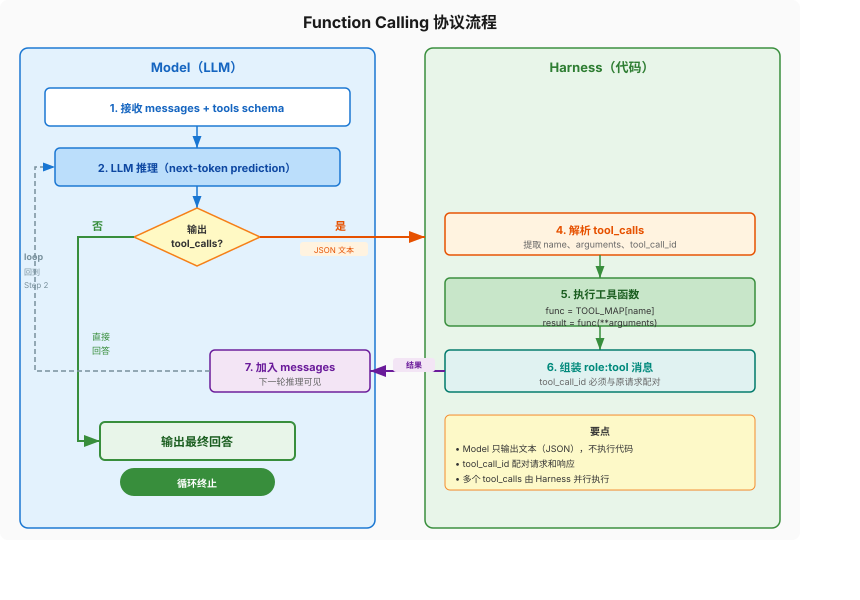

# 第2章：Model 深度解析 —— LLM 的内部工作机制

> **本章你将理解：** LLM 推理的本质、System Prompt 的工程化设计方法、Function Calling 协议的完整机制。
>
> **前置知识：** 第1章（Agent = Model + Harness 的概念）、Python 基础、用过 OpenAI SDK。
>
> **学完这章你能做：** 设计高质量的 System Prompt 和 tools schema，理解 Model 每次调用时"看到"了什么，排查"Agent 为什么选错工具"的问题。

上一章建立了 Agent = Model + Harness 的框架。这一章深入 Model 层——LLM 的推理机制、System Prompt 的工程化、Function Calling 的完整协议。理解了 Model 的内部工作方式，你才能在 Harness 层做出正确的设计决策。

---

## 1 LLM 推理的本质：next-token prediction

LLM 的工作方式简单到让人怀疑：给定一段文本，预测下一个 token。就这一件事。但它在这个简单操作上，涌现出了让人惊叹的能力。

### 为什么"想一步"和"想三步"差距巨大

看一个具体的例子。问 GPT-4：

> 一个商店有 23 个苹果，上午卖了 17 个，下午又进货了 6 个。现在有几个苹果？

**不加 CoT（Chain of Thought）的提示：**

```
请直接给出答案。
```

模型输出：`12`

碰巧对了。但 Model 跳过了推理过程——如果中间步骤更复杂（比如涉及分数、逻辑判断），"直觉式"回答就容易出错。看一个真正会错的例子：

> 一个水池，A 管 5 小时注满，B 管 4 小时注满，排水管 10 小时排完。三管同时开，几小时注满？

不加 CoT 时，模型常见错误输出：`3 小时`（简单取平均）。

加 CoT 后：

```
A 管速率：1/5 池/小时
B 管速率：1/4 池/小时
排水速率：1/10 池/小时
三管同时：1/5 + 1/4 - 1/10 = 4/20 + 5/20 - 2/20 = 7/20
时间 = 1 ÷ 7/20 = 20/7 ≈ 2.86 小时
```

**不加 CoT 时，模型要在一次前向传播中从问题直接跳到答案，中间的推理过程全部发生在隐藏状态里。** 加 CoT 后，每一步推理都变成了显式的 token，成为下一步推理的输入。**本质上，CoT 增加了推理的"计算步数"。**

这个发现来自 2022 年的论文《Chain-of-Thought Prompting Elicits Reasoning in Large Language Models》。核心结论：**模型规模越大，CoT 带来的收益越明显。** 小模型加了 CoT 效果提升不大，因为它们缺乏足够的推理能力来利用额外的计算步数。

### 从 CoT 到 Agent 的推理

Agent 的 ReAct 循环（Thought → Action → Observation）就是 CoT 的工程化版本。区别在于：

- **CoT：** Thought → Thought → Thought → Answer（纯文本推理）
- **ReAct：** Thought → Action → Observation → Thought → ... → Answer（推理 + 工具调用）

ReAct 比 CoT 多了两个环节：Action（调用工具）和 Observation（获取真实信息）。这让推理不再局限于模型的内部知识，而是可以引入外部数据。

理解了这一点，就能回答一个常见问题：**为什么 Agent 有时候会"自言自语"——在 Thought 里重复显而易见的事实？** 因为模型需要这些 token 作为后续推理的锚点。这不是 bug，是 CoT 的特性。

### 对 Harness 设计的启示

CoT 的原理直接决定了 Harness 的两个设计选择：

**不要截断 Thought。** 有些实现为了节省 token，只把 Observation 拼回消息列表，丢弃了 Model 的 Thought。这会降低后续推理质量——因为 Model 丢失了上一步的推理上下文。

**给 Model 足够的"思考空间"。** 如果你发现 Agent 在复杂任务上表现差，先检查 System Prompt 是否太死板——比如强制"每次必须调用工具"会压缩 Thought 空间，让模型跳过必要的推理。

---

## 2 System Prompt 的工程化设计

大多数人写 System Prompt 像写小说——一段话描述角色，然后祈祷模型理解。这不叫工程化，叫许愿。

### System Prompt 到底在做什么

每次调用 LLM API，`messages` 列表的第一条通常是 `{"role": "system", "content": "..."}`。这条消息的优先级高于后续所有消息——不是因为 API 有特殊处理，是因为模型在训练时学到了"system 消息是最高优先级的指令"。

但"优先级高"不等于"绝对服从"。System Prompt 是概率性的引导，不是确定性的约束。你在 System Prompt 里写"绝对不能删除数据"，模型大概率会遵守，但不是 100%——而那一次不遵守就是生产事故。

所以 System Prompt 的正确定位是：**引导 Model 的行为倾向，不是强制约束。** 强制约束必须用代码实现（第1章已经讲过）。

### 工程化的 System Prompt 结构

一个工程化的 System Prompt 至少包含四个部分：

```
1. 角色定义：你是谁、你能做什么
2. 行为规则：遇到X应该怎么做、遇到Y应该怎么做
3. 工具使用指南：什么时候用什么工具、输出格式要求
4. 边界约束：什么不能做、遇到不确定时怎么办
```

用第1章的天气 Agent 为例，一个工程化的 System Prompt 长这样：

```python
SYSTEM_PROMPT = """你是一个天气信息助手。

## 角色定义
你可以查询天气信息，并基于查询结果回答用户问题。

## 行为规则
- 用户问天气时，必须调用 get_weather 获取实时数据，不要凭记忆回答
- 用户问多个城市时，逐个调用 get_weather
- 拿到数据后，用简洁的中文总结天气情况

## 工具使用指南
- get_weather：查询指定城市的当前天气。参数 city 必须是城市名称。
- calculate：执行数学计算。仅在需要计算时使用（如温差、平均值）。

## 边界约束
- 只回答天气相关问题。用户问其他问题时，说明你只能查询天气
- 天气数据可能延迟，如实告知用户数据来源和时效性
- 不确定时，调工具查，不要猜"""
```

对比原来那行 `"你是一个有帮助的AI助手。需要时使用工具获取信息。"`——信息量差了 10 倍。

### 四个常见的 System Prompt 错误

**错误一：角色定义太宽泛。** "你是一个有帮助的AI助手"——帮助的方式太多了。搜索是有帮助，编造也是有帮助。要精确：你是天气助手，不是万能助手。

**错误二：规则写成了建议。** "尽量调用工具获取实时数据"——"尽量"是建议，模型可以选择不遵循。应该写"必须调用"，然后在 Harness 层也做校验。

**错误三：没有边界约束。** 只说了能做什么，没说不能做什么。模型遇到边界情况就自由发挥——有时候发挥出创造力，有时候发挥出灾难。

**错误四：太长。** 我见过 2000 词的 System Prompt，塞了各种场景的应对策略。问题是 LLM 对 System Prompt 的关注度不是均匀的——开头和结尾关注度高，中间容易被忽略。**有效的 System Prompt 应该精炼——如果写太长，说明你的 Agent 角色太宽泛了，应该拆成多个专业 Agent。**

### System Prompt 的调试方法

System Prompt 写完不是结束，是开始。调试方法：

1. **准备 10-20 个测试用例**，覆盖正常流程、边界情况、攻击场景
2. **每个用例跑 3 次**——概率模型的输出有随机性，跑一次不能说明问题
3. **记录 Model 的"违规"行为**——什么时候不调工具？什么时候越界？
4. **针对性修改 System Prompt**——违规行为加规则，但每次只改一条，再测
5. **规则加到 5 条以上时考虑拆分**——要么拆 System Prompt 的结构，要么拆 Agent

---

## 3 Function Calling 完整协议

第1章讲了 Function Calling 的基本原理：Model 输出文本（`tool_calls`），Harness 解析执行。这一节讲协议的完整细节——tools schema 设计、tool_choice 三种模式、parallel tool calls、错误处理。

### Tools Schema 设计

`tools` 参数是 Model 选择工具的**唯一依据**。Model 看不到你的 Python 代码，只看到这段 JSON。所以 schema 的设计直接决定工具选择准确率。

一个工具的 schema 包含三个关键字段：

```python
{
    "type": "function",
    "function": {
        "name": "get_weather",           # 1. 名称：Model 用来识别工具
        "description": "获取指定城市的当前天气信息",  # 2. 描述：Model 决定"用不用"的依据
        "parameters": {                   # 3. 参数：Model 决定"怎么用"的依据
            "type": "object",
            "properties": {
                "city": {
                    "type": "string",
                    "description": "城市名称，如北京、上海、New York"
                }
            },
            "required": ["city"]
        }
    }
}
```

**name 要动词开头、语义明确。** `get_weather` 比 `weather` 好——前者明确是"获取"动作，后者可能是获取也可能是分析。`search_web` 比 `web` 好。`calculate` 比 `math` 好。

**description 是最容易被忽视但影响最大的字段。** 好的 description 要回答两个问题：这个工具做什么？什么时候该用？

对比：

```python
# 差的 description
"description": "获取天气"

# 好的 description
"description": "获取指定城市的当前天气信息，包括温度、湿度、天气状况。当用户询问某地天气、比较两地天气、或需要天气数据做计算时使用。"
```

好版本多了"什么时候用"——这直接减少了 Model 的判断成本。实践中，优化 description 对工具选择准确率有显著提升。

**parameters 的 description 同样重要。** `"城市名称，如北京、上海、New York"` 比 `"城市名"` 好——举了例子，Model 知道输入格式。

### tool_choice 三种模式

```python
response = client.chat.completions.create(
    model="gpt-4o",
    messages=messages,
    tools=TOOLS_SCHEMA,
    tool_choice="auto"    # ← 关键参数
)
```

`tool_choice` 有四种值，对应四种系统形态：

| 值 | 行为 | 适用场景 |
|---|---|---|
| `"auto"` | Model 自己决定调不调工具 | **Agent 模式**——大部分场景用这个 |
| `"none"` | 禁止调用任何工具 | **Chatbot 模式**——纯对话 |
| `"required"` | 强制调用至少一个工具 | **工具优先模式**——确保每次都走工具 |
| `{"type": "function", "function": {"name": "xxx"}}` | 强制调用指定工具 | **路由模式**——你已经知道该调哪个 |

第1章的代码用的是 `"auto"`。但有些场景需要其他模式：

**`"required"` 的典型场景：** 客服 Agent 必须查订单才能回答，不允许凭记忆回答。设 `"required"` 确保每次都查数据库。

**指定工具的典型场景：** 你的路由层已经判断了用户意图，直接指定工具，跳过 Model 的选择步骤。省一次推理，也避免选错。

### Parallel Tool Calls

GPT-4o 支持一次输出多个 tool_calls——比如用户问"北京和上海天气"，Model 可能一次输出两个 `get_weather` 调用：

```python
msg.tool_calls = [
    ToolCall(id="call_1", function=Function(name="get_weather", arguments='{"city": "北京"}')),
    ToolCall(id="call_2", function=Function(name="get_weather", arguments='{"city": "上海"}'))
]
```

Harness 层需要处理这种情况。第1章的裸机代码用了串行 `for` 循环：

```python
for tc in msg.tool_calls:
    result = TOOL_MAP[func_name](**func_args)
```

生产环境应该并行执行：

```python
from concurrent.futures import ThreadPoolExecutor, as_completed

def execute_tool_calls(tool_calls):
    """并行执行多个 tool_calls。"""
    with ThreadPoolExecutor(max_workers=min(len(tool_calls), 4)) as executor:
        futures = {}
        for tc in tool_calls:
            func = TOOL_MAP[tc.function.name]
            args = json.loads(tc.function.arguments)
            future = executor.submit(func, **args)
            futures[future] = tc.id

        results = {}
        for future in as_completed(futures):
            results[futures[future]] = future.result()
    return results
```

并行执行把两次 API 调用从串行 2 秒降到并行 1 秒。对用户体验影响明显。

**注意：** 不是所有 tool_calls 都能并行。如果一个工具的参数依赖另一个工具的结果（先查用户 ID 再查订单），必须串行。Model 通常不会对有依赖关系的工具输出 parallel calls，但不保证。Harness 层需要做依赖检查。

### 错误处理：当 Model 输出了非法 tool_call

Model 是概率模型，有时候会输出"看起来像但实际不对"的 tool_call：

- 调用了不存在的工具：`name: "search_weather"`（你只有 `get_weather`）
- 参数类型错误：`city: 123`（应该是字符串）
- 参数缺失：没传 `city`

Harness 层必须处理这些情况：

```python
for tc in msg.tool_calls:
    func_name = tc.function.name

    # 检查工具是否存在
    if func_name not in TOOL_MAP:
        messages.append({
            "role": "tool",
            "tool_call_id": tc.id,
            "content": f"错误：工具 '{func_name}' 不存在。可用工具：{list(TOOL_MAP.keys())}"
        })
        continue

    # 解析参数
    try:
        func_args = json.loads(tc.function.arguments)
    except json.JSONDecodeError:
        messages.append({
            "role": "tool",
            "tool_call_id": tc.id,
            "content": f"错误：参数不是合法的 JSON：{tc.function.arguments}"
        })
        continue

    # 执行
    try:
        result = TOOL_MAP[func_name](**func_args)
    except TypeError as e:
        messages.append({
            "role": "tool",
            "tool_call_id": tc.id,
            "content": f"错误：参数不匹配：{e}"
        })
        continue
    except Exception as e:
        messages.append({
            "role": "tool",
            "tool_call_id": tc.id,
            "content": f"错误：执行失败：{e}"
        })
        continue

    messages.append({
        "role": "tool",
        "tool_call_id": tc.id,
        "content": json.dumps(result, ensure_ascii=False)
    })
```

关键设计：**错误信息也是 `role: tool` 消息。** Model 看到错误后会自行判断——换一个工具、修正参数、还是直接回答。这是 Agent 自我纠错的基础。

### 完整协议流程图



这张图展示了 Model 和 Harness 之间的一次完整交互。注意几个要点：

- Model 每次只输出一组 tool_calls（可能包含多个），Harness 必须全部执行并返回结果
- `tool_call_id` 是配对的关键——Harness 返回的 `role: tool` 消息必须携带对应的 id
- 如果 Harness 返回错误信息，Model 会在下一轮决定怎么处理

---

## 4 从裸 API 调用到完整 Agent

把前几节的知识整合，从最基础的 API 调用逐步构建到一个完整的 Function Calling 流程。

### 第一步：裸 API 调用（Chatbot）

```python
from openai import OpenAI

client = OpenAI()

response = client.chat.completions.create(
    model="gpt-4o",
    messages=[
        {"role": "system", "content": "你是一个天气助手。"},
        {"role": "user", "content": "北京今天天气怎么样？"}
    ]
)

print(response.choices[0].message.content)
```

输出：

```
我无法获取实时天气数据。请查看天气应用或网站获取北京今天的天气信息。
```

Chatbot。没有工具，只能靠内部知识。

### 第二步：加上工具定义

```python
import json
from openai import OpenAI

client = OpenAI()

def get_weather(city: str) -> dict:
    import requests
    try:
        resp = requests.get(f"https://wttr.in/{city}?format=j1", timeout=5)
        current = resp.json()["current_condition"][0]
        return {
            "temp": current["temp_C"],
            "condition": current["weatherDesc"][0]["value"],
            "humidity": current["humidity"]
        }
    except Exception as e:
        return {"error": f"天气查询失败: {e}"}

TOOLS_SCHEMA = [
    {
        "type": "function",
        "function": {
            "name": "get_weather",
            "description": "获取指定城市的当前天气信息，包括温度、湿度、天气状况",
            "parameters": {
                "type": "object",
                "properties": {
                    "city": {"type": "string", "description": "城市名称，如北京、上海"}
                },
                "required": ["city"]
            }
        }
    }
]

TOOL_MAP = {"get_weather": get_weather}

# 第一次调用：Model 决定调工具
response = client.chat.completions.create(
    model="gpt-4o",
    messages=[
        {"role": "system", "content": "你是一个天气助手。用户问天气时必须调用工具获取实时数据。"},
        {"role": "user", "content": "北京今天天气怎么样？"}
    ],
    tools=TOOLS_SCHEMA,
    tool_choice="auto"
)

msg = response.choices[0].message
print("Model 输出 tool_calls:", msg.tool_calls)
```

输出：

```
Model 输出 tool_calls: [ChatCompletionMessageToolCall(id='call_abc123', function=Function(arguments='{"city":"北京"}', name='get_weather'), type='function')]
```

Model 输出了 `tool_calls`——但它只是文本。还没有执行。

### 第三步：执行工具并返回结果

```python
# 执行工具
messages = [
    {"role": "system", "content": "你是一个天气助手。用户问天气时必须调用工具获取实时数据。"},
    {"role": "user", "content": "北京今天天气怎么样？"}
]
messages.append(msg.model_dump())  # 把 Model 的 tool_calls 输出加入消息列表

for tc in msg.tool_calls:
    func_args = json.loads(tc.function.arguments)
    result = TOOL_MAP[tc.function.name](**func_args)
    print(f"工具返回: {result}")

    # 把工具结果拼回消息列表
    messages.append({
        "role": "tool",
        "tool_call_id": tc.id,
        "content": json.dumps(result, ensure_ascii=False)
    })

# 第二次调用：Model 根据工具结果生成回答
response2 = client.chat.completions.create(
    model="gpt-4o",
    messages=messages,
    tools=TOOLS_SCHEMA,
    tool_choice="auto"
)

print(response2.choices[0].message.content)
```

输出：

```
工具返回: {'temp': '22', 'condition': 'Partly cloudy', 'humidity': '45'}
北京今天天气：气温22°C，局部多云，湿度45%。
```

两次 API 调用，中间夹一次工具执行。这就是 Function Calling 的完整流程。

### 把三步合成循环

把上面的流程封装成循环，就是第1章的 `run_agent` 函数。区别是现在你理解了每一步为什么这么做：

```python
def run_agent(user_message: str, max_iterations: int = 5) -> str:
    messages = [
        {"role": "system", "content": SYSTEM_PROMPT},  # 2.2 节的工程化 prompt
        {"role": "user", "content": user_message}
    ]

    for i in range(max_iterations):
        # Model 层
        response = client.chat.completions.create(
            model="gpt-4o",
            messages=messages,
            tools=TOOLS_SCHEMA,
            tool_choice="auto"
        )
        msg = response.choices[0].message
        messages.append(msg.model_dump())

        # Harness 层
        if msg.tool_calls:
            for tc in msg.tool_calls:
                func_name = tc.function.name
                if func_name not in TOOL_MAP:  # 2.3 节的错误处理
                    messages.append({
                        "role": "tool",
                        "tool_call_id": tc.id,
                        "content": f"错误：工具 '{func_name}' 不存在"
                    })
                    continue

                try:
                    func_args = json.loads(tc.function.arguments)
                    result = TOOL_MAP[func_name](**func_args)
                except Exception as e:
                    messages.append({
                        "role": "tool",
                        "tool_call_id": tc.id,
                        "content": f"错误：{e}"
                    })
                    continue

                messages.append({
                    "role": "tool",
                    "tool_call_id": tc.id,
                    "content": json.dumps(result, ensure_ascii=False)
                })
        else:
            return msg.content

    return "达到最大迭代次数，Agent 终止。"
```

和第1章的裸机版本比，多了错误处理、工程化 System Prompt、更详细的 tools schema。这些改进全部来自本章的知识。

---

## 5 动手实验

### 实验一：改 System Prompt 观察行为变化

用上面的完整代码，分别用三个 System Prompt 测试同一个问题 `"北京今天冷吗？"`：

1. `"你是一个有帮助的AI助手。"` — Model 可能不调工具，直接根据常识回答
2. `"你是一个天气助手。用户问天气时必须调用工具获取实时数据。"` — Model 会调工具
3. `"你是一个天气助手。根据你的知识回答，不要使用工具。"` — Model 不调工具

观察：哪个 Prompt 下 Model 调了工具？哪个没调？为什么？

### 实验二：改 description 观察工具选择准确率

定义两个容易混淆的工具：

```python
TOOLS_SCHEMA_VAGUE = [
    {
        "type": "function",
        "function": {
            "name": "get_weather",
            "description": "获取天气",
            "parameters": {
                "type": "object",
                "properties": {
                    "city": {"type": "string", "description": "城市"}
                },
                "required": ["city"]
            }
        }
    },
    {
        "type": "function",
        "function": {
            "name": "get_forecast",
            "description": "获取预报",
            "parameters": {
                "type": "object",
                "properties": {
                    "city": {"type": "string", "description": "城市"}
                },
                "required": ["city"]
            }
        }
    }
]
```

问 `"北京明天天气怎么样？"` —— Model 可能选 `get_weather` 而不是 `get_forecast`，因为 description 太模糊。

然后把 description 改精确：

```python
TOOLS_SCHEMA_PRECISE = [
    {
        "type": "function",
        "function": {
            "name": "get_weather",
            "description": "获取指定城市的当前天气（实时），包括温度、湿度、天气状况",
            ...
        }
    },
    {
        "type": "function",
        "function": {
            "name": "get_forecast",
            "description": "获取指定城市未来1-7天的天气预报。当用户问明天/本周/未来天气时使用",
            ...
        }
    }
]
```

再测同一组问题。观察选择准确率的变化。

### 实验三：模拟非法 tool_call

在 `TOOL_MAP` 里临时删掉 `get_weather`，然后问天气问题。观察：
- Model 输出了 `get_weather` 的 tool_call
- Harness 返回错误信息
- Model 下一轮怎么处理——是换一种方式回答，还是重试？

这是 Agent 自我纠错的典型场景。

---

下一章深入 Harness 的核心组件——Tool Use。工具系统是 Harness 五大组件中最核心的一个，第1章的因果链已经证明了这一点。我们将从裸机 ReAct 循环扩展到带错误处理、并行执行、重试策略的生产级实现。
