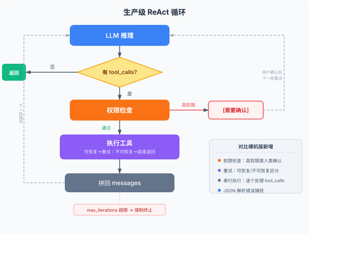

# 第3章：Harness 核心机制 —— Tool Use

> **本章你将理解：** 工具系统的完整架构、从裸机 ReAct 到生产级实现的演进、工具设计的陷阱和最佳实践。
>
> **前置知识：** 第1章（Agent 循环和裸机实现）、第2章（Function Calling 协议）。
>
> **学完这章你能做：** 为 Agent 设计和注册工具、实现带错误处理和权限检查的生产级 ReAct 循环、诊断"Agent 选错工具"的问题。

第1章的因果链得出一个结论：**只要解决了"动作能力"这一件事（接上工具系统），后面几个问题大部分都能顺带解决。** 工具系统是 Harness 五大组件中最核心的一个。这一章专门讲它。

---

## 1 Tool 的定义、注册与发现

### 一个 Tool 由什么组成

从工程角度，一个完整的 Tool 包含四个部分：

```python
# 1. Python 函数：实际执行逻辑
def get_weather(city: str) -> str:
    ...

# 2. JSON Schema：Model 选择工具的唯一依据
{
    "type": "function",
    "function": {
        "name": "get_weather",
        "description": "获取指定城市的当前天气信息",
        "parameters": { ... }
    }
}

# 3. 名称映射：Harness 根据 Model 输出的 name 查找函数
TOOL_MAP = {"get_weather": get_weather}

# 4. （可选）元数据：权限等级、超时时间、重试策略
TOOL_CONFIG = {
    "get_weather": {"permission": "low", "timeout": 5, "retries": 2}
}
```

第1章的裸机版本只有前三部分。第4部分是生产级必需的——权限等级决定了是否需要人类审批（第1章的分级审批原则），超时和重试决定了错误恢复策略。没有元数据会怎样？一个真实场景：`execute_python` 没设 `permission="high"`，用户让 Agent "清理一下临时文件"，Agent 直接执行了 `rm -rf /tmp/*`——删除了不该删的东西。没有权限标记，Harness 不知道该拦截。

### 注册模式：TOOL_MAP 的局限

TOOL_MAP 是最简单的注册方式——一个字典把 name 映射到函数。但它有三个问题：

**问题一：工具和 schema 分离。** `TOOL_MAP` 和 `TOOLS_SCHEMA` 是两段独立代码，改了一个忘了改另一个就出 bug。

**问题二：没有运行时校验。** 函数签名和 schema 的参数定义可能不一致——schema 说 `city: string`，函数接受 `city: int` 也不会报错，直到运行时才炸。

**问题三：不支持动态发现。** Agent 运行时不能根据上下文增加或移除工具。

更好的模式是用装饰器把四部分绑定在一起：

```python
import inspect

# 工具注册表
_tool_registry = {}

def tool(name: str = None, permission: str = "low", timeout: int = 10, retries: int = 1):
    """注册工具的装饰器。自动从函数签名生成 schema。"""
    def decorator(func):
        tool_name = name or func.__name__
        sig = inspect.signature(func)

        # 从类型注解自动生成 parameters schema
        properties = {}
        required = []
        for param_name, param in sig.parameters.items():
            if param.default is inspect.Parameter.empty:
                required.append(param_name)
            param_type = "string"  # 简化版，生产环境需要完整的类型映射
            if param.annotation != inspect.Parameter.empty:
                type_map = {str: "string", int: "integer", float: "number", bool: "boolean"}
                param_type = type_map.get(param.annotation, "string")
            properties[param_name] = {"type": param_type, "description": param_name}

        schema = {
            "type": "function",
            "function": {
                "name": tool_name,
                "description": func.__doc__ or "",
                "parameters": {
                    "type": "object",
                    "properties": properties,
                    "required": required
                }
            }
        }

        _tool_registry[tool_name] = {
            "func": func,
            "schema": schema,
            "config": {"permission": permission, "timeout": timeout, "retries": retries}
        }
        return func
    return decorator
```

使用方式：

```python
import json

@tool(permission="low", timeout=5, retries=2)
def get_weather(city: str) -> str:
    """获取指定城市的当前天气信息，包括温度、湿度、天气状况。当用户询问某地天气或比较天气时使用。"""
    import requests
    resp = requests.get(f"https://wttr.in/{city}?format=j1", timeout=5)
    current = resp.json()["current_condition"][0]
    return json.dumps({
        "temp": current["temp_C"],
        "condition": current["weatherDesc"][0]["value"],
        "humidity": current["humidity"]
    }, ensure_ascii=False)

@tool(permission="low", timeout=30, retries=1)
def search_web(query: str) -> str:
    """搜索互联网获取信息。当需要查找实时信息、最新新闻、或验证事实时使用。"""
    import os
    import requests
    resp = requests.get(
        "https://api.tavily.com/search",
        params={"query": query, "api_key": os.environ.get("TAVILY_API_KEY"), "max_results": 3},
        timeout=30
    )
    results = resp.json().get("results", [])
    return "\n".join(f"- {r['title']}: {r.get('content', '')[:200]}" for r in results)

@tool(permission="high", timeout=10, retries=0)
def execute_python(code: str) -> str:
    """在沙箱中执行 Python 代码。仅用于数学计算和数据处理，不能执行文件操作或网络请求。高风险操作，需谨慎使用。"""
    import subprocess
    result = subprocess.run(
        ["python3", "-c", code],
        capture_output=True, text=True, timeout=10
    )
    return result.stdout or result.stderr
```

从注册表自动生成 `TOOLS_SCHEMA` 和 `TOOL_MAP`：

```python
def get_tools_schema():
    return [t["schema"] for t in _tool_registry.values()]

def get_tool_map():
    return {name: t["func"] for name, t in _tool_registry.items()}

def get_tool_config(name: str):
    return _tool_registry.get(name, {}).get("config", {})
```

装饰器模式解决了 TOOL_MAP 的三个问题：工具和 schema 绑定在一起（从函数签名自动生成）、运行时有一致性保障、可以动态注册。

### MCP：工具发现的标准协议

TOOL_MAP 是本地注册——工具和 Agent 在同一个进程里。如果工具是远程服务（比如第三方 API、其他团队的微服务），需要一个发现协议。

MCP（Model Context Protocol）做的就是这件事。它定义了工具的标准化描述格式和发现机制：

```
Agent → MCP Server: "你有什么工具？"
MCP Server → Agent: [工具列表 + schema]
Agent → MCP Server: "调用 get_weather，参数 {city: '北京'}"
MCP Server → Agent: {temp: 22, condition: "Partly cloudy"}
```

MCP 目前解决了工具发现和调用，但还没覆盖权限控制和编排。生产环境中，MCP 发现的工具仍然需要经过 Harness 的权限层才能执行——不能因为 MCP Server 说"我能删除数据库"就真的让它删。

**什么时候用 MCP？** 判断标准很简单：工具是否在 Agent 进程之外。如果工具是本地 Python 函数，用 `@tool` 装饰器就够了。如果工具是另一个团队的微服务、第三方 SaaS API、或者需要独立部署和升级的服务，用 MCP。不要为了"用 MCP"而用 MCP——本地注册更简单、更可控。

一个 MCP 客户端的最简实现：

```python
# MCP 客户端：发现并调用远程工具
import requests

class MCPClient:
    def __init__(self, server_url: str):
        self.server_url = server_url
        self.tools = self._discover()

    def _discover(self) -> list[dict]:
        """从 MCP Server 获取工具列表和 schema。"""
        resp = requests.get(f"{self.server_url}/tools")
        return resp.json()["tools"]

    def call(self, tool_name: str, arguments: dict) -> str:
        """调用远程工具。"""
        resp = requests.post(
            f"{self.server_url}/call",
            json={"name": tool_name, "arguments": arguments}
        )
        return resp.json()["result"]

# 使用：把 MCP 发现的工具合并到本地注册表
mcp = MCPClient("http://tools-service:8080")
for t in mcp.tools:
    # 动态注册——运行时增加工具
    _tool_registry[t["function"]["name"]] = {
        "func": lambda *, _m=mcp, _n=t["function"]["name"], **kwargs: _m.call(_n, kwargs),
        "schema": t,
        "config": {"permission": "medium", "timeout": 10, "retries": 1}
    }
```

---

## 2 从裸机 ReAct 到生产级实现

第1章的裸机 ReAct 循环有 5 个缺口：没记忆、没错误恢复、没安全护栏、没并发、没可观测性。这一节补上错误恢复和安全护栏，并给出完整的生产级 `run_agent`。记忆和可观测性在后续章节单独讲。

### 错误恢复：重试策略

裸机版本把错误拼回消息列表，指望 LLM 自己处理。但有些错误不应该交给 LLM 判断——比如网络超时，应该自动重试。

**不是所有错误都该重试。** 关键区分：**可恢复错误**（网络超时、服务端 5xx）应该重试，因为下次可能成功；**不可恢复错误**（参数类型错误、4xx 客户端错误、工具不存在）不该重试，因为重试也不会改变结果。裸机版本的代码用 `Exception` 兜底了所有错误，生产环境应该区分处理。

```python
import json
import time

def execute_with_retry(func, args, config, max_retries=None):
    """带重试的工具执行。不可恢复错误直接返回，可恢复错误重试。统一返回字符串。"""
    retries = max_retries if max_retries is not None else config.get("retries", 1)
    unrecoverable = (TypeError, KeyError, ValueError, AttributeError)

    for attempt in range(retries + 1):
        try:
            result = func(**args)
            return result if isinstance(result, str) else json.dumps(result, ensure_ascii=False)
        except unrecoverable as e:
            # 不可恢复错误：参数错、键不存在等，重试也没用
            return json.dumps({"error": f"不可恢复错误: {e}"}, ensure_ascii=False)
        except Exception as e:
            if attempt < retries:
                wait = 2 ** attempt  # 指数退避：1s, 2s, 4s
                print(f"  工具执行失败（第{attempt+1}次），{wait}s 后重试: {e}")
                time.sleep(wait)
            else:
                return json.dumps({"error": f"工具执行失败（已重试{retries}次）: {e}"}, ensure_ascii=False)
```

运行效果：

```
--- 第 1 轮 ---
  Model 决定调用: get_weather({'city': '北京'})
  工具执行失败（第1次），1s 后重试: HTTPSConnectionPool timeout
  工具执行失败（第2次），2s 后重试: HTTPSConnectionPool timeout
  Harness 返回: {"error": "工具执行失败（已重试2次）: timeout"}
```

重试耗尽后，错误信息拼回消息列表，Model 决定下一步——换一种方式查询、告知用户、还是用缓存数据。

### 安全护栏：权限检查

```python
def execute_with_permission(func_name, func, args, config, user_confirmed=False):
    """带权限检查的工具执行。权限通过后走重试逻辑。返回字符串。"""
    permission = config.get("permission", "low")

    if permission == "high" and not user_confirmed:
        return (f"[需要确认] 工具 '{func_name}' 是高风险操作，需要用户确认才能执行。"
                f"调用参数: {args}。请确认是否执行（yes/no）。")

    # 权限通过，走重试逻辑执行（execute_with_retry 统一返回字符串）
    return execute_with_retry(func, args, config)
```

高权限工具不直接执行，而是返回一个确认请求。这个请求拼回消息列表后，Model 会把确认请求展示给用户，等待用户输入 "yes" 再执行。

完整的确认流程是：Model 输出 `execute_python` 的 tool_calls → Harness 检查权限 → 返回 `[需要确认]` → Model 把确认请求转述给用户 → 用户输入 "yes" → Harness 在下一轮以 `user_confirmed=True` 重新执行。这意味着高权限工具至少需要两轮循环才能完成——一轮确认，一轮执行。上面的 `run_agent` 简化了这个流程：它把 `[需要确认]` 拼回消息列表后，Model 会向用户转述确认请求，`run_agent` 随即返回该确认文本。生产环境中需要把 `run_agent` 改为交互式聊天循环，在收到用户确认后以 `user_confirmed=True` 重新调用 `execute_with_permission`。

### 并行执行

第2章已经讲了 parallel tool_calls 的原理。这里给出同步版本（不用 asyncio，更易读）：

**部分失败的处理原则：** Model 一次输出 3 个 tool_calls，其中 2 个成功 1 个失败。Harness 应该把 3 个结果都拼回消息列表——成功的返回数据，失败的返回错误信息。Model 看到完整结果后自行决定：用已有数据继续、换一个工具、还是告知用户。不要因为一个失败就丢弃其他结果。

```python
import json
from concurrent.futures import ThreadPoolExecutor, as_completed

def execute_tool_calls_parallel(tool_calls, tool_map, tool_configs):
    """并行执行多个 tool_calls，返回 {tool_call_id: result} 的映射。"""
    results = {}

    # 简化判断：多个 tool_calls 时默认并行
    # 例外情况（如一个工具的输出是另一个的输入）需要手动串行，此处不自动检测
    if len(tool_calls) <= 1:
        serial = True
    else:
        serial = False  # Model 输出 parallel tool_calls 时，通常它们之间没有数据依赖

    if serial:
        # 串行执行
        for tc in tool_calls:
            func_name = tc.function.name
            if func_name not in tool_map:
                results[tc.id] = f"错误：工具 '{func_name}' 不存在"
                continue
            func = tool_map[func_name]
            args = json.loads(tc.function.arguments)
            config = tool_configs.get(func_name, {})
            results[tc.id] = execute_with_retry(func, args, config)  # 注意：此处未走权限检查，仅用于教学演示
    else:
        # 并行执行
        with ThreadPoolExecutor(max_workers=min(len(tool_calls), 4)) as executor:
            futures = {}
            for tc in tool_calls:
                func_name = tc.function.name
                if func_name not in tool_map:
                    results[tc.id] = f"错误：工具 '{func_name}' 不存在"
                    continue
                func = tool_map[func_name]
                args = json.loads(tc.function.arguments)
                config = tool_configs.get(func_name, {})
                future = executor.submit(execute_with_retry, func, args, config)  # 注意：此处未走权限检查，仅用于教学演示
                futures[future] = tc.id

            for future in as_completed(futures):
                tc_id = futures[future]
                results[tc_id] = future.result()

    return results
```

上面的 `execute_tool_calls_parallel` 是教学参考，展示了并行执行的基本实现。在 `run_agent` 中我们没有直接使用它，原因是：当 tool_calls 中包含高权限工具时，并行执行可能导致某个工具已经执行完毕、另一个却还在等用户确认——结果难以拼回消息列表。**实际生产中，只有确认所有 tool_calls 都是低权限时才适合并行；有高权限工具时串行更安全。**

### 完整的生产级 run_agent



把错误恢复、权限检查整合。注意，生产版用串行而非并行执行 tool_calls——因为权限检查需要逐个处理：如果某个高权限工具需要确认，后续工具的执行结果可能依赖用户的确认决策。

```python
import json
from openai import OpenAI

client = OpenAI()

def run_agent(user_message: str, max_iterations: int = 10) -> str:
    """生产级 ReAct Agent 循环。"""
    messages = [
        {"role": "system", "content": SYSTEM_PROMPT},
        {"role": "user", "content": user_message}
    ]

    tool_map = get_tool_map()
    tool_configs = {name: t["config"] for name, t in _tool_registry.items()}

    for i in range(max_iterations):
        print(f"\n--- 第 {i+1} 轮 ---")

        response = client.chat.completions.create(
            model="gpt-4o",
            messages=messages,
            tools=get_tools_schema(),
            tool_choice="auto"
        )
        msg = response.choices[0].message
        messages.append(msg.model_dump())

        if not msg.tool_calls:
            return msg.content

        # 逐个执行 tool_calls（含权限检查 + 重试）
        for tc in msg.tool_calls:
            func_name = tc.function.name
            if func_name not in tool_map:
                content = f"错误：工具 '{func_name}' 不存在。可用工具：{list(tool_map.keys())}"
            else:
                try:
                    func_args = json.loads(tc.function.arguments)
                except json.JSONDecodeError:
                    content = f"错误：参数不是合法的 JSON：{tc.function.arguments}"
                    print(f"  {func_name} → {content[:100]}")
                    messages.append({"role": "tool", "tool_call_id": tc.id, "content": content})
                    continue

                config = tool_configs.get(func_name, {})
                # 权限检查
                content = execute_with_permission(func_name, tool_map[func_name], func_args, config)
                if content.startswith("[需要确认]"):
                    # 高权限工具未确认，把确认请求拼回消息列表
                    print(f"  {func_name} → {content[:100]}")
                    messages.append({"role": "tool", "tool_call_id": tc.id, "content": content})
                    continue
                # content 是正常执行结果，无需额外处理

            print(f"  {func_name} → {content[:100]}")
            messages.append({"role": "tool", "tool_call_id": tc.id, "content": content})

    return "达到最大迭代次数，Agent 终止。"
```

运行 `run_agent("北京和上海哪个更热？现在各多少度？")`：

```
--- 第 1 轮 ---
  get_weather → {"temp": "22", "condition": "Partly cloudy", "humidity": "45"}
  get_weather → {"temp": "28", "condition": "Sunny", "humidity": "65"}
--- 第 2 轮 ---
上海更热，当前28°C，北京22°C，相差6度。
```

两个 `get_weather` 在同一轮中依次执行，一轮就拿到全部数据。对比第1章的裸机版本（没有错误恢复、没有权限检查），生产版多了重试和确认机制，但核心循环逻辑不变。

---

## 3 工具设计的陷阱

### 陷阱一：description 写得太简略

```python
# 差
"description": "搜索"

# 好
"description": "搜索互联网获取信息。当需要查找实时新闻、验证事实、或获取你不确定的信息时使用。不支持搜索私有数据库。"
```

description 是 Model 决定"用不用"的依据。写得太简略，Model 要么不知道什么时候该用，要么在不该用的时候用了。

### 陷阱二：一个工具做太多事

```python
# 差：一个工具做了搜索 + 总结
@tool()
def search_and_summarize(query: str, max_length: int = 200) -> str:
    """搜索并总结结果"""
    ...
```

这个工具把搜索和总结绑在一起。如果 Model 只需要搜索结果（不需要总结），它无法只用搜索部分。应该拆成两个工具。

但也不能拆得太碎——第1章测试过，50 个工具时选择准确率只有 55%。**每个工具做一件事，但不要为了拆而拆。** 判断标准：这两个操作是否总是成对出现？是，就合成一个。否，就拆开。

### 陷阱三：返回值格式不一致

```python
# 差：成功返回 dict，失败返回 str
def get_weather(city):
    if success:
        return {"temp": 22, "condition": "cloudy"}  # dict
    else:
        return "查询失败"  # str
```

Model 看到不同格式的返回值，无法统一处理。**工具的返回值应该统一为字符串——这是 `role: tool` 消息的 content 字段要求的格式。** 具体来说：

```python
# 好：统一返回字符串，让 Model 能直接理解；异常不捕获，交给 Harness 重试
def get_weather(city):
    data = fetch_weather(city)
    return json.dumps({"temp": data["temp"], "condition": data["condition"]}, ensure_ascii=False)
```

如果部分工具返回 dict、部分返回 str，在拼入 `role: tool` 消息时要统一转换——`json.dumps(dict)` 或 `str(result)`。异常则不要在工具内捕获——让 `execute_with_retry` 统一处理重试。

### 陷阱四：参数设计让 Model 猜

```python
# 差：Model 不知道 format 有哪些选项
"format": {"type": "string", "description": "输出格式"}

# 好：用 enum 明确选项
"format": {"type": "string", "description": "输出格式", "enum": ["json", "text", "csv"]}
```

LLM 处理 `enum` 比处理自由文本准确得多。能用 `enum` 就用 `enum`。

### 陷阱五：工具之间有隐式依赖

```python
@tool()
def get_user_id(username: str) -> str:
    """根据用户名获取用户 ID"""
    ...

@tool()
def get_orders(user_id: str) -> str:
    """根据用户 ID 获取订单列表"""
    ...
```

这两个工具有依赖：`get_orders` 的参数 `user_id` 来自 `get_user_id` 的返回值。Model 需要两轮才能完成"查某用户的订单"：第一轮调 `get_user_id`，第二轮调 `get_orders`。

解决方案：提供一个组合工具，把两步合成一步。

```python
@tool()
def get_user_orders(username: str) -> str:
    """根据用户名获取该用户的订单列表。当你需要查询某用户的订单时使用此工具，不需要先查 ID。"""
    user_id = get_user_id(username)
    return get_orders(user_id)
```

这样 Model 一次调用就完成，减少出错概率。

但组合工具有代价：它的 description 可能和原有工具重叠，增加 Model 的选择困惑。比如 `get_user_orders` 和 `get_orders` 的描述可能都提到"获取订单"，Model 不确定该用哪个。解决方法：保留组合工具，把底层工具的 description 加上"内部使用，优先使用 get_user_orders"的引导，或者在 schema 中减少底层工具的暴露。

---

## 4 LangGraph 的 tool_node 抽象

理解了裸机实现，再来看 LangGraph 怎么做。LangGraph 提供了 `tool_node` —— 一个预封装的工具执行节点：

```python
from langgraph.prebuilt import ToolNode, tools_condition
from langgraph.graph import StateGraph, MessagesState

# 定义工具（用 @tool 装饰器，LangChain 的版本）
from langchain_core.tools import tool as lc_tool

@lc_tool
def get_weather(city: str) -> dict:
    """获取指定城市的当前天气信息"""
    import requests
    resp = requests.get(f"https://wttr.in/{city}?format=j1", timeout=5)
    current = resp.json()["current_condition"][0]
    return {"temp": current["temp_C"], "condition": current["weatherDesc"][0]["value"]}

# 绑定工具到 LLM
from langchain_openai import ChatOpenAI
llm_with_tools = ChatOpenAI(model="gpt-4o").bind_tools([get_weather])

# 构建图
builder = StateGraph(MessagesState)
builder.add_node("llm", lambda state: {"messages": [llm_with_tools.invoke(state["messages"])]})
builder.add_node("tools", ToolNode([get_weather]))
builder.add_conditional_edges("llm", tools_condition)  # 有 tool_calls → tools，没有 → END
builder.add_edge("tools", "llm")  # 执行完工具 → 回到 LLM

graph = builder.compile()
```

> **关于返回值类型：** 这里 `get_weather` 返回 `dict` 而非 `str`，与第3节"统一返回字符串"的建议不矛盾——LangChain 的 `@tool` 装饰器会自动把 dict 转为字符串再拼入 `role: tool` 消息。我们的裸机实现没有这层自动转换，所以需要手动 `json.dumps`。

对比裸机实现，LangGraph 帮你处理了：
- 循环逻辑（`conditional_edges` + `add_edge`）
- 工具执行和结果拼回（`ToolNode`）
- 状态管理（`MessagesState`）

但你需要理解：
- `tools_condition` 等价于裸机的 `if msg.tool_calls`
- `ToolNode` 等价于裸机的 `for tc in msg.tool_calls: execute()`
- 循环是隐式的——`tools → llm → tools_condition → tools` 就是 ReAct 循环

**裸机实现的价值不是替代框架，是让你在框架出问题时能排查。** `ToolNode` 执行失败时，错误信息在哪里？在 `messages` 列表里，`role: tool` 的消息。如果你不知道 `ToolNode` 本质上就是把执行结果拼回 `messages`，就找不到排查的起点。

**ToolNode 没覆盖的生产级能力：** 它处理了基本的工具执行和结果拼回，但不包括：重试策略（可恢复/不可恢复错误的区分）、权限检查（高权限工具的人类确认流程）、并行执行的超时控制。这些需要你在 `ToolNode` 之外自行实现——比如在 `tools` 节点前加一个权限检查节点，或者用自定义的 `ToolNode` 子类覆盖执行逻辑。框架给你骨架，生产级的血肉得自己补。

---

## 5 动手实验

### 实验一：加一个新工具

给 Agent 加一个 `get_time` 工具，返回当前时间。要求：
1. 用 `@tool` 装饰器注册
2. 写清晰的 description
3. 测试：问 Agent "现在几点了？北京天气怎么样？"——观察它是否先调 `get_time` 再调 `get_weather`

### 实验二：改 description 观察工具选择

1. 把 `search_web` 的 description 改成 `"搜索信息"`（简略版）
2. 准备 5 个问题：2 个需要搜索、2 个需要查天气、1 个需要计算
3. 跑 3 次，记录工具选择准确率
4. 把 description 改回详细版，再跑 3 次，对比

### 实验三：触发错误恢复

1. 把 `get_weather` 中的 API URL 改成一个不存在的地址（如 `https://httpbin.org/delay/10`）
2. 运行 Agent，观察重试过程（网络超时会自动触发重试）
3. 重试耗尽后，观察 Model 如何处理错误信息

---

下一章深入 Harness 的第二个核心组件——Memory。工具系统让 Agent 能"动手"，记忆系统让 Agent 能"记住"。没有记忆的 Agent 每次对话都从零开始，无法积累知识，也无法处理需要跨轮次的复杂任务。
