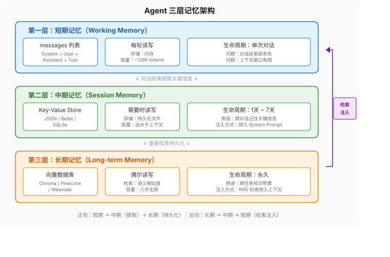

# 第4章：Harness 核心机制 —— Memory

> **本章你将理解：** Agent 记忆的三层架构、对话记忆策略的选择、长期记忆与 RAG 的工程实现。
>
> **前置知识：** 第1章（messages 列表是 Model 的全部世界）、第2章（System Prompt 和 Function Calling）、第3章（工具系统）。
>
> **学完这章你能做：** 为 Agent 实现三层记忆系统、选择合适的对话记忆策略、处理长对话的上下文管理问题。

第1章的裸机 Agent 只有一个 `messages` 列表——对话结束，一切消失。这像一个人每次对话都失忆，连你叫什么都不知道。

记忆不是"存个数据库"这么简单。Agent 的记忆至少分三层，每层的读写频率、存储介质、检索方式完全不同。搞混了层级，要么性能差，要么信息丢失。

---

## 1 三层记忆架构



### 第一层：短期记忆（Working Memory）

短期记忆就是 `messages` 列表。它的特点是：

- **读写频率：** 每轮循环都读写
- **存储介质：** 内存（进程内变量）
- **生命周期：** 单次对话，对话结束即丢失
- **容量限制：** 受 Model 上下文窗口限制（GPT-4o 约 128K tokens）

短期记忆是 Agent 的"工作台"——所有正在处理的信息都在这里。Model 在每一轮推理时看到的就是整个 `messages` 列表。你在第1章已经看到了：System Prompt、用户输入、工具调用记录、工具返回结果，全都在这个列表里。

**短期记忆的核心问题是：它不是无限大的。** 128K tokens 听起来很多，但一个运行了 20 轮的 Agent，messages 可能已经占了 50K-80K tokens。继续跑下去，要么触发截断（丢失早期信息），要么报错（超出上下文长度）。

### 第二层：中期记忆（Session Memory）

中期记忆是当前任务的工作空间。它的特点是：

- **读写频率：** 需要时读写
- **存储介质：** session 级 key-value store（Redis / 文件系统 / 数据库）
- **生命周期：** 跨对话，通常 24 小时到 7 天
- **容量限制：** 远大于上下文窗口

中期记忆解决的问题是：**用户关掉对话再回来，Agent 应该记得之前聊过什么。** 不需要把完整对话历史全部加载（太大了），只需要加载关键信息。

```python
import json
import os

class SessionMemory:
    """中期记忆：session 级 key-value store。"""

    def __init__(self, session_id: str, storage_dir: str = ".sessions"):
        self.session_id = session_id
        self.path = os.path.join(storage_dir, f"{session_id}.json")
        self.data = self._load()

    def _load(self) -> dict:
        if os.path.exists(self.path):
            with open(self.path, "r") as f:
                return json.load(f)
        return {}

    def save(self):
        os.makedirs(os.path.dirname(self.path), exist_ok=True)
        with open(self.path, "w") as f:
            json.dump(self.data, f, ensure_ascii=False, indent=2)

    def set(self, key: str, value):
        self.data[key] = value
        # 注意：生产环境应改为延迟保存（如对话结束时统一 save），
        # 避免每次 set 都写文件。此处为简化示例。

    def get(self, key: str, default=None):
        return self.data.get(key, default)

    def get_context(self) -> str:
        """生成中期记忆的摘要，拼入 System Prompt。"""
        if not self.data:
            return ""
        lines = ["\n## 已知信息（来自之前的对话）"]
        for k, v in self.data.items():
            lines.append(f"- {k}: {v}")
        return "\n".join(lines)
```

使用方式——在 System Prompt 里注入中期记忆：

```python
def run_agent_with_memory(user_message: str, session_id: str = "default") -> str:
    session = SessionMemory(session_id)
    context = session.get_context()

    messages = [
        {"role": "system", "content": SYSTEM_PROMPT + context},
        {"role": "user", "content": user_message}
    ]

    # ... ReAct 循环 ...

    # 对话结束后，提取关键信息存入中期记忆
    # 这一步可以由 LLM 完成：让它在对话结束时输出要记住的信息
    return result
```

### 第三层：长期记忆（Long-term Memory）

长期记忆是跨任务的知识积累。它的特点是：

- **读写频率：** 偶尔读写
- **存储介质：** 向量数据库（Chroma / Pinecone / Weaviate）
- **生命周期：** 永久
- **容量限制：** 几乎无限

长期记忆解决的问题是：**Agent 能不能从历史任务中学到东西？** 用户上次说过"我对花生过敏"，下次对话时 Agent 应该记住，不需要用户重复。

```python
import chromadb

class LongTermMemory:
    """长期记忆：向量数据库 + 语义检索。"""

    def __init__(self, collection_name: str = "agent_memory"):
        self.client = chromadb.PersistentClient(path=".chroma")
        self.collection = self.client.get_or_create_collection(
            name=collection_name,
            metadata={"hnsw:space": "cosine"}
        )

    def store(self, text: str, metadata: dict = None):
        """存储一条记忆。"""
        self.collection.add(
            documents=[text],
            metadatas=[metadata or {}],
            ids=[f"mem_{self.collection.count()}"]
        )

    def retrieve(self, query: str, top_k: int = 3) -> list[str]:
        """检索相关记忆。"""
        results = self.collection.query(
            query_texts=[query],
            n_results=top_k
        )
        return results["documents"][0] if results["documents"] else []
```

使用方式：

```python
memory = LongTermMemory()

# 存储
memory.store("用户对花生过敏，吃花生会严重过敏反应", {"type": "health", "importance": "high"})
memory.store("用户偏好中文回答", {"type": "preference"})

# 检索
relevant = memory.retrieve("帮我推荐一道菜")
# → ["用户对花生过敏，吃花生会严重过敏反应"]
```

检索结果拼入 System Prompt，Agent 就能在回答时考虑到用户的过敏情况。

### 三层记忆的协作

三层不是孤立的，而是协同工作：

1. **短期记忆**处理当前对话（实时、全量）
2. **中期记忆**存储当前任务的关键信息（选择性、结构化）
3. **长期记忆**积累跨任务的知识（语义检索、按需加载）

信息流向：短期 → 中期（对话结束时提取关键信息）→ 长期（重要信息持久化）。反向：长期 → 中期（检索相关记忆注入上下文）→ 短期（拼入 messages 列表）。

---

## 2 对话记忆策略

短期记忆（messages 列表）会增长，必须管理。有三种基本策略：

### Buffer：原样保留

直接把完整对话历史传入。最简单，但消耗最多 tokens。

```python
# Buffer 就是原始的 messages 列表，不需要特殊处理
messages = [
    {"role": "system", "content": SYSTEM_PROMPT},
    {"role": "user", "content": "你好"},
    {"role": "assistant", "content": "你好！有什么可以帮你的？"},
    {"role": "user", "content": "北京天气怎么样？"},
    # ... 越来越长
]
```

适用场景：短对话（< 10 轮）、上下文窗口足够大。

### Sliding Window：只保留最近 N 轮

```python
def trim_messages(messages, max_rounds=5):
    """只保留最近 max_rounds 轮对话。system 消息始终保留。

    注意：Agent 对话中一轮可能包含多条消息（user + assistant + tool + tool + assistant），
    所以不能简单地每 2 条算一轮。这里按 user 消息出现次数计算轮次。
    """
    system_msgs = [m for m in messages if m["role"] == "system"]
    non_system = [m for m in messages if m["role"] != "system"]

    # 按 user 消息分段——每出现一次 user 消息就是一个新轮次的开始
    rounds = []
    current_round = []
    for m in non_system:
        if m["role"] == "user" and current_round:
            rounds.append(current_round)
            current_round = []
        current_round.append(m)
    if current_round:
        rounds.append(current_round)

    # 只保留最近 max_rounds 轮
    kept = []
    for r in rounds[-max_rounds:]:
        kept.extend(r)

    return system_msgs + kept
```

适用场景：中等长度对话、不需要完整历史。

问题：**丢失了早期对话，Model 可能忘记关键信息。** 比如用户在第 1 轮说了"我叫张三"，第 10 轮问"我叫什么"——如果滑动窗口只保留 5 轮，Model 就答不上来。

### Summary：用 LLM 总结早期对话

```python
def summarize_messages(messages, llm_client, summary_prompt="请用2-3句话总结以下对话的关键信息："):
    """用 LLM 总结早期对话，替代原始 messages。"""
    system_msgs = [m for m in messages if m["role"] == "system"]
    non_system = [m for m in messages if m["role"] != "system"]

    if len(non_system) <= 6:  # 太短不需要总结
        return messages

    # 把前半部分总结
    early = non_system[:len(non_system)//2]
    recent = non_system[len(non_system)//2:]

    conversation_text = "\n".join(
        f"{m['role']}: {m['content']}" for m in early
    )

    summary = llm_client.chat.completions.create(
        model="gpt-4o-mini",  # 用便宜模型做总结
        messages=[
            {"role": "system", "content": summary_prompt},
            {"role": "user", "content": conversation_text}
        ]
    ).choices[0].message.content

    # 用 user 角色而非 system——避免 Model 把摘要当成不可变的指令
    summary_msg = {"role": "user", "content": f"[之前的对话摘要]\n{summary}"}

    return system_msgs + [summary_msg] + recent
```

适用场景：长对话、需要保留关键信息但不想消耗太多 tokens。

**总结的成本：** 每次总结需要一次额外的 LLM 调用。通常用便宜模型（GPT-4o-mini）做总结，成本可控。而且只在消息数量超过阈值时才触发，不是每轮都总结。

### 策略选择

| 策略 | 优点 | 缺点 | 适用场景 |
|------|------|------|---------|
| Buffer | 信息完整 | 消耗大量 tokens | 短对话 |
| Sliding Window | 简单高效 | 丢失早期信息 | 不需要历史的闲聊 |
| Summary | 兼顾信息量和 token 效率 | 额外 LLM 调用、总结可能遗漏 | 长对话、知识密集型 |

实际项目中通常组合使用：**最近 5 轮保留原文（Buffer），更早的对话总结（Summary），同时从中期/长期记忆加载相关信息。**

---

## 3 长期记忆与 RAG

### 为什么纯向量检索不够

RAG（Retrieval-Augmented Generation）是长期记忆的标准实现：把信息存入向量数据库，查询时用语义相似度检索，把检索结果拼入上下文。

但纯向量检索有三个问题：

**问题一：语义相似不等于语境相关。** 用户问"Python 性能优化"，向量检索可能返回"Python 蛇的饲养指南"——因为"Python"这个词的向量表示在两个语境下很接近。解决方案：加元数据过滤（`metadata={"domain": "programming"}`）。

**问题二：检索数量有限。** top_k 通常设 3-5。如果相关信息分散在 10 条记忆里，你只能拿到其中 3-5 条。解决方案：增大 top_k，但要平衡 token 消耗。

**问题三：时序信息丢失。** 向量检索按语义相似度排序，不考虑时间。用户上周说的"我喜欢 A"和今天说的"我改主意了，喜欢 B"，检索时可能返回旧的偏好。解决方案：在元数据里加时间戳，检索时按时间降序排列，优先用最新的。

### 更好的长期记忆检索

```python
def retrieve_with_context(query: str, memory: LongTermMemory, top_k: int = 5) -> str:
    """带上下文过滤的长期记忆检索。"""
    results = memory.collection.query(
        query_texts=[query],
        n_results=top_k,
        where={"importance": {"$in": ["medium", "high"]}},  # 过滤低重要性记忆
    )

    if not results["documents"][0]:
        return ""

    # 按时间排序，最新的优先
    docs_with_meta = list(zip(results["documents"][0], results["metadatas"][0]))
    docs_with_meta.sort(key=lambda x: x[1].get("timestamp", ""), reverse=True)

    # 格式化
    lines = ["\n## 相关记忆"]
    for doc, meta in docs_with_meta[:3]:  # 只取 top 3
        source = meta.get("source", "未知")
        lines.append(f"- [{source}] {doc}")

    return "\n".join(lines)
```

---

## 4 LangGraph 的 checkpointer 机制

LangGraph 用 `checkpointer` 自动保存和恢复 Agent 状态：

```python
from langgraph.checkpoint.memory import MemorySaver
from langgraph.graph import StateGraph, MessagesState

# 创建带 checkpointer 的图
checkpointer = MemorySaver()  # 内存版，生产用 SqliteSaver 或 PostgresSaver
graph = builder.compile(checkpointer=checkpointer)

# 第一次对话
result1 = graph.invoke(
    {"messages": [{"role": "user", "content": "我叫张三"}]},
    config={"configurable": {"thread_id": "user_123"}}  # thread_id 区分不同用户
)

# 第二次对话——新消息，但同一个 thread_id
result2 = graph.invoke(
    {"messages": [{"role": "user", "content": "我叫什么？"}]},
    config={"configurable": {"thread_id": "user_123"}}
)
# Agent 会回答"你叫张三"——因为 checkpointer 保存了第一次对话的状态
```

`checkpointer` 的本质是什么？**把 `messages` 列表序列化存储，下次对话时反序列化加载。** 对应到我们的三层架构：

- `MemorySaver`：内存存储，对应短期记忆
- `SqliteSaver`：SQLite 存储，对应中期记忆
- `PostgresSaver`：PostgreSQL 存储，适合生产环境

但 LangGraph 的 checkpointer 只解决了对话历史的持久化，不解决长期记忆的语义检索。如果需要"用户上次提到对花生过敏，6 个月后 Agent 还记得"，还是需要自己实现向量数据库层。

---

## 5 完整实现：带三层记忆的 Agent

```python
import json
from openai import OpenAI

client = OpenAI()

class MemoryAgent:
    """带三层记忆的 Agent。"""

    def __init__(self, session_id: str = "default"):
        self.session = SessionMemory(session_id)
        self.long_term = LongTermMemory()
        self.messages = []

    def _build_system_prompt(self) -> str:
        """构建包含记忆上下文的 System Prompt。"""
        prompt = SYSTEM_PROMPT

        # 中期记忆
        session_context = self.session.get_context()
        if session_context:
            prompt += session_context

        # 长期记忆——用用户最后一条消息做检索
        if self.messages:
            last_user_msg = ""
            for m in reversed(self.messages):
                if m.get("role") == "user":
                    last_user_msg = m.get("content", "")
                    break
            if last_user_msg:
                relevant = self.long_term.retrieve(last_user_msg, top_k=3)
                if relevant:
                    prompt += "\n## 相关记忆\n" + "\n".join(f"- {r}" for r in relevant)

        return prompt

    def chat(self, user_message: str, max_iterations: int = 5) -> str:
        """带记忆的对话。"""
        # 重建 System Prompt（包含最新的记忆上下文）
        system_prompt = self._build_system_prompt()
        self.messages = [
            {"role": "system", "content": system_prompt},
            *self.messages[1:],  # 保留非 system 的历史消息
            {"role": "user", "content": user_message}
        ]

        # ReAct 循环
        for i in range(max_iterations):
            response = client.chat.completions.create(
                model="gpt-4o",
                messages=self.messages,
                tools=get_tools_schema(),
                tool_choice="auto"
            )
            msg = response.choices[0].message
            self.messages.append(msg.model_dump())

            if msg.tool_calls:
                tool_map = get_tool_map()
                for tc in msg.tool_calls:
                    func = tool_map.get(tc.function.name)
                    if not func:
                        content = f"错误：工具 '{tc.function.name}' 不存在"
                    else:
                        try:
                            args = json.loads(tc.function.arguments)
                            result = func(**args)
                            content = json.dumps(result, ensure_ascii=False) if isinstance(result, dict) else str(result)
                        except Exception as e:
                            content = f"执行失败: {e}"
                    self.messages.append({"role": "tool", "tool_call_id": tc.id, "content": content})
            else:
                # 对话结束后，提取要记住的信息
                self._extract_memory(user_message, msg.content)
                self.session.save()  # 统一保存中期记忆
                return msg.content

        return "达到最大迭代次数"

    def _extract_memory(self, user_msg: str, assistant_msg: str):
        """从对话中提取关键信息存入记忆。"""
        extraction = client.chat.completions.create(
            model="gpt-4o-mini",
            messages=[
                {"role": "system", "content": "从以下对话中提取用户提到的关键信息（偏好、个人情况、重要事实），每条一行。如果没有关键信息，输出 NONE。"},
                {"role": "user", "content": f"用户: {user_msg}\n助手: {assistant_msg}"}
            ]
        ).choices[0].message.content

        if extraction.strip() == "NONE":
            return

        for line in extraction.strip().split("\n"):
            if line.strip():
                self.session.set(f"info_{len(self.session.data)}", line.strip())
                self.long_term.store(line.strip(), {"importance": "medium"})

    def summarize_if_needed(self):
        """对话过长时总结。"""
        # 粗略估算：中文约 1.5 token/字，英文约 0.25 token/字符
        # 这里用折中值估算
        total_chars = sum(len(json.dumps(m, ensure_ascii=False)) for m in self.messages)
        token_count = total_chars // 2  # 粗略折中
        if token_count > 80000:  # 约 80K tokens 时触发
            self.messages = summarize_messages(self.messages, client)
```

运行示例：

```python
agent = MemoryAgent(session_id="user_zhangsan")

# 第一次对话
print(agent.chat("我叫张三，我对花生过敏"))
# → 你好张三！我记住了你对花生过敏。以后推荐食物时会避开花生。

# 新对话（同一个 session_id）
agent2 = MemoryAgent(session_id="user_zhangsan")
print(agent2.chat("帮我推荐一道菜"))
# → 推荐宫保鸡丁（注意：这款菜通常含花生，根据你的过敏情况，可以选择腰果版或者...
```

Agent 记住了"花生过敏"——不是通过 System Prompt 写死的，是通过中期/长期记忆自动检索的。

---

## 6 Lost in the Middle：上下文管理的工程应对

第1章提到了"Lost in the Middle"现象——LLM 对上下文开头和结尾关注度高，中间容易被忽略。这对记忆系统有直接影响。

假设 messages 有 30 条消息。关键信息在第 5 条和第 28 条。第 5 条容易被忽略，第 28 条不会。

工程应对：

**策略一：重要信息放两头。** 把关键指令放在 System Prompt（开头）和最后一条用户消息（结尾）里，不要放在中间的工具返回结果里。

**策略二：定期重申。** 如果对话超过 15 轮，在 System Prompt 里重申关键约束。相当于把"中间"的信息"提到开头"。

**策略三：总结压缩中间内容。** 就是 4.2 节的 Summary 策略——把中间的对话历史压缩成几句话，腾出注意力空间。

---

## 7 动手实验

### 实验一：观察遗忘

1. 用第1章的裸机 Agent（没有记忆系统），对话 20 轮以上
2. 第 1 轮告诉 Agent "我叫张三"
3. 第 20 轮问 "我叫什么"
4. 观察结果——大概率忘了

### 实验二：加 Summary 后对比

1. 用本章的 `MemoryAgent`（带三层记忆）
2. 同样的测试流程
3. 对比结果——Agent 是否还能记住你的名字？

### 实验三：长期记忆检索

1. 连续几次对话，让 Agent 记住不同类别的信息（偏好、健康、工作）
2. 开一个新对话，问一个跟之前信息相关的问题
3. 观察长期记忆检索是否返回了相关信息

---

下一章深入 Harness 的第三个核心组件——Planning。工具系统让 Agent 能"动手"，记忆系统让 Agent 能"记住"，规划系统让 Agent 能"想清楚再做"。没有规划的 Agent 只能被动响应，遇到复杂任务就迷失方向。
