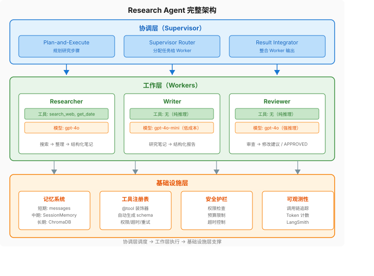

大家好，我是Q。

> **本章你将理解：** 如何整合前6章的所有模块，从零构建一个生产级 Agent；生产环境的工程考量。
>
> **前置知识：** 第1-6章全部内容。
>
> **学完这章你能做：** 构建一个能搜索、能记忆、能规划、多角色协作的 Research Agent，并理解生产环境的错误处理、成本控制和可观测性。

前六章，我们一块一块地搭积木——模型、工具、记忆、规划、多 Agent。每章结束时你都多了一块积木，但每块积木单独放着，什么也干不了。

这章只做一件事：**把所有积木拼起来，造一个能跑的系统。**

不是 demo，不是玩具，是一个你丢给它"帮我调研 AIGC 教育应用"就能自己搜索、自己整理、自己写报告、自己检查质量的研究助手。它会规划步骤，会记住你的偏好，会在搜索失败时重试，会在 token 快烧完时踩刹车。

拼积木的过程不会一帆风顺。单 Agent 模式下，一个角色既要搜索又要写报告，工具一多就手忙脚乱；不加护栏，一个死循环就能烧掉你一天的 API 额度；不做可观测性，出了 bug 你连日志都找不到。这些都是真实生产环境的坑，我们一个个踩过去。

---

### 1 需求分析：Research Agent 做什么

我们要构建一个 Research Agent，它能：

1. **接收研究课题**：比如"对比 LangGraph 和 CrewAI 的优劣"
2. **自动规划研究步骤**：拆分成搜索、整理、撰写、审查
3. **搜索并整理信息**：调用搜索工具，获取实时资料
4. **撰写结构化报告**：基于研究结果写报告
5. **自我审查**：检查报告质量，必要时修改
6. **记住用户偏好**：跨对话记住用户关注的领域和格式偏好

这不是一个 demo——是一个能实际使用的工具。

#### 从裸机到完整系统：架构演进

第1章的裸机 Agent 只有 70 行代码。现在要把它扩展成一个完整系统。演进路径：

```
第1章：70行裸机循环（1个工具，无记忆，无规划，无协作）
  ↓ 加更多工具 + 错误处理
第3章：生产级 ReAct 循环（多工具，并行，重试）
  ↓ 加记忆
第4章：带三层记忆的 Agent
  ↓ 加规划
第5章：Plan-and-Execute Agent
  ↓ 加多 Agent 协作
本章：完整 Research Agent
```

---

### 2 架构设计



#### 三层架构

**协调层（Supervisor）**：接收用户输入，规划研究步骤，分配给工作层 Agent，整合结果。用 Plan-and-Execute 模式。

**工作层（Workers）**：
- Researcher：搜索并整理信息，拥有搜索工具
- Writer：撰写报告，不需要工具（纯推理）
- Reviewer：审查报告质量，不需要工具（纯推理）

**基础设施层**：
- 记忆系统：SessionMemory + LongTermMemory
- 工具注册表：装饰器模式，自动生成 schema
- 安全护栏：权限检查、预算限制、超时控制

---

### 3 逐步实现

#### 工具层

工具注册使用第3章的 `@tool` 装饰器模式，这里只展示新增的研究类工具：

```python
import os
import json
from openai import OpenAI

client = OpenAI()

 第3章的 @tool 装饰器 + _tool_registry + get_tools_schema() + get_tool_map()
 此处不再重复，直接使用

@tool(permission="low", timeout=30, retries=2)
def search_web(query: str) -> str:
    """搜索互联网获取信息。当需要查找实时信息、最新动态、技术对比、产品评测时使用。"""
    import requests
    try:
        resp = requests.get(
            "https://api.tavily.com/search",
            params={"query": query, "api_key": os.environ.get("TAVILY_API_KEY"), "max_results": 5},
            timeout=30
        )
        results = resp.json().get("results", [])
        if not results:
            return "未找到相关结果"
        return "\n\n".join(
            f"标题: {r['title']}\n内容: {r.get('content', '')[:300]}\n来源: {r.get('url', '')}"
            for r in results
        )
    except Exception as e:
        return f"搜索失败: {e}"

@tool(permission="low", timeout=5, retries=1)
def get_current_date() -> str:
    """获取当前日期和时间。当需要判断信息时效性或处理时间相关问题时使用。"""
    from datetime import datetime
    return datetime.now().strftime("%Y-%m-%d %H:%M:%S")

@tool(permission="medium", timeout=60, retries=0)
def save_report(filename: str, content: str) -> str:
    """将报告保存到文件。当用户要求保存或导出报告时使用。"""
    try:
        with open(filename, "w") as f:
            f.write(content)
        return f"报告已保存到 {filename}"
    except Exception as e:
        return f"保存失败: {e}"
```

#### 记忆层

使用第4章的 `SessionMemory`（中期）和 `LongTermMemory`（长期），不再重复代码。唯一新增的是一个信息提取函数，从研究结果中自动提取关键事实存入记忆：

```python
def extract_and_store(text: str, session: SessionMemory, long_term: LongTermMemory):
    """从研究结果中提取关键信息存入记忆。自动去重。"""
    extraction = client.chat.completions.create(
        model="gpt-4o-mini",
        messages=[
            {"role": "system", "content": "提取以下文本中的关键事实和发现，每条一行。如果没有输出 NONE。"},
            {"role": "user", "content": text[:2000]}
        ]
    ).choices[0].message.content
    if extraction.strip() != "NONE":
        existing = set(long_term.retrieve(text, top_k=10))  # 检索已有记忆用于去重
        for line in extraction.strip().split("\n"):
            if line.strip() and line.strip() not in existing:
                long_term.store(line.strip(), {"importance": "medium"})
```

#### 协调层（Supervisor）

Supervisor 使用第6章的 LangGraph StateGraph 模式，但增加了研究进度追踪。完整图构建和路由逻辑与第6章相同（`builder.add_node` + `add_conditional_edges`），这里只展示差异——Supervisor Prompt 更丰富，因为它需要了解研究进度：

```python
from typing import TypedDict

class ResearchState(TypedDict):
    query: str
    plan: list[dict]
    executed_steps: list[dict]
    step_results: list[str]
    research_notes: str
    draft: str
    review_comments: str
    final_output: str
    next_agent: str

SUPERVISOR_PROMPT = """你是一个研究项目的协调者。根据当前状态决定下一步。

可选 Agent:
- researcher: 搜索和整理信息
- writer: 撰写或修改报告
- reviewer: 审查报告质量
- FINISH: 任务完成

当前进度:
- 研究笔记: {research_notes}
- 当前草稿: {draft}
- 审查意见: {review_comments}

输出 JSON: {{"next": "agent_name 或 FINISH", "reason": "决策理由"}}"""

def supervisor(state: ResearchState) -> dict:
    response = client.chat.completions.create(
        model="gpt-4o",
        response_format={"type": "json_object"},
        messages=[
            {"role": "system", "content": SUPERVISOR_PROMPT.format(
                research_notes=str(state.get("research_notes", "无"))[:500],
                draft=str(state.get("draft", "无"))[:500],
                review_comments=str(state.get("review_comments", "无"))[:500]
            )},
            {"role": "user", "content": state["query"]}
        ]
    )
    decision = json.loads(response.choices[0].message.content)
    return {"next_agent": decision["next"]}
```

#### 工作层（Workers）

和第6章的 Researcher / Writer / Reviewer 结构相同，但有两个关键区别：**Researcher 带了记忆**，**Writer / Reviewer 根据角色选择不同模型**。

```python
RESEARCHER_PROMPT = """你是一个研究助手。搜索与用户课题相关的信息，整理成结构化的研究笔记。

研究笔记格式：
# 核心发现
- 发现1
- 发现2

# 关键数据
- 数据1
- 数据2

# 不同观点
- 观点A: ...
- 观点B: ...

# 信息缺口
- 还需要了解的方面"""

def researcher(state: ResearchState) -> dict:
    # ★ 关键区别：带记忆的研究
    session = SessionMemory("research_session")
    long_term = LongTermMemory()

    context = session.get_context()
    relevant = long_term.retrieve(state["query"], top_k=3)
    memory_context = ""
    if relevant:
        memory_context = "\n\n相关历史记忆：\n" + "\n".join(relevant)

    messages = [
        {"role": "system", "content": RESEARCHER_PROMPT + context + memory_context},
        {"role": "user", "content": f"研究课题：{state['query']}"}
    ]

    # ReAct 循环（复用第3章的 run_agent 逻辑，不再重复）
    for i in range(5):
        response = client.chat.completions.create(
            model="gpt-4o",
            messages=messages,
            tools=get_tools_schema(),
            tool_choice="auto"
        )
        msg = response.choices[0].message
        messages.append(msg.model_dump())

        if msg.tool_calls:
            for tc in msg.tool_calls:
                func_name = tc.function.name
                func = get_tool_map().get(func_name)
                if not func:
                    messages.append({"role": "tool", "tool_call_id": tc.id,
                                    "content": f"错误：工具 '{func_name}' 不存在"})
                    continue
                try:
                    args = json.loads(tc.function.arguments)
                    result = func(**args)
                except Exception as e:
                    result = f"执行失败: {e}"

                messages.append({"role": "tool", "tool_call_id": tc.id,
                                "content": str(result) if not isinstance(result, str) else result})
        else:
            extract_and_store(msg.content, session, long_term)
            return {"research_notes": msg.content}

    return {"research_notes": "研究超时，请重试"}

WRITER_PROMPT = """你是一个技术写作助手。基于研究笔记撰写结构化的研究报告。

报告格式：
 {标题}

# 摘要
{200字以内的摘要}

# 正文
{分章节论述，引用研究笔记中的数据}

# 结论与建议
{基于证据的结论}

# 参考文献
{列出信息来源}"""

def writer(state: ResearchState) -> dict:
    review_context = ""
    if state.get("review_comments"):
        review_context = f"\n\n审查意见（请根据意见修改）：\n{state['review_comments']}"

    # ★ 关键区别：Writer 用低成本模型
    response = client.chat.completions.create(
        model="gpt-4o-mini",
        messages=[
            {"role": "system", "content": WRITER_PROMPT},
            {"role": "user", "content": f"研究课题：{state['query']}\n\n研究笔记：\n{state.get('research_notes', '无')}{review_context}"}
        ]
    )
    return {"draft": response.choices[0].message.content}

REVIEWER_PROMPT = """你是严格的审稿人。审查报告的：
1. 事实准确性——论点是否有研究笔记支撑
2. 逻辑完整性——论证链是否完整
3. 结构清晰度——章节组织是否合理
4. 表达质量——语言是否简洁专业

如果质量合格，输出 APPROVED。
否则输出具体修改建议，标注需要改进的段落。"""

def reviewer(state: ResearchState) -> dict:
    # ★ 关键区别：Reviewer 用强推理模型
    response = client.chat.completions.create(
        model="gpt-4o",
        messages=[
            {"role": "system", "content": REVIEWER_PROMPT},
            {"role": "user", "content": state.get("draft", "")}
        ]
    )
    return {"review_comments": response.choices[0].message.content}
```

#### 构建完整图

图结构与第6章完全相同——Supervisor 路由到 Worker，Worker 执行后回到 Supervisor：

```python
from langgraph.graph import StateGraph, END

def route_agent(state: ResearchState) -> str:
    next_agent = state.get("next_agent", "researcher")
    if next_agent == "FINISH":
        return "finish"
    return next_agent

builder = StateGraph(ResearchState)
builder.add_node("supervisor", supervisor)
builder.add_node("researcher", researcher)
builder.add_node("writer", writer)
builder.add_node("reviewer", reviewer)

builder.set_entry_point("supervisor")
builder.add_conditional_edges("supervisor", route_agent, {
    "researcher": "researcher",
    "writer": "writer",
    "reviewer": "reviewer",
    "finish": END
})
builder.add_edge("researcher", "supervisor")
builder.add_edge("writer", "supervisor")
builder.add_edge("reviewer", "supervisor")

research_agent = builder.compile()
```

#### 运行

```python
result = research_agent.invoke({
    "query": "对比 LangGraph 和 CrewAI 在多Agent系统中的优劣，给出选型建议",
    "plan": [],
    "executed_steps": [],
    "step_results": [],
    "research_notes": "",
    "draft": "",
    "review_comments": "",
    "final_output": ""
})

print(result["draft"])
```

运行流程：

```
supervisor → researcher（搜索 + 整理）→ supervisor → writer（撰写报告）→ supervisor → reviewer（审查）→ supervisor → FINISH
```

如果 Reviewer 没有输出 APPROVED，流程会变成：

```
supervisor → researcher → supervisor → writer → supervisor → reviewer → supervisor → writer（修改）→ supervisor → reviewer → supervisor → FINISH
```

---

### 4 生产级考量

#### 错误处理

上面的代码已经包含了基本的错误处理：工具不存在、参数解析失败、执行超时。但生产环境还需要：

**LLM API 错误：** 速率限制（429）、服务不可用（503）。加指数退避重试。

```python
from tenacity import retry, stop_after_attempt, wait_exponential

@retry(stop=stop_after_attempt(3), wait=wait_exponential(min=1, max=30))
def call_llm(messages, model="gpt-4o", **kwargs):
    return client.chat.completions.create(model=model, messages=messages, **kwargs)
```

**工具超时：** 搜索 API 可能响应很慢。设 `timeout=30`，超时后返回错误信息而不是挂住。

#### 成本控制

多 Agent 系统的成本是单 Agent 的 3-5 倍。控制成本的方法：

**模型路由：** Researcher 用 GPT-4o（需要工具调用），Writer 用 GPT-4o-mini（纯推理，成本降 10 倍），Reviewer 用 GPT-4o（需要强推理）。

```python
def get_model_for_agent(agent_name: str) -> str:
    return {
        "researcher": "gpt-4o",
        "writer": "gpt-4o-mini",
        "reviewer": "gpt-4o"
    }.get(agent_name, "gpt-4o-mini")
```

**预算限制：** 设单次任务的最大 token 消耗。

```python
MAX_TOKENS_PER_TASK = 100000  # 约 $0.5

class TokenCounter:
    def __init__(self, max_tokens=MAX_TOKENS_PER_TASK):
        self.total = 0
        self.max_tokens = max_tokens

    def add(self, tokens: int):
        self.total += tokens
        if self.total > self.max_tokens:
            raise BudgetExceeded(f"Token 预算耗尽: {self.total}/{self.max_tokens}")

    def safe_add(self, tokens: int) -> bool:
        """安全版本：超预算时返回 False 而非抛异常，让调用方可以优雅降级。"""
        if self.total + tokens > self.max_tokens:
            return False
        self.total += tokens
        return True

class BudgetExceeded(Exception):
    pass
```

#### 可观测性

Agent 的行为不可预测，你需要完整的追踪。两个维度：

**调用链追踪：** 每次 LLM 调用的输入、输出、耗时、token 消耗。

```python
import time
import logging

logging.basicConfig(level=logging.INFO)
logger = logging.getLogger("research_agent")

def traced_call(agent_name: str, func, **kwargs):
    start = time.time()
    try:
        result = func(**kwargs)
        elapsed = time.time() - start
        logger.info(f"[{agent_name}] 完成 | 耗时{elapsed:.1f}s | 输出{len(str(result))}字符")
        return result
    except Exception as e:
        elapsed = time.time() - start
        logger.error(f"[{agent_name}] 失败 | 耗时{elapsed:.1f}s | 错误: {e}")
        raise
```

**结构化日志：** 用 LangSmith 或 Arize Phoenix 做可视化追踪。它们能展示每个 Agent 的调用链、中间结果、最终输出——排障效率提升 10 倍。

```python
 LangSmith 集成
import os
os.environ["LANGCHAIN_TRACING_V2"] = "true"
os.environ["LANGCHAIN_API_KEY"] = "YOUR_LANGSMITH_KEY"
os.environ["LANGCHAIN_PROJECT"] = "research-agent"

 启用后，所有 LangGraph 调用自动追踪
```

---

### 5 动手实验

#### 实验一：跑通完整流程

1. 配置 API Key（OpenAI + Tavily）
2. 运行 Research Agent，输入你感兴趣的研究课题
3. 观察完整流程：researcher → writer → reviewer → 完成
4. 阅读最终报告，评估质量

#### 实验二：定制你的 Agent

1. 加一个新工具（比如 `read_file` 读取本地文档、`query_database` 查询数据库）
2. 用 `@tool` 装饰器注册，写清晰的 description
3. 让 Researcher 使用新工具完成更丰富的研究

#### 实验三：触发审查修改循环

1. 给 Writer 一个很短的 System Prompt，让它写出低质量报告
2. 观察 Reviewer 是否发现问题
3. 观察修改循环是否改善了报告质量
4. 检查是否有无限循环——如果有，加 `max_iterations` 限制

#### 实验四：测试记忆

1. 第一次对话：让 Agent 研究某个课题
2. 第二次对话（同一个 session_id）：问一个跟之前课题相关的问题
3. 观察 Agent 是否利用了之前的记忆

---

### 回顾：从第1章到第7章

7 章的内容可以用一个等式概括：

**Agent = Model + Harness**

- **第1章** 建立了这个等式，定义了 Agent
- **第2章** 深入 Model——理解 LLM 的工作方式
- **第3章** 深入 Harness 的工具系统——让 Agent 能"动手"
- **第4章** 深入 Harness 的记忆系统——让 Agent 能"记住"
- **第5章** 深入 Harness 的规划系统——让 Agent 能"想清楚再做"
- **第6章** 多 Agent 协作——当单个 Agent 不够时
- **第7章** 整合所有模块，构建完整系统

一个核心原则贯穿始终：**凡是"出错了不可接受"的逻辑，必须由代码强制执行，不可能交给概率模型。** 这是 Harness 永远存在的根本理由——也是你作为 Agent 工程师最核心的职责。
